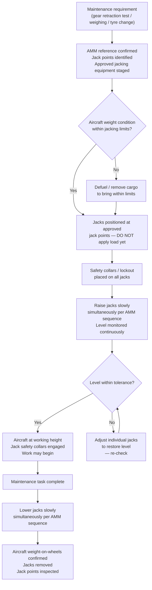

# ATLAS 000-009 · Section 00 · Subsection 003 · Subsubject 005 — Lifting, Shoring and Jacking Basics

## 1. Purpose

Introduces the **structural support operations** used to raise, stabilise, or level an aircraft during maintenance: **jacking** (raising the aircraft on hydraulic jacks), **shoring** (structural support during repair or when the primary structure is compromised), and **leveling** (establishing a horizontal reference plane). This subsubject establishes shared vocabulary and conceptual boundaries.

> **Scope boundary:** This file is **introductory orientation** (Level 1). The step-by-step jacking, shoring, and leveling procedures — including jack positioning diagrams, load limits, jacking sequences, and safety checks — are in [`../../010-019_Manejo-en-Tierra-Servicio/016_Lifting-Shoring-Jacking-Procedures/`](../../010-019_Manejo-en-Tierra-Servicio/016_Lifting-Shoring-Jacking-Procedures/). Equivalent conventional ATA reference: ATA chapters 7 and 8.

## 2. Scope

### 2.1 Jacking — raising the aircraft on hydraulic jacks

**Jacking** is the operation of raising the aircraft off the ground using hydraulic or screw jacks placed at approved structural hard-points (jack points). Jacking is required for:

- **Landing gear retraction tests** — verifying gear-up/gear-down cycling without aircraft weight on the gear; performed after gear maintenance or at scheduled intervals.
- **Landing gear replacement or maintenance** — removing and reinstalling main or nose gear assemblies.
- **Aircraft weighing** — determining actual operating empty weight and centre-of-gravity position; required at delivery and after significant structural modifications.
- **Tyre and wheel replacement** — raising one gear to swap a wheel/tyre assembly.

#### 2.1.1 Jack points

**Jack points** are designated load-bearing locations on the airframe where hydraulic jacks may be applied without risking structural damage. Jack points are:

- Defined by the aircraft manufacturer in the Aircraft Maintenance Manual (AMM, ATA chapter 7).
- Typically reinforced fittings on the wing/fuselage lower skin, landing gear beam, or keel beam.
- Associated with a **maximum allowable jack load** (expressed in kN or tonnes).

**Never jack on an unapproved surface.** Jack pad slippage or structural overload during jacking is a serious safety hazard.

#### 2.1.2 Jacking sequence

The **jacking sequence** specifies the order and rate at which individual jacks are raised to maintain the aircraft in a controlled, level attitude during the lift. Incorrect jacking sequence can:

- Overload a single jack point if the aircraft pivots.
- Introduce torsional loads into the fuselage.
- Cause the aircraft to slide off the jacks.

The approved jacking sequence is aircraft-specific and is published in the AMM. The top-level principle is: **raise all jacks slowly and simultaneously**, monitoring level continuously, with crew positioned at each jack.

### 2.2 Shoring — structural support during repair

**Shoring** is the placement of temporary structural supports (props, beams, or purpose-built shoring rigs) beneath or around the aircraft to maintain structural integrity when:

- A primary structural member is damaged or removed for repair.
- The aircraft is on an uneven surface and requires stabilisation.
- A repair is in progress that temporarily reduces local structural rigidity.

Shoring loads, placement positions, and material specifications are defined in the Structural Repair Manual (SRM) and the applicable damage/repair assessment. Shoring is an engineering-authorised action — it is not performed without a written Engineering Order or maintenance instruction.

### 2.3 Leveling — establishing the horizontal reference

**Leveling** is the procedure of placing the aircraft in a precisely defined horizontal reference attitude for the purpose of:

- **Aircraft weighing** — accurate weight and CG measurement requires a known level datum.
- **System calibration** — certain avionics calibrations (inertial reference, fuel quantity system) require a level aircraft.
- **Structural measurement** — waterline and station measurements require a known datum.
- **Fuel quantity calibration** — fuel quantity gauging accuracy depends on tank attitude at calibration.

The leveling reference (datum attitude) is defined in the AMM as a specific combination of pitch and roll angles measured at defined reference points (spirit level stations, plumb bobs, or electronic inclination references).

### 2.4 Load distribution

Jacking and shoring operations must account for the **distribution of the aircraft's weight** across the jack and shore points:

- Aircraft weight shifts with fuel state, passenger/cargo load, and equipment installed.
- Maximum jack-point loads are calculated for the **heaviest allowable condition** (Maximum Ramp Weight, MRW) unless a lighter condition is confirmed.
- Load distribution is affected by jack-point geometry — raising the tail jack while the nose jack is stationary shifts more weight to the nose, potentially exceeding the nose-jack limit.

The load distribution calculation is part of the approved jacking procedure in the AMM.

## 3. Diagram — Jacking Operations Overview

## 4. Footprint

| Metric | Value |
|---|---|
| Architecture | `ATLAS` — Aircraft Top Level Architecture Schema/System (controlled term) |
| Master range | `000–099` |
| Code range | `000-009` |
| Section | `00` — Información General y Servicio |
| Subsection | `003` — Operaciones Básicas |
| Subsubject | `005` — Lifting, Shoring and Jacking Basics |
| Scope level | Introductory orientation (Level 1); procedural detail in `010-019_/016_Lifting-Shoring-Jacking-Procedures/` |
| Conventional ATA reference | ATA chapter 7 — Lifting and Shoring |
| Primary Q-Division | Q-DATAGOV[^qdiv] |
| Support Q-Divisions | Q-GROUND, Q-AIR |
| ORB support | ORB-PMO, ORB-LEG |
| Governance class | `baseline`[^gov] |
| Folder path | `Q+ATLANTIDE/000-099_ATLAS/000-009_Informacion-General-y-Servicio/003_Operaciones-Basicas/` |
| Document | `005_Lifting-Shoring-and-Jacking-Basics.md` (this file) |
| Parent subsection | [`README.md`](./README.md) · [`000_Overview.md`](./000_Overview.md) |
| Procedural detail | [`../../010-019_Manejo-en-Tierra-Servicio/016_Lifting-Shoring-Jacking-Procedures/`](../../010-019_Manejo-en-Tierra-Servicio/016_Lifting-Shoring-Jacking-Procedures/) |
| Parent architecture | [`../../README.md`](../../README.md) |
| Parent baseline | [`organization/Q+ATLANTIDE.md`](../../../../organization/Q+ATLANTIDE.md) |

## 5. References & Citations

[^baseline]: **Q+ATLANTIDE controlled baseline (v1.0.0)** — [`organization/Q+ATLANTIDE.md`](../../../../organization/Q+ATLANTIDE.md).

[^archtable]: **§3 — Architecture Table (parent)** — [`../../README.md` §3](../../README.md#3-architecture-table).

[^qdiv]: **Q-Division authority** — [`organization/Q-Divisions/`](../../../../organization/Q-Divisions/).

[^gov]: **Governance class** — `baseline` denotes documents under controlled change management within the Q+ATLANTIDE baseline.

[^ata2200]: **ATA iSpec 2200** — Information standards for aviation maintenance documentation.

[^ataspec100]: **ATA Spec 100** — ATA chapter 7 covers lifting and shoring; ATA chapter 8 covers leveling and weighing. These conventional chapter assignments are reflected in ATLAS `005_`.

[^s1000d]: **S1000D Issue 6.0** — International specification for technical publications.

[^as9100d]: **AS9100D** — Quality Management Systems — Aviation, Space and Defense Organizations.

[^icao9137]: **ICAO Doc 9137 — Airport Services Manual** — Includes reference guidance on aircraft handling and ground safety for maintenance operations.

### Applicable industry standards

- ATA iSpec 2200 — Information standards for aviation maintenance[^ata2200]
- ATA Spec 100 — Manufacturers' Technical Data (ATA chapters 7, 8)[^ataspec100]
- S1000D Issue 6.0 — International specification for technical publications[^s1000d]
- AS9100D — Quality Management Systems — Aviation, Space and Defense Organizations[^as9100d]
- ICAO Doc 9137 — Airport Services Manual[^icao9137]
