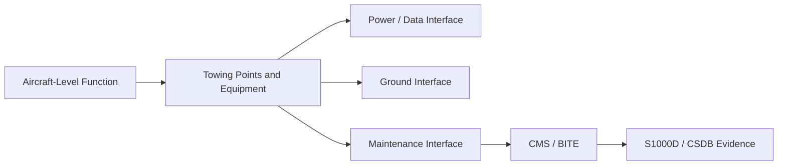
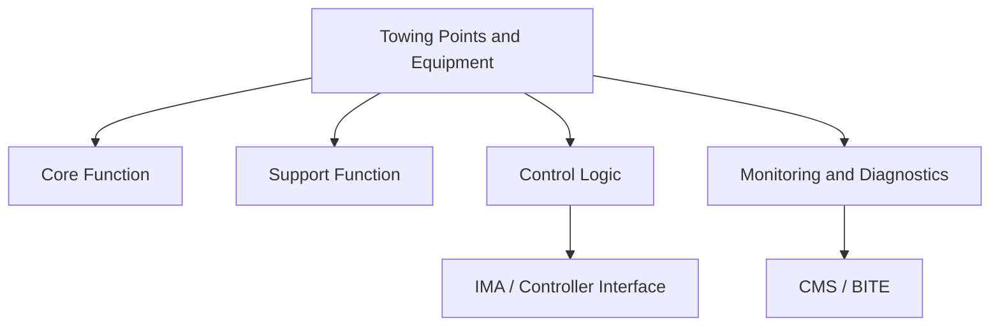
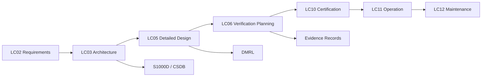

# ATLAS 000-009 · Section 00 · Subsection 008 · 010 — Towing Points and Equipment

## 0. Hyperlink Policy

All hyperlinks within this document use **relative paths** from the current file location. Cross-subsection links navigate to sibling files within `./` (same folder), to the subsection index at [`./README.md`](./README.md), and to parent indexes at `../`, `../../`, and `../../../`. Absolute URLs are used only for external standards references.

---

## 1. Purpose

Documents the controlled towing attachment points on the programme-defined aircraft type, including the nose gear towing lug, main gear towing attachment provisions, and the approved tow bar and towbarless tractor interfaces. Defines the maximum towing load per towing point and the approved towing speed limits.

This document is part of the **ATLAS-1000** register, a subpart of the controlled **Q+ATLANTIDE** baseline. It applies to the [[PROGRAMME-AIRCRAFT] programme-defined aircraft configuration Family](../../../../[PROGRAMME-PATH]/090_[PROGRAMME-AIRCRAFT]-Wide-Tube-and-Wing-Family/) programme, **[PROGRAMME-VARIANT]** configuration.

---

## 2. Applicability

| Applicability Item | Value | Status |
|---|---|---|
| Programme | [PROGRAMME-AIRCRAFT] programme-defined aircraft configuration Family |  |
| Short code | [PROGRAMME-VARIANT] |  |
| Architecture register | Q+ATLANTIDE |  |
| ATLAS band | 000-099_ATLAS |  |
| ATA reference | ATA 09 |  |
| S1000D SNS | 008-010-00 |  |
| S1000D compatibility | S1000D-CSDB-compatible |  |

---

## 3. System / Function Overview

The **Towing Points and Equipment** node defines the structural tow attachment points, rated loads, and certified GSE for ground movement of the programme-defined aircraft type. Towing loads are transmitted to the airframe through the nose gear towing lug (NTL-001, forward face of nose gear leg, rated ±800 kN longitudinal, ±100 kN lateral per side). Two body-gear rear towing points (BGT-001L and BGT-001R, main gear trunnion aft attach fittings, rated ±400 kN each) are provided for push-in manoeuvres and hangar positioning only — these are not to be used for towing more than 5 m without nose gear guidance.

Approved GSE: (A) TBLT cradle set Q-TBLT-001 (for nose-gear widths 450–600 mm, compatible with the [PROGRAMME-VARIANT] 520 mm nose-gear track, tow capacity 100 t gross, 28 V DC powered with HVDC adapter for tow-on-charge feature); (B) towbar Q-TOWBAR-001 (standard 3-lug NATO pin, rated 80 t, for backup towing); (C) shear bolts set Q-SHEAR-001 (mandatory, rated 90 kN shear, must be installed in NTL-001 before any tow). The ENWTD must be placed in "tow mode" before any external tow to decouple the electric drive from the nose gear bearings; confirmation is displayed on the GMMS maintenance screen. All tow attachments are documented per the Pre-Move Checklist (Q-GMMS-CHECK-001).

---

## 4. Scope

### 4.1 Included

This document includes:

- controlled definition of the towing points and equipment scope;
- architecture boundaries and interface definitions;
- programme-defined aircraft type-specific implementation notes;
- S1000D/CSDB mapping requirements;
- lifecycle evidence requirements.

### 4.2 Excluded

This document excludes:

- supplier-proprietary internal design data;
- final certification compliance statements;
- detailed maintenance procedures (pending DMRL assignment);
- final illustrated parts data (pending CSDB release).

---

## 5. Architecture Description 

The **Towing Points and Equipment** architecture is organized around controlled interfaces, deterministic function allocation, and maintainable component boundaries within the 000-009 General Information and Service section of the programme-defined aircraft type programme.

---

## 6. Functional Breakdown 

| Ref | Function | Description | Primary Interface | Status |
|---:|---|---|---|---|
| F-001 | Core Function | Primary controlled function for towing points and equipment. | [Interfaces](#10-interfaces) |  |
| F-002 | Support Function | Supporting controlled function. | [Interfaces](#10-interfaces) |  |
| F-003 | Monitoring | Captures status, faults, and maintenance data. | [CMS / BITE](#12-monitoring-and-diagnostics) |  |
| F-004 | Traceability | Links architecture, requirements, and S1000D content. | [CSDB / DMRL](#14-s1000d--csdb-mapping) |  |

---

## 7. Mermaid — System Context Diagram

*Diagram 1 — System context for Towing Points and Equipment.*

---

## 8. Mermaid — Internal Functional Architecture

*Diagram 2 — Internal functional architecture for Towing Points and Equipment.*

---

## 9. Mermaid — Lifecycle Traceability

*Diagram 3 — Lifecycle traceability.*

---

## 10. Interfaces 

| Interface Type | Connected System | Description | Status |
|---|---|---|---|
| Electrical power | HVDC Bus / GPU | Power supply interface |  |
| Data / control | IMA / CMS / AMT | Command and monitoring interface |  |
| Mechanical | Structure / GSE | Mounting and access interface |  |
| Maintenance | CSDB / IETP | Technician-facing access and procedure boundary |  |

---

## 11. Operating Modes 

| Mode | Description | Entry Condition | Exit Condition | Status |
|---|---|---|---|---|
| Normal | System operates within nominal limits. | Aircraft powered and system enabled. | Shutdown or fault. |  |
| Degraded | Reduced function or redundancy. | Fault detected. | Recovery or maintenance action. |  |
| Maintenance | Configured for inspection or servicing. | Authorized maintenance action. | Operational check complete. |  |
| Failure / Safe State | Protective state to prevent unsafe operation. | Fault threshold exceeded. | Reset or repair. |  |

---

## 12. Monitoring and Diagnostics 

The system shall provide sufficient monitoring to support safe operation, maintenance troubleshooting, and lifecycle evidence capture. Diagnostic data shall be mapped to the relevant S1000D/CSDB fault isolation and maintenance data modules.

---

## 13. Maintenance Concept 

The maintenance concept shall support modular inspection, fault isolation, removal, installation, and return-to-service verification. Maintenance procedures shall remain provisional until validated against the applicable DMRL, BREX, and task validation records.

---

## 14. S1000D / CSDB Mapping 

| S1000D Element | Controlled Value | Status |
|---|---|---|
| Model ident code | `[PROGRAMME-AIRCRAFT]` |  |
| System diff code | `[PROGRAMME-VARIANT]` |  |
| System code | `008` |  |
| Sub-system code | `010` |  |
| DMC prefix | `DMC-<PROGRAMME>-<VARIANT>-008-010` |  |
| Info codes | `040 / 300 / 400 / 520 / 720 / 941` |  |

---

## 15. Footprints 

### 15.1 Physical Footprint

| Footprint Item | Description | Status |
|---|---|---|
| Installation zone | TBD |  |
| Access panels | TBD |  |

### 15.2 Data Footprint

| Footprint Item | Description | Status |
|---|---|---|
| Configuration records | Part number, serial number, effectivity |  |
| Evidence records | Test, inspection, compliance records |  |
| CSDB records | DMCs, ICNs, BREX, applicability |  |

---

## 16. Safety and Certification Considerations 

Final safety classification shall remain **TBD** until reviewed against the applicable FHA, PSSA, SSA, and certification basis (EASA CS-25 Amendment 27+).

---

## 17. Verification and Validation 

| Verification Method | Description | Evidence | Status |
|---|---|---|---|
| Analysis | Engineering calculation or safety analysis. | Analysis report |  |
| Inspection | Physical or visual verification. | Inspection record |  |
| Test | Functional or integration test. | Test report |  |

---

## 18. Glossary of Terms and Acronyms

| Term | Meaning | Status |
|---|---|---|
| [PROGRAMME-AIRCRAFT] | Electrified aircraft programme family. |  |
| ATLAS | Aircraft Top Level Architecture Schema/System. |  |
| BITE | Built-In Test Equipment. |  |
| CSDB | Common Source DataBase (S1000D). |  |
| DMC | Data Module Code. |  |
| DMRL | Data Module Requirement List. |  |
| [PROGRAMME-VARIANT] | Electric programme-defined aircraft configuration. |  |
| HVDC | High-Voltage Direct Current. |  |
| IMA | Integrated Modular Avionics. |  |
| S1000D | International specification for technical publications. |  |

---

## 19. Open Issues

| ID | Description | Owner | Status |
|---|---|---|---|
| OI-008-010-001 | Content requires review by system expert. | Q-GROUND | open |
| OI-008-010-002 | S1000D DMC mapping to be validated against DMRL. | Q-DATAGOV | open |

---

## 20. References

[^baseline]: **Q+ATLANTIDE controlled baseline (v1.0.0)** — [`organization/Q+ATLANTIDE.md`](../../../../organization/Q+ATLANTIDE.md).
[^ata2200]: **ATA iSpec 2200** — Information Standards for Aviation Maintenance.
[^s1000d]: **S1000D Issue 6.0** — International specification for technical publications.
[^as9100d]: **AS9100D** — Quality Management Systems — Aviation, Space and Defense Organizations.
[^cs25]: **EASA CS-25** — Certification Specifications for Large Aeroplanes (Amendment 27+).

---

## 21. Change Log

| Version | Date | Author | Notes |
|---|---|---|---|
| 1.0.0 | 2026-05-11 | Q+ Team / Amedeo Pelliccia + AI | Initial baseline from template.md. Content scaffold — pending system expert review. |
