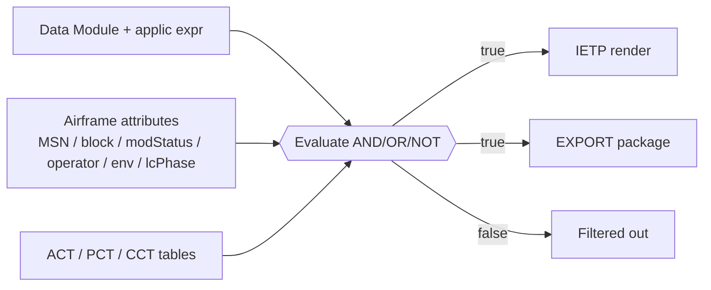

# ATLAS 000-009 · Section 00 · Subsection 020 · Subsubject 002 — Effectivity and Applicability

## 1. Purpose

Defines the **effectivity and applicability** model for ATLAS `000-009.020` *configuración*: how a data module, modification or service action is bound to the airframe population it applies to (by MSN range, block, modification status, operator, environment and lifecycle phase). Applicability is expressed via S1000D ACT/PCT/CCT tables[^s1000d] and is the runtime gate used by IETP and EXPORT pipelines, in conformance with the controlled Q+ATLANTIDE baseline[^baseline].

## 2. Scope

- Covers the *Effectivity and Applicability* subsubject (`02`) of subsection `020` *configuración*.
- Inherits Q-Division authority and ORB support from the parent row in [`../../README.md` §3](../../README.md#3-architecture-table)[^archtable].
- Object classes in scope: **MSN ranges**, **block points**, **applicability expressions** (AND/OR/NOT), **ACT/PCT/CCT tables**, IETP/EXPORT filter rules.
- Aligned with the ATA iSpec 2200 / Spec 100 information set[^ata2200][^ataspec100], S1000D Issue 6.0 applicability model[^s1000d] and AS9100D quality controls[^as9100d].

## 3. Diagram

The diagram below shows how a Data Module's applicability expression is evaluated against an airframe instance's attribute values to gate IETP rendering and EXPORT package assembly.

## 4. Footprint

| Metric | Value |
|---|---|
| Architecture | `ATLAS` — Aircraft Top-Level Architecture System |
| Master range | `000–099` |
| Code range | `000-009` |
| Section | `00` — Información General y Servicio |
| Subject | `00` — General Information |
| Subsection | `020` — configuración |
| Subsubject | `002` — Effectivity and Applicability |
| Primary Q-Division | Q-DATAGOV[^qdiv] |
| Support Q-Divisions | Q-GROUND, Q-AIR |
| ORB support | ORB-PMO, ORB-LEG |
| Governance class | `baseline`[^gov] |
| Folder path | `Q+ATLANTIDE/000-099_ATLAS/000-009_Informacion-General-y-Servicio/020_configuracion/` |
| Document | `002_Effectivity-and-Applicability.md` (this file) |
| Parent subsection | [`000_Overview.md`](./000_Overview.md) |
| Parent architecture | [`../../README.md`](../../README.md) |
| Parent baseline | [`organization/Q+ATLANTIDE.md`](../../../../organization/Q+ATLANTIDE.md) |

## 5. References & Citations

[^baseline]: **Q+ATLANTIDE controlled baseline (v1.0.0)** — [`organization/Q+ATLANTIDE.md`](../../../../organization/Q+ATLANTIDE.md). Defines the controlled `000-999` architecture-band taxonomy and the ATLAS-1000 register subpart.

[^archtable]: **ATLAS §3 Architecture Table** — [`../../README.md` §3](../../README.md#3-architecture-table). Authoritative source for the `000-009` row (Section `00` — Información General y Servicio, Primary Q-Division Q-DATAGOV).

[^qdiv]: **Q-Division authority** — Q-Divisions provide technical authority over an architecture row (Q+ATLANTIDE Note N-002). See [`organization/Q+ATLANTIDE.md` §4](../../../../organization/Q+ATLANTIDE.md#4-notes).

[^gov]: **Governance class** — Bands are classified as `baseline` or `restricted` per Q+ATLANTIDE §4 governance rules.

[^ata2200]: **ATA iSpec 2200 — Information Standards for Aviation Maintenance** — Industry standard for digital aircraft maintenance information; governs chapter / section / subject numbering inherited by ATLAS `000-099`.

[^ataspec100]: **ATA Spec 100 — Manufacturers' Technical Data** — Predecessor numbering scheme that established the 00–99 chapter map mirrored by ATLAS sub-ranges.

[^s1000d]: **S1000D Issue 6.0 — International specification for technical publications** — Common Source DataBase (CSDB) and Data Module Code (DMC) specification used across ATLAS technical publications.

[^as9100d]: **AS9100D — Quality Management Systems — Aviation, Space and Defense Organizations** — Quality-management baseline for all Q+ATLANTIDE deliverables.

### Applicable industry standards

The following ATA-family and industry standards apply to this subsubject in addition to the cross-cutting Q+ATLANTIDE governance:

- ATA iSpec 2200 — Information Standards for Aviation Maintenance[^ata2200]
- ATA Spec 100 — Manufacturers' Technical Data[^ataspec100]
- S1000D Issue 6.0 — International specification for technical publications[^s1000d]
- AS9100D — Quality Management Systems — Aviation, Space and Defense Organizations[^as9100d]
