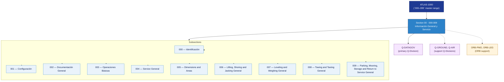

# ATLAS 000-009 · Section 00 — Información General y Servicio

## 1. Purpose

Section-level index for *Información General y Servicio* (`000-009`) within the ATLAS band. Covers identification, configuration, general documentation, basic operations, servicing, dimensions, lifting/jacking, leveling/weighing, towing/taxiing, and parking/storage for the programme-defined aircraft type.

This section is part of the **ATLAS-1000** register, a subpart of the controlled **Q+ATLANTIDE** baseline[^baseline][^n001].

## 2. Scope

- Aggregates the 10 subsections within the `000-009` code range listed in §3.
- Inherits Q-Division authority and ORB support from the parent row in [`../README.md` §3](../README.md#3-architecture-table)[^archtable].
- Applies to the [[PROGRAMME-AIRCRAFT] programme-defined aircraft configuration Family](../../../[PROGRAMME-PATH]/090_[PROGRAMME-AIRCRAFT]-Wide-Tube-and-Wing-Family/) programme, **[PROGRAMME-VARIANT]** configuration.

## 3. Subsection Index

| Code | Title | Folder | Status |
|---:|---|---|---|
| `000` | Identificación | [`000_Identificacion/`](./000_Identificacion/) | active |
| `001` | Configuración | [`001_Configuracion/`](./001_Configuracion/) | active |
| `002` | Documentación General | [`002_Documentacion-General/`](./002_Documentacion-General/) | active |
| `003` | Operaciones Básicas | [`003_Operaciones-Basicas/`](./003_Operaciones-Basicas/) | active |
| `004` | Service General | [`004_Service-General/`](./004_Service-General/) | active |
| `005` | Dimensions and Areas | [`005_Dimensions-and-Areas/`](./005_Dimensions-and-Areas/) | active |
| `006` | Lifting, Shoring and Jacking General | [`006_Lifting-Shoring-and-Jacking-General/`](./006_Lifting-Shoring-and-Jacking-General/) | active |
| `007` | Leveling and Weighing General | [`007_Leveling-and-Weighing-General/`](./007_Leveling-and-Weighing-General/) | active |
| `008` | Towing and Taxiing General | [`008_Towing-and-Taxiing-General/`](./008_Towing-and-Taxiing-General/) | active |
| `009` | Parking, Mooring, Storage and Return to Service General | [`009_Parking-Mooring-Storage-and-Return-to-Service-General/`](./009_Parking-Mooring-Storage-and-Return-to-Service-General/) | active |

## 4. Interfaces Diagram

## 5. Footprint

| Metric | Value |
|---|---|
| Architecture | `ATLAS` — Aircraft Top Level Architecture Schema/System (controlled term) |
| Master range | `000–099` |
| Code range | `000-009` |
| Section | `00` — Información General y Servicio |
| Subsections | 10 populated (000–009) |
| Primary Q-Division | Q-DATAGOV[^qdiv] |
| Support Q-Divisions | Q-GROUND, Q-AIR |
| ORB support | ORB-PMO, ORB-LEG |
| Governance class | `baseline`[^gov] |
| Folder path | `Q+ATLANTIDE/000-099_ATLAS/000-009_Informacion-General-y-Servicio/` |
| Document | `README.md` (this file) |
| Parent architecture | [`../README.md`](../README.md) |
| Parent baseline | [`organization/Q+ATLANTIDE.md`](../../../organization/Q+ATLANTIDE.md) |

## Governance

Governed by [`organization/Q+ATLANTIDE.md`](../../../organization/Q+ATLANTIDE.md)[^baseline]. All subsections inherit `architecture_code = ATLAS`, `primary_q_division = Q-DATAGOV` and `governance_class = baseline`. The No-AAA Rule[^n004] applies.

## 6. References & Citations

[^baseline]: **Q+ATLANTIDE controlled baseline (v1.0.0)** — [`organization/Q+ATLANTIDE.md`](../../../organization/Q+ATLANTIDE.md).
[^archtable]: **§3 — Architecture Table (parent)** — [`../README.md` §3](../README.md#3-architecture-table).
[^qdiv]: **Q-Division authority** — [`organization/Q-Divisions/`](../../../organization/Q-Divisions/).
[^gov]: **Governance class** — `baseline` denotes documents under controlled change management.
[^n001]: **Note N-001** — Q+ATLANTIDE is a taxonomy and traceability ecosystem. See [`organization/Q+ATLANTIDE.md` §4](../../../organization/Q+ATLANTIDE.md#4-notes).
[^n004]: **Note N-004 (No-AAA Rule)** — "AAA" is not a valid domain in this baseline. See [`organization/Q+ATLANTIDE.md` §4](../../../organization/Q+ATLANTIDE.md#4-notes).
