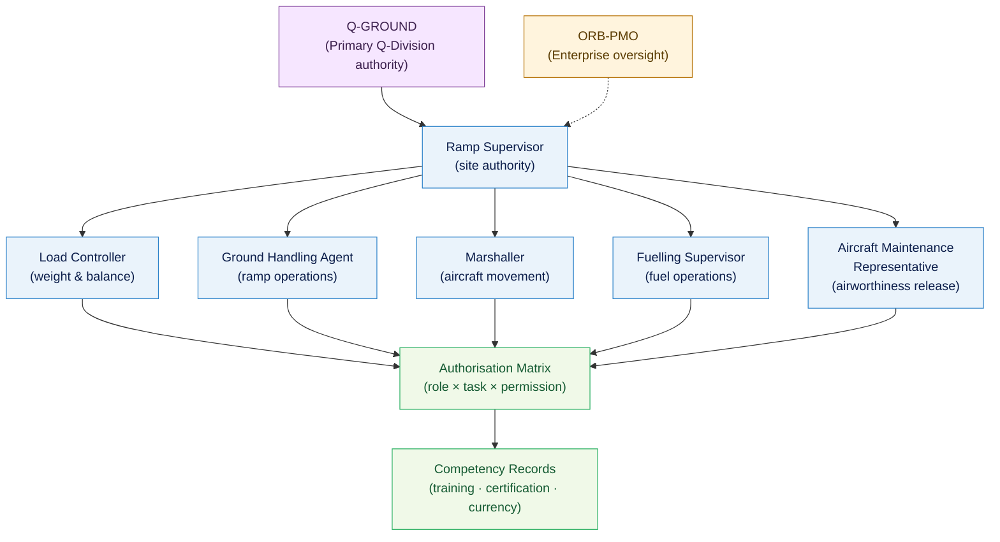

# ATLAS 010-019 · Section 01 · Subsection 010 · Subsubject 002 — Roles, Authorizations and Responsibilities

## 1. Purpose

Defines the **ground-crew roles, authorisation matrix, and competency requirements** for all personnel involved in aircraft ground-handling operations within the Q+ATLANTIDE programme. Establishes the responsibility assignments and delegation chains that ensure safe, compliant, and traceable ground operations, in conformance with AS9100D[^as9100d] and ICAO Doc 9137[^icaodoc9137].

## 2. Scope

- Covers the *Roles, Authorizations and Responsibilities* subsubject (`002`) of subsection `010` *Ground Handling* within section `01` *Manejo en Tierra & Servicio*.
- Inherits Q-Division authority and ORB support from the parent row in [`../../README.md` §3](../../README.md#3-architecture-table)[^archtable].
- Concepts in scope:
  - **Role catalogue** — the complete list of named roles (e.g., *Ramp Supervisor*, *Ground Handling Agent (GHA)*, *Load Controller*, *Marshaller*, *Fuelling Supervisor*, *Aircraft Maintenance Representative (AMR)*) and their functional definitions.
  - **Authorisation matrix** — the role-to-task permission table specifying which roles are authorised to perform, supervise, or approve each ground-handling activity category (e.g., aircraft movement, fuelling, loading, aircraft power connection).
  - **Competency requirements** — minimum training, certification, and currency requirements for each role, cross-referenced to Q-GROUND training records and ORB-PMO project approvals.
  - **Delegation and escalation** — rules governing delegation of responsibilities between roles, conditions for escalation to a higher authority, and the process for temporary role assignments.
  - **Interface with Q-Division authority** — how Q-GROUND[^qdiv] exercises technical authority over role definitions and authorisation levels, with ORB-PMO[^orbpmo] providing enterprise oversight.
- Out of scope: definitions and terminology (`001_`), physical safety-zone layout (`003_`), GSE mechanical interfaces (`004_`), and documentation log formats (`005_`).

## 3. Diagram — Role Hierarchy and Authorisation Flow

Roles are hierarchically ordered; authorisation flows from the programme authority (Q-GROUND) through the Ramp Supervisor to operational roles.

## 4. Footprint

| Metric | Value |
|---|---|
| Architecture | `ATLAS` — Aircraft Top Level Architecture Schema/System (controlled term) |
| Master range | `000–099` |
| Code range | `010-019` |
| Section | `01` — Manejo en Tierra & Servicio |
| Subsection | `010` — Ground Handling |
| Subsubject | `002` — Roles, Authorizations and Responsibilities |
| Primary Q-Division | Q-GROUND[^qdiv] |
| Support Q-Divisions | Q-MECHANICS, Q-INDUSTRY |
| ORB support | ORB-PMO, ORB-FIN |
| Governance class | `baseline`[^gov] |
| Folder path | `Q+ATLANTIDE/000-099_ATLAS/010-019_Manejo-en-Tierra-Servicio/010_Ground-handling/` |
| Document | `002_Roles-Authorizations-and-Responsibilities.md` (this file) |
| Parent subsection | [`README.md`](./README.md) · [`000_Overview.md`](./000_Overview.md) |
| Parent architecture | [`../../README.md`](../../README.md) |
| Parent baseline | [`organization/Q+ATLANTIDE.md`](../../../../organization/Q+ATLANTIDE.md) |

## 5. References & Citations

[^baseline]: **Q+ATLANTIDE controlled baseline (v1.0.0)** — [`organization/Q+ATLANTIDE.md`](../../../../organization/Q+ATLANTIDE.md). Defines the controlled `000-999` architecture-band taxonomy and the ATLAS-1000 register subpart.

[^archtable]: **ATLAS §3 Architecture Table** — [`../../README.md` §3](../../README.md#3-architecture-table). Authoritative source for the `010-019` row (Section `01` — Manejo en Tierra & Servicio, Primary Q-Division Q-GROUND).

[^qdiv]: **Q-Division authority** — Q-Divisions provide technical authority over an architecture row (Q+ATLANTIDE Note N-002). See [`organization/Q+ATLANTIDE.md` §4](../../../../organization/Q+ATLANTIDE.md#4-notes).

[^gov]: **Governance class** — `baseline` denotes documents under controlled change management within the Q+ATLANTIDE baseline.

[^orbpmo]: **ORB-PMO** — Programme Management Office function within the Q+ATLANTIDE Organisational Review Board (ORB). Provides enterprise oversight for authorisation matrices and competency approvals.

[^ata2200]: **ATA iSpec 2200 — Information Standards for Aviation Maintenance** — Governs the structure of roles and responsibilities documentation within ATLAS maintenance data modules.

[^s1000d]: **S1000D Issue 6.0 — International specification for technical publications** — Common Source DataBase (CSDB) and Data Module Code (DMC) specification used for all Q+ATLANTIDE artefacts.

[^as9100d]: **AS9100D — Quality Management Systems — Aviation, Space and Defense Organizations** — Defines competency, awareness, and authorisation requirements for personnel performing quality-affecting ground operations.

[^icaodoc9137]: **ICAO Doc 9137 — Airport Services Manual** — Provides role definitions and minimum competency requirements for aerodrome ground-handling personnel.

[^iataigom]: **IATA Ground Operations Manual (IGOM)** — Industry-standard operational procedures including role assignments and authorisation requirements for commercial ground-handling operations.

### Applicable industry standards

The following standards apply to this subsubject in addition to the cross-cutting Q+ATLANTIDE governance:

- ATA iSpec 2200 — Information Standards for Aviation Maintenance[^ata2200]
- S1000D Issue 6.0 — International specification for technical publications[^s1000d]
- AS9100D — Quality Management Systems — Aviation, Space and Defense Organizations[^as9100d]
- ICAO Doc 9137 — Airport Services Manual[^icaodoc9137]
- IATA Ground Operations Manual (IGOM)[^iataigom]
