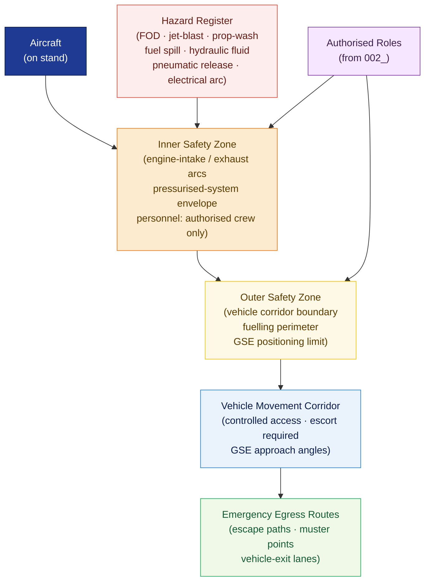

# ATLAS 010-019 · Section 01 · Subsection 010 · Subsubject 003 — Safety Zones, Hazards and Exclusion Areas

## 1. Purpose

Defines the **safety-zone demarcation, hazard identification, and exclusion-area rules** applicable to all ground-handling activities within the Q+ATLANTIDE programme. Establishes the physical and procedural boundaries that prevent personnel, vehicle, and equipment conflicts during aircraft turn-around operations, in conformance with ICAO Doc 9137[^icaodoc9137] and AS9100D[^as9100d].

## 2. Scope

- Covers the *Safety Zones, Hazards and Exclusion Areas* subsubject (`003`) of subsection `010` *Ground Handling* within section `01` *Manejo en Tierra & Servicio*.
- Inherits Q-Division authority and ORB support from the parent row in [`../../README.md` §3](../../README.md#3-architecture-table)[^archtable].
- Concepts in scope:
  - **Safety zone classification** — the tiered zone taxonomy (*Inner Safety Zone*, *Outer Safety Zone*, *Vehicle Movement Corridor*) and the conditions (engine running, APU active, fuelling in progress, door open) that activate each zone level.
  - **Exclusion area demarcation** — engine intake and exhaust exclusion arcs, rotor-disc sweep areas (if applicable), hot-surface no-contact zones, and pressurised-system safe-distance envelopes.
  - **Hazard identification** — categorised hazard register for ground operations: FOD (Foreign Object Debris/Damage), fuel-spill ignition risk, jet-blast, prop-wash, hydraulic-fluid contact, high-pressure pneumatic release, and electrical-arc exposure.
  - **Emergency egress routes** — designated personnel escape paths, muster points, and vehicle-exit lanes that must remain unobstructed during all ground-handling phases.
  - **Zone activation and deactivation** — the conditions and authorised roles (per `002_`) under which each safety zone is declared active or clear, and the communication protocol (visual signals, intercom, radio).
  - **GSE positioning constraints** — mandatory standoff distances and approach-angle restrictions for ground support equipment relative to aircraft structure, fuel vents, and service panels.
- Out of scope: terminology and applicability (`001_`), personnel role definitions (`002_`), GSE mechanical interface specifications (`004_`), and documentation log formats (`005_`).

## 3. Diagram — Safety Zone Layout and Hazard Boundaries

Safety zones are nested around the aircraft; hazard sources define exclusion arcs that further restrict access within the outer zone.

## 4. Footprint

| Metric | Value |
|---|---|
| Architecture | `ATLAS` — Aircraft Top Level Architecture Schema/System (controlled term) |
| Master range | `000–099` |
| Code range | `010-019` |
| Section | `01` — Manejo en Tierra & Servicio |
| Subsection | `010` — Ground Handling |
| Subsubject | `003` — Safety Zones, Hazards and Exclusion Areas |
| Primary Q-Division | Q-GROUND[^qdiv] |
| Support Q-Divisions | Q-MECHANICS, Q-INDUSTRY |
| ORB support | ORB-PMO, ORB-FIN |
| Governance class | `baseline`[^gov] |
| Folder path | `Q+ATLANTIDE/000-099_ATLAS/010-019_Manejo-en-Tierra-Servicio/010_Ground-handling/` |
| Document | `003_Safety-Zones-Hazards-and-Exclusion-Areas.md` (this file) |
| Parent subsection | [`README.md`](./README.md) · [`000_Overview.md`](./000_Overview.md) |
| Parent architecture | [`../../README.md`](../../README.md) |
| Parent baseline | [`organization/Q+ATLANTIDE.md`](../../../../organization/Q+ATLANTIDE.md) |

## 5. References & Citations

[^baseline]: **Q+ATLANTIDE controlled baseline (v1.0.0)** — [`organization/Q+ATLANTIDE.md`](../../../../organization/Q+ATLANTIDE.md). Defines the controlled `000-999` architecture-band taxonomy and the ATLAS-1000 register subpart.

[^archtable]: **ATLAS §3 Architecture Table** — [`../../README.md` §3](../../README.md#3-architecture-table). Authoritative source for the `010-019` row (Section `01` — Manejo en Tierra & Servicio, Primary Q-Division Q-GROUND).

[^qdiv]: **Q-Division authority** — Q-Divisions provide technical authority over an architecture row (Q+ATLANTIDE Note N-002). See [`organization/Q+ATLANTIDE.md` §4](../../../../organization/Q+ATLANTIDE.md#4-notes).

[^gov]: **Governance class** — `baseline` denotes documents under controlled change management within the Q+ATLANTIDE baseline.

[^ata2200]: **ATA iSpec 2200 — Information Standards for Aviation Maintenance** — Governs safety-zone documentation format and hazard-data integration within ATLAS maintenance data modules.

[^s1000d]: **S1000D Issue 6.0 — International specification for technical publications** — Common Source DataBase (CSDB) and Data Module Code (DMC) specification used for all Q+ATLANTIDE artefacts.

[^as9100d]: **AS9100D — Quality Management Systems — Aviation, Space and Defense Organizations** — Risk-management and hazard-identification baseline for ground operations within the quality-management system.

[^icaodoc9137]: **ICAO Doc 9137 — Airport Services Manual** — Authoritative reference for ground-handling safety zones, exclusion areas, hazard classification, and emergency egress requirements at aerodromes.

[^iataigom]: **IATA Ground Operations Manual (IGOM)** — Industry-standard operational procedures for ramp safety, zone management, and hazard controls in commercial ground-handling operations.

### Applicable industry standards

The following standards apply to this subsubject in addition to the cross-cutting Q+ATLANTIDE governance:

- ATA iSpec 2200 — Information Standards for Aviation Maintenance[^ata2200]
- S1000D Issue 6.0 — International specification for technical publications[^s1000d]
- AS9100D — Quality Management Systems — Aviation, Space and Defense Organizations[^as9100d]
- ICAO Doc 9137 — Airport Services Manual[^icaodoc9137]
- IATA Ground Operations Manual (IGOM)[^iataigom]
