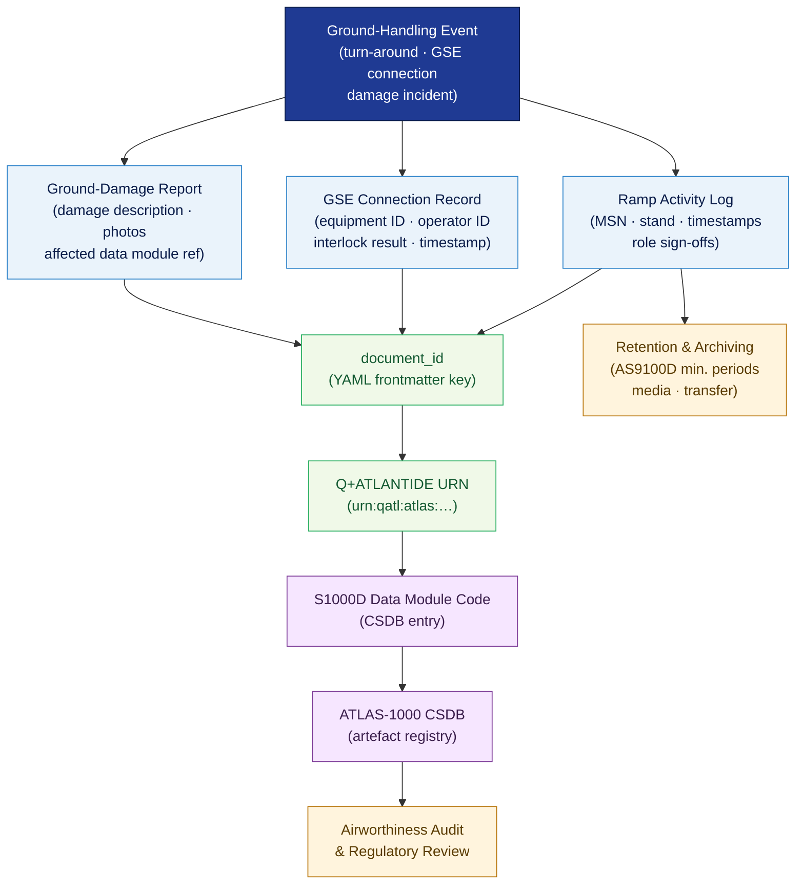

# ATLAS 010-019 · Section 01 · Subsection 010 · Subsubject 005 — Documentation, Logs and Traceability

## 1. Purpose

Defines the **record-keeping obligations, log formats, and digital traceability links** for all ground-handling activities within the Q+ATLANTIDE programme. Establishes the controlled documentation scheme — ramp activity logs, ground-damage reports, GSE connection records, and digital artefact identifiers — that provides an auditable, end-to-end traceability chain from each turn-around event to the corresponding ATLAS-1000 data module, in conformance with S1000D[^s1000d], AS9100D[^as9100d], and ISO 15459[^iso15459].

## 2. Scope

- Covers the *Documentation, Logs and Traceability* subsubject (`005`) of subsection `010` *Ground Handling* within section `01` *Manejo en Tierra & Servicio*.
- Inherits Q-Division authority and ORB support from the parent row in [`../../README.md` §3](../../README.md#3-architecture-table)[^archtable].
- Concepts in scope:
  - **Ramp activity log** — the mandatory per-turn-around record capturing aircraft identity (MSN, tail number), stand, scheduled and actual times for each ground-handling phase (arrival, block-on, block-off, departure), and the authorised roles (per `002_`) who performed each phase.
  - **GSE connection / disconnection record** — timestamped log entry created for each GSE interface (per `004_`) connection and disconnection event, including equipment ID, operator ID, and interlock-check result.
  - **Ground-damage report** — standardised form for recording any aircraft or equipment damage occurring during ground handling, linked by document_id to the affected ATLAS data module and to the relevant safety-zone record (per `003_`).
  - **Digital artefact identifiers** — the `document_id` scheme, Q+ATLANTIDE URNs, and S1000D Data Module Codes (DMC) used to cross-link log entries to the ATLAS-1000 CSDB, applying the identifier conventions established in `000_Identificacion · 005_Digital-Identifiers`.
  - **Retention and archiving** — minimum retention periods, storage media requirements, and transfer-to-archive procedures per AS9100D[^as9100d] record-control requirements.
  - **Digital traceability chain** — the directed link graph from a physical ground event → ramp log entry → ATLAS data module → CSDB record → Q+ATLANTIDE URN, enabling full reverse traceability for airworthiness and audit purposes.
- Out of scope: terminology and applicability (`001_`), personnel role definitions (`002_`), safety-zone layout (`003_`), and GSE mechanical interface specifications (`004_`).

## 3. Diagram — Documentation and Traceability Chain

Each ground-handling event generates one or more log entries; all entries are digitally linked to the ATLAS-1000 CSDB via the Q+ATLANTIDE identifier scheme.

## 4. Footprint

| Metric | Value |
|---|---|
| Architecture | `ATLAS` — Aircraft Top Level Architecture Schema/System (controlled term) |
| Master range | `000–099` |
| Code range | `010-019` |
| Section | `01` — Manejo en Tierra & Servicio |
| Subsection | `010` — Ground Handling |
| Subsubject | `005` — Documentation, Logs and Traceability |
| Primary Q-Division | Q-GROUND[^qdiv] |
| Support Q-Divisions | Q-MECHANICS, Q-INDUSTRY |
| ORB support | ORB-PMO, ORB-FIN |
| Governance class | `baseline`[^gov] |
| Folder path | `Q+ATLANTIDE/000-099_ATLAS/010-019_Manejo-en-Tierra-Servicio/010_Ground-handling/` |
| Document | `005_Documentation-Logs-and-Traceability.md` (this file) |
| Parent subsection | [`README.md`](./README.md) · [`000_Overview.md`](./000_Overview.md) |
| Parent architecture | [`../../README.md`](../../README.md) |
| Parent baseline | [`organization/Q+ATLANTIDE.md`](../../../../organization/Q+ATLANTIDE.md) |

## 5. References & Citations

[^baseline]: **Q+ATLANTIDE controlled baseline (v1.0.0)** — [`organization/Q+ATLANTIDE.md`](../../../../organization/Q+ATLANTIDE.md). Defines the controlled `000-999` architecture-band taxonomy and the ATLAS-1000 register subpart.

[^archtable]: **ATLAS §3 Architecture Table** — [`../../README.md` §3](../../README.md#3-architecture-table). Authoritative source for the `010-019` row (Section `01` — Manejo en Tierra & Servicio, Primary Q-Division Q-GROUND).

[^qdiv]: **Q-Division authority** — Q-Divisions provide technical authority over an architecture row (Q+ATLANTIDE Note N-002). See [`organization/Q+ATLANTIDE.md` §4](../../../../organization/Q+ATLANTIDE.md#4-notes).

[^gov]: **Governance class** — `baseline` denotes documents under controlled change management within the Q+ATLANTIDE baseline.

[^ata2200]: **ATA iSpec 2200 — Information Standards for Aviation Maintenance** — Governs log and record formats, document-number conventions, and data-module scope for ATLAS maintenance artefacts.

[^ataspec100]: **ATA Spec 100 — Manufacturers Technical Data** — Baseline standard for document numbering and record-identification conventions.

[^s1000d]: **S1000D Issue 6.0 — International specification for technical publications** — Defines the Data Module Code (DMC) structure, CSDB key conventions, and identifier-lifecycle rules used to link ground-handling logs to the ATLAS-1000 registry.

[^as9100d]: **AS9100D — Quality Management Systems — Aviation, Space and Defense Organizations** — Defines record-control requirements: identification, storage, protection, retrieval, retention period, and disposition of quality records including ground-handling logs.

[^icaodoc9137]: **ICAO Doc 9137 — Airport Services Manual** — Reference for ground-damage reporting requirements and aerodrome record-keeping obligations.

[^iso15459]: **ISO 15459 — Unique Identification of Transport Units and Unit Loads** — UID standard extended to digital artefact traceability; applied to log entries and CSDB cross-links within the Q+ATLANTIDE identifier scheme.

[^iataigom]: **IATA Ground Operations Manual (IGOM)** — Industry-standard operational procedures for ramp activity logging, damage reporting, and ground-handling documentation requirements.

### Applicable industry standards

The following standards apply to this subsubject in addition to the cross-cutting Q+ATLANTIDE governance:

- ATA iSpec 2200 — Information Standards for Aviation Maintenance[^ata2200]
- ATA Spec 100 — Manufacturers Technical Data[^ataspec100]
- S1000D Issue 6.0 — International specification for technical publications[^s1000d]
- AS9100D — Quality Management Systems — Aviation, Space and Defense Organizations[^as9100d]
- ICAO Doc 9137 — Airport Services Manual[^icaodoc9137]
- ISO 15459 — Unique Identification of Transport Units and Unit Loads[^iso15459]
- IATA Ground Operations Manual (IGOM)[^iataigom]
