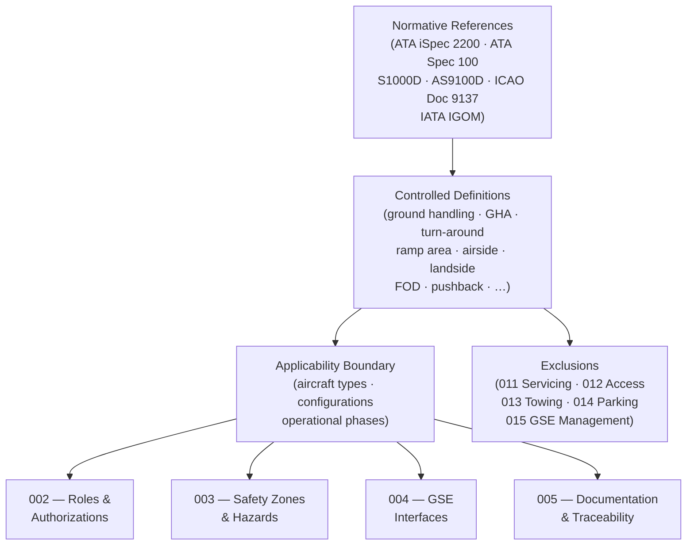

# ATLAS 010-019 · Section 01 · Subsection 010 · Subsubject 001 — Scope and Definitions

## 1. Purpose

Establishes the **normative scope and controlled terminology** governing all ground-handling activities within the Q+ATLANTIDE programme. Defines the applicability limits, key terms, and regulatory references that all downstream subsubjects, procedures, and data modules in subsection `010` *Ground Handling* depend upon, in conformance with ATA iSpec 2200[^ata2200] and ATA Spec 100[^ataspec100].

## 2. Scope

- Covers the *Scope and Definitions* subsubject (`001`) of subsection `010` *Ground Handling* within section `01` *Manejo en Tierra & Servicio*.
- Inherits Q-Division authority and ORB support from the parent row in [`../../README.md` §3](../../README.md#3-architecture-table)[^archtable].
- Concepts in scope:
  - **Applicability** — aircraft types, configurations, and operational phases (pre-departure, transit, post-arrival) to which this subsection applies.
  - **Normative references** — the binding standards, regulations, and Q+ATLANTIDE documents that this subsubject draws from, including ATA iSpec 2200[^ata2200], ATA Spec 100[^ataspec100], S1000D[^s1000d], AS9100D[^as9100d], and ICAO Doc 9137[^icaodoc9137].
  - **Defined terms** — controlled vocabulary entries (e.g., *ground handling*, *ground-handling agent (GHA)*, *turn-around*, *ramp area*, *airside*, *landside*, *FOD*, *pushback*) used consistently across all `010` subsubjects.
  - **Exclusions** — activities explicitly outside this subsection's scope, such as aircraft servicing (subsection `011`), access panels and doors (subsection `012`), towing and taxiing (subsection `013`), parking (subsection `014`), and GSE management (subsection `015`).
  - **Relationship to regulatory framework** — cross-map from Q+ATLANTIDE definitions to ICAO, IATA IGOM[^iataigom], and EASA/FAA regulatory categories.
- Out of scope: role assignments and authorisation matrices (`002_`), physical safety-zone demarcation (`003_`), GSE mechanical interfaces (`004_`), and log or record formats (`005_`).

## 3. Diagram — Scope Boundary and Definition Flow

Normative references flow into the controlled definition set; definitions govern operational scope, which bounds all downstream subsubjects in subsection `010`.

## 4. Footprint

| Metric | Value |
|---|---|
| Architecture | `ATLAS` — Aircraft Top Level Architecture Schema/System (controlled term) |
| Master range | `000–099` |
| Code range | `010-019` |
| Section | `01` — Manejo en Tierra & Servicio |
| Subsection | `010` — Ground Handling |
| Subsubject | `001` — Scope and Definitions |
| Primary Q-Division | Q-GROUND[^qdiv] |
| Support Q-Divisions | Q-MECHANICS, Q-INDUSTRY |
| ORB support | ORB-PMO, ORB-FIN |
| Governance class | `baseline`[^gov] |
| Folder path | `Q+ATLANTIDE/000-099_ATLAS/010-019_Manejo-en-Tierra-Servicio/010_Ground-handling/` |
| Document | `010-001-Ground-Handling-Scope-and-Definitions.md` (this file) |
| Parent subsection | [`README.md`](./README.md) · [`010-000-Ground-Handling-Overview.md`](./010-000-Ground-Handling-Overview.md) |
| Parent architecture | [`../../README.md`](../../README.md) |
| Parent baseline | [`organization/Q+ATLANTIDE.md`](../../../../organization/Q+ATLANTIDE.md) |

## 5. References & Citations

[^baseline]: **Q+ATLANTIDE controlled baseline (v1.0.0)** — [`organization/Q+ATLANTIDE.md`](../../../../organization/Q+ATLANTIDE.md). Defines the controlled `000-999` architecture-band taxonomy and the ATLAS-1000 register subpart.

[^archtable]: **ATLAS §3 Architecture Table** — [`../../README.md` §3](../../README.md#3-architecture-table). Authoritative source for the `010-019` row (Section `01` — Manejo en Tierra & Servicio, Primary Q-Division Q-GROUND).

[^qdiv]: **Q-Division authority** — Q-Divisions provide technical authority over an architecture row (Q+ATLANTIDE Note N-002). See [`organization/Q+ATLANTIDE.md` §4](../../../../organization/Q+ATLANTIDE.md#4-notes).

[^gov]: **Governance class** — `baseline` denotes documents under controlled change management within the Q+ATLANTIDE baseline.

[^ata2200]: **ATA iSpec 2200 — Information Standards for Aviation Maintenance** — Governs ground-handling document structure, data-module scope, and normative reference conventions for all ATLAS maintenance artefacts.

[^ataspec100]: **ATA Spec 100 — Manufacturers Technical Data** — Baseline standard for document numbering conventions and applicability expressions.

[^s1000d]: **S1000D Issue 6.0 — International specification for technical publications** — Common Source DataBase (CSDB) and Data Module Code (DMC) specification used for all Q+ATLANTIDE artefacts.

[^as9100d]: **AS9100D — Quality Management Systems — Aviation, Space and Defense Organizations** — Quality-management baseline for controlled terminology and document applicability in ground operations.

[^icaodoc9137]: **ICAO Doc 9137 — Airport Services Manual** — Authoritative reference for ground-handling definitions, safety categories, and regulatory classification.

[^iataigom]: **IATA Ground Operations Manual (IGOM)** — Industry-standard operational procedures and definitions for ground-handling activities at commercial airports.

### Applicable industry standards

The following standards apply to this subsubject in addition to the cross-cutting Q+ATLANTIDE governance:

- ATA iSpec 2200 — Information Standards for Aviation Maintenance[^ata2200]
- ATA Spec 100 — Manufacturers Technical Data[^ataspec100]
- S1000D Issue 6.0 — International specification for technical publications[^s1000d]
- AS9100D — Quality Management Systems — Aviation, Space and Defense Organizations[^as9100d]
- ICAO Doc 9137 — Airport Services Manual[^icaodoc9137]
- IATA Ground Operations Manual (IGOM)[^iataigom]
