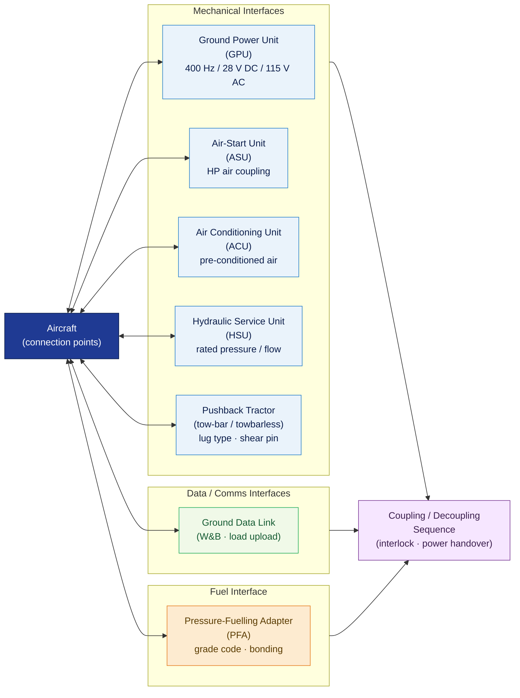

# ATLAS 010-019 · Section 01 · Subsection 010 · Subsubject 004 — Ground Support Equipment Interfaces

## 1. Purpose

Defines the **mechanical, electrical, and pneumatic interface specifications** between the aircraft and ground support equipment (GSE) used during ground-handling operations within the Q+ATLANTIDE programme. Establishes the controlled interface parameters — connector types, load limits, voltage/pressure envelopes, and coupling sequences — that ensure safe and compatible GSE connection and disconnection, in conformance with ATA Spec 100[^ataspec100] and ATA iSpec 2200[^ata2200].

## 2. Scope

- Covers the *Ground Support Equipment Interfaces* subsubject (`004`) of subsection `010` *Ground Handling* within section `01` *Manejo en Tierra & Servicio*.
- Inherits Q-Division authority and ORB support from the parent row in [`../../README.md` §3](../../README.md#3-architecture-table)[^archtable].
- Concepts in scope:
  - **Mechanical interfaces** — aircraft attachment and coupling points for ground power units (GPU), air-start units (ASU), air conditioning units (ACU), hydraulic service units (HSU), and pushback tractors; including lug types, load ratings, and shear-pin specifications.
  - **Electrical interfaces** — external power receptacle specifications (400 Hz / 28 V DC / 115 V AC as applicable), plug/socket standards, polarity and phase sequencing, interlock logic, and maximum inrush current limits.
  - **Pneumatic interfaces** — ground high-pressure air supply coupling (HP air, pre-conditioned air), rated pressures, flow rates, and coupling-sequence interlocks to prevent over-pressure.
  - **Fuel-system interface** — fuelling panel access, pressure-fuelling adapter (PFA) types, fuel-grade compatibility codes, and bonding/earthing requirements; cross-referenced to subsection `011` *Servicing* for procedural detail.
  - **Data/communications interfaces** — ground data link connectors and aircraft-to-ground-station data ports used during pre-flight loading and weight-and-balance verification.
  - **Coupling and decoupling sequences** — the prescribed order for connecting and disconnecting each GSE category, including interlock checks and power-transfer handover steps.
- Out of scope: terminology and applicability (`001_`), personnel roles and authorisation (`002_`), ramp safety-zone demarcation (`003_`), and documentation log formats (`005_`). Detailed GSE fleet management is addressed in subsection `015` *GSE*.

## 3. Diagram — GSE Interface Categories and Aircraft Connection Points

Aircraft connection points are grouped by interface type; each GSE category connects only to its designated point and follows the prescribed coupling sequence.

## 4. Footprint

| Metric | Value |
|---|---|
| Architecture | `ATLAS` — Aircraft Top Level Architecture Schema/System (controlled term) |
| Master range | `000–099` |
| Code range | `010-019` |
| Section | `01` — Manejo en Tierra & Servicio |
| Subsection | `010` — Ground Handling |
| Subsubject | `004` — Ground Support Equipment Interfaces |
| Primary Q-Division | Q-GROUND[^qdiv] |
| Support Q-Divisions | Q-MECHANICS, Q-INDUSTRY |
| ORB support | ORB-PMO, ORB-FIN |
| Governance class | `baseline`[^gov] |
| Folder path | `Q+ATLANTIDE/000-099_ATLAS/010-019_Manejo-en-Tierra-Servicio/010_Ground-handling/` |
| Document | `010-004-Ground-Support-Equipment-Interfaces.md` (this file) |
| Parent subsection | [`README.md`](./README.md) · [`010-000-Ground-Handling-Overview.md`](./010-000-Ground-Handling-Overview.md) |
| Parent architecture | [`../../README.md`](../../README.md) |
| Parent baseline | [`organization/Q+ATLANTIDE.md`](../../../../organization/Q+ATLANTIDE.md) |

## 5. References & Citations

[^baseline]: **Q+ATLANTIDE controlled baseline (v1.0.0)** — [`organization/Q+ATLANTIDE.md`](../../../../organization/Q+ATLANTIDE.md). Defines the controlled `000-999` architecture-band taxonomy and the ATLAS-1000 register subpart.

[^archtable]: **ATLAS §3 Architecture Table** — [`../../README.md` §3](../../README.md#3-architecture-table). Authoritative source for the `010-019` row (Section `01` — Manejo en Tierra & Servicio, Primary Q-Division Q-GROUND).

[^qdiv]: **Q-Division authority** — Q-Divisions provide technical authority over an architecture row (Q+ATLANTIDE Note N-002). See [`organization/Q+ATLANTIDE.md` §4](../../../../organization/Q+ATLANTIDE.md#4-notes).

[^gov]: **Governance class** — `baseline` denotes documents under controlled change management within the Q+ATLANTIDE baseline.

[^ata2200]: **ATA iSpec 2200 — Information Standards for Aviation Maintenance** — Governs GSE interface documentation structure, data-module scope, and coupling-sequence format for ATLAS maintenance artefacts.

[^ataspec100]: **ATA Spec 100 — Manufacturers Technical Data** — Baseline standard for aircraft-to-GSE interface specifications, connector types, and service-point identification.

[^s1000d]: **S1000D Issue 6.0 — International specification for technical publications** — Common Source DataBase (CSDB) and Data Module Code (DMC) specification used for all Q+ATLANTIDE artefacts.

[^as9100d]: **AS9100D — Quality Management Systems — Aviation, Space and Defense Organizations** — Quality-management baseline for interface verification, inspection records, and coupling-sequence control.

[^icaodoc9137]: **ICAO Doc 9137 — Airport Services Manual** — Reference for GSE safety standoff distances, interface-area demarcation, and ground-power connection procedures at aerodromes.

[^iataigom]: **IATA Ground Operations Manual (IGOM)** — Industry-standard operational procedures for GSE interface connection, safety interlock requirements, and ground power management.

### Applicable industry standards

The following standards apply to this subsubject in addition to the cross-cutting Q+ATLANTIDE governance:

- ATA iSpec 2200 — Information Standards for Aviation Maintenance[^ata2200]
- ATA Spec 100 — Manufacturers Technical Data[^ataspec100]
- S1000D Issue 6.0 — International specification for technical publications[^s1000d]
- AS9100D — Quality Management Systems — Aviation, Space and Defense Organizations[^as9100d]
- ICAO Doc 9137 — Airport Services Manual[^icaodoc9137]
- IATA Ground Operations Manual (IGOM)[^iataigom]
