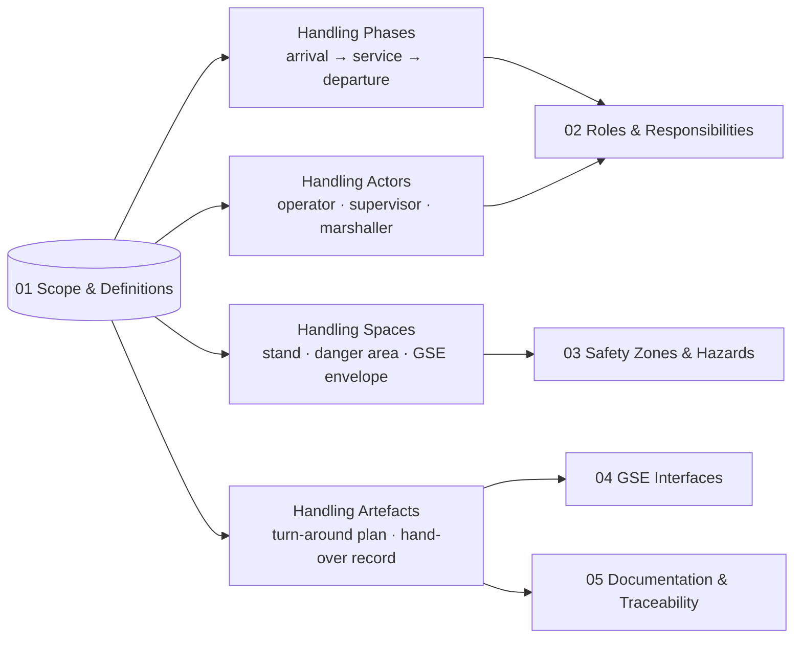

# ATLAS 010-019 · Section 01 · Subsection 010 · Subsubject 011 — Scope and Definitions

## 1. Purpose

Establishes the **scope boundary** and **controlled vocabulary** of the *Ground handling* subsection (`010`) within ATLAS `010-019.01` *Manejo en Tierra & Servicio*. Fixes the terms (aircraft turn-around, into-position, out-of-position, hand-over, danger area, GSE envelope, FOD perimeter) used by the downstream subsubjects (`012`–`015`) so that role assignments, safety zoning, GSE interfaces and traceability records share a single semantic model on the ATA iSpec 2200 / Spec 100 information set[^ata2200][^ataspec100][^s1000d], in conformance with the controlled Q+ATLANTIDE baseline[^baseline].

## 2. Scope

- Covers the *Scope and Definitions* subsubject (`011`) of subsection `010` *Ground handling* within section `01` *Manejo en Tierra & Servicio*.
- Inherits Q-Division authority and ORB support from the parent row in [`../../README.md` §3](../../README.md#3-architecture-table)[^archtable].
- Term classes in scope: **handling phases** (arrival → into-position → service → out-of-position → departure), **handling actors** (operator, supervisor, marshaller, GSE driver, mechanic-on-call), **handling spaces** (stand, danger area, FOD perimeter, GSE envelope, walk-routes) and **handling artefacts** (turn-around plan, hand-over record, GSE interface log).
- Out of scope: detailed servicing procedures (subsection `020`), towing/pushback (subsection `040`) and parking configurations (subsection `050`); these are referenced as **adjacent subsections** under the same `010-019` code range and are not redefined here.
- Definitions are surfaced as S1000D `terminology` entries on the ATA iSpec 2200 information set[^ata2200][^s1000d] and quality-controlled per AS9100D[^as9100d].

## 3. Diagram

The diagram below shows how the *Ground handling* term-set is partitioned into the four definition classes consumed by the downstream subsubjects (`012`–`015`).

## 4. Footprint

| Metric | Value |
|---|---|
| Architecture | `ATLAS` — Aircraft Top-Level Architecture System |
| Master range | `000–099` |
| Code range | `010-019` |
| Section | `01` — Manejo en Tierra & Servicio |
| Subject | `00` — General Information |
| Subsection | `010` — Ground handling |
| Subsubject | `011` — Scope and Definitions |
| Primary Q-Division | Q-GROUND[^qdiv] |
| Support Q-Divisions | Q-MECHANICS, Q-INDUSTRY |
| ORB support | ORB-PMO, ORB-FIN |
| Governance class | `baseline`[^gov] |
| Folder path | `Q+ATLANTIDE/000-099_ATLAS/010-019_Manejo-en-Tierra-Servicio/010_Ground-handling/` |
| Document | `011_Scope-and-Definitions.md` (this file) |
| Parent subsection | [`010_Overview.md`](./010_Overview.md) |
| Parent architecture | [`../../README.md`](../../README.md) |
| Parent baseline | [`organization/Q+ATLANTIDE.md`](../../../../organization/Q+ATLANTIDE.md) |

## 5. References & Citations

[^baseline]: **Q+ATLANTIDE controlled baseline (v1.0.0)** — [`organization/Q+ATLANTIDE.md`](../../../../organization/Q+ATLANTIDE.md). Defines the controlled `000-999` architecture-band taxonomy and the ATLAS-1000 register subpart.

[^archtable]: **ATLAS §3 Architecture Table** — [`../../README.md` §3](../../README.md#3-architecture-table). Authoritative source for the `010-019` row (Section `01` — Manejo en Tierra & Servicio, Primary Q-Division Q-GROUND).

[^qdiv]: **Q-Division authority** — Q-Divisions provide technical authority over an architecture row (Q+ATLANTIDE Note N-002). See [`organization/Q+ATLANTIDE.md` §4](../../../../organization/Q+ATLANTIDE.md#4-notes).

[^gov]: **Governance class** — Bands are classified as `baseline` or `restricted` per Q+ATLANTIDE §4 governance rules.

[^ata2200]: **ATA iSpec 2200 — Information Standards for Aviation Maintenance** — Industry standard for digital aircraft maintenance information; governs chapter / section / subject numbering inherited by ATLAS `000-099`.

[^ataspec100]: **ATA Spec 100 — Manufacturers' Technical Data** — Predecessor numbering scheme that established the 00–99 chapter map mirrored by ATLAS sub-ranges.

[^s1000d]: **S1000D Issue 6.0 — International specification for technical publications** — Common Source DataBase (CSDB) and Data Module Code (DMC) specification used across ATLAS technical publications.

[^as9100d]: **AS9100D — Quality Management Systems — Aviation, Space and Defense Organizations** — Quality-management baseline for all Q+ATLANTIDE deliverables.

### Applicable industry standards

The following ATA-family and industry standards apply to this subsubject in addition to the cross-cutting Q+ATLANTIDE governance:

- ATA iSpec 2200 — Information Standards for Aviation Maintenance[^ata2200]
- ATA Spec 100 — Manufacturers' Technical Data[^ataspec100]
- S1000D Issue 6.0 — International specification for technical publications[^s1000d]
- AS9100D — Quality Management Systems — Aviation, Space and Defense Organizations[^as9100d]
