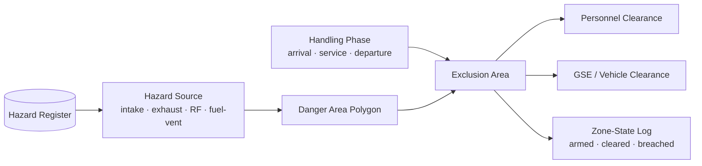

# ATLAS 010-019 · Section 01 · Subsection 010 · Subsubject 013 — Safety Zones, Hazards and Exclusion Areas

## 1. Purpose

Defines the **safety zoning model** used while the airframe is on the stand under ATLAS `010-019.010` *Ground handling*: the named hazard sources (engine intake/exhaust, propeller arc, APU exhaust, fuel-vent, antenna RF, energised servicing panels), the geometric **danger areas** they project, and the **exclusion areas** that personnel and GSE must clear before each phase. Zoning data are anchored to the configuration baseline of subsection `020 configuración` and surfaced as S1000D applicability conditions on the ATA iSpec 2200 / Spec 100 information set[^ata2200][^ataspec100][^s1000d], in conformance with the controlled Q+ATLANTIDE baseline[^baseline] and audited per AS9100D[^as9100d].

## 2. Scope

- Covers the *Safety Zones, Hazards and Exclusion Areas* subsubject (`013`) of subsection `010` *Ground handling* within section `01` *Manejo en Tierra & Servicio*.
- Inherits Q-Division authority and ORB support from the parent row in [`../../README.md` §3](../../README.md#3-architecture-table)[^archtable]; Q-GROUND owns the zoning model, with Q-MECHANICS consulted on energy-source classification.
- Hazard classes in scope: **propulsion hazards** (intake suction, exhaust efflux, propeller/rotor arc), **fluid hazards** (fuel-vent, fuel-spill containment, hydraulic blowdown), **electrical & RF hazards** (energised servicing panels, antenna radiation, lightning bonding), **mechanical hazards** (moving control surfaces, deploying gear/doors), **environmental hazards** (jet-blast, FOD, ice/snow shedding).
- Artefact classes in scope: **Hazard register**, **Danger-area polygon** (per hazard, per phase), **Exclusion-area polygon** (personnel, GSE, vehicle), **Zone-state log** (armed / cleared / breached).
- Out of scope: hazard modelling for towing/pushback (subsection `040`) and parking sweep (subsection `050`); cross-references only.

## 3. Diagram

The diagram below shows how a **hazard source** projects a **danger area** that, combined with the active handling phase, produces the **exclusion area** enforced for personnel and GSE during ground handling.

## 4. Footprint

| Metric | Value |
|---|---|
| Architecture | `ATLAS` — Aircraft Top-Level Architecture System |
| Master range | `000–099` |
| Code range | `010-019` |
| Section | `01` — Manejo en Tierra & Servicio |
| Subject | `00` — General Information |
| Subsection | `010` — Ground handling |
| Subsubject | `013` — Safety Zones, Hazards and Exclusion Areas |
| Primary Q-Division | Q-GROUND[^qdiv] |
| Support Q-Divisions | Q-MECHANICS, Q-INDUSTRY |
| ORB support | ORB-PMO, ORB-FIN |
| Governance class | `baseline`[^gov] |
| Folder path | `Q+ATLANTIDE/000-099_ATLAS/010-019_Manejo-en-Tierra-Servicio/010_Ground-handling/` |
| Document | `013_Safety-Zones-Hazards-and-Exclusion-Areas.md` (this file) |
| Parent subsection | [`010_Overview.md`](./010_Overview.md) |
| Parent architecture | [`../../README.md`](../../README.md) |
| Parent baseline | [`organization/Q+ATLANTIDE.md`](../../../../organization/Q+ATLANTIDE.md) |

## 5. References & Citations

[^baseline]: **Q+ATLANTIDE controlled baseline (v1.0.0)** — [`organization/Q+ATLANTIDE.md`](../../../../organization/Q+ATLANTIDE.md). Defines the controlled `000-999` architecture-band taxonomy and the ATLAS-1000 register subpart.

[^archtable]: **ATLAS §3 Architecture Table** — [`../../README.md` §3](../../README.md#3-architecture-table). Authoritative source for the `010-019` row (Section `01` — Manejo en Tierra & Servicio, Primary Q-Division Q-GROUND).

[^qdiv]: **Q-Division authority** — Q-Divisions provide technical authority over an architecture row (Q+ATLANTIDE Note N-002). See [`organization/Q+ATLANTIDE.md` §4](../../../../organization/Q+ATLANTIDE.md#4-notes).

[^gov]: **Governance class** — Bands are classified as `baseline` or `restricted` per Q+ATLANTIDE §4 governance rules.

[^ata2200]: **ATA iSpec 2200 — Information Standards for Aviation Maintenance** — Industry standard for digital aircraft maintenance information; governs chapter / section / subject numbering inherited by ATLAS `000-099`.

[^ataspec100]: **ATA Spec 100 — Manufacturers' Technical Data** — Predecessor numbering scheme that established the 00–99 chapter map mirrored by ATLAS sub-ranges.

[^s1000d]: **S1000D Issue 6.0 — International specification for technical publications** — Common Source DataBase (CSDB) and Data Module Code (DMC) specification used across ATLAS technical publications.

[^as9100d]: **AS9100D — Quality Management Systems — Aviation, Space and Defense Organizations** — Quality-management baseline for all Q+ATLANTIDE deliverables.

### Applicable industry standards

The following ATA-family and industry standards apply to this subsubject in addition to the cross-cutting Q+ATLANTIDE governance:

- ATA iSpec 2200 — Information Standards for Aviation Maintenance[^ata2200]
- ATA Spec 100 — Manufacturers' Technical Data[^ataspec100]
- S1000D Issue 6.0 — International specification for technical publications[^s1000d]
- AS9100D — Quality Management Systems — Aviation, Space and Defense Organizations[^as9100d]
