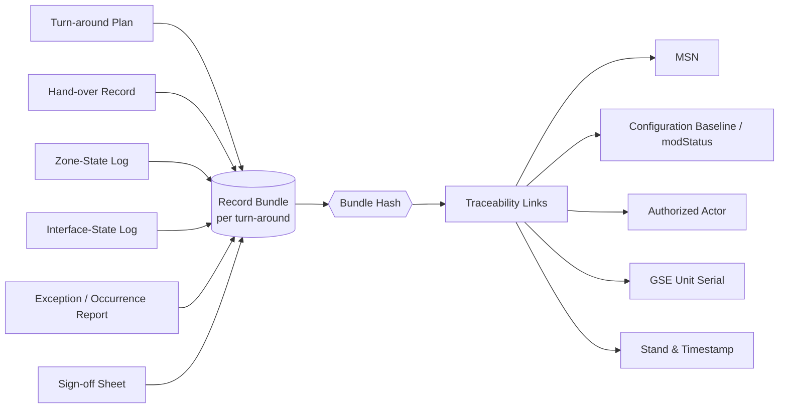

# ATLAS 010-019 · Section 01 · Subsection 010 · Subsubject 015 — Documentation, Logs and Traceability

## 1. Purpose

Defines the **documentation set** and **immutable log chain** that evidence each ground-handling event under ATLAS `010-019.010` *Ground handling*: the turn-around plan, hand-over record, zone-state log, GSE interface log and exception/occurrence reports, together with the **traceability links** that bind every entry to the airframe MSN, the configuration baseline of subsection `020 configuración`, the authorized actor of subsubject `012` and the GSE interface of subsubject `014`. Records are surfaced as S1000D data modules on the ATA iSpec 2200 / Spec 100 information set[^ata2200][^ataspec100][^s1000d], in conformance with the controlled Q+ATLANTIDE baseline[^baseline] and audited per AS9100D[^as9100d].

## 2. Scope

- Covers the *Documentation, Logs and Traceability* subsubject (`015`) of subsection `010` *Ground handling* within section `01` *Manejo en Tierra & Servicio*.
- Inherits Q-Division authority and ORB support from the parent row in [`../../README.md` §3](../../README.md#3-architecture-table)[^archtable]; Q-GROUND owns the record set, with ORB-PMO accountable for retention policy and ORB-FIN consulted for cost-allocation reconciliation.
- Record classes in scope: **Turn-around plan** (per arrival), **Hand-over record** (inbound crew → ground team → outbound crew), **Zone-state log** (from subsubject `013`), **Interface-state log** (from subsubject `014`), **Exception / occurrence report**, **Sign-off sheet** (RACI evidence from subsubject `012`).
- Traceability link classes in scope: record ↔ **MSN**, record ↔ **configuration baseline / modStatus**, record ↔ **authorized actor**, record ↔ **GSE unit serial**, record ↔ **stand & timestamp**.
- Records are surfaced as S1000D `applic` properties (e.g. `msn`, `modStatus`, `lcPhase`, `operator`) on the ATA iSpec 2200 information set[^ata2200][^s1000d] so the chain is filterable per airframe instance and per turn-around.

## 3. Diagram

The diagram below shows how the four operational logs converge into a per-turn-around **record bundle** that is hashed and bound, through the traceability links, to the airframe MSN, the active configuration baseline, the authorized actor and the GSE unit serial.

## 4. Footprint

| Metric | Value |
|---|---|
| Architecture | `ATLAS` — Aircraft Top-Level Architecture System |
| Master range | `000–099` |
| Code range | `010-019` |
| Section | `01` — Manejo en Tierra & Servicio |
| Subject | `00` — General Information |
| Subsection | `010` — Ground handling |
| Subsubject | `015` — Documentation, Logs and Traceability |
| Primary Q-Division | Q-GROUND[^qdiv] |
| Support Q-Divisions | Q-MECHANICS, Q-INDUSTRY |
| ORB support | ORB-PMO, ORB-FIN |
| Governance class | `baseline`[^gov] |
| Folder path | `Q+ATLANTIDE/000-099_ATLAS/010-019_Manejo-en-Tierra-Servicio/010_Ground-handling/` |
| Document | `015_Documentation-Logs-and-Traceability.md` (this file) |
| Parent subsection | [`010_Overview.md`](./010_Overview.md) |
| Parent architecture | [`../../README.md`](../../README.md) |
| Parent baseline | [`organization/Q+ATLANTIDE.md`](../../../../organization/Q+ATLANTIDE.md) |

## 5. References & Citations

[^baseline]: **Q+ATLANTIDE controlled baseline (v1.0.0)** — [`organization/Q+ATLANTIDE.md`](../../../../organization/Q+ATLANTIDE.md). Defines the controlled `000-999` architecture-band taxonomy and the ATLAS-1000 register subpart.

[^archtable]: **ATLAS §3 Architecture Table** — [`../../README.md` §3](../../README.md#3-architecture-table). Authoritative source for the `010-019` row (Section `01` — Manejo en Tierra & Servicio, Primary Q-Division Q-GROUND).

[^qdiv]: **Q-Division authority** — Q-Divisions provide technical authority over an architecture row (Q+ATLANTIDE Note N-002). See [`organization/Q+ATLANTIDE.md` §4](../../../../organization/Q+ATLANTIDE.md#4-notes).

[^gov]: **Governance class** — Bands are classified as `baseline` or `restricted` per Q+ATLANTIDE §4 governance rules.

[^ata2200]: **ATA iSpec 2200 — Information Standards for Aviation Maintenance** — Industry standard for digital aircraft maintenance information; governs chapter / section / subject numbering inherited by ATLAS `000-099`.

[^ataspec100]: **ATA Spec 100 — Manufacturers' Technical Data** — Predecessor numbering scheme that established the 00–99 chapter map mirrored by ATLAS sub-ranges.

[^s1000d]: **S1000D Issue 6.0 — International specification for technical publications** — Common Source DataBase (CSDB) and Data Module Code (DMC) specification used across ATLAS technical publications.

[^as9100d]: **AS9100D — Quality Management Systems — Aviation, Space and Defense Organizations** — Quality-management baseline for all Q+ATLANTIDE deliverables.

### Applicable industry standards

The following ATA-family and industry standards apply to this subsubject in addition to the cross-cutting Q+ATLANTIDE governance:

- ATA iSpec 2200 — Information Standards for Aviation Maintenance[^ata2200]
- ATA Spec 100 — Manufacturers' Technical Data[^ataspec100]
- S1000D Issue 6.0 — International specification for technical publications[^s1000d]
- AS9100D — Quality Management Systems — Aviation, Space and Defense Organizations[^as9100d]
