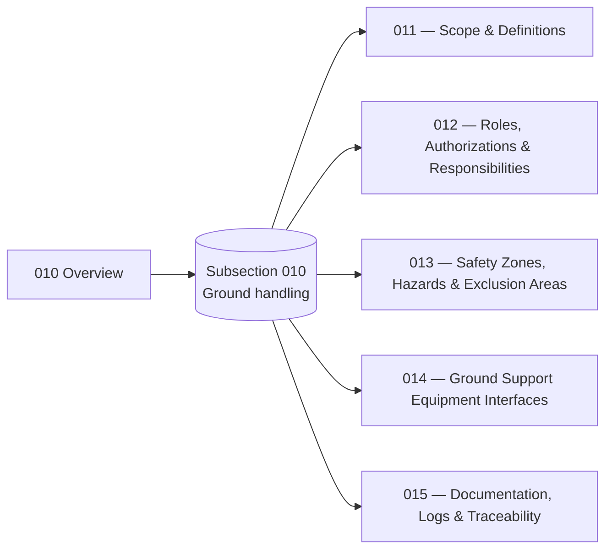

# ATLAS 010-019 · Section 01 · Subsection 010 — Ground handling

## 1. Purpose

Subsection-level index for *Ground handling* (`010`) within ATLAS `010-019` — *Manejo en Tierra & Servicio*. Aggregates the `010 Overview` and the detailed subsubjects (`011`–`015`) that extend it with the canonical scope and definitions, role assignments, safety zoning, GSE interfaces and documentation/traceability semantics, in conformance with the controlled Q+ATLANTIDE baseline[^baseline] and S1000D Issue 6.0[^s1000d].

## 2. Scope

- Covers the full subsubject namespace `010`–`019` of subsection `010` *Ground handling*; subsubjects `011`–`015` are populated in this baseline release, the remaining `016`–`019` slots remain available for future extension per the Overview's authorisation[^archtable].
- Inherits Q-Division authority and ORB support from the parent row in [`../../README.md` §3](../../README.md#3-architecture-table)[^archtable].

## 3. Diagram

The diagram below shows how this subsection's `010 Overview` aggregates the populated subsubjects (`011`–`015`) into the *Ground handling* slice of ATLAS `010-019`.

## 4. Subsubject Index

| 01N | Title | Document | Status |
|---:|---|---|---|
| 010 | Overview | [`010_Overview.md`](./010_Overview.md) | active |
| 011 | Scope and Definitions | [`011_Scope-and-Definitions.md`](./011_Scope-and-Definitions.md) | active |
| 012 | Roles, Authorizations and Responsibilities | [`012_Roles-Authorizations-and-Responsibilities.md`](./012_Roles-Authorizations-and-Responsibilities.md) | active |
| 013 | Safety Zones, Hazards and Exclusion Areas | [`013_Safety-Zones-Hazards-and-Exclusion-Areas.md`](./013_Safety-Zones-Hazards-and-Exclusion-Areas.md) | active |
| 014 | Ground Support Equipment Interfaces | [`014_Ground-Support-Equipment-Interfaces.md`](./014_Ground-Support-Equipment-Interfaces.md) | active |
| 015 | Documentation, Logs and Traceability | [`015_Documentation-Logs-and-Traceability.md`](./015_Documentation-Logs-and-Traceability.md) | active |

## 5. Footprint

| Metric | Value |
|---|---|
| Architecture | `ATLAS` — Aircraft Top-Level Architecture System |
| Master range | `000–099` |
| Code range | `010-019` |
| Section | `01` — Manejo en Tierra & Servicio |
| Subject | `00` — General Information |
| Subsection | `010` — Ground handling |
| Subsubject namespace | `010`–`019` (`010` + `011`–`015` populated; canonical `01N_*.md` scheme) |
| Primary Q-Division | Q-GROUND[^qdiv] |
| Support Q-Divisions | Q-MECHANICS, Q-INDUSTRY |
| ORB support | ORB-PMO, ORB-FIN |
| Governance class | `baseline`[^gov] |
| Folder path | `Q+ATLANTIDE/000-099_ATLAS/010-019_Manejo-en-Tierra-Servicio/010_Ground-handling/` |
| Document | `README.md` (this file) |
| Parent architecture | [`../../README.md`](../../README.md) |
| Parent baseline | [`organization/Q+ATLANTIDE.md`](../../../../organization/Q+ATLANTIDE.md) |

## Governance

Governed by [`organization/Q+ATLANTIDE.md`](../../../../organization/Q+ATLANTIDE.md)[^baseline]. All subsubjects under this subsection inherit `architecture_code = ATLAS`, `primary_q_division = Q-GROUND` and `governance_class = baseline` from the parent ATLAS band; extensions added under `016`–`019` shall preserve those header fields, follow the canonical `01N_*.md` naming scheme, and reuse the footnote set declared below.

## 6. References & Citations

[^baseline]: **Q+ATLANTIDE controlled baseline (v1.0.0)** — [`organization/Q+ATLANTIDE.md`](../../../../organization/Q+ATLANTIDE.md). Defines the controlled `000-999` architecture-band taxonomy and the ATLAS-1000 register subpart.

[^archtable]: **ATLAS §3 Architecture Table** — [`../../README.md` §3](../../README.md#3-architecture-table). Authoritative source for the `010-019` row (Section `01` — Manejo en Tierra & Servicio, Primary Q-Division Q-GROUND).

[^qdiv]: **Q-Division authority** — Q-Divisions provide technical authority over an architecture row (Q+ATLANTIDE Note N-002). See [`organization/Q+ATLANTIDE.md` §4](../../../../organization/Q+ATLANTIDE.md#4-notes).

[^gov]: **Governance class** — Bands are classified as `baseline` or `restricted` per Q+ATLANTIDE §4 governance rules.

[^ata2200]: **ATA iSpec 2200 — Information Standards for Aviation Maintenance** — Industry standard for digital aircraft maintenance information; governs chapter / section / subject numbering inherited by ATLAS `000-099`.

[^ataspec100]: **ATA Spec 100 — Manufacturers' Technical Data** — Predecessor numbering scheme that established the 00–99 chapter map mirrored by ATLAS sub-ranges.

[^s1000d]: **S1000D Issue 6.0 — International specification for technical publications** — Common Source DataBase (CSDB) and Data Module Code (DMC) specification used across ATLAS technical publications.

[^as9100d]: **AS9100D — Quality Management Systems — Aviation, Space and Defense Organizations** — Quality-management baseline for all Q+ATLANTIDE deliverables.

### Applicable industry standards

The following ATA-family and industry standards apply to this subsection in addition to the cross-cutting Q+ATLANTIDE governance:

- ATA iSpec 2200 — Information Standards for Aviation Maintenance[^ata2200]
- ATA Spec 100 — Manufacturers' Technical Data[^ataspec100]
- S1000D Issue 6.0 — International specification for technical publications[^s1000d]
- AS9100D — Quality Management Systems — Aviation, Space and Defense Organizations[^as9100d]
