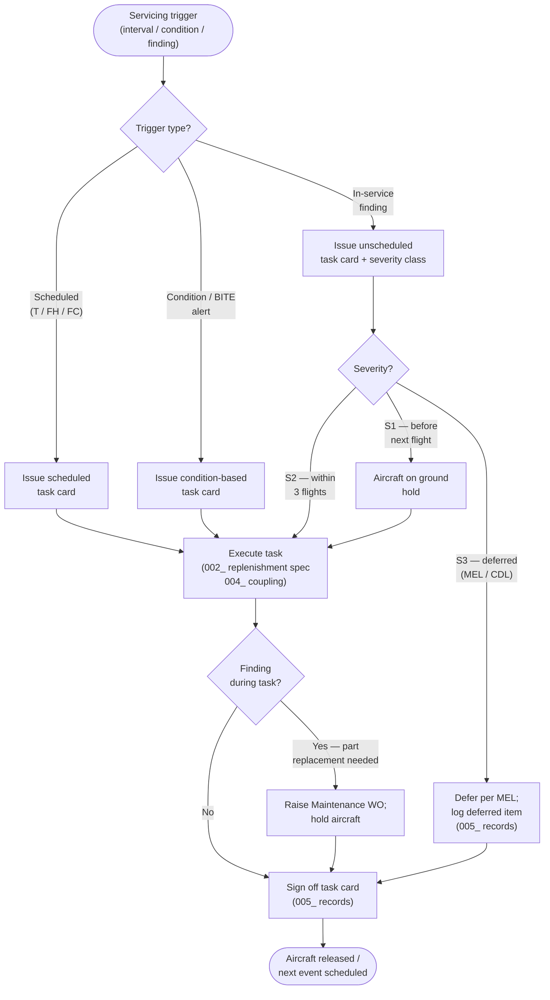

# ATLAS 010-019 · Section 01 · Subsection 011 · Subsubject 003 — Scheduled and Unscheduled Servicing

## 1. Purpose

Defines the **scheduled and unscheduled servicing** framework — the complete set of rules governing when servicing tasks are triggered, how task cards are structured and authorised, and how unscheduled events escalate to corrective or deferred maintenance. Establishes the controlled vocabulary for service intervals, condition-based triggers, task-card formats, and escalation logic that Q-GROUND technicians and planners use under the Q+ATLANTIDE baseline[^baseline], in conformance with ATA iSpec 2200[^ata2200] and AS9100D[^as9100d].

## 2. Scope

- Covers the *Scheduled and Unscheduled Servicing* subsubject (`003`) of subsection `011` *Servicing* within section `01` *Manejo en Tierra & Servicio*.
- Inherits Q-Division authority and ORB support from the parent row in [`../../README.md` §3](../../README.md#3-architecture-table)[^archtable].
- Concepts in scope:
  - **Scheduled servicing** — tasks triggered by elapsed calendar time, flight-hours, flight-cycles, or combinations thereof. Intervals are expressed as `T/FH/FC` tuples (e.g., "every 500 FH or 6 months, whichever comes first") and cross-referenced to the Maintenance Planning Document (MPD).
  - **Condition-based servicing** — tasks triggered by sensor thresholds, visual inspections, or BITE (Built-In Test Equipment) alerts rather than fixed intervals. Includes oil-level BITE alerts, hydraulic-pressure drop indications, and water-quantity sensor warnings.
  - **Unscheduled servicing** — tasks arising from findings during pre-flight, transit, or post-flight checks or from in-flight system reports. Each unscheduled event is assigned a severity class (S1 — before next flight; S2 — within 3 flights; S3 — deferred per MEL) that determines the response window.
  - **Task-card structure** — each servicing task card carries: task ID (linked to the S1000D DMC[^s1000d]), skill code, tool references, consumable specifications from `002_`, warning/caution notices, and sign-off fields for the Authorised Technician (AT) and Inspector.
  - **Escalation logic** — if a servicing task reveals a condition requiring part replacement or system test, the task card raises an unscheduled maintenance work order (WO) and the aircraft is held until the WO is signed off or deferred per MEL authority.
  - **Carry-over and deferrals** — rules for extending scheduled intervals (within approved tolerances) and for deferring unscheduled items using the Minimum Equipment List (MEL) or Configuration Deviation List (CDL).
- Out of scope: replenishment specifications (`002_`), physical servicing-point locations (`004_`), and record-keeping systems (`005_`).

## 3. Diagram — Servicing Event Decision Flow

Every servicing event — whether planned or discovered — follows the same triage path before a task card is issued and closed.

## 4. Footprint

| Metric | Value |
|---|---|
| Architecture | `ATLAS` — Aircraft Top Level Architecture Schema/System (controlled term) |
| Master range | `000–099` |
| Code range | `010-019` |
| Section | `01` — Manejo en Tierra & Servicio |
| Subsection | `011` — Servicing |
| Subsubject | `003` — Scheduled and Unscheduled Servicing |
| Primary Q-Division | Q-GROUND[^qdiv] |
| Support Q-Divisions | Q-MECHANICS, Q-INDUSTRY |
| ORB support | ORB-PMO, ORB-FIN |
| Governance class | `baseline`[^gov] |
| Folder path | `Q+ATLANTIDE/000-099_ATLAS/010-019_Manejo-en-Tierra-Servicio/011_Servicing/` |
| Document | `003_Scheduled-and-Unscheduled-Servicing.md` (this file) |
| Parent subsection | [`README.md`](./README.md) · [`000_Overview.md`](./000_Overview.md) |
| Parent architecture | [`../../README.md`](../../README.md) |
| Parent baseline | [`organization/Q+ATLANTIDE.md`](../../../../organization/Q+ATLANTIDE.md) |

## 5. References & Citations

[^baseline]: **Q+ATLANTIDE controlled baseline (v1.0.0)** — [`organization/Q+ATLANTIDE.md`](../../../../organization/Q+ATLANTIDE.md). Defines the controlled `000-999` architecture-band taxonomy and the ATLAS-1000 register subpart.

[^archtable]: **ATLAS §3 Architecture Table** — [`../../README.md` §3](../../README.md#3-architecture-table). Authoritative source for the `010-019` row (Section `01` — Manejo en Tierra & Servicio, Primary Q-Division Q-GROUND).

[^qdiv]: **Q-Division authority** — Q-Divisions provide technical authority over an architecture row (Q+ATLANTIDE Note N-002). See [`organization/Q+ATLANTIDE.md` §4](../../../../organization/Q+ATLANTIDE.md#4-notes).

[^gov]: **Governance class** — `baseline` denotes documents under controlled change management within the Q+ATLANTIDE baseline.

[^ata2200]: **ATA iSpec 2200 — Information Standards for Aviation Maintenance** — Defines task-card structure, interval expression conventions (T/FH/FC), and the escalation pathway from servicing to maintenance for all ATLAS artefacts.

[^ataspec100]: **ATA Spec 100 — Manufacturers Technical Data** — Baseline standard for maintenance-interval definitions, MEL/CDL deferral authority, and task-card content requirements.

[^s1000d]: **S1000D Issue 6.0 — International specification for technical publications** — Defines the Data Module Code (DMC) used as the canonical task reference on all Q+ATLANTIDE task cards, and the CSDB structure that links task cards to applicable warnings and consumable data modules.

[^as9100d]: **AS9100D — Quality Management Systems — Aviation, Space and Defense Organizations** — Quality-management baseline covering planned vs. unplanned service events, non-conformance escalation, corrective-action requirements, and release-to-service authorisation.

### Applicable industry standards

The following standards apply to this subsubject in addition to the cross-cutting Q+ATLANTIDE governance:

- ATA iSpec 2200 — Information Standards for Aviation Maintenance[^ata2200]
- ATA Spec 100 — Manufacturers Technical Data[^ataspec100]
- S1000D Issue 6.0 — International specification for technical publications[^s1000d]
- AS9100D — Quality Management Systems — Aviation, Space and Defense Organizations[^as9100d]
