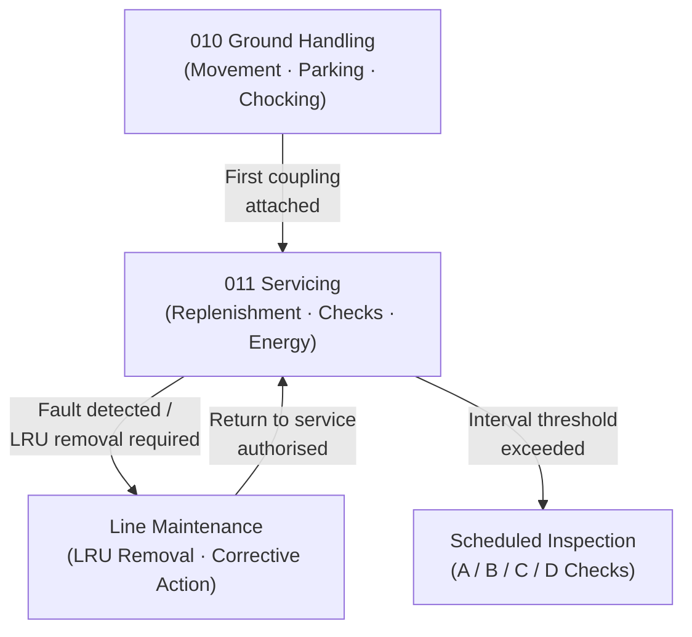

# ATLAS 010-019 · Section 01 · Subsection 011 · Subsubject 001 — Scope and Servicing Boundaries

## 1. Purpose

Defines the **scope and servicing boundaries** for subsection `011` *Servicing* — the complete set of routine ground-servicing tasks assigned to ATLAS 010-019 together with the explicit interfaces to adjacent ATLAS subsections (maintenance, ground handling, and inspection). Establishes the controlled vocabulary and task-boundary rules that prevent scope overlap, ensuring each servicing activity is owned by exactly one ATLAS subsection and traceable to an authorised Q-Division per the Q+ATLANTIDE baseline[^baseline], in conformance with ATA iSpec 2200[^ata2200].

## 2. Scope

- Covers the *Scope and Servicing Boundaries* subsubject (`001`) of subsection `011` *Servicing* within section `01` *Manejo en Tierra & Servicio*.
- Inherits Q-Division authority and ORB support from the parent row in [`../../README.md` §3](../../README.md#3-architecture-table)[^archtable].
- Concepts in scope:
  - **Servicing task definition** — a servicing task is any routine replenishment, fluid check, or energy-level verification performed between flights or at prescribed intervals that does not require removal or replacement of a line-replaceable unit (LRU). Tasks meeting this definition fall within `011_Servicing`; tasks requiring LRU removal fall within the adjacent maintenance subsection.
  - **Boundary with Ground Handling (`010`)** — ground handling covers aircraft movement, parking, safety-cone placement, and chocking; servicing begins where fluid or energy replenishment starts. The handover point is defined by the first coupling attachment at a servicing panel.
  - **Boundary with Line Maintenance** — corrective actions triggered during servicing (e.g., a fluid system fault detected during replenishment) are handed over to line maintenance per the escalation protocol in `011-003-Scheduled-and-Unscheduled-Servicing.md`.
  - **Aircraft systems in scope** — fuel system, engine oil system, hydraulic system, potable-water system, waste system, pneumatic (nitrogen/oxygen) system, and aircraft battery/GPU interface. Avionics cooling fluid (if closed-loop) is included; avionics box replacement is excluded.
  - **Aircraft systems out of scope** — engine/APU replacement, landing-gear overhaul, structural inspections, and any task classified as a check A, B, C, or D.
- Out of scope: specific replenishment procedures (`002_`), scheduling logic (`003_`), coupling hardware (`004_`), and record requirements (`005_`).

## 3. Diagram — Servicing Boundary Map

The diagram shows the boundary between `011_Servicing` tasks and the adjacent ATLAS subsections, with the handover points that trigger scope transfer.

## 4. Footprint

| Metric | Value |
|---|---|
| Architecture | `ATLAS` — Aircraft Top Level Architecture Schema/System (controlled term) |
| Master range | `000–099` |
| Code range | `010-019` |
| Section | `01` — Manejo en Tierra & Servicio |
| Subsection | `011` — Servicing |
| Subsubject | `001` — Scope and Servicing Boundaries |
| Primary Q-Division | Q-GROUND[^qdiv] |
| Support Q-Divisions | Q-MECHANICS, Q-INDUSTRY |
| ORB support | ORB-PMO, ORB-FIN |
| Governance class | `baseline`[^gov] |
| Folder path | `Q+ATLANTIDE/000-099_ATLAS/010-019_Manejo-en-Tierra-Servicio/011_Servicing/` |
| Document | `011-001-Servicing-Scope-and-Boundaries.md` (this file) |
| Parent subsection | [`README.md`](./README.md) · [`011-000-Servicing-Overview.md`](./011-000-Servicing-Overview.md) |
| Parent architecture | [`../../README.md`](../../README.md) |
| Parent baseline | [`organization/Q+ATLANTIDE.md`](../../../../organization/Q+ATLANTIDE.md) |

## 5. References & Citations

[^baseline]: **Q+ATLANTIDE controlled baseline (v1.0.0)** — [`organization/Q+ATLANTIDE.md`](../../../../organization/Q+ATLANTIDE.md). Defines the controlled `000-999` architecture-band taxonomy and the ATLAS-1000 register subpart.

[^archtable]: **ATLAS §3 Architecture Table** — [`../../README.md` §3](../../README.md#3-architecture-table). Authoritative source for the `010-019` row (Section `01` — Manejo en Tierra & Servicio, Primary Q-Division Q-GROUND).

[^qdiv]: **Q-Division authority** — Q-Divisions provide technical authority over an architecture row (Q+ATLANTIDE Note N-002). See [`organization/Q+ATLANTIDE.md` §4](../../../../organization/Q+ATLANTIDE.md#4-notes).

[^gov]: **Governance class** — `baseline` denotes documents under controlled change management within the Q+ATLANTIDE baseline.

[^ata2200]: **ATA iSpec 2200 — Information Standards for Aviation Maintenance** — Defines the boundary between servicing and maintenance tasks, data-module scope, and task classification conventions used across all ATLAS 010-019 artefacts.

[^ataspec100]: **ATA Spec 100 — Manufacturers Technical Data** — Baseline standard for aircraft system identification and the delineation of ground-servicing versus maintenance tasks.

[^s1000d]: **S1000D Issue 6.0 — International specification for technical publications** — Common Source DataBase (CSDB) and Data Module Code (DMC) specification used for all Q+ATLANTIDE artefacts.

[^as9100d]: **AS9100D — Quality Management Systems — Aviation, Space and Defense Organizations** — Quality-management baseline covering task ownership, scope control, and escalation procedures.

### Applicable industry standards

The following standards apply to this subsubject in addition to the cross-cutting Q+ATLANTIDE governance:

- ATA iSpec 2200 — Information Standards for Aviation Maintenance[^ata2200]
- ATA Spec 100 — Manufacturers Technical Data[^ataspec100]
- S1000D Issue 6.0 — International specification for technical publications[^s1000d]
- AS9100D — Quality Management Systems — Aviation, Space and Defense Organizations[^as9100d]
