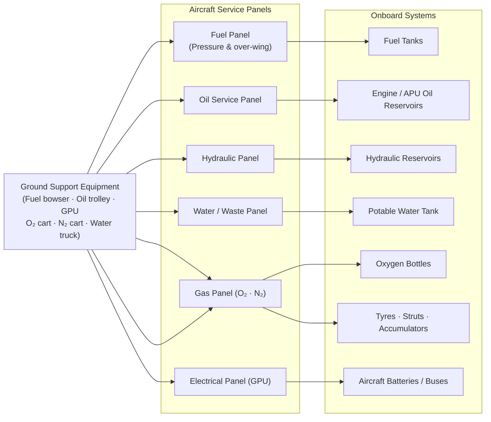

# ATLAS 010-019 · Section 01 · Subsection 011 · Subsubject 002 — Replenishment — Fluids, Gases and Energy

## 1. Purpose

Defines the **replenishment procedures and specifications** for all consumable fluids, gases, and energy sources serviced at the aircraft during ground operations. Establishes the controlled vocabulary for fluid grades, quantity limits, replenishment sequences, contamination-prevention controls, and energy-source coupling requirements used by Q-GROUND technicians under the Q+ATLANTIDE baseline[^baseline], in conformance with ATA iSpec 2200[^ata2200] and ATA Spec 100[^ataspec100].

## 2. Scope

- Covers the *Replenishment — Fluids, Gases and Energy* subsubject (`002`) of subsection `011` *Servicing* within section `01` *Manejo en Tierra & Servicio*.
- Inherits Q-Division authority and ORB support from the parent row in [`../../README.md` §3](../../README.md#3-architecture-table)[^archtable].
- Concepts in scope:
  - **Fuel replenishment** — approved fuel grades (Jet-A, Jet-A1, JP-8, sustainable aviation fuel blends), pressure and over-wing fuelling procedures, fuel quantity determination, defuelling, and fuel system venting controls.
  - **Engine and APU oil replenishment** — approved oil types and grades, quantity-check procedures (hot/cold engine), replenishment limits, and contamination checks.
  - **Hydraulic fluid replenishment** — approved fluid types (Skydrol, mineral oil), reservoir level checks, manual and powered replenishment procedures, and flush/purge protocols when fluid type changes.
  - **Potable water replenishment** — water-system fill procedures, disinfection requirements, fill-quantity limits, and interface with the waste-system drain to prevent cross-contamination.
  - **Gaseous oxygen replenishment** — portable and fixed-system oxygen bottle charging, pressure limits, purity specification (aviation-grade, min 99.5 % O₂), and fire-safety precautions.
  - **Nitrogen replenishment** — tyre inflation (main and nose gear), strut charging, and accumulator pre-charge; purity specification (dry nitrogen, min 99.5 % N₂) and pressure tables.
  - **Ground power and energy** — 28 V DC and 115 V AC 400 Hz ground power unit (GPU) connection procedures, pre-connection compatibility checks, and battery-charging interface specifications.
- Out of scope: physical coupling hardware and connector locations (`004_`), scheduling of replenishment tasks (`003_`), record-keeping (`005_`), and LRU-level replacement of fluid-system components (line maintenance).

## 3. Diagram — Replenishment System Map

Replenishment streams flow from ground support equipment (GSE) through aircraft service panels to the respective onboard systems. Each stream has an independent coupling point and contamination-control barrier.

## 4. Footprint

| Metric | Value |
|---|---|
| Architecture | `ATLAS` — Aircraft Top Level Architecture Schema/System (controlled term) |
| Master range | `000–099` |
| Code range | `010-019` |
| Section | `01` — Manejo en Tierra & Servicio |
| Subsection | `011` — Servicing |
| Subsubject | `002` — Replenishment — Fluids, Gases and Energy |
| Primary Q-Division | Q-GROUND[^qdiv] |
| Support Q-Divisions | Q-MECHANICS, Q-INDUSTRY |
| ORB support | ORB-PMO, ORB-FIN |
| Governance class | `baseline`[^gov] |
| Folder path | `Q+ATLANTIDE/000-099_ATLAS/010-019_Manejo-en-Tierra-Servicio/011_Servicing/` |
| Document | `011-002-Replenishment-Fluids-Gases-and-Energy.md` (this file) |
| Parent subsection | [`README.md`](./README.md) · [`011-000-Servicing-Overview.md`](./011-000-Servicing-Overview.md) |
| Parent architecture | [`../../README.md`](../../README.md) |
| Parent baseline | [`organization/Q+ATLANTIDE.md`](../../../../organization/Q+ATLANTIDE.md) |

## 5. References & Citations

[^baseline]: **Q+ATLANTIDE controlled baseline (v1.0.0)** — [`organization/Q+ATLANTIDE.md`](../../../../organization/Q+ATLANTIDE.md). Defines the controlled `000-999` architecture-band taxonomy and the ATLAS-1000 register subpart.

[^archtable]: **ATLAS §3 Architecture Table** — [`../../README.md` §3](../../README.md#3-architecture-table). Authoritative source for the `010-019` row (Section `01` — Manejo en Tierra & Servicio, Primary Q-Division Q-GROUND).

[^qdiv]: **Q-Division authority** — Q-Divisions provide technical authority over an architecture row (Q+ATLANTIDE Note N-002). See [`organization/Q+ATLANTIDE.md` §4](../../../../organization/Q+ATLANTIDE.md#4-notes).

[^gov]: **Governance class** — `baseline` denotes documents under controlled change management within the Q+ATLANTIDE baseline.

[^ata2200]: **ATA iSpec 2200 — Information Standards for Aviation Maintenance** — Governs replenishment task structure, fluid-specification data-module content, and servicing-procedure conventions for all ATLAS 010-019 artefacts.

[^ataspec100]: **ATA Spec 100 — Manufacturers Technical Data** — Defines fluid-grade designations, quantity tables, and servicing-point identification conventions used in replenishment specifications.

[^s1000d]: **S1000D Issue 6.0 — International specification for technical publications** — Common Source DataBase (CSDB) and Data Module Code (DMC) specification used for all Q+ATLANTIDE artefacts.

[^as9100d]: **AS9100D — Quality Management Systems — Aviation, Space and Defense Organizations** — Quality-management baseline covering material traceability, contamination control, and non-conformance reporting for replenishment operations.

### Applicable industry standards

The following standards apply to this subsubject in addition to the cross-cutting Q+ATLANTIDE governance:

- ATA iSpec 2200 — Information Standards for Aviation Maintenance[^ata2200]
- ATA Spec 100 — Manufacturers Technical Data[^ataspec100]
- S1000D Issue 6.0 — International specification for technical publications[^s1000d]
- AS9100D — Quality Management Systems — Aviation, Space and Defense Organizations[^as9100d]
