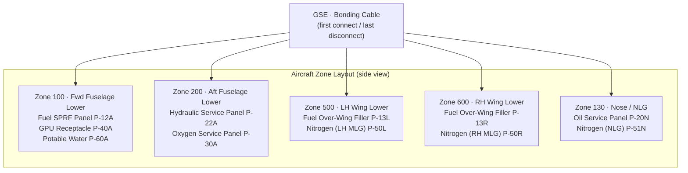

# ATLAS 010-019 · Section 01 · Subsection 011 · Subsubject 004 — Servicing Points, Couplings and Interfaces

## 1. Purpose

Defines the **physical locations, coupling standards, and GSE interface specifications** for all aircraft servicing access points within subsection `011` *Servicing*. Establishes the controlled vocabulary for panel locations (zone references), coupling types (male/female, quick-disconnect, pressure class), safety-interlock requirements, and ground support equipment (GSE) compatibility matrices that Q-GROUND technicians use to connect and disconnect servicing equipment safely, in conformance with ATA iSpec 2200[^ata2200] and ATA Spec 100[^ataspec100], and within the Q+ATLANTIDE baseline[^baseline].

## 2. Scope

- Covers the *Servicing Points, Couplings and Interfaces* subsubject (`004`) of subsection `011` *Servicing* within section `01` *Manejo en Tierra & Servicio*.
- Inherits Q-Division authority and ORB support from the parent row in [`../../README.md` §3](../../README.md#3-architecture-table)[^archtable].
- Concepts in scope:
  - **Zone and panel references** — servicing panels are identified by ATA zone code (e.g., Zone 100 — fuselage lower, Zone 200 — fuselage upper) and a panel designator (e.g., `P-12A — Fuel Single-Point Pressure Fill Panel`). Each panel entry lists its zone, physical side (LH/RH/Centre), and access height.
  - **Coupling types and pressure classes** — each service point specifies: coupling gender, nominal bore diameter, operating pressure class (`LOW` ≤ 50 psi; `MED` 51–3000 psi; `HIGH` > 3000 psi), fluid compatibility, and the applicable coupling standard (e.g., MS24484, AS1698, NATO STANAG 3756 for fuel; MS28889 for hydraulic quick-disconnect).
  - **Safety interlocks and colour coding** — coupling colour codes (per ATA iSpec 2200 Appendix D), cross-coupling prevention features (non-interchangeable geometry for incompatible fluids), bonding/earthing cable attachment sequence, and pressure-relief requirements before coupling removal.
  - **GSE compatibility matrix** — for each servicing point, the approved GSE types (by Q+ATLANTIDE GSE part-number range), maximum delivery flow rate, maximum delivery pressure, and hose-end fitting compatibility are tabulated.
  - **Access envelope and clearances** — minimum access zone dimensions (height, reach), panel-door opening arc, and ground clearance requirements to enable standard GSE to be positioned safely.
  - **Electrical interface (GPU)** — ground power receptacle location (zone, panel designator), connector type (MIL-C-83527 or equivalent for 115 V AC 400 Hz; MS3509 for 28 V DC), polarity protection, and plug insertion/extraction sequence.
- Out of scope: replenishment quantities and fluid specifications (`002_`), servicing scheduling (`003_`), and record-keeping (`005_`).

## 3. Diagram — Servicing Point Zone Layout

Service panels are distributed across the lower fuselage, wings, and nose, grouped by system. GSE approaches from the ground level; bonding cable is always the first connection and last disconnection.

## 4. Footprint

| Metric | Value |
|---|---|
| Architecture | `ATLAS` — Aircraft Top Level Architecture Schema/System (controlled term) |
| Master range | `000–099` |
| Code range | `010-019` |
| Section | `01` — Manejo en Tierra & Servicio |
| Subsection | `011` — Servicing |
| Subsubject | `004` — Servicing Points, Couplings and Interfaces |
| Primary Q-Division | Q-GROUND[^qdiv] |
| Support Q-Divisions | Q-MECHANICS, Q-INDUSTRY |
| ORB support | ORB-PMO, ORB-FIN |
| Governance class | `baseline`[^gov] |
| Folder path | `Q+ATLANTIDE/000-099_ATLAS/010-019_Manejo-en-Tierra-Servicio/011_Servicing/` |
| Document | `011-004-Servicing-Points-Couplings-and-Interfaces.md` (this file) |
| Parent subsection | [`README.md`](./README.md) · [`011-000-Servicing-Overview.md`](./011-000-Servicing-Overview.md) |
| Parent architecture | [`../../README.md`](../../README.md) |
| Parent baseline | [`organization/Q+ATLANTIDE.md`](../../../../organization/Q+ATLANTIDE.md) |

## 5. References & Citations

[^baseline]: **Q+ATLANTIDE controlled baseline (v1.0.0)** — [`organization/Q+ATLANTIDE.md`](../../../../organization/Q+ATLANTIDE.md). Defines the controlled `000-999` architecture-band taxonomy and the ATLAS-1000 register subpart.

[^archtable]: **ATLAS §3 Architecture Table** — [`../../README.md` §3](../../README.md#3-architecture-table). Authoritative source for the `010-019` row (Section `01` — Manejo en Tierra & Servicio, Primary Q-Division Q-GROUND).

[^qdiv]: **Q-Division authority** — Q-Divisions provide technical authority over an architecture row (Q+ATLANTIDE Note N-002). See [`organization/Q+ATLANTIDE.md` §4](../../../../organization/Q+ATLANTIDE.md#4-notes).

[^gov]: **Governance class** — `baseline` denotes documents under controlled change management within the Q+ATLANTIDE baseline.

[^ata2200]: **ATA iSpec 2200 — Information Standards for Aviation Maintenance** — Defines zone-code conventions, service-panel designator formats, coupling colour-coding (Appendix D), and GSE interface specification requirements for all ATLAS artefacts.

[^ataspec100]: **ATA Spec 100 — Manufacturers Technical Data** — Baseline standard for service-point identification, coupling standard references (MS/AS/NATO), and GSE compatibility documentation.

[^s1000d]: **S1000D Issue 6.0 — International specification for technical publications** — Common Source DataBase (CSDB) and Data Module Code (DMC) specification used for all Q+ATLANTIDE artefacts.

[^as9100d]: **AS9100D — Quality Management Systems — Aviation, Space and Defense Organizations** — Quality-management baseline covering safety-interlock verification, bonding-cable sequence compliance, and coupling-inspection records.

### Applicable industry standards

The following standards apply to this subsubject in addition to the cross-cutting Q+ATLANTIDE governance:

- ATA iSpec 2200 — Information Standards for Aviation Maintenance[^ata2200]
- ATA Spec 100 — Manufacturers Technical Data[^ataspec100]
- S1000D Issue 6.0 — International specification for technical publications[^s1000d]
- AS9100D — Quality Management Systems — Aviation, Space and Defense Organizations[^as9100d]
