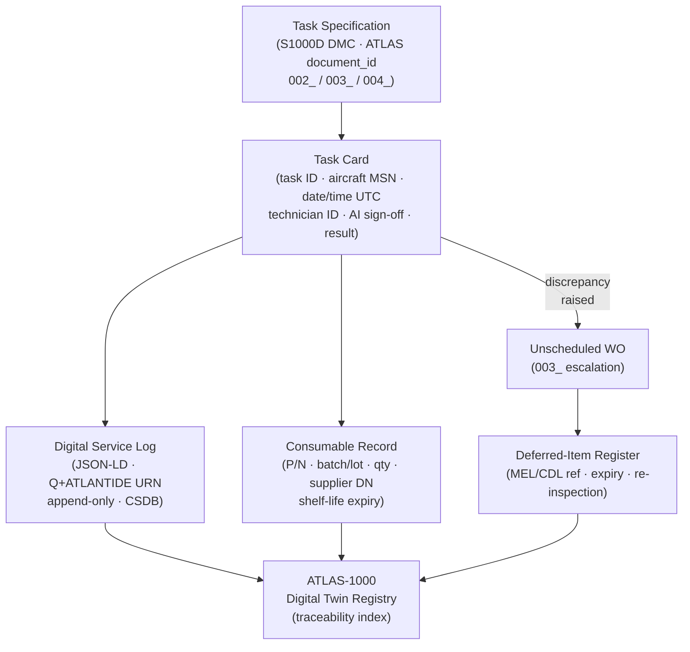

# ATLAS 010-019 · Section 01 · Subsection 011 · Subsubject 005 — Servicing Records and Traceability

## 1. Purpose

Defines the **servicing records and traceability framework** — the complete set of documentation requirements, digital record formats, retention rules, and traceability links that ensure every servicing task performed under subsection `011` *Servicing* is captured, auditable, and integrated with the Q+ATLANTIDE ATLAS-1000 register. Establishes the controlled vocabulary for task-card sign-off fields, batch/lot references for consumables, digital service logs, and the linkage to S1000D data modules[^s1000d] and AS9100D[^as9100d] quality records, within the Q+ATLANTIDE baseline[^baseline].

## 2. Scope

- Covers the *Servicing Records and Traceability* subsubject (`005`) of subsection `011` *Servicing* within section `01` *Manejo en Tierra & Servicio*.
- Inherits Q-Division authority and ORB support from the parent row in [`../../README.md` §3](../../README.md#3-architecture-table)[^archtable].
- Concepts in scope:
  - **Task-card sign-off record** — mandatory fields for each completed servicing task: task ID (S1000D DMC[^s1000d]), aircraft registration and MSN, date/time (UTC), technician ID and licence/authorisation number, Authorised Inspector (AI) sign-off, task result (OK / discrepancy raised), and reference to any unscheduled WO raised per `003_`.
  - **Consumable batch/lot traceability** — for each fluid, gas, or energy-source replenishment, the record captures: consumable part number, batch/lot number, quantity dispensed (mass or volume with unit), supplier delivery note reference, and shelf-life expiry date. Required for fuel, oils, hydraulic fluids, and oxygen per ATA iSpec 2200[^ata2200].
  - **Digital service log** — the machine-readable service record stored in the Q+ATLANTIDE ATLAS-1000 digital twin registry as a JSON-LD entry linked to the aircraft's Q+ATLANTIDE URN (see `000-009.000.005` for identifier scheme). Mandatory fields mirror the task-card fields; the log entry is immutable once closed (append-only audit trail).
  - **Retention periods** — task-card records: minimum 2 years from date of performance (regulatory minimum); consumable batch records: minimum life of the aircraft or 10 years (whichever is greater), per AS9100D[^as9100d] §7.5.3. Digital records are retained indefinitely in the CSDB.
  - **Deferred-item log** — MEL/CDL deferrals raised during servicing (`003_`) are tracked in a separate deferred-item register cross-referenced to the originating task card. Each entry carries: deferral authority reference, expiry date, and re-inspection requirement.
  - **Traceability to ATLAS-1000 register** — every closed service record references its parent S1000D DMC and the Q+ATLANTIDE `document_id` of the applicable task specification, enabling forward and backward traceability through the CSDB.
- Out of scope: replenishment specifications (`002_`), scheduling logic (`003_`), physical coupling locations (`004_`), and aircraft identification (`000-009.000`).

## 3. Diagram — Servicing Record Traceability Chain

Each completed task card generates an immutable record that links upward to the task specification and downward to the consumable supply chain.

## 4. Footprint

| Metric | Value |
|---|---|
| Architecture | `ATLAS` — Aircraft Top Level Architecture Schema/System (controlled term) |
| Master range | `000–099` |
| Code range | `010-019` |
| Section | `01` — Manejo en Tierra & Servicio |
| Subsection | `011` — Servicing |
| Subsubject | `005` — Servicing Records and Traceability |
| Primary Q-Division | Q-GROUND[^qdiv] |
| Support Q-Divisions | Q-MECHANICS, Q-INDUSTRY |
| ORB support | ORB-PMO, ORB-FIN |
| Governance class | `baseline`[^gov] |
| Folder path | `Q+ATLANTIDE/000-099_ATLAS/010-019_Manejo-en-Tierra-Servicio/011_Servicing/` |
| Document | `011-005-Servicing-Records-and-Traceability.md` (this file) |
| Parent subsection | [`README.md`](./README.md) · [`011-000-Servicing-Overview.md`](./011-000-Servicing-Overview.md) |
| Parent architecture | [`../../README.md`](../../README.md) |
| Parent baseline | [`organization/Q+ATLANTIDE.md`](../../../../organization/Q+ATLANTIDE.md) |

## 5. References & Citations

[^baseline]: **Q+ATLANTIDE controlled baseline (v1.0.0)** — [`organization/Q+ATLANTIDE.md`](../../../../organization/Q+ATLANTIDE.md). Defines the controlled `000-999` architecture-band taxonomy and the ATLAS-1000 register subpart.

[^archtable]: **ATLAS §3 Architecture Table** — [`../../README.md` §3](../../README.md#3-architecture-table). Authoritative source for the `010-019` row (Section `01` — Manejo en Tierra & Servicio, Primary Q-Division Q-GROUND).

[^qdiv]: **Q-Division authority** — Q-Divisions provide technical authority over an architecture row (Q+ATLANTIDE Note N-002). See [`organization/Q+ATLANTIDE.md` §4](../../../../organization/Q+ATLANTIDE.md#4-notes).

[^gov]: **Governance class** — `baseline` denotes documents under controlled change management within the Q+ATLANTIDE baseline.

[^ata2200]: **ATA iSpec 2200 — Information Standards for Aviation Maintenance** — Specifies mandatory task-card fields, consumable traceability requirements (batch/lot), and digital-record conventions for all ATLAS 010-019 artefacts.

[^ataspec100]: **ATA Spec 100 — Manufacturers Technical Data** — Defines record content requirements, sign-off authority levels, and deferred-item register formats for aircraft servicing.

[^s1000d]: **S1000D Issue 6.0 — International specification for technical publications** — Defines the Data Module Code (DMC) used as the canonical task reference in all service records, and the CSDB append-only log structure for immutable digital records in the Q+ATLANTIDE digital twin registry.

[^as9100d]: **AS9100D — Quality Management Systems — Aviation, Space and Defense Organizations** — §7.5.3 mandates retention periods, record integrity controls, and traceability requirements for all servicing and maintenance records.

### Applicable industry standards

The following standards apply to this subsubject in addition to the cross-cutting Q+ATLANTIDE governance:

- ATA iSpec 2200 — Information Standards for Aviation Maintenance[^ata2200]
- ATA Spec 100 — Manufacturers Technical Data[^ataspec100]
- S1000D Issue 6.0 — International specification for technical publications[^s1000d]
- AS9100D — Quality Management Systems — Aviation, Space and Defense Organizations[^as9100d]
