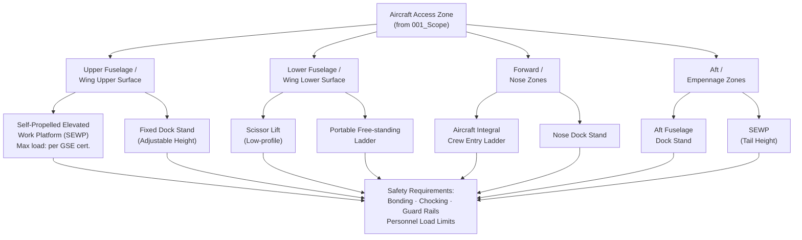

# ATLAS 010-019 · Section 01 · Subsection 012 · Subsubject 003 — Access Equipment — Stands, Platforms and Ladders

## 1. Purpose

Defines the **access equipment** requirements — stands, platforms, and ladders — used to reach all aircraft access zones during ground maintenance and servicing operations. Specifies approved equipment types, structural load ratings, positioning and securing procedures, personnel safety constraints, and the interface between access equipment and the aircraft structure, in conformance with ATA iSpec 2200[^ata2200], ATA Spec 100[^ataspec100], and AS9100D[^as9100d].

## 2. Scope

- Covers the *Access Equipment — Stands, Platforms and Ladders* subsubject (`003`) of subsection `012` *Acceso* within section `01` *Manejo en Tierra & Servicio*.
- Inherits Q-Division authority and ORB support from the parent row in [`../../README.md` §3](../../README.md#3-architecture-table)[^archtable].
- Concepts in scope:
  - **Equipment type catalogue** — the approved set of access stands (fixed-height, adjustable, articulated), work platforms (self-propelled elevated work platforms — SEWPs, scissor lifts, dock-type stands), and ladders (integral aircraft, portable free-standing, fixed dock) with their GSE part numbers per ATA Spec 100[^ataspec100].
  - **Structural load ratings** — maximum static and dynamic loads per equipment type; interface load limits at aircraft contact points (fuselage frames, wing lower skin, door surround frames); bump load thresholds.
  - **Positioning procedures** — approach routes, minimum separation distances from landing gear and engine intakes, orientation/heading constraints, and locking/chocking requirements before personnel ascent.
  - **Personnel safety constraints** — maximum simultaneous personnel per platform level, fall-arrest attachment points, toe-board and guard-rail requirements, electrostatic bonding requirements during fuel-system access.
  - **Aircraft structure interface** — padded contact provisions, prohibited contact zones (composite skin panels, antenna fairings, static wicks), and force limits for stand docking.
  - **Inspection and certification** — pre-use inspection checklist, periodic load-test intervals, and tagging/quarantine procedures for unserviceable equipment per AS9100D[^as9100d].
- Out of scope: access zone taxonomy (`001_`), door/hatch hardware (`002_`), cabin/cargo entry procedures (`004_`), and access-control records (`005_`).

## 3. Diagram — Access Equipment Selection and Interface

The following diagram maps approved equipment types to aircraft access zones and key interface constraints.

## 4. Footprint

| Metric | Value |
|---|---|
| Architecture | `ATLAS` — Aircraft Top Level Architecture Schema/System (controlled term) |
| Master range | `000–099` |
| Code range | `010-019` |
| Section | `01` — Manejo en Tierra & Servicio |
| Subsection | `012` — Acceso |
| Subsubject | `003` — Access Equipment — Stands, Platforms and Ladders |
| Primary Q-Division | Q-GROUND[^qdiv] |
| Support Q-Divisions | Q-MECHANICS, Q-INDUSTRY |
| ORB support | ORB-PMO, ORB-FIN |
| Governance class | `baseline`[^gov] |
| Folder path | `Q+ATLANTIDE/000-099_ATLAS/010-019_Manejo-en-Tierra-Servicio/012_Acceso/` |
| Document | `003_Access-Equipment-Stands-Platforms-and-Ladders.md` (this file) |
| Parent subsection | [`README.md`](./README.md) · [`000_Overview.md`](./000_Overview.md) |
| Parent architecture | [`../../README.md`](../../README.md) |
| Parent baseline | [`organization/Q+ATLANTIDE.md`](../../../../organization/Q+ATLANTIDE.md) |

## 5. References & Citations

[^baseline]: **Q+ATLANTIDE controlled baseline (v1.0.0)** — [`organization/Q+ATLANTIDE.md`](../../../../organization/Q+ATLANTIDE.md). Defines the controlled `000-999` architecture-band taxonomy and the ATLAS-1000 register subpart.

[^archtable]: **ATLAS §3 Architecture Table** — [`../../README.md` §3](../../README.md#3-architecture-table). Authoritative source for the `010-019` row (Section `01` — Manejo en Tierra & Servicio, Primary Q-Division Q-GROUND).

[^qdiv]: **Q-Division authority** — Q-Divisions provide technical authority over an architecture row (Q+ATLANTIDE Note N-002). See [`organization/Q+ATLANTIDE.md` §4](../../../../organization/Q+ATLANTIDE.md#4-notes).

[^gov]: **Governance class** — `baseline` denotes documents under controlled change management within the Q+ATLANTIDE baseline.

[^ata2200]: **ATA iSpec 2200 — Information Standards for Aviation Maintenance** — Governs access-equipment type classification, load-limit documentation, and positioning-procedure data-module structure.

[^ataspec100]: **ATA Spec 100 — Manufacturers Technical Data** — Baseline standard for GSE part numbering, equipment catalogue structure, and aircraft-contact-zone identification.

[^s1000d]: **S1000D Issue 6.0 — International specification for technical publications** — Common Source DataBase (CSDB) and Data Module Code (DMC) specification used for all Q+ATLANTIDE artefacts.

[^as9100d]: **AS9100D — Quality Management Systems — Aviation, Space and Defense Organizations** — Quality-management baseline covering equipment inspection intervals, certification tagging, and quarantine procedures.

### Applicable industry standards

The following standards apply to this subsubject in addition to the cross-cutting Q+ATLANTIDE governance:

- ATA iSpec 2200 — Information Standards for Aviation Maintenance[^ata2200]
- ATA Spec 100 — Manufacturers Technical Data[^ataspec100]
- S1000D Issue 6.0 — International specification for technical publications[^s1000d]
- AS9100D — Quality Management Systems — Aviation, Space and Defense Organizations[^as9100d]
