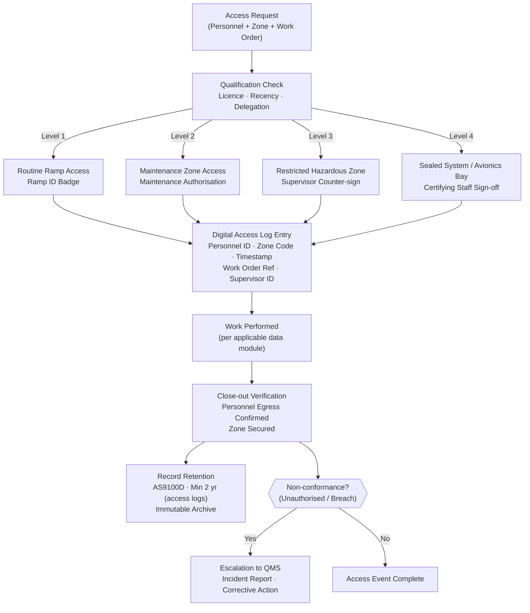

# ATLAS 010-019 · Section 01 · Subsection 012 · Subsubject 005 — Access Control, Authorizations and Records

## 1. Purpose

Defines the **access control framework, authorisation levels, and record-keeping requirements** for all ground-access activities on the aircraft — covering badge/key management, digital-access log systems, personnel qualification verification, authorisation-delegation chains, and record-retention obligations. Establishes the controlled governance vocabulary used to audit who accessed which aircraft zone, when, and under what authorisation, in conformance with ATA iSpec 2200[^ata2200], ATA Spec 100[^ataspec100], S1000D[^s1000d], and AS9100D[^as9100d].

## 2. Scope

- Covers the *Access Control, Authorizations and Records* subsubject (`005`) of subsection `012` *Acceso* within section `01` *Manejo en Tierra & Servicio*.
- Inherits Q-Division authority and ORB support from the parent row in [`../../README.md` §3](../../README.md#3-architecture-table)[^archtable].
- Concepts in scope:
  - **Authorisation levels** — the four-tier access authorisation hierarchy (Level 1: Routine Ramp Access; Level 2: Maintenance Zone Access; Level 3: Restricted Hazardous Zone Access; Level 4: Sealed System / Avionics Bay Access) with personnel qualification prerequisites at each level.
  - **Badge and key management** — physical badge issuance, zone-coded key/card allocation, master-key accountability, lost-key escalation procedures, and key-return verification at end of shift or work-order completion.
  - **Digital access log systems** — the Q+ATLANTIDE access log schema: mandatory data fields (personnel ID, aircraft registration, zone code, entry timestamp, exit timestamp, work-order reference, supervisor sign-off), log storage location, and integration with the S1000D[^s1000d] CSDB work-order data modules.
  - **Personnel qualification verification** — licence/approval cross-check at point of access, recency-of-experience requirements for restricted zones, and delegation of authorisation from certifying staff to supervised personnel.
  - **Authorisation delegation chain** — rules governing temporary access grants (maintenance shift, one-time visit), counter-signature requirements, and automatic expiry of delegated access.
  - **Record retention** — minimum retention periods per AS9100D[^as9100d] (access logs: minimum 2 years; work-order records: minimum per regulatory requirement); archival format (electronic, immutable); audit-trail integrity requirements.
  - **Non-conformance and escalation** — procedures for unauthorised access events, access-attempt failures, quarantine-zone breaches, and mandatory reporting to the quality-management system.
- Out of scope: access zone taxonomy (`001_`), door/hatch hardware (`002_`), access equipment (`003_`), cabin/cargo entry procedures (`004_`).

## 3. Diagram — Access Control and Authorisation Flow

The following diagram maps the authorisation-level hierarchy and the record-keeping flow for a ground-access event.

## 4. Footprint

| Metric | Value |
|---|---|
| Architecture | `ATLAS` — Aircraft Top Level Architecture Schema/System (controlled term) |
| Master range | `000–099` |
| Code range | `010-019` |
| Section | `01` — Manejo en Tierra & Servicio |
| Subsection | `012` — Acceso |
| Subsubject | `005` — Access Control, Authorizations and Records |
| Primary Q-Division | Q-GROUND[^qdiv] |
| Support Q-Divisions | Q-MECHANICS, Q-INDUSTRY |
| ORB support | ORB-PMO, ORB-FIN |
| Governance class | `baseline`[^gov] |
| Folder path | `Q+ATLANTIDE/000-099_ATLAS/010-019_Manejo-en-Tierra-Servicio/012_Acceso/` |
| Document | `005_Access-Control-Authorizations-and-Records.md` (this file) |
| Parent subsection | [`README.md`](./README.md) · [`000_Overview.md`](./000_Overview.md) |
| Parent architecture | [`../../README.md`](../../README.md) |
| Parent baseline | [`organization/Q+ATLANTIDE.md`](../../../../organization/Q+ATLANTIDE.md) |

## 5. References & Citations

[^baseline]: **Q+ATLANTIDE controlled baseline (v1.0.0)** — [`organization/Q+ATLANTIDE.md`](../../../../organization/Q+ATLANTIDE.md). Defines the controlled `000-999` architecture-band taxonomy and the ATLAS-1000 register subpart.

[^archtable]: **ATLAS §3 Architecture Table** — [`../../README.md` §3](../../README.md#3-architecture-table). Authoritative source for the `010-019` row (Section `01` — Manejo en Tierra & Servicio, Primary Q-Division Q-GROUND).

[^qdiv]: **Q-Division authority** — Q-Divisions provide technical authority over an architecture row (Q+ATLANTIDE Note N-002). See [`organization/Q+ATLANTIDE.md` §4](../../../../organization/Q+ATLANTIDE.md#4-notes).

[^gov]: **Governance class** — `baseline` denotes documents under controlled change management within the Q+ATLANTIDE baseline.

[^ata2200]: **ATA iSpec 2200 — Information Standards for Aviation Maintenance** — Governs access-authorisation data-module structure, personnel qualification fields, and maintenance access-log schema.

[^ataspec100]: **ATA Spec 100 — Manufacturers Technical Data** — Baseline standard for access-point identification and authorisation-level documentation conventions.

[^s1000d]: **S1000D Issue 6.0 — International specification for technical publications** — Common Source DataBase (CSDB) and Data Module Code (DMC) specification; access-log entries are cross-referenced to applicable work-order data modules in the Q+ATLANTIDE CSDB.

[^as9100d]: **AS9100D — Quality Management Systems — Aviation, Space and Defense Organizations** — Quality-management baseline governing access-log retention periods, immutable-archive requirements, and non-conformance escalation procedures.

### Applicable industry standards

The following standards apply to this subsubject in addition to the cross-cutting Q+ATLANTIDE governance:

- ATA iSpec 2200 — Information Standards for Aviation Maintenance[^ata2200]
- ATA Spec 100 — Manufacturers Technical Data[^ataspec100]
- S1000D Issue 6.0 — International specification for technical publications[^s1000d]
- AS9100D — Quality Management Systems — Aviation, Space and Defense Organizations[^as9100d]
