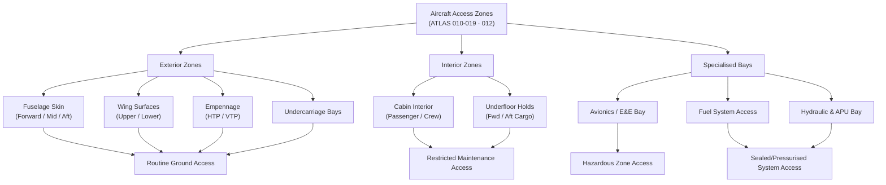

# ATLAS 010-019 · Section 01 · Subsection 012 · Subsubject 001 — Scope and Access Boundaries

## 1. Purpose

Defines the **scope and access boundaries** for the *Acceso* subsection — the controlled set of zone perimeters, access categories, and safety constraints that govern every maintenance, servicing, and inspection activity performed on or around the aircraft during ground operations. Establishes the authoritative vocabulary and zoning taxonomy (exterior access, interior cabin, underfloor, avionics bay, and fuel/hydraulic bays) used by all downstream *Acceso* subsubjects and linked maintenance data modules within the Q+ATLANTIDE baseline[^baseline], in conformance with ATA iSpec 2200[^ata2200] and ATA Spec 100[^ataspec100].

## 2. Scope

- Covers the *Scope and Access Boundaries* subsubject (`001`) of subsection `012` *Acceso* within section `01` *Manejo en Tierra & Servicio*.
- Inherits Q-Division authority and ORB support from the parent row in [`../../README.md` §3](../../README.md#3-architecture-table)[^archtable].
- Concepts in scope:
  - **Access zone taxonomy** — the hierarchical classification of all access areas (exterior skin, forward fuselage, aft fuselage, wing upper/lower surfaces, empennage, undercarriage bays, cabin interior, underfloor holds, and avionics/equipment bays) as defined in ATA iSpec 2200[^ata2200].
  - **Access categories** — the four operational categories (Routine Ground Access, Restricted Maintenance Access, Hazardous Zone Access, and Sealed/Pressurised System Access) with their applicable authorisation levels.
  - **Safety perimeter rules** — minimum clearance distances, FOD-prevention zones, electrical power-off requirements, and co-ordination with towing/pushback operations per ATA Spec 100[^ataspec100].
  - **Interface with other subsections** — handoff rules to subsection `010` (Ground Handling), `011` (Servicing), `013` (Remolque), `014` (Parking), and `015` (GSE) defining which zone each adjacent subsection is authorised to occupy simultaneously.
  - **Regulatory constraints** — national/international authority requirements (EASA, FAA) for access-zone segregation during concurrent maintenance tasks.
- Out of scope: physical door/hatch hardware (`002_`), access equipment specifications (`003_`), cabin/cargo entry procedures (`004_`), and access-control authorisation records (`005_`).

## 3. Diagram — Access Zone Taxonomy

The following diagram maps the aircraft access zone hierarchy and its relationship to access categories and authorisation levels.

## 4. Footprint

| Metric | Value |
|---|---|
| Architecture | `ATLAS` — Aircraft Top Level Architecture Schema/System (controlled term) |
| Master range | `000–099` |
| Code range | `010-019` |
| Section | `01` — Manejo en Tierra & Servicio |
| Subsection | `012` — Acceso |
| Subsubject | `001` — Scope and Access Boundaries |
| Primary Q-Division | Q-GROUND[^qdiv] |
| Support Q-Divisions | Q-MECHANICS, Q-INDUSTRY |
| ORB support | ORB-PMO, ORB-FIN |
| Governance class | `baseline`[^gov] |
| Folder path | `Q+ATLANTIDE/000-099_ATLAS/010-019_Manejo-en-Tierra-Servicio/012_Acceso/` |
| Document | `012-001-Access-Scope-and-Boundaries.md` (this file) |
| Parent subsection | [`README.md`](./README.md) · [`012-000-Access-Overview.md`](./012-000-Access-Overview.md) |
| Parent architecture | [`../../README.md`](../../README.md) |
| Parent baseline | [`organization/Q+ATLANTIDE.md`](../../../../organization/Q+ATLANTIDE.md) |

## 5. References & Citations

[^baseline]: **Q+ATLANTIDE controlled baseline (v1.0.0)** — [`organization/Q+ATLANTIDE.md`](../../../../organization/Q+ATLANTIDE.md). Defines the controlled `000-999` architecture-band taxonomy and the ATLAS-1000 register subpart.

[^archtable]: **ATLAS §3 Architecture Table** — [`../../README.md` §3](../../README.md#3-architecture-table). Authoritative source for the `010-019` row (Section `01` — Manejo en Tierra & Servicio, Primary Q-Division Q-GROUND).

[^qdiv]: **Q-Division authority** — Q-Divisions provide technical authority over an architecture row (Q+ATLANTIDE Note N-002). See [`organization/Q+ATLANTIDE.md` §4](../../../../organization/Q+ATLANTIDE.md#4-notes).

[^gov]: **Governance class** — `baseline` denotes documents under controlled change management within the Q+ATLANTIDE baseline.

[^ata2200]: **ATA iSpec 2200 — Information Standards for Aviation Maintenance** — Governs aircraft access-zone definition, access category taxonomy, and safety perimeter rules for all ATLAS maintenance artefacts.

[^ataspec100]: **ATA Spec 100 — Manufacturers Technical Data** — Baseline standard for access-point identification and safety constraint documentation.

[^s1000d]: **S1000D Issue 6.0 — International specification for technical publications** — Common Source DataBase (CSDB) and Data Module Code (DMC) specification used for all Q+ATLANTIDE artefacts.

[^as9100d]: **AS9100D — Quality Management Systems — Aviation, Space and Defense Organizations** — Quality-management baseline for all Q+ATLANTIDE deliverables.

### Applicable industry standards

The following standards apply to this subsubject in addition to the cross-cutting Q+ATLANTIDE governance:

- ATA iSpec 2200 — Information Standards for Aviation Maintenance[^ata2200]
- ATA Spec 100 — Manufacturers Technical Data[^ataspec100]
- S1000D Issue 6.0 — International specification for technical publications[^s1000d]
- AS9100D — Quality Management Systems — Aviation, Space and Defense Organizations[^as9100d]
