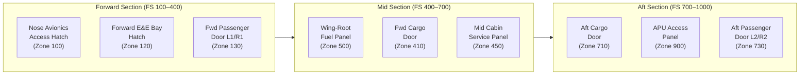

# ATLAS 010-019 · Section 01 · Subsection 012 · Subsubject 002 — Access Doors, Hatches and Panels

## 1. Purpose

Defines the **access doors, hatches and panels** catalogue for the aircraft — the complete inventory of all openable access elements in the airframe structure, including their location reference, dimensions, locking and latching mechanisms, opening torque limits, serviceable-condition criteria, and ground-handling interface requirements. Provides the controlled data used by maintenance personnel to safely open, secure, and close all exterior and interior access points during ground operations, in conformance with ATA iSpec 2200[^ata2200] and ATA Spec 100[^ataspec100].

## 2. Scope

- Covers the *Access Doors, Hatches and Panels* subsubject (`002`) of subsection `012` *Acceso* within section `01` *Manejo en Tierra & Servicio*.
- Inherits Q-Division authority and ORB support from the parent row in [`../../README.md` §3](../../README.md#3-architecture-table)[^archtable].
- Concepts in scope:
  - **Access element taxonomy** — classification of all openable elements as *door* (hinged, large-panel), *hatch* (quick-release, flush-fit), or *panel* (fastener-secured, removable); each identified by an ATA iSpec 2200[^ata2200]-compliant zone-station reference code.
  - **Location and dimensions** — fuselage station (FS), butt line (BL), and water line (WL) co-ordinates; nominal opening dimensions (height × width); and swing/slide clearance envelope.
  - **Locking and latching mechanisms** — latch types (rotary, hook, cam-lock, Dzus), key/tool requirements, locking-pin or safety-wire provisions, and OPEN/CLOSE indicator systems.
  - **Opening torque and force limits** — maximum allowable torque on fasteners and latches; spring-assist ratings; minimum two-person operation requirements where applicable.
  - **Serviceable-condition criteria** — wear limits for hinge pins, latch wear-checks, seal condition inspection intervals, and pass/fail criteria per AS9100D[^as9100d] quality requirements.
  - **Ground-support interface** — ground-power interlocks, door-open warning flags, interface with access stands (subsubject `003_`), and co-ordination with towing/pushback operations.
- Out of scope: access zone taxonomy (`001_`), access-equipment hardware (`003_`), cabin/cargo entry procedures (`004_`), and access-control records (`005_`).

## 3. Diagram — Access Element Location Reference

The following diagram illustrates the primary access door, hatch, and panel locations mapped to aircraft zones.

## 4. Footprint

| Metric | Value |
|---|---|
| Architecture | `ATLAS` — Aircraft Top Level Architecture Schema/System (controlled term) |
| Master range | `000–099` |
| Code range | `010-019` |
| Section | `01` — Manejo en Tierra & Servicio |
| Subsection | `012` — Acceso |
| Subsubject | `002` — Access Doors, Hatches and Panels |
| Primary Q-Division | Q-GROUND[^qdiv] |
| Support Q-Divisions | Q-MECHANICS, Q-INDUSTRY |
| ORB support | ORB-PMO, ORB-FIN |
| Governance class | `baseline`[^gov] |
| Folder path | `Q+ATLANTIDE/000-099_ATLAS/010-019_Manejo-en-Tierra-Servicio/012_Acceso/` |
| Document | `012-002-Access-Doors-Hatches-and-Panels.md` (this file) |
| Parent subsection | [`README.md`](./README.md) · [`012-000-Access-Overview.md`](./012-000-Access-Overview.md) |
| Parent architecture | [`../../README.md`](../../README.md) |
| Parent baseline | [`organization/Q+ATLANTIDE.md`](../../../../organization/Q+ATLANTIDE.md) |

## 5. References & Citations

[^baseline]: **Q+ATLANTIDE controlled baseline (v1.0.0)** — [`organization/Q+ATLANTIDE.md`](../../../../organization/Q+ATLANTIDE.md). Defines the controlled `000-999` architecture-band taxonomy and the ATLAS-1000 register subpart.

[^archtable]: **ATLAS §3 Architecture Table** — [`../../README.md` §3](../../README.md#3-architecture-table). Authoritative source for the `010-019` row (Section `01` — Manejo en Tierra & Servicio, Primary Q-Division Q-GROUND).

[^qdiv]: **Q-Division authority** — Q-Divisions provide technical authority over an architecture row (Q+ATLANTIDE Note N-002). See [`organization/Q+ATLANTIDE.md` §4](../../../../organization/Q+ATLANTIDE.md#4-notes).

[^gov]: **Governance class** — `baseline` denotes documents under controlled change management within the Q+ATLANTIDE baseline.

[^ata2200]: **ATA iSpec 2200 — Information Standards for Aviation Maintenance** — Governs access-element zone-station coding, latch type classifications, and opening-force documentation for all ATLAS maintenance artefacts.

[^ataspec100]: **ATA Spec 100 — Manufacturers Technical Data** — Baseline standard for access-point identification codes and door/hatch catalogue structure.

[^s1000d]: **S1000D Issue 6.0 — International specification for technical publications** — Common Source DataBase (CSDB) and Data Module Code (DMC) specification used for all Q+ATLANTIDE artefacts.

[^as9100d]: **AS9100D — Quality Management Systems — Aviation, Space and Defense Organizations** — Quality-management baseline covering serviceable-condition inspection criteria and documentation retention.

### Applicable industry standards

The following standards apply to this subsubject in addition to the cross-cutting Q+ATLANTIDE governance:

- ATA iSpec 2200 — Information Standards for Aviation Maintenance[^ata2200]
- ATA Spec 100 — Manufacturers Technical Data[^ataspec100]
- S1000D Issue 6.0 — International specification for technical publications[^s1000d]
- AS9100D — Quality Management Systems — Aviation, Space and Defense Organizations[^as9100d]
