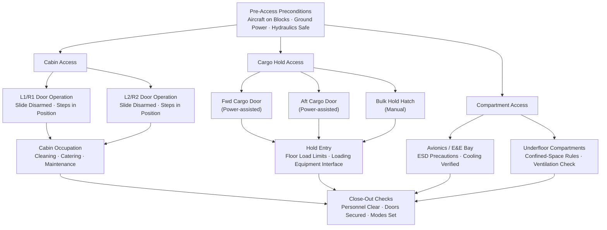

# ATLAS 010-019 · Section 01 · Subsection 012 · Subsubject 004 — Cabin, Cargo and Compartment Access

## 1. Purpose

Defines the procedures, constraints, and sequencing rules for **cabin, cargo hold, and compartment access** during ground operations — covering passenger/crew door operation, cargo-hold entry, avionics/equipment-bay access, and underfloor compartment entry. Provides the controlled data required by ground-handling, ramp, and maintenance personnel to safely open, occupy, and close all internal aircraft areas, in conformance with ATA iSpec 2200[^ata2200], ATA Spec 100[^ataspec100], and S1000D[^s1000d].

## 2. Scope

- Covers the *Cabin, Cargo and Compartment Access* subsubject (`004`) of subsection `012` *Acceso* within section `01` *Manejo en Tierra & Servicio*.
- Inherits Q-Division authority and ORB support from the parent row in [`../../README.md` §3](../../README.md#3-architecture-table)[^archtable].
- Concepts in scope:
  - **Passenger and crew door sequencing** — the prescribed open/close order for L1/R1, L2/R2 doors (and emergency exits where applicable) during passenger boarding, deplaning, and ground maintenance; armed/disarmed slide status requirements; door-mode cross-check procedures.
  - **Cargo hold access** — forward and aft cargo door operation (power-assisted or manual), bulk-hold hatch sequencing, floor-load limits for ground-support vehicles entering holds, and co-ordination with baggage/cargo loading systems.
  - **Avionics and E&E bay entry** — preconditions (aircraft ground power, hydraulic pressure safe-state, avionics cooling verified), step/platform requirements, electrostatic discharge (ESD) precautions, and maximum occupancy per bay.
  - **Underfloor compartment entry** — access hatch locations, confined-space entry rules where applicable (oxygen levels, ventilation), authorised personnel category, and duration limits.
  - **Concurrent access constraints** — rules governing simultaneous occupation of cabin and underfloor zones, cabin cleaning and catering access during fuelling, and segregation of hazardous-cargo holds.
  - **S1000D CSDB cross-references** — data module codes (DMC) linking each access procedure to the applicable S1000D[^s1000d] procedural data module in the Q+ATLANTIDE CSDB.
- Out of scope: access zone taxonomy (`001_`), door/hatch hardware catalogue (`002_`), access-equipment specifications (`003_`), and access-control records (`005_`).

## 3. Diagram — Cabin and Cargo Access Sequencing

The following diagram shows the prescribed access sequencing for the primary cabin and cargo zones.

## 4. Footprint

| Metric | Value |
|---|---|
| Architecture | `ATLAS` — Aircraft Top Level Architecture Schema/System (controlled term) |
| Master range | `000–099` |
| Code range | `010-019` |
| Section | `01` — Manejo en Tierra & Servicio |
| Subsection | `012` — Acceso |
| Subsubject | `004` — Cabin, Cargo and Compartment Access |
| Primary Q-Division | Q-GROUND[^qdiv] |
| Support Q-Divisions | Q-MECHANICS, Q-INDUSTRY |
| ORB support | ORB-PMO, ORB-FIN |
| Governance class | `baseline`[^gov] |
| Folder path | `Q+ATLANTIDE/000-099_ATLAS/010-019_Manejo-en-Tierra-Servicio/012_Acceso/` |
| Document | `012-004-Cabin-Cargo-and-Compartment-Access.md` (this file) |
| Parent subsection | [`README.md`](./README.md) · [`012-000-Access-Overview.md`](./012-000-Access-Overview.md) |
| Parent architecture | [`../../README.md`](../../README.md) |
| Parent baseline | [`organization/Q+ATLANTIDE.md`](../../../../organization/Q+ATLANTIDE.md) |

## 5. References & Citations

[^baseline]: **Q+ATLANTIDE controlled baseline (v1.0.0)** — [`organization/Q+ATLANTIDE.md`](../../../../organization/Q+ATLANTIDE.md). Defines the controlled `000-999` architecture-band taxonomy and the ATLAS-1000 register subpart.

[^archtable]: **ATLAS §3 Architecture Table** — [`../../README.md` §3](../../README.md#3-architecture-table). Authoritative source for the `010-019` row (Section `01` — Manejo en Tierra & Servicio, Primary Q-Division Q-GROUND).

[^qdiv]: **Q-Division authority** — Q-Divisions provide technical authority over an architecture row (Q+ATLANTIDE Note N-002). See [`organization/Q+ATLANTIDE.md` §4](../../../../organization/Q+ATLANTIDE.md#4-notes).

[^gov]: **Governance class** — `baseline` denotes documents under controlled change management within the Q+ATLANTIDE baseline.

[^ata2200]: **ATA iSpec 2200 — Information Standards for Aviation Maintenance** — Governs door-sequencing data-module structure, cargo-hold access procedures, and avionics-bay entry constraints.

[^ataspec100]: **ATA Spec 100 — Manufacturers Technical Data** — Baseline standard for door identification codes, slide status cross-check procedures, and hold-entry floor-load documentation.

[^s1000d]: **S1000D Issue 6.0 — International specification for technical publications** — Common Source DataBase (CSDB) and Data Module Code (DMC) specification; all procedural data modules referenced in §2 are stored in the Q+ATLANTIDE CSDB under the applicable DMC.

[^as9100d]: **AS9100D — Quality Management Systems — Aviation, Space and Defense Organizations** — Quality-management baseline for all Q+ATLANTIDE deliverables and maintenance record retention.

### Applicable industry standards

The following standards apply to this subsubject in addition to the cross-cutting Q+ATLANTIDE governance:

- ATA iSpec 2200 — Information Standards for Aviation Maintenance[^ata2200]
- ATA Spec 100 — Manufacturers Technical Data[^ataspec100]
- S1000D Issue 6.0 — International specification for technical publications[^s1000d]
- AS9100D — Quality Management Systems — Aviation, Space and Defense Organizations[^as9100d]
