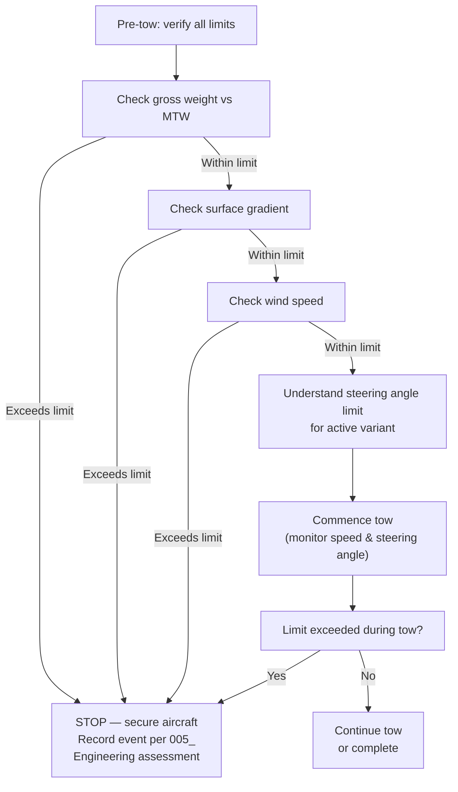

# ATLAS 010-019 · Section 01 · Subsection 013 · Subsubject 004 — Towing Limits, Loads and Steering Constraints

## 1. Purpose

Establishes the quantitative and qualitative limits that constrain all AMPEL360 towing operations: towing speed limits by operational area, nose-gear steering angle limits, nose-gear vertical and lateral load limits, towbar shear bolt limits, and surface gradient limits. Exceeding any limit defined in this subsubject requires entry in the Aircraft Technical Log (ATL) and a damage assessment before further operation.

> **Scope boundary:** This file contains limits only. The procedure steps that reference these limits are in [`003_Towing-Procedures-Pushback-and-Maneuvering.md`](./003_Towing-Procedures-Pushback-and-Maneuvering.md). Records and incident reporting when a limit is exceeded are in [`005_Towing-Records-Incidents-and-Traceability.md`](./005_Towing-Records-Incidents-and-Traceability.md).

> **Authority note:** The limits in §2 are architectural references. The **master authority** for all numerical limits is AMM chapter 9 (current revision). In case of discrepancy between this document and AMM chapter 9, AMM chapter 9 takes precedence.

## 2. Scope

### 2.1 Towing speed limits

Speed limits protect the nose gear, towbar, and ground personnel from dynamic overload.

| Operational area | Maximum towing speed | Notes |
|---|---|---|
| Congested apron (with parked aircraft, equipment, or personnel within 10 m) | 5 km/h (walking pace) | Wing walkers required at both wingtips |
| Open apron or taxiway (clear zone >10 m on all sides) | 15 km/h | Only with crew leader's explicit authorisation; wing walkers still required |
| Inside hangar or maintenance bay | 2 km/h | Continuous wing-tip and tail clearance monitoring required |
| During approach to stop position | 2 km/h (final 5 m) | Smooth deceleration; no abrupt braking |
| Recovery tow (post-incident) | 5 km/h maximum regardless of area | Until structural assessment confirms normal limits apply |

> **Speed exceedance rule:** If the tow speed exceeds the applicable limit, stop the operation, secure the aircraft, and record the event per `005_` §2.2 before continuing.

### 2.2 Nose-gear steering angle limits

The nose-gear steering angle limit is the maximum angular deflection of the nose wheel from the aircraft centreline during a tow manoeuvre. Exceeding this limit can shear the towbar shear bolt or, in worse cases, damage the nose-gear steering collar, actuator, or structural attachment.

| Variant | Maximum steering angle (towbar) | Maximum steering angle (TBL) | Notes |
|---|---|---|---|
| AMPEL360e (Gen 1) | Per AMM chapter 9 Table 903 | Per AMM chapter 9 Table 903 | Do not approach limit in a single steering input |
| AMPEL360-BWB (Gen 2) | Per AMM chapter 9 Table 904 | Per AMM chapter 9 Table 904 | Gen 2 limit differs due to BWB nose-gear geometry |

#### 2.2.1 Steering angle discipline

- All turns must be executed **gradually**, approaching the limit over multiple small steering inputs.
- A wing walker at each wingtip must confirm adequate clearance before each turn is executed.
- At any tow speed, the steering angle must not be changed abruptly; abrupt steering inputs create lateral shock loads on the towhead and nose-gear collar.
- If the aircraft geometry requires a turn that approaches the steering angle limit, **stop, reposition the tug, and re-approach in a wider arc** rather than trying to complete the turn at the limit.

### 2.3 Towbar shear bolt

The shear bolt is a sacrificial element designed to shear before the nose-gear structural attachment reaches its damage threshold. A sheared towbar shear bolt is a **mandatory stop** condition.

| Event | Action |
|---|---|
| Shear bolt intact — tow complete | No action; standard tow-sheet entry |
| Shear bolt sheared during tow | STOP immediately; secure aircraft; do not re-tow; record as Towbar Shear Event in ATL and tow sheet per `005_` §2.3; obtain engineering assessment; replace shear bolt before next use |
| Shear bolt found sheared at pre-tow inspection | Do not use towbar; remove from service; tag and report; obtain replacement towbar |

> **Engineering assessment requirement:** A sheared shear bolt is a structural overload indicator. Before the aircraft is released for any further ground movement, maintenance engineering must assess the nose-gear steering collar and towbar attachment for damage. The assessment outcome must be recorded in the ATL.

### 2.4 Nose-gear vertical load limits (tow-weight limits)

The nose gear has a maximum tow weight (MTW) — the maximum Aircraft Gross Weight at which towing is permitted without additional nose-gear support.

| Variant | Maximum Tow Weight | Notes |
|---|---|---|
| AMPEL360e (Gen 1) | Per AMM chapter 9 Table 905 | Fuel load and payload contribute to gross weight |
| AMPEL360-BWB (Gen 2) | Per AMM chapter 9 Table 906 | BWB mass distribution differs; verify variant-specific table |

If the aircraft gross weight exceeds the variant's MTW:
- Reduce fuel load before tow, **or**
- Use a dual-point nose/main-gear tow rig if one is approved for the variant (see AMM chapter 9 for availability).

### 2.5 Surface gradient limits

Towing on gradients creates additional loads on the nose gear and towbar. The following limits apply:

| Gradient direction | Maximum gradient | Notes |
|---|---|---|
| Downhill (aircraft towed downslope, tug ahead) | Per AMM chapter 9 | Tug must provide braking; aircraft parking brake must be available on demand |
| Uphill (aircraft towed upslope, tug ahead) | Per AMM chapter 9 | Tug tractive effort must exceed gradient load; verify tug capacity |
| Cross-slope (aircraft towed across a slope) | Per AMM chapter 9 | Cross-slope loads apply lateral forces to nose gear; reduce speed to minimum |

> If any gradient limit is uncertain in the field, treat the gradient as exceeding the limit and obtain engineering approval before towing.

### 2.6 Wind limits

Strong winds impose additional lateral loads on the airframe during a tow.

| Wind condition | Action |
|---|---|
| Wind speed ≤ the limit per AMM chapter 9 Table 907 | Normal tow authorised |
| Wind speed > limit but ≤ 1.5× limit | Crew leader assessment required; additional wing walkers and reduced speed; record in tow sheet |
| Wind speed > 1.5× limit | Tow not authorised; secure aircraft in current position; wait for conditions to improve |

## 3. Diagram — Limits Decision Tree

## 4. Footprint

| Metric | Value |
|---|---|
| Architecture | `ATLAS` — Aircraft Top Level Architecture Schema/System (controlled term) |
| Master range | `000–099` |
| Code range | `010-019` |
| Section | `01` — Manejo en Tierra & Servicio |
| Subsection | `013` — Remolque |
| Subsubject | `004` — Towing Limits, Loads and Steering Constraints |
| Conventional ATA ref | ATA chapter 9 (Towing and Taxiing) |
| Master numerical limits | AMM chapter 9 (current revision) — takes precedence over this document |
| Variant sensitivity | Steering angle limits, MTW, gradient limits differ by variant |
| Primary Q-Division | Q-GROUND[^qdiv] |
| Support Q-Divisions | Q-MECHANICS, Q-INDUSTRY |
| ORB support | ORB-PMO, ORB-FIN |
| Governance class | `baseline`[^gov] |
| Folder path | `Q+ATLANTIDE/000-099_ATLAS/010-019_Manejo-en-Tierra-Servicio/013_Remolque/` |
| Document | `004_Towing-Limits-Loads-and-Steering-Constraints.md` (this file) |
| Parent subsection | [`README.md`](./README.md) · [`000_Overview.md`](./000_Overview.md) |
| Procedures reference | [`003_Towing-Procedures-Pushback-and-Maneuvering.md`](./003_Towing-Procedures-Pushback-and-Maneuvering.md) |
| Records reference | [`005_Towing-Records-Incidents-and-Traceability.md`](./005_Towing-Records-Incidents-and-Traceability.md) |
| Parent architecture | [`../../README.md`](../../README.md) |
| Parent baseline | [`organization/Q+ATLANTIDE.md`](../../../../organization/Q+ATLANTIDE.md) |

## 5. References & Citations

[^baseline]: **Q+ATLANTIDE controlled baseline (v1.0.0)** — [`organization/Q+ATLANTIDE.md`](../../../../organization/Q+ATLANTIDE.md).

[^archtable]: **§3 — Architecture Table (parent)** — [`../../README.md` §3](../../README.md#3-architecture-table).

[^qdiv]: **Q-Division authority** — [`organization/Q-Divisions/`](../../../../organization/Q-Divisions/).

[^gov]: **Governance class** — `baseline` denotes documents under controlled change management within the Q+ATLANTIDE baseline.

[^ata2200]: **ATA iSpec 2200** — Information standards for aviation maintenance documentation. ATA chapter 9 (Towing and Taxiing) is the master authority for numerical towing limits.

[^ataspec100]: **ATA Spec 100** — Manufacturers' Technical Data standard.

[^s1000d]: **S1000D Issue 6.0** — International specification for technical publications.

[^as9100d]: **AS9100D** — Quality Management Systems — Aviation, Space and Defense Organizations.

[^icao9137]: **ICAO Doc 9137 — Airport Services Manual, Part 4** — Towing speed and gradient guidance at aerodromes.

[^iata_igom]: **IATA Ground Operations Manual (IGOM)** — Towing speed and wind limits at the operational level.

### Applicable industry standards

- ATA iSpec 2200 — Information standards for aviation maintenance (ATA chapter 9)[^ata2200]
- ATA Spec 100 — Manufacturers' Technical Data[^ataspec100]
- S1000D Issue 6.0 — International specification for technical publications[^s1000d]
- AS9100D — Quality Management Systems — Aviation, Space and Defense Organizations[^as9100d]
- ICAO Doc 9137 Part 4 — Airport Services Manual[^icao9137]
- IATA Ground Operations Manual (IGOM)[^iata_igom]
