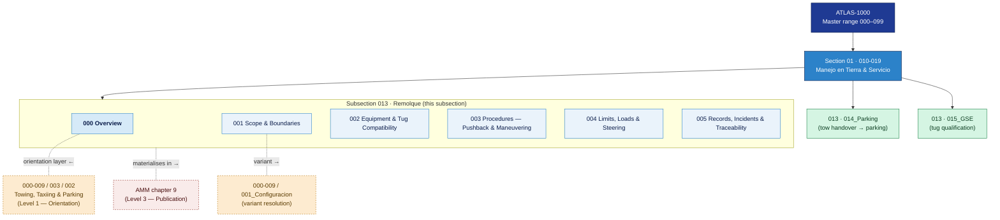

# ATLAS 010-019 · Section 01 · Subsection 013 · Subsubject 000 — Overview

## 1. Purpose

Overview entry-point for *Remolque* (`013`) — the third subsection of Code range `010-019` (*Manejo en Tierra & Servicio*). This subsubject maps the operational scope of all towing and pushback procedures applicable to AMPEL360 aircraft variants, introduces the subsubject structure of `013_`, and declares the boundary between this procedure subsection and the introductory-orientation layer in `000-009`.

This subsubject is part of the **ATLAS-1000** register, a subpart of the controlled **Q+ATLANTIDE** baseline[^baseline].

> **Doctrinal position:** `013_Remolque/` is the **Level 2 — Procedure** layer for aircraft towing. It answers *how* towing operations are executed (step sequences, safety checks, tooling requirements, limits, sign-offs). The introductory orientation — *what* towing is, shared vocabulary, concept boundaries — lives in [`../../000-009_Informacion-General-y-Servicio/003_Operaciones-Basicas/002_Towing-Taxiing-and-Parking.md`](../../000-009_Informacion-General-y-Servicio/003_Operaciones-Basicas/002_Towing-Taxiing-and-Parking.md). See the three-level rule in `003_Operaciones-Basicas/000_Overview.md` §2.3.

## 2. Scope

### 2.1 Position within ATLAS 010-019

`013_Remolque/` occupies the fourth slot of Code range `010-019`:

| Subsection | Title | Role within Code range |
|---|---|---|
| `010` | Ground Handling | General ground-handling procedures and interfaces |
| `011` | Servicing | Fluid and gas replenishment / drainage procedures |
| `012` | Acceso | Access panels, doors, and zone entry procedures |
| **`013`** | **Remolque** | **Towing and pushback procedures** ← this subsection |
| `014` | Parking | Parking, chocking, and mooring procedures |
| `015` | GSE | Ground Support Equipment operation and management |
| `016` | Lifting, Shoring and Jacking Procedures | Jacking, shoring, leveling procedures |

### 2.2 Content in scope

Subsubjects `001`–`005` provide the procedure-level detail for towing operations:

| 00N | Title | Key content |
|---|---|---|
| `001` | Scope and Towing Boundaries | Operation scope, aircraft applicability, exclusions, cross-section pointers |
| `002` | Towing Equipment and Tug Compatibility | Towbar specifications, TBL tug compatibility matrix, bypass pin, GSE qualification |
| `003` | Towing Procedures — Pushback and Maneuvering | Pre-tow checks, bypass pin insertion, tug connection, pushback and reposition sequences, handover to flight crew, post-tow checks |
| `004` | Towing Limits, Loads and Steering Constraints | Speed limits by area, nose-gear steering angle limits, towbar shear bolt, vertical load limits, gradient limits |
| `005` | Towing Records, Incidents and Traceability | Required log entries, tow sheet, incident categories, reporting thresholds, traceability to configuration baseline |

### 2.3 Explicit boundary against `000-009` — CRITICAL

> **Rule TOW-01 — Three-level separation of concerns:**
>
> | Level | Where | Role |
> |---|---|---|
> | **Level 1 — Orientation** | `000-009/003_Operaciones-Basicas/002_Towing-Taxiing-and-Parking.md` | *What* towing is, key concepts, vocabulary, towbar vs. TBL overview, bypass pin concept. |
> | **Level 2 — Procedure** | `010-019_Manejo-en-Tierra-Servicio/013_Remolque/` (this subsection) | *How* towing is executed: step sequences, safety checks, equipment specs, limits, sign-offs. |
> | **Level 3 — Publication** | Published manuals (AMM chapter 9, GMM, GHM) | Materialisation of Levels 1 and 2 in approved, distributable form. |
>
> **Three levels, three roles. Content shall not be duplicated across levels.**

### 2.4 Variant applicability

Towing procedures in this subsection apply to AMPEL360 aircraft variants. Variant-specific differences (e.g., nose-gear geometry differences between AMPEL360e and BWB variants, electric taxi system interlock for Gen 2) are flagged within each subsubject. Contributors must resolve the applicable variant via the Configuration Baseline ([`../../000-009_Informacion-General-y-Servicio/001_Configuracion/`](../../000-009_Informacion-General-y-Servicio/001_Configuracion/)) before issuing a tow order.

## 3. Diagram — Subsection Structure and Cross-Section Interfaces

*Solid arrows show parent → section → subsection ownership. Dotted arrows show cross-section interfaces.*

## 4. Footprint

| Metric | Value |
|---|---|
| Architecture | `ATLAS` — Aircraft Top Level Architecture Schema/System (controlled term) |
| Master range | `000–099` |
| Code range | `010-019` |
| Section | `01` — Manejo en Tierra & Servicio |
| Subsection | `013` — Remolque |
| Subsubject | `000` — Overview |
| Procedure level | Level 2 — Procedure (operational); orientation in `000-009/003/002` |
| Conventional ATA ref | ATA chapter 9 (Towing and Taxiing) |
| Variant sensitivity | Variant-dependent; resolve via [`../../000-009_Informacion-General-y-Servicio/001_Configuracion/`](../../000-009_Informacion-General-y-Servicio/001_Configuracion/) |
| Primary Q-Division | Q-GROUND[^qdiv] |
| Support Q-Divisions | Q-MECHANICS, Q-INDUSTRY |
| ORB support | ORB-PMO, ORB-FIN |
| Governance class | `baseline`[^gov] |
| Folder path | `Q+ATLANTIDE/000-099_ATLAS/010-019_Manejo-en-Tierra-Servicio/013_Remolque/` |
| Document | `013-000-Towing-Overview.md` (this file) |
| Parent subsection | [`README.md`](./README.md) |
| Orientation layer | [`../../000-009_Informacion-General-y-Servicio/003_Operaciones-Basicas/002_Towing-Taxiing-and-Parking.md`](../../000-009_Informacion-General-y-Servicio/003_Operaciones-Basicas/002_Towing-Taxiing-and-Parking.md) |
| Parent architecture | [`../../README.md`](../../README.md) |
| Parent baseline | [`organization/Q+ATLANTIDE.md`](../../../../organization/Q+ATLANTIDE.md) |

## 5. References & Citations

[^baseline]: **Q+ATLANTIDE controlled baseline (v1.0.0)** — [`organization/Q+ATLANTIDE.md`](../../../../organization/Q+ATLANTIDE.md). Defines the controlled `000-999` architecture-band taxonomy and the ATLAS-1000 register subpart.

[^archtable]: **§3 — Architecture Table (parent)** — [`../../README.md` §3](../../README.md#3-architecture-table). Source of authority for primary/support Q-Divisions and ORB support of this section.

[^qdiv]: **Q-Division authority** — [`organization/Q-Divisions/`](../../../../organization/Q-Divisions/). Technical-authority units for the Q+ATLANTIDE baseline.

[^gov]: **Governance class** — `baseline` denotes documents under controlled change management within the Q+ATLANTIDE baseline.

[^ata2200]: **ATA iSpec 2200** — Information standards for aviation maintenance documentation. ATA chapter 9 (Towing and Taxiing) is the conventional chapter reference for this subsection's scope.

[^ataspec100]: **ATA Spec 100** — Manufacturers' Technical Data standard. ATA chapter 9 covers towing and taxiing procedures.

[^s1000d]: **S1000D Issue 6.0** — International specification for technical publications. Common Source DataBase (CSDB) and Data Module Code (DMC) specification used for all Q+ATLANTIDE artefacts.

[^as9100d]: **AS9100D** — Quality Management Systems — Aviation, Space and Defense Organizations. Quality-management baseline for all Q+ATLANTIDE deliverables.

[^icao9137]: **ICAO Doc 9137 — Airport Services Manual, Part 4** — Ground vehicle operations, apron management, and towing procedures. Provides the regulatory framework for towing operations at aerodromes.

[^iata_igom]: **IATA Ground Operations Manual (IGOM)** — Industry standard for ground-handling procedures at the operational level, including towing and pushback.

### Applicable industry standards

- ATA iSpec 2200 — Information standards for aviation maintenance (ATA chapter 9)[^ata2200]
- ATA Spec 100 — Manufacturers' Technical Data[^ataspec100]
- S1000D Issue 6.0 — International specification for technical publications[^s1000d]
- AS9100D — Quality Management Systems — Aviation, Space and Defense Organizations[^as9100d]
- ICAO Doc 9137 Part 4 — Airport Services Manual[^icao9137]
- IATA Ground Operations Manual (IGOM)[^iata_igom]
