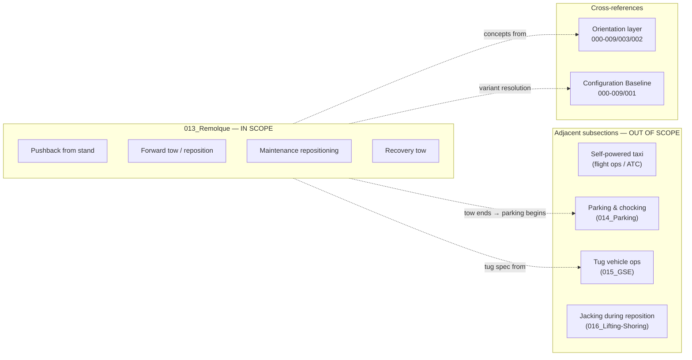

# ATLAS 010-019 · Section 01 · Subsection 013 · Subsubject 001 — Scope and Towing Boundaries

## 1. Purpose

Defines the operational scope of `013_Remolque/` — which towing and pushback operations are governed by this subsection, which aircraft variants are in scope, and where the boundaries lie with adjacent subsections and external procedures. This subsubject is the mandatory first reference before executing or authoring any towing procedure under the ATLAS `013_` slot.

> **Scope boundary:** This file defines *what* is in scope and *where* the boundaries are. The step-by-step procedures are in [`013-003-Towing-Procedures-Pushback-and-Maneuvering.md`](./013-003-Towing-Procedures-Pushback-and-Maneuvering.md); equipment specifications are in [`013-002-Towing-Equipment-and-Tug-Compatibility.md`](./013-002-Towing-Equipment-and-Tug-Compatibility.md).

## 2. Scope

### 2.1 Operations in scope

The following ground movement operations are governed by this subsection:

| Operation | Description |
|---|---|
| **Pushback from stand** | Rearward movement of the aircraft from a parking stand to the taxiway hold point by a ground tug. |
| **Forward tow** | Forward movement of the aircraft by a ground tug (e.g., tow into a hangar, reposition on apron). |
| **Maintenance repositioning** | Movement of the aircraft between maintenance bays, hangar positions, or storage areas. |
| **Recovery tow** | Towing of an aircraft from an off-stand position following an incident, ground stop, or taxi abort. |

All of the above operations require:
- An authorised towing order (see [`013-005-Towing-Records-Incidents-and-Traceability.md`](./013-005-Towing-Records-Incidents-and-Traceability.md)).
- Insertion of the bypass pin before tug connection (see [`013-003-Towing-Procedures-Pushback-and-Maneuvering.md`](./013-003-Towing-Procedures-Pushback-and-Maneuvering.md)).
- A qualified tug and approved towbar or towbarless (TBL) adapter (see [`013-002-Towing-Equipment-and-Tug-Compatibility.md`](./013-002-Towing-Equipment-and-Tug-Compatibility.md)).

### 2.2 Aircraft variants in scope

| Variant | Nose-gear geometry | Towbar series | TBL compatibility | Notes |
|---|---|---|---|---|
| AMPEL360e (Gen 1) | Standard nose-gear, Jet-A / SAF propulsion | Series A (type-specific) | Yes — approved TBL list in AMM chapter 9 | Electric taxi interlock not fitted |
| AMPEL360-BWB (Gen 2) | BWB nose-gear geometry | Series B (type-specific) | Yes — separate approved TBL list | Electric taxi interlock: must be in TOWING mode before bypass pin insertion |
| Hybrid / interim variants | Per active Configuration Baseline | Per Configuration Baseline | Per Configuration Baseline | Resolve variant via [`../../000-009_Informacion-General-y-Servicio/001_Configuracion/`](../../000-009_Informacion-General-y-Servicio/001_Configuracion/) |

> **Variant resolution rule:** The applicable towbar series, tug type, and bypass pin part number are variant-dependent. **Always resolve the active Configuration Baseline before commencing any tow operation.**

### 2.3 Operations explicitly excluded from this subsection

The following operations are **not** governed by `013_Remolque/`:

| Excluded operation | Governed by |
|---|---|
| Aircraft taxiing under own propulsion | Flight operations / ATC — not an ATLAS `010-019` procedure |
| Aircraft self-powered electric taxi (Gen 2 only) | EPTA Code range (propulsion system) + flight operations |
| Tug vehicle operation and maintenance | [`../015_GSE/`](../015_GSE/) — Ground Support Equipment |
| Parking and chocking after tow completion | [`../014_Parking/`](../014_Parking/) |
| Jacking / shoring during maintenance repositioning | [`../016_Lifting-Shoring-Jacking-Procedures/`](../016_Lifting-Shoring-Jacking-Procedures/) |
| LH₂ fuel system safety interlocks during tow | EPTA `460-469_Propulsion-de-Hidrogeno-y-Celdas-de-Combustible/` |

### 2.4 Relationship to the orientation layer

The introductory concepts for towing — towbar vs. TBL definitions, bypass pin concept, tow speed concept, parking transition — are documented in the Level 1 orientation file:

[`../../000-009_Informacion-General-y-Servicio/003_Operaciones-Basicas/002_Towing-Taxiing-and-Parking.md`](../../000-009_Informacion-General-y-Servicio/003_Operaciones-Basicas/002_Towing-Taxiing-and-Parking.md)

Contributors must read the orientation file before authoring procedure content in `013_`. **Procedure content shall not repeat orientation content; cross-reference it instead.**

### 2.5 Aerodrome scope

Towing procedures in `013_` are applicable to:
- **Airport aprons and taxiways** where the aircraft is under control of the operator and ground crew.
- **Maintenance hangars and bays** under the operator's or MRO's jurisdiction.

Procedures are not applicable to:
- Runway operations (runway incursion risk — governed by aerodrome operating procedures).
- Ferry towing across public roads (special permit and localised procedures required outside ATLAS scope).

## 3. Diagram — Scope Boundary Map

## 4. Footprint

| Metric | Value |
|---|---|
| Architecture | `ATLAS` — Aircraft Top Level Architecture Schema/System (controlled term) |
| Master range | `000–099` |
| Code range | `010-019` |
| Section | `01` — Manejo en Tierra & Servicio |
| Subsection | `013` — Remolque |
| Subsubject | `001` — Scope and Towing Boundaries |
| Conventional ATA ref | ATA chapter 9 (Towing and Taxiing) |
| Variant sensitivity | Yes — towbar series, bypass pin P/N, TBL list are variant-dependent |
| Primary Q-Division | Q-GROUND[^qdiv] |
| Support Q-Divisions | Q-MECHANICS, Q-INDUSTRY |
| ORB support | ORB-PMO, ORB-FIN |
| Governance class | `baseline`[^gov] |
| Folder path | `Q+ATLANTIDE/000-099_ATLAS/010-019_Manejo-en-Tierra-Servicio/013_Remolque/` |
| Document | `013-001-Towing-Scope-and-Boundaries.md` (this file) |
| Parent subsection | [`README.md`](./README.md) · [`013-000-Towing-Overview.md`](./013-000-Towing-Overview.md) |
| Orientation layer | [`../../000-009_Informacion-General-y-Servicio/003_Operaciones-Basicas/002_Towing-Taxiing-and-Parking.md`](../../000-009_Informacion-General-y-Servicio/003_Operaciones-Basicas/002_Towing-Taxiing-and-Parking.md) |
| Configuration Baseline | [`../../000-009_Informacion-General-y-Servicio/001_Configuracion/`](../../000-009_Informacion-General-y-Servicio/001_Configuracion/) |
| Parent architecture | [`../../README.md`](../../README.md) |
| Parent baseline | [`organization/Q+ATLANTIDE.md`](../../../../organization/Q+ATLANTIDE.md) |

## 5. References & Citations

[^baseline]: **Q+ATLANTIDE controlled baseline (v1.0.0)** — [`organization/Q+ATLANTIDE.md`](../../../../organization/Q+ATLANTIDE.md).

[^archtable]: **§3 — Architecture Table (parent)** — [`../../README.md` §3](../../README.md#3-architecture-table).

[^qdiv]: **Q-Division authority** — [`organization/Q-Divisions/`](../../../../organization/Q-Divisions/).

[^gov]: **Governance class** — `baseline` denotes documents under controlled change management within the Q+ATLANTIDE baseline.

[^ata2200]: **ATA iSpec 2200** — Information standards for aviation maintenance documentation. ATA chapter 9 (Towing and Taxiing) is the conventional chapter reference for this subsection's scope.

[^ataspec100]: **ATA Spec 100** — Manufacturers' Technical Data standard. ATA chapter 9 covers towing and taxiing procedures.

[^s1000d]: **S1000D Issue 6.0** — International specification for technical publications.

[^as9100d]: **AS9100D** — Quality Management Systems — Aviation, Space and Defense Organizations.

[^icao9137]: **ICAO Doc 9137 — Airport Services Manual, Part 4** — Ground vehicle operations and towing procedures.

[^iata_igom]: **IATA Ground Operations Manual (IGOM)** — Towing and pushback procedures at the operational level.

### Applicable industry standards

- ATA iSpec 2200 — Information standards for aviation maintenance (ATA chapter 9)[^ata2200]
- ATA Spec 100 — Manufacturers' Technical Data[^ataspec100]
- S1000D Issue 6.0 — International specification for technical publications[^s1000d]
- AS9100D — Quality Management Systems — Aviation, Space and Defense Organizations[^as9100d]
- ICAO Doc 9137 Part 4 — Airport Services Manual[^icao9137]
- IATA Ground Operations Manual (IGOM)[^iata_igom]
