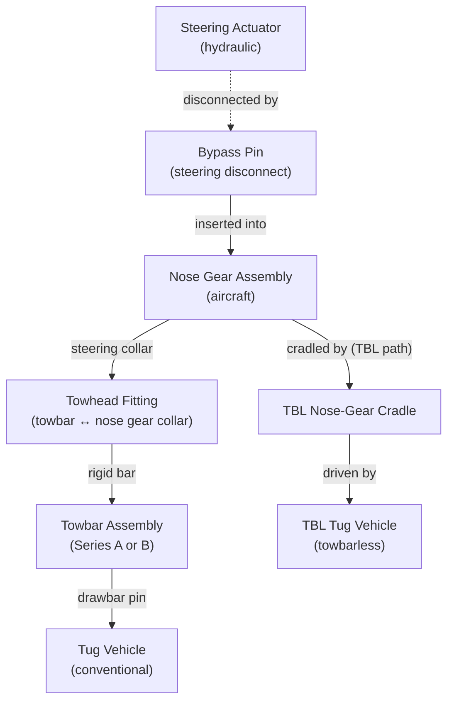

# ATLAS 010-019 · Section 01 · Subsection 013 · Subsubject 002 — Towing Equipment and Tug Compatibility

## 1. Purpose

Specifies the ground support equipment used in AMPEL360 towing operations: towbar assemblies, towbarless (TBL) tug adapters, bypass pins, and ancillary equipment. Establishes the qualification and compatibility requirements that must be verified before any tow operation commences.

> **Scope boundary:** This file covers equipment specifications and qualification criteria. The procedure for using this equipment (installation sequence, tug connection, bypass pin insertion) is in [`013-003-Towing-Procedures-Pushback-and-Maneuvering.md`](./013-003-Towing-Procedures-Pushback-and-Maneuvering.md). Load and speed limits applicable to all equipment are in [`013-004-Towing-Limits-Loads-and-Steering-Constraints.md`](./013-004-Towing-Limits-Loads-and-Steering-Constraints.md).

## 2. Scope

### 2.1 Towbar assemblies

A **towbar** is a rigid or semi-rigid bar that mechanically couples the tug's drawbar to the aircraft nose-gear steering collar via a towhead fitting. The towbar is type-specific; only approved towbars may be used.

#### 2.1.1 Towbar series (AMPEL360)

| Series | Applicable variant | Towhead fitting | Shear bolt rating | Part number prefix |
|---|---|---|---|---|
| Series A | AMPEL360e (Gen 1) | NATO lug, nose-gear collar Type A | Per AMM chapter 9 Table 901 | See AMM chapter 9 |
| Series B | AMPEL360-BWB (Gen 2) | BWB-specific collar Type B | Per AMM chapter 9 Table 902 | See AMM chapter 9 |

Key towbar features common to all series:
- **Shear bolt**: A sacrificial bolt designed to shear at a defined overload to protect the nose gear from damage. Shear bolt must be replaced after each shear event. Shear bolt part number and torque value are in AMM chapter 9.
- **Towhead locking pin**: Must be visually confirmed seated and locked before towing commences.
- **Towbar inspection**: Before each use, inspect for cracks, corrosion, bent tube, missing pins, and worn towhead bushing. A damaged towbar must not be used.

#### 2.1.2 Towbar do-not-use conditions

| Condition | Action |
|---|---|
| Visible crack in towbar tube or towhead casting | Remove from service; tag and report to maintenance |
| Shear bolt previously sheared (not replaced) | Replace shear bolt before use; log event per `005_` |
| Towhead locking pin missing or not seated | Do not connect to aircraft; obtain serviceable towbar |
| Towbar series mismatch with aircraft variant | Do not use; obtain correct series towbar |

### 2.2 Towbarless (TBL) tugs

A **towbarless tug** cradles or clamps the nose gear directly, eliminating the towbar. The tug manoeuvres independently and steer the aircraft by rotating the nose gear through the tug's cradle.

#### 2.2.1 TBL compatibility matrix

| TBL tug model | AMPEL360e (Gen 1) | AMPEL360-BWB (Gen 2) | Notes |
|---|---|---|---|
| TBL Type I | Approved | Not approved | Max. tow speed: per AMM chapter 9 |
| TBL Type II | Approved | Approved | Max. tow speed: per AMM chapter 9 |
| Other models | Per AMM chapter 9 Approved Equipment List | Per AMM chapter 9 Approved Equipment List | Operator must verify against current revision |

> **Note:** The Approved Equipment List (AEL) in AMM chapter 9 is the master authority. This table is a summary reference only. Always check the current AMM revision before using a TBL tug.

#### 2.2.2 TBL nose-gear cradling inspection

Before cradling the nose gear:
- Inspect TBL cradle pads for wear, contamination, and correct shore-hardness rating.
- Verify TBL tug is set to the correct nose-gear width and height setting for the active variant.
- Confirm nose-gear doors are in the closed and latched position.

### 2.3 Bypass pin (steering disconnect pin)

The **bypass pin** (also called *tow pin* or *steering disconnect pin*) is a mechanical pin inserted into the nose-gear steering mechanism before towing to disconnect the hydraulic steering actuator from the nose gear. This prevents hydraulic loads from opposing the towbar/tug and avoids steering system damage.

#### 2.3.1 Bypass pin specifications

| Attribute | AMPEL360e (Gen 1) | AMPEL360-BWB (Gen 2) |
|---|---|---|
| Part number | Per AMM chapter 9 (PN listed in task) | Per AMM chapter 9 (PN listed in task) |
| Installation torque | Per AMM chapter 9 | Per AMM chapter 9 |
| Safety wire requirement | Yes — safety wire after installation | Yes — safety wire after installation |
| Red streamer required | Yes — streamer attached to pin | Yes — streamer attached to pin |
| Location in aircraft | Nose gear well or dedicated stowage panel | Nose gear well or dedicated stowage panel |

> **CRITICAL — AIRWORTHINESS ITEM:** The bypass pin **must be removed and stowed** before the next powered taxi or flight. Loss of the bypass pin in a flight-ready aircraft is an airworthiness discrepancy requiring entry in the Aircraft Technical Log (ATL). Refer to `013-005-Towing-Records-Incidents-and-Traceability.md` for the reporting procedure.

#### 2.3.2 Gen 2 electric taxi system interlock

For AMPEL360-BWB (Gen 2) aircraft equipped with the electric taxi system, the taxi system **must be placed in TOWING mode** via the flight deck panel before the bypass pin is inserted. Failure to set TOWING mode before bypass pin insertion may result in electrical actuator damage. Refer to AMM chapter 9 Gen 2 supplement for the interlock sequence.

### 2.4 Ancillary equipment

| Item | Purpose | Requirement |
|---|---|---|
| Tow bar connecting pin / safety clip | Secures towbar to tug drawbar | Verified seated before tow |
| Wing walker / tip clearance poles | Visual clearance indication for ground crew | Required on all tows with reduced wingtip clearance (<5 m) |
| Headset / radio communication set | Communication between tow crew leader and flight deck | Required for all pushback operations with flight crew on board |
| Wheel chock set (pre/post tow) | Prevent inadvertent movement before and after tow | Chocks removed per departure sequence; replaced per `014_Parking/` arrival sequence |
| Ground safety cones | Mark exclusion zone around aircraft during tow setup | Required on apron tows where third-party traffic is present |

## 3. Diagram — Equipment Interface on Nose Gear

## 4. Footprint

| Metric | Value |
|---|---|
| Architecture | `ATLAS` — Aircraft Top Level Architecture Schema/System (controlled term) |
| Master range | `000–099` |
| Code range | `010-019` |
| Section | `01` — Manejo en Tierra & Servicio |
| Subsection | `013` — Remolque |
| Subsubject | `002` — Towing Equipment and Tug Compatibility |
| Conventional ATA ref | ATA chapter 9 (Towing and Taxiing) |
| Variant sensitivity | Yes — towbar series, bypass pin P/N, TBL compatibility are variant-dependent |
| Primary Q-Division | Q-GROUND[^qdiv] |
| Support Q-Divisions | Q-MECHANICS, Q-INDUSTRY |
| ORB support | ORB-PMO, ORB-FIN |
| Governance class | `baseline`[^gov] |
| Folder path | `Q+ATLANTIDE/000-099_ATLAS/010-019_Manejo-en-Tierra-Servicio/013_Remolque/` |
| Document | `013-002-Towing-Equipment-and-Tug-Compatibility.md` (this file) |
| Parent subsection | [`README.md`](./README.md) · [`013-000-Towing-Overview.md`](./013-000-Towing-Overview.md) |
| GSE qualification | [`../015_GSE/`](../015_GSE/) |
| Parent architecture | [`../../README.md`](../../README.md) |
| Parent baseline | [`organization/Q+ATLANTIDE.md`](../../../../organization/Q+ATLANTIDE.md) |

## 5. References & Citations

[^baseline]: **Q+ATLANTIDE controlled baseline (v1.0.0)** — [`organization/Q+ATLANTIDE.md`](../../../../organization/Q+ATLANTIDE.md).

[^archtable]: **§3 — Architecture Table (parent)** — [`../../README.md` §3](../../README.md#3-architecture-table).

[^qdiv]: **Q-Division authority** — [`organization/Q-Divisions/`](../../../../organization/Q-Divisions/).

[^gov]: **Governance class** — `baseline` denotes documents under controlled change management within the Q+ATLANTIDE baseline.

[^ata2200]: **ATA iSpec 2200** — Information standards for aviation maintenance documentation. ATA chapter 9 (Towing and Taxiing) is the conventional chapter reference for this subsection's scope.

[^ataspec100]: **ATA Spec 100** — Manufacturers' Technical Data standard.

[^s1000d]: **S1000D Issue 6.0** — International specification for technical publications.

[^as9100d]: **AS9100D** — Quality Management Systems — Aviation, Space and Defense Organizations.

[^icao9137]: **ICAO Doc 9137 — Airport Services Manual, Part 4** — Ground vehicle operations and towing procedures.

[^iata_igom]: **IATA Ground Operations Manual (IGOM)** — Towing and pushback equipment standards at the operational level.

### Applicable industry standards

- ATA iSpec 2200 — Information standards for aviation maintenance (ATA chapter 9)[^ata2200]
- ATA Spec 100 — Manufacturers' Technical Data[^ataspec100]
- S1000D Issue 6.0 — International specification for technical publications[^s1000d]
- AS9100D — Quality Management Systems — Aviation, Space and Defense Organizations[^as9100d]
- ICAO Doc 9137 Part 4 — Airport Services Manual[^icao9137]
- IATA Ground Operations Manual (IGOM)[^iata_igom]
