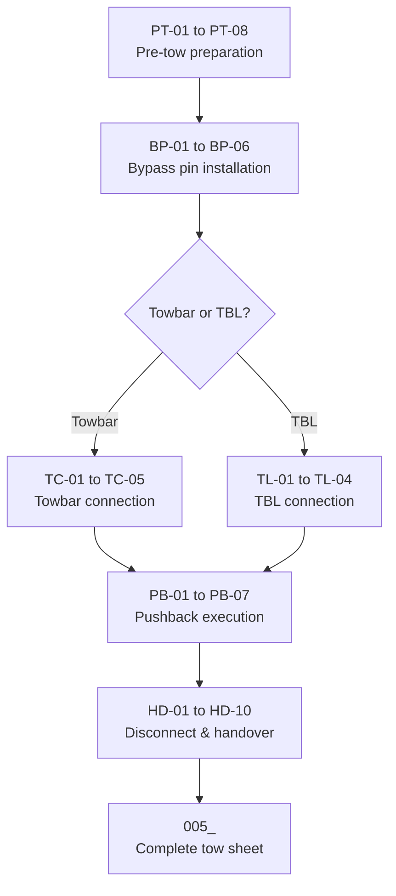

# ATLAS 010-019 · Section 01 · Subsection 013 · Subsubject 003 — Towing Procedures — Pushback and Maneuvering

## 1. Purpose

Provides the step-level procedure for AMPEL360 towing operations, covering pushback from a parking stand, forward tow and repositioning, and the final handover to flight crew. This subsubject is the primary procedural reference for ground crew conducting towing operations.

> **Scope boundary:** This file contains the step-level procedures. Equipment specifications and qualification are in [`013-002-Towing-Equipment-and-Tug-Compatibility.md`](./013-002-Towing-Equipment-and-Tug-Compatibility.md). Load and speed limits governing these steps are in [`013-004-Towing-Limits-Loads-and-Steering-Constraints.md`](./013-004-Towing-Limits-Loads-and-Steering-Constraints.md). Record-keeping requirements following each tow are in [`013-005-Towing-Records-Incidents-and-Traceability.md`](./013-005-Towing-Records-Incidents-and-Traceability.md).

## 2. Scope

### 2.1 Pre-tow preparation (all tow types)

The following checks must be completed before any towing operation commences, regardless of tow type:

| Step | Action | Responsibility |
|---|---|---|
| PT-01 | Obtain a signed towing order authorising the operation, specifying destination and variant | Crew leader |
| PT-02 | Verify aircraft variant; select correct towbar series or TBL type per AMM chapter 9 AEL | Crew leader |
| PT-03 | Inspect towbar or TBL cradle per `002_` §2.1.1 / §2.2.2 | Crew leader / mechanic |
| PT-04 | Confirm wheel chocks are in place (fore and aft main gear) | Wing walker |
| PT-05 | Confirm parking brake is SET on flight deck (confirmed verbally with flight crew or cockpit check) | Crew leader + flight deck |
| PT-06 | Ensure all access panels, doors, and service hatches are closed and latched | Mechanic |
| PT-07 | Brief all personnel: crew leader, wing walkers, flight deck crew | Crew leader |
| PT-08 | For **Gen 2 (BWB)** only: set electric taxi system to TOWING mode on flight deck panel | Flight deck crew |

### 2.2 Bypass pin installation

| Step | Action | Notes |
|---|---|---|
| BP-01 | Retrieve bypass pin from stowage (nose gear well or dedicated panel); verify correct P/N for active variant | See `002_` §2.3.1 for P/N |
| BP-02 | Remove nose-gear steering lockout cover (if fitted) | Follow AMM chapter 9 access procedure |
| BP-03 | Insert bypass pin into steering disconnect port until fully seated | Verify tactile and visual engagement |
| BP-04 | Install safety wire per AMM chapter 9 | Retain safety wire ends within nose-gear well |
| BP-05 | Attach red streamer to bypass pin; confirm streamer is visible from outside aircraft | Streamer must not contact any moving part |
| BP-06 | Record bypass pin installation in tow sheet (date, time, P/N, installer initials) | See `005_` |

> **CRITICAL:** Do not connect towbar or move aircraft without the bypass pin fully installed and safety-wired.

### 2.3 Tug and towbar connection

#### 2.3.1 Conventional towbar connection

| Step | Action | Notes |
|---|---|---|
| TC-01 | Position tug so drawbar aligns with towbar rear clevis | Engine off or at idle; tug brakes set |
| TC-02 | Connect towbar rear clevis to tug drawbar; insert drawbar pin; fit and lock safety clip | Verify pin fully inserted and clip seated |
| TC-03 | Position towbar towhead over nose-gear steering collar | Approach slowly; personnel clear of arc |
| TC-04 | Lower towhead onto nose-gear collar; insert towhead locking pin; lock per AMM chapter 9 | Confirm lock visually and by pull test |
| TC-05 | Perform towbar tension check: crew leader applies hand tension to towbar; verify no slack in connections | Any slack indicates unseated towhead or drawbar pin |

#### 2.3.2 Towbarless (TBL) connection

| Step | Action | Notes |
|---|---|---|
| TL-01 | Verify TBL tug type is on AEL for the active variant; set nose-gear width and height on TBL control panel | See `002_` §2.2.1 |
| TL-02 | Drive TBL tug slowly forward until nose-gear enters cradle; stop when cradle sensor confirms capture | Max approach speed: 2 km/h |
| TL-03 | Activate cradle clamp; confirm clamp indicator green on TBL control panel | Do not proceed if indicator red |
| TL-04 | Verify nose-gear doors clear of cradle mechanism | Wing walker confirms visually |

### 2.4 Pushback procedure

| Step | Action | Notes |
|---|---|---|
| PB-01 | Remove all chocks; confirm "chocks out" verbally to crew leader | Wing walkers confirm fore and aft |
| PB-02 | Crew leader signals ATC / ramp control for pushback clearance | At airports where ramp control is active |
| PB-03 | Crew leader connects headset to aircraft interphone (belly point) and establishes communication with flight deck | Confirm "ready for pushback" |
| PB-04 | Release aircraft parking brake on command from crew leader | Flight deck crew |
| PB-05 | Begin pushback at walking pace; wing walkers maintain position at wingtips | Wing walkers signal stop if clearance reduces below safe margin |
| PB-06 | Execute turns within steering angle limits (see `004_` §2.1); approach turns gradually | Do not exceed maximum steering angle in a single input |
| PB-07 | Tow to designated hold point or taxiway position; stop aircraft; confirm position with flight deck | Crew leader calls "at hold point" on interphone |

### 2.5 Tug disconnect and handover to flight crew

| Step | Action | Notes |
|---|---|---|
| HD-01 | Set aircraft parking brake on command from crew leader | Flight deck crew; confirm "brakes set" |
| HD-02 | Place chocks fore and aft of nose gear (or main gear per local procedure) | Wing walkers |
| HD-03 | Disconnect towbar towhead from nose-gear collar; or retract TBL cradle | Do not disconnect while aircraft is in motion |
| HD-04 | **Remove bypass pin**: remove safety wire; extract pin; attach red streamer; confirm removal | Crew leader announces "bypass pin out" on interphone |
| HD-05 | Stow bypass pin in designated aircraft stowage | Verify stowage secured |
| HD-06 | Record bypass pin removal in tow sheet (time, person); crew leader signs tow sheet | See `005_` |
| HD-07 | Move tug and all ground equipment clear of aircraft and taxiway | Confirm "equipment clear" |
| HD-08 | Crew leader signals flight deck: "all clear, ready for taxi" | Visual signal or interphone |
| HD-09 | Flight deck crew confirms bypass pin removed and stowed via before-taxi checklist item | Flight deck responsibility |
| HD-10 | Disconnect interphone; coil headset cable; remove from aircraft | Crew leader |

### 2.6 Maintenance repositioning (hangar / bay tow)

Maintenance repositioning follows the same pre-tow, bypass pin, and connection steps as pushback (§2.1–§2.3) with the following differences:

- ATC clearance is not required inside a controlled maintenance area; authorisation is from the Maintenance Controller or Hangar Supervisor.
- Wing walkers are required at both wingtips and tail to manage hangar clearances.
- Speed must not exceed walking pace inside a hangar.
- If jacking is required as part of the repositioning (e.g., to position the aircraft on maintenance jacks), the jacking procedure in [`../016_Lifting-Shoring-Jacking-Procedures/`](../016_Lifting-Shoring-Jacking-Procedures/) takes over after the tow is complete and the aircraft is parked.

### 2.7 Recovery tow (post-incident / off-stand)

Recovery tow applies when the aircraft is in an unplanned position (e.g., after a taxi abort, ground stop, or minor ground incident). Before commencing a recovery tow:

- An Engineering Assessment must confirm the aircraft is structurally tow-worthy (no landing gear damage, no known structural discrepancy).
- A Recovery Tow Brief must be held with all crew.
- The tow sheet must be designated as a **Recovery Tow** type (see `005_` §2.3).
- The procedure then follows §2.1–§2.5 with the additional Engineering Signoff at HD-06.

## 3. Diagram — Pushback Sequence

## 4. Footprint

| Metric | Value |
|---|---|
| Architecture | `ATLAS` — Aircraft Top Level Architecture Schema/System (controlled term) |
| Master range | `000–099` |
| Code range | `010-019` |
| Section | `01` — Manejo en Tierra & Servicio |
| Subsection | `013` — Remolque |
| Subsubject | `003` — Towing Procedures — Pushback and Maneuvering |
| Conventional ATA ref | ATA chapter 9 (Towing and Taxiing) |
| Variant sensitivity | Gen 2 electric taxi interlock at PT-08; bypass pin P/N by variant |
| Primary Q-Division | Q-GROUND[^qdiv] |
| Support Q-Divisions | Q-MECHANICS, Q-INDUSTRY |
| ORB support | ORB-PMO, ORB-FIN |
| Governance class | `baseline`[^gov] |
| Folder path | `Q+ATLANTIDE/000-099_ATLAS/010-019_Manejo-en-Tierra-Servicio/013_Remolque/` |
| Document | `013-003-Towing-Procedures-Pushback-and-Maneuvering.md` (this file) |
| Parent subsection | [`README.md`](./README.md) · [`013-000-Towing-Overview.md`](./013-000-Towing-Overview.md) |
| Equipment reference | [`013-002-Towing-Equipment-and-Tug-Compatibility.md`](./013-002-Towing-Equipment-and-Tug-Compatibility.md) |
| Limits reference | [`013-004-Towing-Limits-Loads-and-Steering-Constraints.md`](./013-004-Towing-Limits-Loads-and-Steering-Constraints.md) |
| Records reference | [`013-005-Towing-Records-Incidents-and-Traceability.md`](./013-005-Towing-Records-Incidents-and-Traceability.md) |
| Parent architecture | [`../../README.md`](../../README.md) |
| Parent baseline | [`organization/Q+ATLANTIDE.md`](../../../../organization/Q+ATLANTIDE.md) |

## 5. References & Citations

[^baseline]: **Q+ATLANTIDE controlled baseline (v1.0.0)** — [`organization/Q+ATLANTIDE.md`](../../../../organization/Q+ATLANTIDE.md).

[^archtable]: **§3 — Architecture Table (parent)** — [`../../README.md` §3](../../README.md#3-architecture-table).

[^qdiv]: **Q-Division authority** — [`organization/Q-Divisions/`](../../../../organization/Q-Divisions/).

[^gov]: **Governance class** — `baseline` denotes documents under controlled change management within the Q+ATLANTIDE baseline.

[^ata2200]: **ATA iSpec 2200** — Information standards for aviation maintenance documentation. ATA chapter 9 (Towing and Taxiing) provides the step-level framework for these procedures.

[^ataspec100]: **ATA Spec 100** — Manufacturers' Technical Data standard.

[^s1000d]: **S1000D Issue 6.0** — International specification for technical publications.

[^as9100d]: **AS9100D** — Quality Management Systems — Aviation, Space and Defense Organizations.

[^icao9137]: **ICAO Doc 9137 — Airport Services Manual, Part 4** — Ground vehicle operations and towing procedures.

[^iata_igom]: **IATA Ground Operations Manual (IGOM)** — Towing and pushback procedure standards at the operational level.

### Applicable industry standards

- ATA iSpec 2200 — Information standards for aviation maintenance (ATA chapter 9)[^ata2200]
- ATA Spec 100 — Manufacturers' Technical Data[^ataspec100]
- S1000D Issue 6.0 — International specification for technical publications[^s1000d]
- AS9100D — Quality Management Systems — Aviation, Space and Defense Organizations[^as9100d]
- ICAO Doc 9137 Part 4 — Airport Services Manual[^icao9137]
- IATA Ground Operations Manual (IGOM)[^iata_igom]
