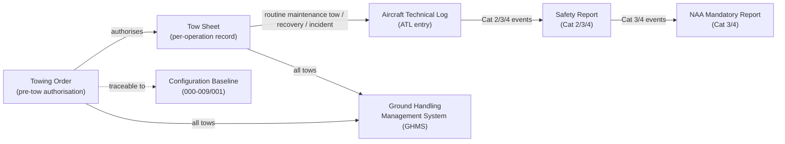

# ATLAS 010-019 · Section 01 · Subsection 013 · Subsubject 005 — Towing Records, Incidents and Traceability

## 1. Purpose

Defines the records, incident categories, reporting thresholds, and traceability requirements for all [PROGRAMME-AIRCRAFT] towing operations. Every completed tow — routine or incident-related — must generate a documented record that is traceable to the aircraft registration, Configuration Baseline, and the authorising personnel.

> **Scope boundary:** This file covers documentation and reporting requirements. The procedure steps that generate these records are in [`013-003-Towing-Procedures-Pushback-and-Maneuvering.md`](./013-003-Towing-Procedures-Pushback-and-Maneuvering.md). The limits that, when exceeded, trigger incident entries are in [`013-004-Towing-Limits-Loads-and-Steering-Constraints.md`](./013-004-Towing-Limits-Loads-and-Steering-Constraints.md).

## 2. Scope

### 2.1 Towing order

A **Towing Order** must be issued and signed before any tow operation commences. The Towing Order is the primary authorisation document for the operation.

#### 2.1.1 Required fields — Towing Order

| Field | Description |
|---|---|
| Aircraft registration | Full registration of the aircraft to be towed |
| Active variant | [PROGRAMME-AIRCRAFT] / [PROGRAMME-AIRCRAFT]-BWB / other (resolved from Configuration Baseline) |
| Date and time (planned) | ISO 8601 date-time: YYYY-MM-DDTHH:MM |
| Origin position | Stand, bay, or area from which the aircraft will be towed |
| Destination position | Stand, bay, or area to which the aircraft will be towed |
| Tow type | Pushback / Forward tow / Maintenance reposition / Recovery tow |
| Towbar series or TBL model | Towbar series (A/B) or approved TBL model used |
| Bypass pin P/N | Part number of bypass pin to be installed |
| Crew leader | Name and certification reference |
| Wing walkers | Name(s) |
| Flight deck crew (if on board) | Name(s); N/A if unoccupied |
| Authorising supervisor | Name and signature |

#### 2.1.2 Towing Order retention

Towing Orders are retained in the operator's Ground Handling Management System (GHMS) or paper records for a minimum period per the applicable regulatory requirement (typically 24 months, or as required by the NAA). Traceability to the aircraft ATL entry is required for all tows other than routine pushbacks from a stand.

### 2.2 Tow sheet (per-operation record)

The **Tow Sheet** is completed during and after the tow operation by the crew leader. It is the operative record of what was executed, as opposed to the Towing Order (what was planned).

#### 2.2.1 Required entries — Tow Sheet

| Entry | When | Who |
|---|---|---|
| Bypass pin installation: P/N, date, time, installer initials | At BP-06 | Crew leader / installer |
| Tug type and registration/ID | At tug connection | Crew leader |
| Tow start time | At PB-05 (chocks out) | Crew leader |
| Tow stop time | At HD-01 (brakes set) | Crew leader |
| Bypass pin removal: date, time, remover initials | At HD-04 | Crew leader |
| Any limit exceedances (speed, steering angle, gradient, wind) | If applicable | Crew leader |
| Shear bolt status | Post-tow inspection | Crew leader / mechanic |
| Crew leader signature | On completion | Crew leader |

#### 2.2.2 Recovery Tow designation

If the tow is a Recovery Tow (§2.7 of `003_`), the tow sheet must be headed **RECOVERY TOW** and must include:
- Reference to the Engineering Assessment that authorised the recovery tow.
- Engineering Signoff at tow completion (name, certification reference, signature).

### 2.3 Aircraft Technical Log (ATL) entries

The following events require an ATL entry:

| Event | ATL entry required | Nature of entry |
|---|---|---|
| Routine pushback (no anomalies) | No | Record retained in tow sheet only |
| Maintenance repositioning | Yes | Log entry: tow completed, from/to position, crew leader name |
| Recovery tow | Yes | Log entry: tow type, Engineering Assessment reference, engineering signoff |
| Towbar shear bolt sheared | Yes | Maintenance entry: shear event, engineering assessment outcome, shear bolt replaced (P/N, batch) |
| Tow speed limit exceeded | Yes | Maintenance entry: speed exceedance, assessment, release or rectification |
| Steering angle limit exceeded | Yes | Maintenance entry: steering exceedance, nose-gear inspection result |
| Bypass pin not removed before taxi | Yes — **AIRWORTHINESS DISCREPANCY** | Immediate ATL entry; aircraft grounded until bypass pin located and engineering assessment completed |

### 2.4 Incident categories

Towing incidents are classified by severity to determine the appropriate response and reporting escalation:

| Category | Definition | Minimum response |
|---|---|---|
| **Category 1 — Minor deviation** | Speed limit exceeded by ≤20%; no structural contact; personnel uninjured | Tow sheet entry; crew leader report to supervisor; no ATL entry required unless maintenance action needed |
| **Category 2 — Operational incident** | Speed limit exceeded by >20%; steering angle limit reached; shear bolt sheared; ground equipment contact with aircraft (no visible damage) | ATL entry; maintenance inspection; Ground Safety Report; Supervisor notification within 1 hour |
| **Category 3 — Damage incident** | Visible damage to aircraft structure, landing gear, or skin; ground equipment penetrates aircraft surface; personnel injured | Immediate operation stop; ATL entry; Engineering Hold applied; Safety Report within 2 hours; Notify NAA per applicable regulation; Accident / Serious Incident Report if personnel injury or significant damage |
| **Category 4 — Airworthiness event** | Bypass pin not removed before taxi or flight; towbar not disconnected before aircraft power-on; any event where an airworthiness-relevant action was not completed | Immediate ATL entry; Engineering Hold; Engineering clearance required before further operation; Mandatory occurrence report per applicable regulation |

### 2.5 Bypass pin control and traceability

The bypass pin is an airworthiness-critical item. Its installation and removal must be traceable at all times.

| Control step | Method |
|---|---|
| Pin assigned to aircraft | Bypass pin P/N recorded against aircraft registration in GHMS or maintenance record |
| Pin installed | Tow sheet entry: P/N, time, installer |
| Pin removed | Tow sheet entry: time, remover; cross-checked against flight deck before-taxi checklist |
| Pin stowed | Crew leader confirms stowage; flight deck confirms stowage on before-taxi checklist |
| Pin not found at stow check | Immediate ATL entry — Category 4 incident; aircraft grounded; locate pin before further operation |

### 2.6 Configuration Baseline traceability

Each tow sheet must be traceable to the **active Configuration Baseline** of the aircraft at the time of the tow. This ensures that:
- The correct towbar series and bypass pin P/N were used for the active variant.
- Any configuration changes that affect towing parameters (e.g., variant upgrade, nose-gear modification) are reflected in subsequent tow orders.

The Configuration Baseline reference (document_id or release version from [`../../000-009_Informacion-General-y-Servicio/001_Configuracion/`](../../000-009_Informacion-General-y-Servicio/001_Configuracion/)) must be recorded on the Towing Order.

### 2.7 Record retention and audit

| Record type | Minimum retention | Storage |
|---|---|---|
| Towing Order | 24 months (or per NAA requirement) | GHMS or paper archive |
| Tow Sheet | 24 months (or per NAA requirement) | GHMS or paper archive |
| ATL entry (maintenance tow / recovery / incident) | Life of aircraft (or per NAA requirement) | ATL; transferred to new operator on sale/transfer |
| Ground Safety Report (Category 2/3) | 5 years (or per operator Safety Management System) | Safety Management System |
| Mandatory Occurrence Report (Category 3/4) | Per NAA requirement | NAA-designated system |

## 3. Diagram — Records Flow

## 4. Footprint

| Metric | Value |
|---|---|
| Architecture | `ATLAS` — Aircraft Top Level Architecture Schema/System (controlled term) |
| Master range | `000–099` |
| Code range | `010-019` |
| Section | `01` — Manejo en Tierra & Servicio |
| Subsection | `013` — Remolque |
| Subsubject | `005` — Towing Records, Incidents and Traceability |
| Conventional ATA ref | ATA chapter 9 (Towing and Taxiing) |
| Regulatory interface | ATL, NAA Mandatory Occurrence Reporting (applicable national regulation) |
| Traceability | Configuration Baseline [`../../000-009_Informacion-General-y-Servicio/001_Configuracion/`](../../000-009_Informacion-General-y-Servicio/001_Configuracion/) |
| Primary Q-Division | Q-GROUND[^qdiv] |
| Support Q-Divisions | Q-MECHANICS, Q-INDUSTRY |
| ORB support | ORB-PMO, ORB-FIN |
| Governance class | `baseline`[^gov] |
| Folder path | `Q+ATLANTIDE/000-099_ATLAS/010-019_Manejo-en-Tierra-Servicio/013_Remolque/` |
| Document | `013-005-Towing-Records-Incidents-and-Traceability.md` (this file) |
| Parent subsection | [`README.md`](./README.md) · [`013-000-Towing-Overview.md`](./013-000-Towing-Overview.md) |
| Procedures reference | [`013-003-Towing-Procedures-Pushback-and-Maneuvering.md`](./013-003-Towing-Procedures-Pushback-and-Maneuvering.md) |
| Limits reference | [`013-004-Towing-Limits-Loads-and-Steering-Constraints.md`](./013-004-Towing-Limits-Loads-and-Steering-Constraints.md) |
| Parent architecture | [`../../README.md`](../../README.md) |
| Parent baseline | [`organization/Q+ATLANTIDE.md`](../../../../organization/Q+ATLANTIDE.md) |

## 5. References & Citations

[^baseline]: **Q+ATLANTIDE controlled baseline (v1.0.0)** — [`organization/Q+ATLANTIDE.md`](../../../../organization/Q+ATLANTIDE.md).

[^archtable]: **§3 — Architecture Table (parent)** — [`../../README.md` §3](../../README.md#3-architecture-table).

[^qdiv]: **Q-Division authority** — [`organization/Q-Divisions/`](../../../../organization/Q-Divisions/).

[^gov]: **Governance class** — `baseline` denotes documents under controlled change management within the Q+ATLANTIDE baseline.

[^ata2200]: **ATA iSpec 2200** — Information standards for aviation maintenance documentation. ATA chapter 9 (Towing and Taxiing) governs record-keeping requirements for towing operations.

[^ataspec100]: **ATA Spec 100** — Manufacturers' Technical Data standard.

[^s1000d]: **S1000D Issue 6.0** — International specification for technical publications.

[^as9100d]: **AS9100D** — Quality Management Systems — Aviation, Space and Defense Organizations. Defines quality record requirements applicable to ground-handling operations.

[^icao9137]: **ICAO Doc 9137 — Airport Services Manual, Part 4** — Towing incident reporting standards.

[^iata_igom]: **IATA Ground Operations Manual (IGOM)** — Ground incident categorisation and reporting requirements.

### Applicable industry standards

- ATA iSpec 2200 — Information standards for aviation maintenance (ATA chapter 9)[^ata2200]
- ATA Spec 100 — Manufacturers' Technical Data[^ataspec100]
- S1000D Issue 6.0 — International specification for technical publications[^s1000d]
- AS9100D — Quality Management Systems — Aviation, Space and Defense Organizations[^as9100d]
- ICAO Doc 9137 Part 4 — Airport Services Manual[^icao9137]
- IATA Ground Operations Manual (IGOM)[^iata_igom]
