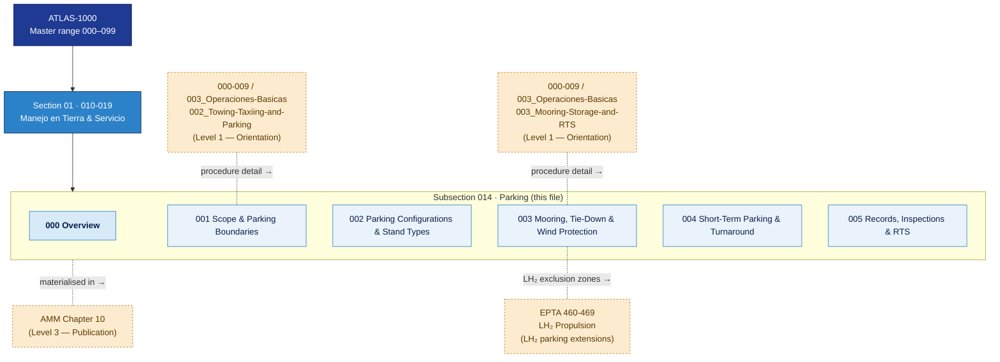

# ATLAS 010-019 · Section 01 · Subsection 014 · Subsubject 000 — Overview

## 1. Purpose

Overview entry-point for *Parking* (`014`) — the fifth subsection of Code range `010-019` (*Manejo en Tierra & Servicio*), which provides the **operational procedure layer** (Level 2) for parking, mooring, tie-down, and return-to-service operations for AMPEL360 aircraft variants.

This subsubject establishes the scope, doctrinal position, boundary rules, and subsubject map of `014_Parking/` within the controlled Q+ATLANTIDE baseline[^baseline] and links outward to the applicable industry standards listed in §5.

> **Doctrinal phrase (canonical, controlled):**
> *ATLAS `014_Parking/` defines the step-level operational procedures for positioning, securing, mooring, and returning AMPEL360 aircraft to service at gate, remote, and maintenance stands — at the level of detailed procedure, not at the level of general orientation.*

> **Scope boundary:** Introductory orientation for parking (what parking is, conceptual vocabulary) is in [`../../000-009_Informacion-General-y-Servicio/003_Operaciones-Basicas/002_Towing-Taxiing-and-Parking.md`](../../000-009_Informacion-General-y-Servicio/003_Operaciones-Basicas/002_Towing-Taxiing-and-Parking.md) and [`003_Mooring-Storage-and-Return-to-Service.md`](../../000-009_Informacion-General-y-Servicio/003_Operaciones-Basicas/003_Mooring-Storage-and-Return-to-Service.md) (Level 1). This subsection (`014_`) provides the **operational procedures** (Level 2). Published manuals (AMM, GMM) are the materialisation of both layers (Level 3).

> **Conventional ATA reference:** ATA chapter 10 (Parking and Mooring). The ATLAS `014_` slot is the programmatic equivalent of that chapter within the `010-019` Code range.

## 2. Scope

### 2.1 Position within ATLAS 010-019

`014_Parking/` occupies the fifth slot of Code range `010-019`:

| Code | Title | Role within the Code range |
|---|---|---|
| `010` | Ground Handling | Apron safety, exclusion zones, chocks, brakes, GPU |
| `011` | Servicing | Fluid and gas replenishment and drain procedures |
| `012` | Acceso | Access panel and door management |
| `013` | Remolque | Towing and taxi-out operations |
| **`014`** | **Parking** | **Parking, mooring, tie-down, and return to service** ← this subsection |
| `015` | GSE | Ground support equipment management |
| `016` | Lifting, Shoring and Jacking Procedures | Jack/shore/level procedures |

### 2.2 Content in scope

Subsubjects `001`–`005` cover (at procedure level):

| 00N | Title | Key content |
|---|---|---|
| `001` | Scope and Parking Boundaries | Regulatory scope, airside boundary definitions, stand identification and numbering |
| `002` | Parking Configurations and Stand Types | Nose-in, nose-out, angled/echelon, remote, maintenance bay; markings and guidance systems |
| `003` | Mooring, Tie-Down and Wind Protection | Tie-down point locations, mooring procedure, gust lock application, control surface lock-out |
| `004` | Short-Term Parking and Turnaround Configurations | Chock placement, GPU connect/disconnect, pitot covers, equipment positioning, safety perimeter |
| `005` | Parking Records, Inspections and Return to Service | Parking record requirements, walk-around inspection, RTS inspection checklist, discrepancy reporting |

### 2.3 Boundary against `000-009_Informacion-General-y-Servicio/003_Operaciones-Basicas/`

> **Rule PK-01 — Three-level separation of concerns:**
>
> | Level | Where | Role |
> |---|---|---|
> | **Level 1 — Orientation** | `000-009_/.../003_Operaciones-Basicas/002_` and `003_` | *What* parking, mooring and RTS are; key vocabulary; conceptual boundary between turnaround, overnight, extended parking and storage |
> | **Level 2 — Procedure** | `010-019_/.../014_Parking/` (this subsection) | *How* each operation is executed: step sequences, equipment requirements, safety checks, sign-offs, limits |
> | **Level 3 — Publication** | AMM Chapter 10, GMM, applicable Maintenance Task Cards | Approved, distributable form of the procedures |
>
> **Three levels, three roles. Content shall not be duplicated across levels.**

### 2.4 Variant sensitivity

Parking procedures in this subsection may be **variant-dependent** for the following reasons:

- **Aircraft geometry:** Nose-gear geometry, wing span, tail height, and stand footprint differ between AMPEL360 variants. Stand clearance envelopes and chock positions must be resolved against the applicable variant.
- **Propulsion architecture:** AMPEL360 variants with LH₂ propulsion (Gen 2, BWB-H2) require additional exclusion zones and cover requirements during parking. Hydrogen-specific procedures reference EPTA `460-469_`.
- **Electric taxi systems:** AMPEL360e variants with electric taxi drive may use power-on taxi-in procedures that affect the parking sequence.

Contributors must resolve the applicable variant via the Configuration Baseline ([`../../000-009_Informacion-General-y-Servicio/001_Configuracion/`](../../000-009_Informacion-General-y-Servicio/001_Configuracion/)) before specifying stand type, chock position, or mooring rig.

## 3. Diagram — Position and Boundary Map

*Solid arrows indicate parent → section → subsection ownership. Dotted arrows indicate cross-section interfaces (orientation layer and LH₂ extensions).*

## 4. Footprint

| Metric | Value |
|---|---|
| Architecture | `ATLAS` — Aircraft Top Level Architecture Schema/System (controlled term) |
| Master range | `000–099` |
| Code range | `010-019` |
| Section | `01` — Manejo en Tierra & Servicio |
| Subsection | `014` — Parking |
| Subsubject | `000` — Overview |
| Scope level | Operational procedure (Level 2); orientation in `003_Operaciones-Basicas/002_` and `003_`; publications in AMM Ch. 10 |
| Conventional ATA ref | ATA chapter 10 (Parking and Mooring) |
| Variant sensitivity | Variant-dependent (geometry, propulsion, electric taxi); resolve via [`../../000-009_Informacion-General-y-Servicio/001_Configuracion/`](../../000-009_Informacion-General-y-Servicio/001_Configuracion/) |
| Primary Q-Division | Q-GROUND[^qdiv] |
| Support Q-Divisions | Q-MECHANICS, Q-INDUSTRY |
| ORB support | ORB-PMO, ORB-FIN |
| Governance class | `baseline`[^gov] |
| Folder path | `Q+ATLANTIDE/000-099_ATLAS/010-019_Manejo-en-Tierra-Servicio/014_Parking/` |
| Document | `014-000-Parking-Overview.md` (this file) |
| Parent subsection | [`README.md`](./README.md) |
| Orientation layer (parking) | [`../../000-009_Informacion-General-y-Servicio/003_Operaciones-Basicas/002_Towing-Taxiing-and-Parking.md`](../../000-009_Informacion-General-y-Servicio/003_Operaciones-Basicas/002_Towing-Taxiing-and-Parking.md) |
| Orientation layer (mooring/RTS) | [`../../000-009_Informacion-General-y-Servicio/003_Operaciones-Basicas/003_Mooring-Storage-and-Return-to-Service.md`](../../000-009_Informacion-General-y-Servicio/003_Operaciones-Basicas/003_Mooring-Storage-and-Return-to-Service.md) |
| Parent architecture | [`../../README.md`](../../README.md) |
| Parent baseline | [`organization/Q+ATLANTIDE.md`](../../../../organization/Q+ATLANTIDE.md) |

## 5. References & Citations

[^baseline]: **Q+ATLANTIDE controlled baseline (v1.0.0)** — [`organization/Q+ATLANTIDE.md`](../../../../organization/Q+ATLANTIDE.md). Defines the controlled `000-999` architecture-band taxonomy and the ATLAS-1000 register subpart.

[^archtable]: **§3 — Architecture Table (parent)** — [`../../README.md` §3](../../README.md#3-architecture-table). Source of authority for primary/support Q-Divisions and ORB support of this section.

[^qdiv]: **Q-Division authority** — [`organization/Q-Divisions/`](../../../../organization/Q-Divisions/). Technical-authority units for the Q+ATLANTIDE baseline.

[^gov]: **Governance class** — `baseline` denotes documents under controlled change management within the Q+ATLANTIDE baseline.

[^ata2200]: **ATA iSpec 2200** — Information standards for aviation maintenance documentation. Governs data-module structure, ATA chapter mapping, and technical-publication interchange for ATLAS artefacts.

[^ataspec100]: **ATA Spec 100** — Manufacturers' Technical Data standard. ATA chapter 10 covers parking and mooring procedures.

[^s1000d]: **S1000D Issue 6.0** — International specification for technical publications. Common Source DataBase (CSDB) and Data Module Code (DMC) specification used for all Q+ATLANTIDE artefacts.

[^as9100d]: **AS9100D** — Quality Management Systems — Aviation, Space and Defense Organizations. Quality-management baseline for all Q+ATLANTIDE deliverables.

[^icao9137]: **ICAO Doc 9137 — Airport Services Manual** — Reference for aircraft parking safety, stand markings, exclusion zones, and ground-handling procedures at airports.

[^iata_igom]: **IATA Ground Operations Manual (IGOM)** — Industry standard for ground-handling procedures including parking configurations, chock placement, and GPU connection.

### Applicable industry standards

- ATA iSpec 2200 — Information standards for aviation maintenance[^ata2200]
- ATA Spec 100 — Manufacturers' Technical Data (ATA chapter 10)[^ataspec100]
- S1000D Issue 6.0 — International specification for technical publications[^s1000d]
- AS9100D — Quality Management Systems — Aviation, Space and Defense Organizations[^as9100d]
- ICAO Doc 9137 — Airport Services Manual[^icao9137]
- IATA Ground Operations Manual (IGOM)[^iata_igom]
