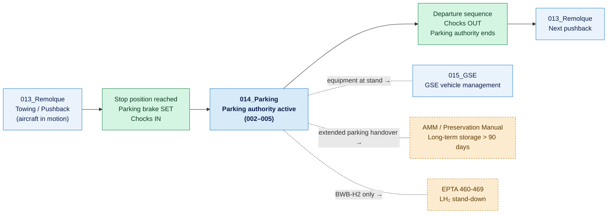

# ATLAS 010-019 · Section 01 · Subsection 014 · Subsubject 001 — Scope and Parking Boundaries

## 1. Purpose

Defines the **regulatory scope**, **spatial boundaries**, and **stand identification conventions** that govern all parking operations within `014_Parking/`. This subsubject establishes which aircraft positions, stand types, and operational conditions fall within the procedural scope of this subsection, and which are handled elsewhere in the ATLAS or by separate programme documents.

> **Scope boundary:** This subsubject defines *where* and *under what conditions* parking procedures apply. The *what* (conceptual definitions) is in [`../../000-009_Informacion-General-y-Servicio/003_Operaciones-Basicas/002_Towing-Taxiing-and-Parking.md`](../../000-009_Informacion-General-y-Servicio/003_Operaciones-Basicas/002_Towing-Taxiing-and-Parking.md) (Level 1). Parking *procedures* are in `002_`–`005_` of this subsection.

## 2. Scope

### 2.1 Regulatory and programme scope

The parking procedures in `014_Parking/` apply to:

- All **[PROGRAMME-AIRCRAFT] variants** (Gen 1 tube-and-wing and Gen 2 BWB-H2) parked at any airfield where an applicable Ground Handling Manual (GHM) or Airside Operations Agreement is in force.
- All **stand types** at which [PROGRAMME-AIRCRAFT] aircraft are positioned under programme authority: gate stands, remote stands, maintenance bays, and ferry-flight or acceptance-test positions.
- All **parking states** from turnaround (minutes) through overnight, extended (days to weeks), and long-term storage positions, up to the handover boundary with the Aircraft Maintenance Manual (AMM) for preservation procedures exceeding 90 days.

The following are **excluded** from this subsection:

| Excluded topic | Authority document |
|---|---|
| Towing and pushback procedures | `013_Remolque/` |
| Long-term storage preservation (> 90 days) | AMM, Preservation Manual |
| LH₂ fuel system stand-down and inerting | EPTA `460-469_Propulsion-de-Hidrogeno-y-Celdas-de-Combustible/` |
| Hangar ingress/egress procedures | `010_Ground-handling/` (exclusion zone management) |
| GSE vehicle positioning at stand | `015_GSE/` |

### 2.2 Airside boundary definitions

Parking procedures activate at the **stop position** — the point at which the aircraft comes to a complete halt at the assigned stand, the parking brake is set, and chocks are inserted. From that moment until chocks are removed for the next departure, the aircraft is under the authority of `014_Parking/`.

Key spatial boundaries:

| Boundary | Definition |
|---|---|
| **Stop line** | Marked line or marshaller stop signal indicating the approved nose-wheel stop position at the stand |
| **Stand box** | The apron area allocated to the aircraft, defined by the stand markings; sets the wing-tip clearance envelope |
| **Exclusion zone** | The area around the aircraft in which access is restricted to authorised personnel and equipment during parking/servicing |
| **Safety perimeter** | Minimum maintained clear zone around the fuselage and engines; dimensions per GHM and ICAO Doc 9137[^icao9137] |

### 2.3 Stand identification and numbering

Stands are identified by a **stand number or alphanumeric code** allocated by the aerodrome operator. [PROGRAMME-AIRCRAFT] programme stand-allocation records must cross-reference:

- Aerodrome stand identifier (e.g., `C12`, `R04`).
- Stand type category (see `014-002-Parking-Configurations-and-Stand-Types.md`).
- Aircraft size code (ICAO aerodrome reference code — ARC — applicable to the variant; resolved via [`../../000-009_Informacion-General-y-Servicio/001_Configuracion/`](../../000-009_Informacion-General-y-Servicio/001_Configuracion/)).
- Any stand-specific restrictions (e.g., LH₂-capable stands only for BWB-H2 variants, power-in capability for Gen 1e electric taxi variants).

### 2.4 Applicable regulations and standards

Parking operations for [PROGRAMME-AIRCRAFT] are bounded by the following regulatory and industry frameworks:

| Standard | Scope |
|---|---|
| ICAO Doc 9137 — Airport Services Manual[^icao9137] | Apron management, stand design, safety areas, GSE movement |
| IATA Ground Operations Manual (IGOM)[^iata_igom] | Parking procedure standards, chock type, equipment positioning |
| ATA chapter 10 (Parking and Mooring)[^ataspec100] | Conventional ATA reference for parking and mooring procedures |
| EASA CS-25 / applicable type certificate | Wing-tip and tail clearance minima by aircraft category |
| Aerodrome Operating Procedures (AOP) | Site-specific stand rules, taxi speed limits, exclusion zones |
| [PROGRAMME-AIRCRAFT] Ground Handling Manual (GHM) | Programme-specific stop positions, chock part numbers, GPU type |

### 2.5 Applicability by variant

All subsubjects within `014_Parking/` are applicable to all current [PROGRAMME-AIRCRAFT] variants unless marked with an explicit applicability statement. Variant-specific notes use the following convention:

> **[[PROGRAMME-AIRCRAFT] only]** — applies to Gen 1 tube-and-wing with electric taxi system only.
> **[BWB-H2 only]** — applies to Gen 2 BWB-H2 hydrogen-propulsion demonstrator only.
> **[All variants]** — applies regardless of propulsion architecture.

## 3. Diagram — Scope and Boundary Map

## 4. Footprint

| Metric | Value |
|---|---|
| Architecture | `ATLAS` — Aircraft Top Level Architecture Schema/System (controlled term) |
| Master range | `000–099` |
| Code range | `010-019` |
| Section | `01` — Manejo en Tierra & Servicio |
| Subsection | `014` — Parking |
| Subsubject | `001` — Scope and Parking Boundaries |
| Scope level | Operational procedure (Level 2) — scope and boundary definition |
| Conventional ATA ref | ATA chapter 10 (Parking and Mooring) |
| Primary Q-Division | Q-GROUND[^qdiv] |
| Support Q-Divisions | Q-MECHANICS, Q-INDUSTRY |
| ORB support | ORB-PMO, ORB-FIN |
| Governance class | `baseline`[^gov] |
| Folder path | `Q+ATLANTIDE/000-099_ATLAS/010-019_Manejo-en-Tierra-Servicio/014_Parking/` |
| Document | `014-001-Parking-Scope-and-Boundaries.md` (this file) |
| Parent subsection | [`README.md`](./README.md) · [`014-000-Parking-Overview.md`](./014-000-Parking-Overview.md) |
| Towing boundary | [`../013_Remolque/`](../013_Remolque/) |
| GSE boundary | [`../015_GSE/`](../015_GSE/) |
| Parent architecture | [`../../README.md`](../../README.md) |
| Parent baseline | [`organization/Q+ATLANTIDE.md`](../../../../organization/Q+ATLANTIDE.md) |

## 5. References & Citations

[^baseline]: **Q+ATLANTIDE controlled baseline (v1.0.0)** — [`organization/Q+ATLANTIDE.md`](../../../../organization/Q+ATLANTIDE.md).

[^archtable]: **§3 — Architecture Table (parent)** — [`../../README.md` §3](../../README.md#3-architecture-table).

[^qdiv]: **Q-Division authority** — [`organization/Q-Divisions/`](../../../../organization/Q-Divisions/).

[^gov]: **Governance class** — `baseline` denotes documents under controlled change management within the Q+ATLANTIDE baseline.

[^ata2200]: **ATA iSpec 2200** — Information standards for aviation maintenance documentation.

[^ataspec100]: **ATA Spec 100** — Manufacturers' Technical Data standard. ATA chapter 10 covers parking and mooring procedures.

[^s1000d]: **S1000D Issue 6.0** — International specification for technical publications.

[^as9100d]: **AS9100D** — Quality Management Systems — Aviation, Space and Defense Organizations.

[^icao9137]: **ICAO Doc 9137 — Airport Services Manual** — Apron management, stand design, safety area dimensions, and GSE movement near parked aircraft.

[^iata_igom]: **IATA Ground Operations Manual (IGOM)** — Parking procedure standards, chock type requirements, and equipment positioning at aircraft stand.

### Applicable industry standards

- ATA iSpec 2200 — Information standards for aviation maintenance[^ata2200]
- ATA Spec 100 — Manufacturers' Technical Data (ATA chapter 10)[^ataspec100]
- S1000D Issue 6.0 — International specification for technical publications[^s1000d]
- AS9100D — Quality Management Systems — Aviation, Space and Defense Organizations[^as9100d]
- ICAO Doc 9137 — Airport Services Manual[^icao9137]
- IATA Ground Operations Manual (IGOM)[^iata_igom]
