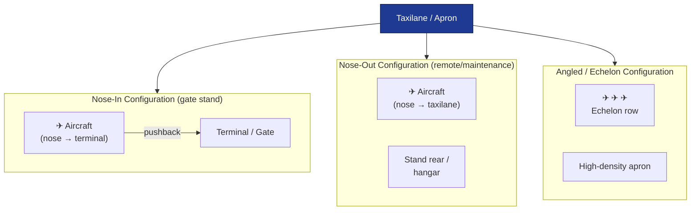

# ATLAS 010-019 · Section 01 · Subsection 014 · Subsubject 002 — Parking Configurations and Stand Types

## 1. Purpose

Defines the **approved parking configurations** and **stand type categories** applicable to [PROGRAMME-AIRCRAFT] aircraft variants. This subsubject specifies the geometric, operational, and equipment requirements for each stand type, including nose orientation, wing-tip clearance envelopes, apron markings, and visual guidance system (VGS) requirements.

> **Scope boundary:** This subsubject covers stand type selection and configuration. Chock placement and GPU connection procedures are in `014-004-Short-Term-Parking-and-Turnaround-Configurations.md`. Mooring and tie-down are in `014-003-Mooring-Tie-Down-and-Wind-Protection.md`.

## 2. Scope

### 2.1 Parking configuration types

[PROGRAMME-AIRCRAFT] aircraft may be parked in the following approved configurations:

| Configuration | Description | Typical application |
|---|---|---|
| **Nose-in (forward-in)** | Aircraft towed or taxied forward into the stand; nose points toward the terminal or structure | Gate stands with jet bridges; requires towbar pushback for departure |
| **Nose-out (forward-out)** | Aircraft positioned with nose pointing away from the terminal or structure | Remote stands, maintenance bays; allows self-powered taxi-out without pushback |
| **Angled / echelon** | Aircraft parked at an oblique angle to the taxilane; nose orientation may be in or out | High-density remote aprons; maximises stand density at reduced clearance |
| **Remote stand** | Aircraft parked on an open apron away from the terminal, accessed by ground transport | Overflow, wide-body remote parking, charter, or cargo positions |
| **Maintenance bay** | Aircraft positioned inside or at the threshold of a maintenance hangar | Scheduled maintenance; may require jacking — see `016_Lifting-Shoring-Jacking-Procedures/` |

### 2.2 Stand type requirements by variant

Stand suitability depends on aircraft geometry. Prior to assigning a stand, the following parameters must be verified against the applicable variant:

| Parameter | [PROGRAMME-AIRCRAFT] (Gen 1, tube-and-wing) | [PROGRAMME-AIRCRAFT] BWB-H2 (Gen 2) |
|---|---|---|
| Wing span | Per approved Type Certificate Data Sheet (TCDS) | Wider span; higher ICAO ARC category requirement |
| Fuselage length | Per TCDS | Longer; stand depth must be verified |
| Tail height | Per TCDS | Verify against hangar door clearance if bay parking |
| LH₂ stand requirement | Not applicable | Only LH₂-capable stands approved; see EPTA `460-469_` |
| Electric taxi | [PROGRAMME-AIRCRAFT] variants: power-on taxi-in procedure applies | Not applicable (Gen 2) |

**[All variants]** Wing-tip and tail clearance to adjacent aircraft, buildings, and equipment must meet the minima specified in ICAO Doc 9137[^icao9137] and the applicable Aerodrome Operating Procedures (AOP). No waiver to clearance minima is permitted without a formal apron risk assessment.

### 2.3 Stand markings and guidance systems

#### 2.3.1 Apron markings

All stands approved for [PROGRAMME-AIRCRAFT] operations shall carry the following markings painted or otherwise permanently affixed on the apron surface:

| Marking | Purpose |
|---|---|
| **Lead-in line** | Centreline guidance for nose-wheel from taxilane to stop position |
| **Stop bar / stop line** | Marks the approved nose-wheel stop position for each applicable aircraft type |
| **Stand box boundary** | Defines the allocated stand footprint; wing-tip clearance envelope |
| **Equipment restraint line** | Marks the inner boundary beyond which only approved GSE may operate during aircraft presence |
| **Chock position indicators** | Marks approved chock placement positions on main-gear fore and aft |

Markings shall conform to ICAO Annex 14 surface marking standards[^icao_ann14] and the aerodrome's own AOP.

#### 2.3.2 Visual Guidance Systems (VGS)

Where installed, a **Visual Docking Guidance System (VDGS)** or **Marshalling Aid** provides real-time nose-wheel position and speed data to the flight crew or tug driver during nose-in taxi/tow:

- **VDGS (Azimuth Guidance for Nose-in Stands — AGNIS or equivalent):** Displays lateral deviation and distance-to-stop. The ground crew supervisor confirms final stop; flight crew or tug driver applies brakes.
- **Marshaller-only:** At stands without VDGS, a qualified marshaller provides stop signals per ICAO Doc 9137 marshalling hand signals[^icao9137].
- **Wand/baton guidance:** Night or low-visibility parking; marshaller uses illuminated wands.

**Note:** VDGS data is advisory. The stop line marking on the apron is the primary authority for stop position. If VDGS and marking conflict, the ground crew supervisor shall halt the aircraft and resolve the discrepancy before final positioning.

### 2.4 Configuration selection procedure

The following sequence shall be followed when selecting a parking configuration for an arriving or repositioning [PROGRAMME-AIRCRAFT] aircraft:

1. **Confirm variant** — identify the [PROGRAMME-AIRCRAFT] variant and resolve ICAO ARC category and LH₂/electric-taxi requirements.
2. **Check stand availability** — confirm stand allocation from the Apron Management Unit (AMU) or equivalent.
3. **Verify stand dimensions** — confirm stand box width, depth, and clearance envelope accommodate the variant using the stand layout drawing or VDGS aircraft type library.
4. **Confirm markings and guidance** — verify that lead-in line, stop bar, and chock position indicators for the applicable aircraft type are legible and not obscured.
5. **Determine nose orientation** — nose-in for gate stands with jet bridge; nose-out or angled for remote/maintenance positions where self-powered taxi-out is required.
6. **Assign and brief crew** — the ground crew supervisor briefs the tug crew or flight crew on configuration, stop position, and any stand-specific restrictions.

## 3. Diagram — Stand Configuration Types

## 4. Footprint

| Metric | Value |
|---|---|
| Architecture | `ATLAS` — Aircraft Top Level Architecture Schema/System (controlled term) |
| Master range | `000–099` |
| Code range | `010-019` |
| Section | `01` — Manejo en Tierra & Servicio |
| Subsection | `014` — Parking |
| Subsubject | `002` — Parking Configurations and Stand Types |
| Scope level | Operational procedure (Level 2) — stand type and configuration |
| Conventional ATA ref | ATA chapter 10 (Parking and Mooring) |
| Primary Q-Division | Q-GROUND[^qdiv] |
| Support Q-Divisions | Q-MECHANICS, Q-INDUSTRY |
| ORB support | ORB-PMO, ORB-FIN |
| Governance class | `baseline`[^gov] |
| Folder path | `Q+ATLANTIDE/000-099_ATLAS/010-019_Manejo-en-Tierra-Servicio/014_Parking/` |
| Document | `014-002-Parking-Configurations-and-Stand-Types.md` (this file) |
| Parent subsection | [`README.md`](./README.md) · [`014-000-Parking-Overview.md`](./014-000-Parking-Overview.md) |
| Chock/GPU procedures | [`014-004-Short-Term-Parking-and-Turnaround-Configurations.md`](./014-004-Short-Term-Parking-and-Turnaround-Configurations.md) |
| Mooring procedures | [`014-003-Mooring-Tie-Down-and-Wind-Protection.md`](./014-003-Mooring-Tie-Down-and-Wind-Protection.md) |
| Jacking (maintenance bay) | [`../016_Lifting-Shoring-Jacking-Procedures/`](../016_Lifting-Shoring-Jacking-Procedures/) |
| LH₂ stand requirements | `Q+ATLANTIDE/400-499_EPTA/460-469_Propulsion-de-Hidrogeno-y-Celdas-de-Combustible/` |
| Parent architecture | [`../../README.md`](../../README.md) |
| Parent baseline | [`organization/Q+ATLANTIDE.md`](../../../../organization/Q+ATLANTIDE.md) |

## 5. References & Citations

[^baseline]: **Q+ATLANTIDE controlled baseline (v1.0.0)** — [`organization/Q+ATLANTIDE.md`](../../../../organization/Q+ATLANTIDE.md).

[^archtable]: **§3 — Architecture Table (parent)** — [`../../README.md` §3](../../README.md#3-architecture-table).

[^qdiv]: **Q-Division authority** — [`organization/Q-Divisions/`](../../../../organization/Q-Divisions/).

[^gov]: **Governance class** — `baseline` denotes documents under controlled change management within the Q+ATLANTIDE baseline.

[^ata2200]: **ATA iSpec 2200** — Information standards for aviation maintenance documentation.

[^ataspec100]: **ATA Spec 100** — Manufacturers' Technical Data standard. ATA chapter 10 covers stand types and parking configurations.

[^s1000d]: **S1000D Issue 6.0** — International specification for technical publications.

[^as9100d]: **AS9100D** — Quality Management Systems — Aviation, Space and Defense Organizations.

[^icao9137]: **ICAO Doc 9137 — Airport Services Manual** — Stand design, wing-tip clearance minima, marshalling signals, VDGS requirements, and apron marking standards.

[^icao_ann14]: **ICAO Annex 14 — Aerodromes (Volume I)** — Standards and Recommended Practices (SARPs) for aerodrome design including apron surface markings.

[^iata_igom]: **IATA Ground Operations Manual (IGOM)** — Stand type classifications, equipment positioning, and parking configuration procedures.

### Applicable industry standards

- ATA iSpec 2200 — Information standards for aviation maintenance[^ata2200]
- ATA Spec 100 — Manufacturers' Technical Data (ATA chapter 10)[^ataspec100]
- S1000D Issue 6.0 — International specification for technical publications[^s1000d]
- AS9100D — Quality Management Systems — Aviation, Space and Defense Organizations[^as9100d]
- ICAO Doc 9137 — Airport Services Manual[^icao9137]
- ICAO Annex 14 — Aerodromes (Volume I)[^icao_ann14]
- IATA Ground Operations Manual (IGOM)[^iata_igom]
