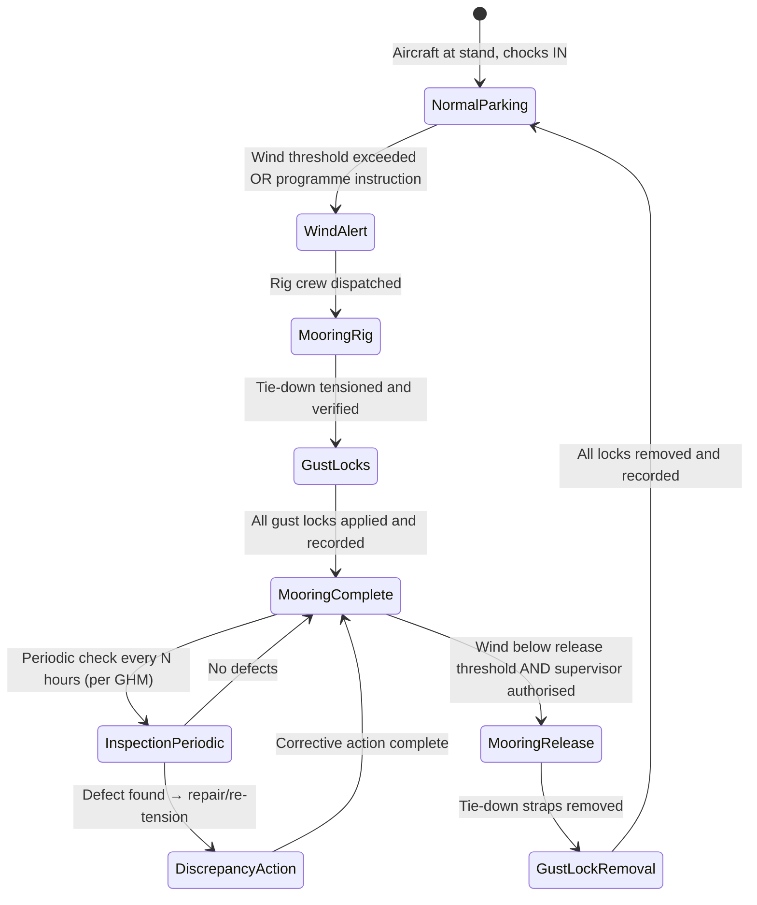

# ATLAS 010-019 · Section 01 · Subsection 014 · Subsubject 003 — Mooring, Tie-Down and Wind Protection

## 1. Purpose

Defines the **step-level procedures** for mooring (tie-down) AMPEL360 aircraft against wind loads, including approved tie-down point locations, rig configuration, gust lock application, and control surface lock-out. This subsubject covers the transition from normal parking to **wind-protection state** and the conditions that require it.

> **Scope boundary:** Conceptual definitions of mooring, gust locks, and storage states are in [`../../000-009_Informacion-General-y-Servicio/003_Operaciones-Basicas/003_Mooring-Storage-and-Return-to-Service.md`](../../000-009_Informacion-General-y-Servicio/003_Operaciones-Basicas/003_Mooring-Storage-and-Return-to-Service.md) (Level 1). This subsubject provides the **operational procedure** (Level 2). Long-term storage preservation (> 90 days) is in the AMM.

## 2. Scope

### 2.1 Conditions requiring mooring (wind-protection state)

Mooring shall be applied when **any one** of the following conditions is met:

| Trigger | Threshold |
|---|---|
| Forecast sustained surface wind speed | ≥ 40 kt (programme-specific; exact threshold in GHM) |
| Forecast wind gust speed | ≥ 55 kt (programme-specific; exact threshold in GHM) |
| Tropical storm, typhoon, or hurricane warning in effect at the airfield | Any category |
| Aircraft will be unattended on an exposed stand for > 12 h | With any wind forecast |
| Programme or airline Ground Operations Director instruction | Any conditions |

**[All variants]** If in doubt, apply the mooring rig. Removal of an unnecessary mooring rig costs time; failure to apply a required rig may result in ground damage.

### 2.2 Approved tie-down points

Tie-down forces shall be applied **only at approved hard-points** designed to accept rated tie-down loads. Approved locations for AMPEL360 variants are specified in the GHM and AMM Chapter 10. The following are the canonical tie-down point categories:

| Location | Point type | Notes |
|---|---|---|
| **Nose gear** | Nose-gear tow lug or dedicated tie-down fitting | Forward tie-down; limits aircraft rolling fore/aft |
| **Main gear (port and starboard)** | Axle fittings or dedicated wing-lower-surface tie-down brackets | Primary lateral and longitudinal restraint |
| **Rear fuselage / tail tie-down** | Dedicated tail-cone or empennage fitting (where provided by design) | Prevents tail lift under gust load; verify by variant |

**Warning:** Attaching tie-down straps to non-approved features (antennas, flap tracks, access panels, APU exhaust, winglets) constitutes an **airworthiness hazard** and is strictly prohibited.

### 2.3 Tie-down rig procedure

The following sequence applies to a **standard three-point mooring rig** (nose + two main gear). Supplement with tail tie-down when forecast gusts exceed the threshold in §2.1 plus 15 kt, or as specified in the GHM.

**Pre-rig checks:**
1. Confirm aircraft is at the approved stop position; parking brake SET; wheel chocks IN on all main gear.
2. Confirm parking brake is set and will remain set for the duration of mooring.
3. Inspect tie-down fittings and anchor points for damage, corrosion, or contamination. Report any discrepancy before proceeding.
4. Inspect tie-down straps/chains for approved type, load rating, and condition (no cuts, fraying, or corrosion on chain links). Use only approved tie-down equipment per GHM equipment list.

**Rig sequence (three-point mooring):**

| Step | Action |
|---|---|
| 1 | Attach port main-gear tie-down strap to approved main-gear fitting; connect opposite end to the nearest approved apron anchor ring. Apply moderate pre-tension. |
| 2 | Attach starboard main-gear tie-down strap symmetrically to port side. Apply moderate pre-tension. |
| 3 | Attach nose-gear tie-down strap to nose-gear tow lug or approved nose fitting; connect to forward anchor ring. Apply moderate pre-tension. |
| 4 | Tension all straps to the load specified in the GHM using a calibrated tensioner. Verify load indicator or torque value. |
| 5 | Inspect all attachments and anchor ring connections for security. |
| 6 | Attach tail tie-down if required (Step 4 variant, per conditions in §2.1). |
| 7 | Record mooring rig status on the Parking State Record (see `014-005-Parking-Records-Inspections-and-Return-to-Service.md`). |

### 2.4 Gust lock application

Gust locks shall be applied to **all moveable flight control surfaces** after mooring (or whenever the aircraft will be unattended for > 4 h with any wind in forecast):

| Surface | Gust lock type | Application |
|---|---|---|
| Ailerons | Internal cockpit column lock + external surface pin (if provided) | Lock column; insert pin at hinge or actuator |
| Elevators | Internal cockpit column lock | Lock elevator column position |
| Rudder | Internal cockpit rudder pedal lock | Lock pedal position; verify surface does not move |
| Flaps | Retract to 0° (clean); if hydraulics depressurised, insert flap ground lock pins | Insert flap lock pins per AMM if hydraulics are depressurised |
| Spoilers / speed brakes | Retract flush; insert spoiler ground lock pins if provided | Per AMM and GHM |

**Warning:** Flight with gust locks fitted is a **fatal hazard**. Gust lock removal is a mandatory pre-departure step and is a checklist item on the RTS inspection (see `005_`). All installed gust locks must be logged on the Parking State Record.

### 2.5 Control surface lock-out

**Control surface lock-out** (distinct from gust locks — see Level 1 orientation for conceptual distinction) is applied during maintenance when surfaces must be mechanically isolated to protect personnel or ensure a known surface position:

- Applies when hydraulic systems will be pressurised during maintenance with personnel near surfaces.
- Lock-out devices are approved tooling items (GHM and AMM-listed part numbers).
- Removal of lock-out devices is a mandatory task-card step; verify removal before aircraft return to service.

### 2.6 Mooring release procedure

Before removing the mooring rig, confirm:

1. Wind speed has fallen below the release threshold (per GHM) and no further weather warning is in effect.
2. Ground supervisor has authorised mooring release.
3. Pre-departure inspection has been completed (see `014-005-Parking-Records-Inspections-and-Return-to-Service.md`).
4. Remove tie-down straps in reverse order of attachment (tail → nose → main gear).
5. Inspect tie-down fittings for damage after removal.
6. Remove all gust locks; verify and record removal on the Parking State Record.
7. Stow tie-down equipment in the approved GSE storage location.

## 3. Diagram — Mooring State Transitions

## 4. Footprint

| Metric | Value |
|---|---|
| Architecture | `ATLAS` — Aircraft Top Level Architecture Schema/System (controlled term) |
| Master range | `000–099` |
| Code range | `010-019` |
| Section | `01` — Manejo en Tierra & Servicio |
| Subsection | `014` — Parking |
| Subsubject | `003` — Mooring, Tie-Down and Wind Protection |
| Scope level | Operational procedure (Level 2) — mooring and wind-protection procedures |
| Conventional ATA ref | ATA chapter 10 (Parking and Mooring) |
| Primary Q-Division | Q-GROUND[^qdiv] |
| Support Q-Divisions | Q-MECHANICS, Q-INDUSTRY |
| ORB support | ORB-PMO, ORB-FIN |
| Governance class | `baseline`[^gov] |
| Folder path | `Q+ATLANTIDE/000-099_ATLAS/010-019_Manejo-en-Tierra-Servicio/014_Parking/` |
| Document | `014-003-Mooring-Tie-Down-and-Wind-Protection.md` (this file) |
| Parent subsection | [`README.md`](./README.md) · [`014-000-Parking-Overview.md`](./014-000-Parking-Overview.md) |
| Orientation layer (mooring) | [`../../000-009_Informacion-General-y-Servicio/003_Operaciones-Basicas/003_Mooring-Storage-and-Return-to-Service.md`](../../000-009_Informacion-General-y-Servicio/003_Operaciones-Basicas/003_Mooring-Storage-and-Return-to-Service.md) |
| Records and RTS | [`014-005-Parking-Records-Inspections-and-Return-to-Service.md`](./014-005-Parking-Records-Inspections-and-Return-to-Service.md) |
| Long-term storage | AMM Chapter 10 / Preservation Manual |
| Parent architecture | [`../../README.md`](../../README.md) |
| Parent baseline | [`organization/Q+ATLANTIDE.md`](../../../../organization/Q+ATLANTIDE.md) |

## 5. References & Citations

[^baseline]: **Q+ATLANTIDE controlled baseline (v1.0.0)** — [`organization/Q+ATLANTIDE.md`](../../../../organization/Q+ATLANTIDE.md).

[^archtable]: **§3 — Architecture Table (parent)** — [`../../README.md` §3](../../README.md#3-architecture-table).

[^qdiv]: **Q-Division authority** — [`organization/Q-Divisions/`](../../../../organization/Q-Divisions/).

[^gov]: **Governance class** — `baseline` denotes documents under controlled change management within the Q+ATLANTIDE baseline.

[^ata2200]: **ATA iSpec 2200** — Information standards for aviation maintenance documentation.

[^ataspec100]: **ATA Spec 100** — Manufacturers' Technical Data standard. ATA chapter 10 covers mooring and tie-down procedures.

[^s1000d]: **S1000D Issue 6.0** — International specification for technical publications.

[^as9100d]: **AS9100D** — Quality Management Systems — Aviation, Space and Defense Organizations.

[^icao9137]: **ICAO Doc 9137 — Airport Services Manual** — Mooring procedures, tie-down load requirements, and wind-protection thresholds for parked aircraft.

[^iata_igom]: **IATA Ground Operations Manual (IGOM)** — Gust lock application requirements and mooring standards for ground operations.

### Applicable industry standards

- ATA iSpec 2200 — Information standards for aviation maintenance[^ata2200]
- ATA Spec 100 — Manufacturers' Technical Data (ATA chapter 10)[^ataspec100]
- S1000D Issue 6.0 — International specification for technical publications[^s1000d]
- AS9100D — Quality Management Systems — Aviation, Space and Defense Organizations[^as9100d]
- ICAO Doc 9137 — Airport Services Manual[^icao9137]
- IATA Ground Operations Manual (IGOM)[^iata_igom]
