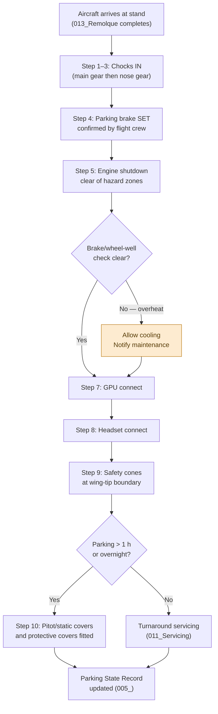

# ATLAS 010-019 · Section 01 · Subsection 014 · Subsubject 004 — Short-Term Parking and Turnaround Configurations

## 1. Purpose

Defines the **step-level procedures** for short-term parking (turnaround and overnight configurations) of AMPEL360 aircraft at gate and remote stands. This subsubject covers chock placement, ground power unit (GPU) connection and disconnection, pitot and static cover fitting, equipment safety-perimeter establishment, and the approved sequence for transitioning the aircraft from an in-flight configuration to a parked-and-secured state.

> **Scope boundary:** This subsubject covers normal short-term and overnight parking. Mooring and wind-protection procedures are in `014-003-Mooring-Tie-Down-and-Wind-Protection.md`. Records and return-to-service inspection are in `014-005-Parking-Records-Inspections-and-Return-to-Service.md`. GSE vehicle positioning is in `015_GSE/`.

## 2. Scope

### 2.1 Short-term parking state definitions

| Parking state | Duration | Key configuration |
|---|---|---|
| **Turnaround parking** | < 4 h (normal between-flight interval) | Chocks IN, GPU connected, all servicing in progress |
| **Overnight parking** | 4 h – 3 days | Chocks IN, GPU optional, pitot/static covers fitted, engine covers optional per weather |
| **Extended short-term** | 3 – 30 days | Chocks IN, full covers fitted, mooring rig if wind exposure; transitions to AMM short-term storage programme at 30 days |

### 2.2 Arrival-at-stand sequence

On aircraft arrival at the assigned stand, the following sequence shall be completed in order by the ground crew:

| Step | Action | Notes |
|---|---|---|
| 1 | **Stop confirmation** — confirm nose wheel at stop bar (VDGS zero or marshaller STOP signal); verify aircraft stationary | Do not approach aircraft until engines are at ground idle or shutdown signal given |
| 2 | **Chocks IN (main gear)** — insert chocks fore and aft of both main-gear wheel assemblies | Use approved chock size for variant; see §2.3 |
| 3 | **Chocks IN (nose gear)** — insert chocks fore and aft of nose-gear wheel assembly | Only after main-gear chocks are secure |
| 4 | **Parking brake confirmation** — flight crew confirms parking brake SET; ground crew receives thumbs-up signal through flight deck window or via headset | Parking brake provides redundancy with chocks; chocks are primary restraint after engine shutdown |
| 5 | **Engine shutdown** — flight crew shuts down engines per normal shutdown checklist; ground crew monitors for safe engine wind-down | Stand clear of exhaust and intake hazard zones until engines stop |
| 6 | **Wheel-well and brake cooling check** — confirm no smoke, hydraulic fluid spray, or abnormal heat from wheel wells | If brake overheat suspected: do not apply chocks close to overheated brakes; allow cooling before approaching |
| 7 | **GPU connect** — connect ground power unit to aircraft external power receptacle per §2.4 | Only after engines are fully shut down and all inlet/exhaust hazards are clear |
| 8 | **Headset connect** — connect headset to intercom at aircraft nose station for aircraft/crew communication | Enables communication for pushback preparation and servicing coordination |
| 9 | **Safety perimeter establish** — position wing-walker safety cones at wing-tip clearance boundary | See §2.5 for cone placement |
| 10 | **Pitot/static covers fit** — fit approved pitot and static covers if aircraft will remain parked > 1 h or overnight | See §2.6 |

### 2.3 Chock placement

Chocks shall be placed at **approved positions** as follows:

| Gear position | Chock position | Chock type |
|---|---|---|
| Main gear (port) | Fore and aft of the main-gear axle centre, in contact with the tyre | Approved rubber or polyurethane chock, size per GHM for the variant |
| Main gear (starboard) | Same as port — symmetric | Same |
| Nose gear | Fore and aft of the nose-gear wheel assembly | Smaller chock size — nose gear only — per GHM |

**[All variants]** Never place chocks at an angle or under the tyre sidewall. Chocks must make full flat contact with the apron surface and the tyre tread face. Damaged or deformed chocks shall be removed from service.

### 2.4 Ground Power Unit (GPU) connection and disconnection

#### 2.4.1 GPU connection

1. Position the GPU or fixed-ground-power (FGP) cart at the approved equipment-restraint line (see `014-001-Parking-Scope-and-Boundaries.md` §2.2). Do not approach the aircraft with the GPU until engines are shutdown and inlet/exhaust hazards are clear.
2. Verify GPU output voltage and frequency match the aircraft external power specification (AMPEL360 standard: 115 V AC / 400 Hz, or 28 V DC for ground support — per GHM; verify by variant).
3. Inspect external power receptacle on the aircraft for damage or contamination.
4. Insert GPU connector; confirm connector locked.
5. Power-on GPU; verify EXTERNAL POWER AVAILABLE light illuminates on the aircraft flight deck (if flight crew present) or at the ground power panel.
6. Flight crew or ground engineer accepts external power per normal procedure.

#### 2.4.2 GPU disconnection (pre-departure)

1. Flight crew or ground engineer signals GPU disconnect readiness.
2. Ground crew confirms aircraft APU or engines are supplying electrical power (or that the aircraft is in a configured-off state).
3. Isolate GPU output before disconnecting connector (avoid arc on live connector).
4. Remove connector and stow GPU cable; confirm receptacle door is closed and latched.
5. Move GPU clear of the stand box before pushback begins.

### 2.5 Safety-perimeter cones and equipment positioning

**[All variants]** Once the aircraft is chocked and GPU-connected, establish the safety perimeter:

- Place **wing-tip cones** at both wing tips at the wing-tip clearance boundary (minimum distance per ICAO Doc 9137[^icao9137] and GHM).
- No uncontrolled vehicle or ground equipment may cross the equipment-restraint line while the aircraft is occupied or fuelled.
- Authorised GSE (GPU, fueller, catering truck, cleaning vehicle) may enter the stand box only during their specific service window and only at the designated equipment approach angle specified in the stand layout drawing.
- The **ground crew supervisor** maintains situational awareness of all GSE movements within the stand box.

### 2.6 Pitot, static, and protective covers

Covers protect sensors, inlets, and systems during parking. The following cover set shall be applied for overnight parking or extended short-term parking:

| Cover / Protector | Application condition |
|---|---|
| Pitot tube covers (all probes) | Always — parking > 1 h |
| Static port covers | Overnight and extended parking |
| Angle-of-attack (AoA) sensor covers | Overnight and extended parking |
| Engine intake covers / blanks | Overnight in areas with bird or FOD risk; extended parking |
| Engine exhaust plugs | Extended parking (> 3 days) |
| Landing gear and wheel-well covers | Extended parking in dusty or contaminated environments |

**Warning:** All covers are fitted with red **REMOVE BEFORE FLIGHT** streamers. Every cover must be accounted for on the Parking State Record and verified removed during the pre-departure walk-around inspection (see `005_`).

### 2.7 Overnight parking configuration checklist

The following represents the minimum parking configuration for an AMPEL360 aircraft overnight:

- [x] Wheel chocks — main gear (port and starboard, fore and aft) and nose gear — IN
- [x] Parking brake — SET
- [x] External power — connected or GPU available at stand
- [x] Engine intake covers / blanks — fitted (bird/FOD risk environment)
- [x] Pitot and static covers — fitted and logged
- [x] Safety-perimeter cones — wing tips marked
- [x] All doors — closed and latched (or left open per servicing programme with posted guard)
- [x] Mooring rig — fitted if wind exposure condition met (see `003_`)
- [x] Parking State Record — completed and filed

## 3. Diagram — Turnaround Parking Sequence

## 4. Footprint

| Metric | Value |
|---|---|
| Architecture | `ATLAS` — Aircraft Top Level Architecture Schema/System (controlled term) |
| Master range | `000–099` |
| Code range | `010-019` |
| Section | `01` — Manejo en Tierra & Servicio |
| Subsection | `014` — Parking |
| Subsubject | `004` — Short-Term Parking and Turnaround Configurations |
| Scope level | Operational procedure (Level 2) — turnaround and overnight parking |
| Conventional ATA ref | ATA chapter 10 (Parking and Mooring) |
| Primary Q-Division | Q-GROUND[^qdiv] |
| Support Q-Divisions | Q-MECHANICS, Q-INDUSTRY |
| ORB support | ORB-PMO, ORB-FIN |
| Governance class | `baseline`[^gov] |
| Folder path | `Q+ATLANTIDE/000-099_ATLAS/010-019_Manejo-en-Tierra-Servicio/014_Parking/` |
| Document | `014-004-Short-Term-Parking-and-Turnaround-Configurations.md` (this file) |
| Parent subsection | [`README.md`](./README.md) · [`014-000-Parking-Overview.md`](./014-000-Parking-Overview.md) |
| Mooring procedures | [`014-003-Mooring-Tie-Down-and-Wind-Protection.md`](./014-003-Mooring-Tie-Down-and-Wind-Protection.md) |
| Records and RTS | [`014-005-Parking-Records-Inspections-and-Return-to-Service.md`](./014-005-Parking-Records-Inspections-and-Return-to-Service.md) |
| Servicing (fluids/gases) | [`../011_Servicing/`](../011_Servicing/) |
| GSE positioning | [`../015_GSE/`](../015_GSE/) |
| Parent architecture | [`../../README.md`](../../README.md) |
| Parent baseline | [`organization/Q+ATLANTIDE.md`](../../../../organization/Q+ATLANTIDE.md) |

## 5. References & Citations

[^baseline]: **Q+ATLANTIDE controlled baseline (v1.0.0)** — [`organization/Q+ATLANTIDE.md`](../../../../organization/Q+ATLANTIDE.md).

[^archtable]: **§3 — Architecture Table (parent)** — [`../../README.md` §3](../../README.md#3-architecture-table).

[^qdiv]: **Q-Division authority** — [`organization/Q-Divisions/`](../../../../organization/Q-Divisions/).

[^gov]: **Governance class** — `baseline` denotes documents under controlled change management within the Q+ATLANTIDE baseline.

[^ata2200]: **ATA iSpec 2200** — Information standards for aviation maintenance documentation.

[^ataspec100]: **ATA Spec 100** — Manufacturers' Technical Data standard. ATA chapter 10 covers short-term parking, chock placement, and turnaround configurations.

[^s1000d]: **S1000D Issue 6.0** — International specification for technical publications.

[^as9100d]: **AS9100D** — Quality Management Systems — Aviation, Space and Defense Organizations.

[^icao9137]: **ICAO Doc 9137 — Airport Services Manual** — Chock standards, GPU safety, safety-perimeter cone placement, and apron equipment management.

[^iata_igom]: **IATA Ground Operations Manual (IGOM)** — Turnaround procedure standards, chock placement, GPU connect/disconnect, and pitot cover requirements.

### Applicable industry standards

- ATA iSpec 2200 — Information standards for aviation maintenance[^ata2200]
- ATA Spec 100 — Manufacturers' Technical Data (ATA chapter 10)[^ataspec100]
- S1000D Issue 6.0 — International specification for technical publications[^s1000d]
- AS9100D — Quality Management Systems — Aviation, Space and Defense Organizations[^as9100d]
- ICAO Doc 9137 — Airport Services Manual[^icao9137]
- IATA Ground Operations Manual (IGOM)[^iata_igom]
