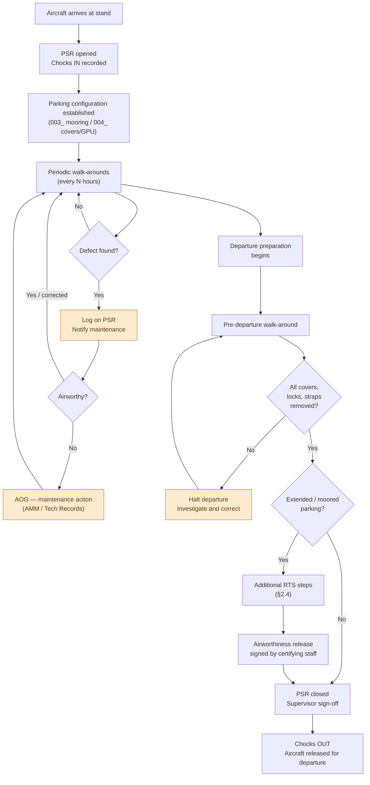

# ATLAS 010-019 · Section 01 · Subsection 014 · Subsubject 005 — Parking Records, Inspections and Return to Service

## 1. Purpose

Defines the **record-keeping requirements**, **periodic inspection procedures**, and **return-to-service (RTS) checklist** for [PROGRAMME-AIRCRAFT] aircraft transitioning from any parking state back to an airworthy operational status. This subsubject closes the parking loop: it follows the securing procedures in `003_` and `004_` and governs the documented release of the aircraft for the next departure.

> **Scope boundary:** Conceptual RTS definitions (storage types, inspection phases, documentation sign-off) are in [`../../000-009_Informacion-General-y-Servicio/003_Operaciones-Basicas/003_Mooring-Storage-and-Return-to-Service.md`](../../000-009_Informacion-General-y-Servicio/003_Operaciones-Basicas/003_Mooring-Storage-and-Return-to-Service.md) (Level 1). This subsubject provides the **operational procedure** (Level 2) for turnaround, overnight, and extended parking RTS. Long-term storage RTS (> 90 days) is governed by the AMM.

## 2. Scope

### 2.1 Parking State Record

The **Parking State Record** (PSR) is the primary document for tracking the parking configuration of an [PROGRAMME-AIRCRAFT] aircraft during any parking event. A PSR shall be opened at the beginning of each parking event and closed when the aircraft departs the stand.

Minimum PSR fields:

| Field | Content |
|---|---|
| Aircraft registration | [PROGRAMME-AIRCRAFT] variant and registration (tail number) |
| Stand identifier | Aerodrome and stand number (e.g., `LPT / C12`) |
| Parking state | Turnaround / Overnight / Extended / Mooring-rig active |
| Date/time in | UTC date and time chocks were inserted |
| Date/time out | UTC date and time chocks were removed for departure |
| Chocks fitted | Port main / Starboard main / Nose — confirmed by initials |
| Mooring rig | YES / NO — if YES, tie-down point list and load confirmation |
| Gust locks fitted | List of all gust locks applied (surface, type, location) |
| Covers fitted | List of all covers/blanks applied (with REMOVE BEFORE FLIGHT streamers confirmed) |
| Periodic checks | Date/time and initials of each periodic walk-around during the parking event |
| Discrepancies noted | Description of any defects, damage, or deviations found; corrective action reference |
| RTS inspection completed by | Name, authorisation level, signature/stamp |
| Aircraft released for departure | Date/time, authorised signatory |

PSRs shall be retained in the programme's technical records system per the document retention requirements of the applicable quality management framework[^as9100d].

### 2.2 Periodic inspections during parking

For any parking event where the aircraft will be unattended, a **periodic walk-around inspection** shall be conducted at intervals not exceeding:

| Parking state | Inspection interval |
|---|---|
| Turnaround (< 4 h) | Once before departure (pre-departure walk-around) |
| Overnight (4 h – 3 days) | Every 12 h or at each crew handover, whichever is sooner |
| Extended short-term (3 – 30 days) | Every 24 h minimum |
| Mooring rig active | Every 8 h or as directed by ground supervisor during active weather |

**Periodic walk-around scope:**

1. Chocks — all chocks in position and in contact with tyres.
2. Mooring straps/chains (if fitted) — no loosening, fraying, or anchor-ring movement.
3. Covers — all covers present; REMOVE BEFORE FLIGHT streamers visible.
4. Aircraft exterior — no new visible damage, fluid leaks, bird strikes, or FOD accumulation.
5. Gust locks (if fitted) — surface lock-out pins still in place; cockpit indicators confirm.
6. Stand clearance — no unauthorised vehicles or equipment inside the equipment-restraint line.
7. Log time, initials, and findings on the PSR.

### 2.3 Pre-departure walk-around inspection

Before authorising departure preparations (removal of chocks, pushback connection), a **pre-departure walk-around** shall be completed. This inspection shall be carried out by a qualified ground crew member and signed on the PSR.

| Phase | Inspection items |
|---|---|
| **1 — Covers and streamers** | Remove and account for ALL covers (pitot, static, AoA, engine inlet, exhaust, gear covers). Verify every REMOVE BEFORE FLIGHT streamer is removed and all covers stowed. Zero tolerance: if any cover is unaccounted for, halt departure and investigate. |
| **2 — Tie-down and mooring** | Confirm all tie-down straps/chains removed and stowed. Verify tie-down fittings for damage. |
| **3 — Gust locks** | Confirm all gust locks removed (internal cockpit checks + external surface pins). Log removal on PSR. |
| **4 — Chock count** | Remove chocks from nose gear first; then main gear. Count chocks out equals count in. |
| **5 — Exterior** | Inspect visible fuselage, wings, empennage, and landing gear for damage, leaks, or contamination. |
| **6 — Engine inlets/exhausts** | Visual inspection of all inlets and exhausts for FOD, bird ingestion, or ice accumulation. |
| **7 — Wheel and brake condition** | Tyre inflation (visual — flat spot or underinflation), brake wear indicators (if visible), wheel-well condition (no fluid seepage, no debris). |
| **8 — Doors and panels** | All access panels and doors closed and latched. |
| **9 — Ground equipment clear** | All GSE, cones, and ground equipment clear of the stand box. GPU disconnected and stowed (see `004_§2.4.2`). |

**Warning:** Departure shall not proceed until the pre-departure walk-around is complete, signed on the PSR, and the aircraft is released by the authorised ground crew supervisor.

### 2.4 Return to Service (RTS) — transition from extended or moored parking

For aircraft returning to service from **extended short-term parking** (3 – 30 days) or after a **mooring event**, the RTS procedure extends the pre-departure walk-around with the following additional steps:

| Additional RTS step | Action |
|---|---|
| **Fluid levels** | Check fuel quantity (dip or gauges), engine oil level, hydraulic fluid reservoir level, and potable water (if applicable); replenish per `011_Servicing/` if below limits |
| **Battery charge** | Verify main battery condition (charge and voltage); replace or charge if below serviceable limits per AMM |
| **Landing gear extension/retraction** | Verify gear pins removed (if inserted for maintenance); perform visual check of gear downlocks |
| **Flight control full travel** | With hydraulics pressurised, verify full-range free movement of all primary flight controls; confirm gust lock clear by surface response |
| **Systems BITE** | Power up avionics and run Built-In Test Equipment (BITE) cycle; verify no latched faults from storage period |
| **Navigation database** | Verify navigation database currency (expiry date not exceeded) |
| **Logbook and tech record review** | Confirm no open deferred defects from previous parking period that affect the departure; obtain maintenance release if required |
| **Airworthiness release** | Authorised certifying staff signs maintenance release or aircraft technical log before first flight after extended parking |

### 2.5 Discrepancy reporting

Any defect, damage, or deviation found during a periodic inspection or pre-departure walk-around shall be:

1. **Recorded** on the PSR with a description, location, and date/time of discovery.
2. **Assessed** by the ground crew supervisor for airworthiness impact.
3. **Referred** to maintenance if any doubt exists about airworthiness.
4. **Closed** with a corrective action reference before aircraft departure is authorised.

No aircraft shall depart with an open, unassessed discrepancy from the parking record.

## 3. Diagram — Parking Record and RTS Lifecycle

## 4. Footprint

| Metric | Value |
|---|---|
| Architecture | `ATLAS` — Aircraft Top Level Architecture Schema/System (controlled term) |
| Master range | `000–099` |
| Code range | `010-019` |
| Section | `01` — Manejo en Tierra & Servicio |
| Subsection | `014` — Parking |
| Subsubject | `005` — Parking Records, Inspections and Return to Service |
| Scope level | Operational procedure (Level 2) — records, inspections, RTS |
| Conventional ATA ref | ATA chapter 10 (Parking and Mooring) |
| Primary Q-Division | Q-GROUND[^qdiv] |
| Support Q-Divisions | Q-MECHANICS, Q-INDUSTRY |
| ORB support | ORB-PMO, ORB-FIN |
| Governance class | `baseline`[^gov] |
| Folder path | `Q+ATLANTIDE/000-099_ATLAS/010-019_Manejo-en-Tierra-Servicio/014_Parking/` |
| Document | `014-005-Parking-Records-Inspections-and-Return-to-Service.md` (this file) |
| Parent subsection | [`README.md`](./README.md) · [`014-000-Parking-Overview.md`](./014-000-Parking-Overview.md) |
| Mooring/gust-lock source | [`014-003-Mooring-Tie-Down-and-Wind-Protection.md`](./014-003-Mooring-Tie-Down-and-Wind-Protection.md) |
| Covers/GPU source | [`014-004-Short-Term-Parking-and-Turnaround-Configurations.md`](./014-004-Short-Term-Parking-and-Turnaround-Configurations.md) |
| Servicing (fluids at RTS) | [`../011_Servicing/`](../011_Servicing/) |
| Long-term storage RTS | AMM Chapter 10 / Preservation Manual |
| Orientation layer (RTS) | [`../../000-009_Informacion-General-y-Servicio/003_Operaciones-Basicas/003_Mooring-Storage-and-Return-to-Service.md`](../../000-009_Informacion-General-y-Servicio/003_Operaciones-Basicas/003_Mooring-Storage-and-Return-to-Service.md) |
| Parent architecture | [`../../README.md`](../../README.md) |
| Parent baseline | [`organization/Q+ATLANTIDE.md`](../../../../organization/Q+ATLANTIDE.md) |

## 5. References & Citations

[^baseline]: **Q+ATLANTIDE controlled baseline (v1.0.0)** — [`organization/Q+ATLANTIDE.md`](../../../../organization/Q+ATLANTIDE.md).

[^archtable]: **§3 — Architecture Table (parent)** — [`../../README.md` §3](../../README.md#3-architecture-table).

[^qdiv]: **Q-Division authority** — [`organization/Q-Divisions/`](../../../../organization/Q-Divisions/).

[^gov]: **Governance class** — `baseline` denotes documents under controlled change management within the Q+ATLANTIDE baseline.

[^ata2200]: **ATA iSpec 2200** — Information standards for aviation maintenance documentation. Governs maintenance task card structure and tech-record requirements applicable to parking records.

[^ataspec100]: **ATA Spec 100** — Manufacturers' Technical Data standard. ATA chapter 10 covers RTS inspection requirements for parked and moored aircraft.

[^s1000d]: **S1000D Issue 6.0** — International specification for technical publications.

[^as9100d]: **AS9100D** — Quality Management Systems — Aviation, Space and Defense Organizations. Defines technical records retention and quality-management requirements for parking records and airworthiness releases.

[^icao9137]: **ICAO Doc 9137 — Airport Services Manual** — Walk-around inspection standards, discrepancy reporting procedures, and airworthiness release requirements for ground-handled aircraft.

[^iata_igom]: **IATA Ground Operations Manual (IGOM)** — Pre-departure inspection standards, cover-removal accountability, and PSR record requirements.

### Applicable industry standards

- ATA iSpec 2200 — Information standards for aviation maintenance[^ata2200]
- ATA Spec 100 — Manufacturers' Technical Data (ATA chapter 10)[^ataspec100]
- S1000D Issue 6.0 — International specification for technical publications[^s1000d]
- AS9100D — Quality Management Systems — Aviation, Space and Defense Organizations[^as9100d]
- ICAO Doc 9137 — Airport Services Manual[^icao9137]
- IATA Ground Operations Manual (IGOM)[^iata_igom]
