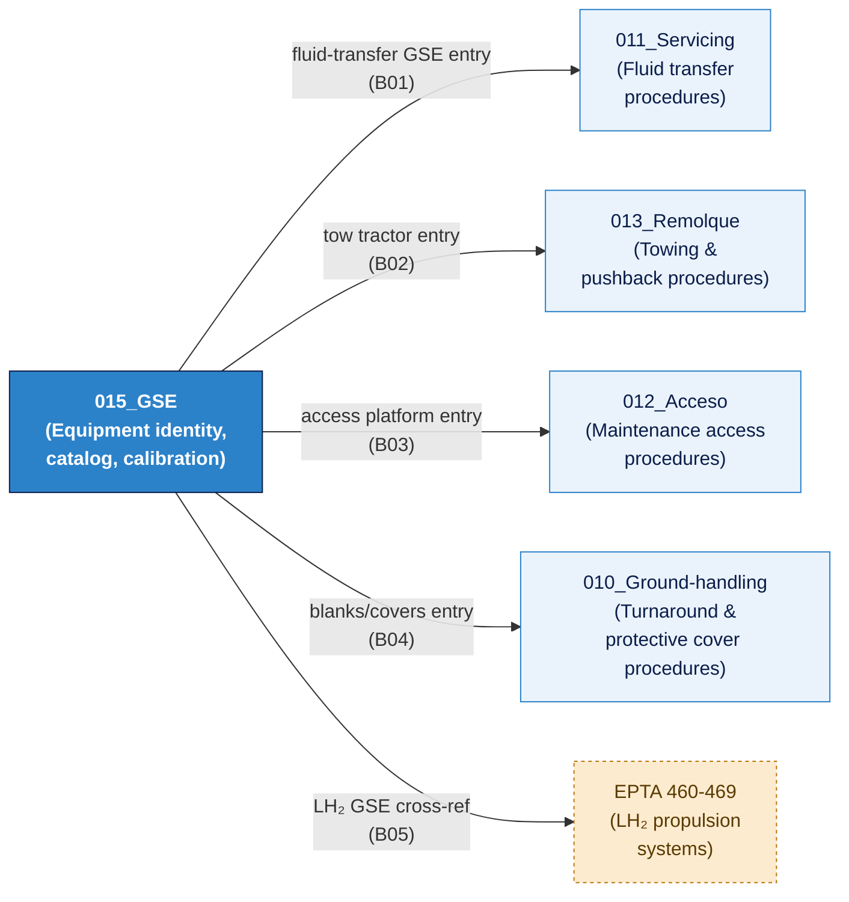

# ATLAS 010-019 · Section 01 · Subsection 015 · Subsubject 001 — Scope and GSE Boundaries

## 1. Purpose

Defines the precise **taxonomic scope** of Ground Support Equipment (GSE) within the ATLAS `015_` subsection and establishes the **boundary rules** that distinguish GSE from adjacent subjects in the ATLAS `010-019` Code range and across the Q+ATLANTIDE baseline[^baseline]. These rules are binding for all contributors and must be applied when placing new equipment entries, procedures, or data modules within the taxonomy.

## 2. Scope

### 2.1 Definition of GSE within ATLAS

For the purposes of the ATLAS `015_` subsection, **Ground Support Equipment (GSE)** is defined as:

> *Any specialised vehicle, apparatus, tool, or supporting system — other than the aircraft itself — that is used to service, maintain, test, move, power, or protect an aircraft or aircraft system while the aircraft is on the ground.*

This definition encompasses:

- **Mobile equipment:** Self-propelled and towed vehicles used for aircraft operations on the ramp (ground power units, air start units, cargo loaders, passenger boarding equipment, maintenance platforms, tow tractors, aircraft cleaning rigs).
- **Fixed/semi-fixed equipment:** Equipment installed at a stand or hangar position that interfaces with the aircraft (fixed ground power bridges, preconditioned air (PCA) connections, water and waste service points).
- **Portable equipment:** Hand-carried or manually positioned tools and apparatus that are managed as controlled assets (torque wrenches, calibrated pressure gauges, borescopes, jacking adapters).
- **Safety equipment:** Equipment used to protect the aircraft, personnel, and infrastructure during ground operations (fire extinguisher carts, spill response kits, engine intake and exhaust covers/blanks, pitot covers, control surface locks).

### 2.2 Equipment explicitly within scope

| GSE Category | Examples | Covered in |
|---|---|---|
| Aircraft power supply | Ground Power Unit (GPU), Power Distribution Unit (PDU) | `003_` (classification), `004_` (interface) |
| Pneumatic start | Air Start Unit (ASU), High-Pressure Air Cart | `003_`, `004_` |
| Passenger/crew boarding | Passenger boarding stairs (motorised and manual), aerobridge (fixed) | `003_`, `002_` |
| Cargo and baggage handling | Belt loaders, cargo loaders (Hi-Lo), container dollies, baggage tractors | `003_`, `002_` |
| Aircraft cleaning | Lavatory service vehicles, potable water service vehicles, cabin cleaning equipment | `003_`, `002_` |
| Maintenance access | Mobile maintenance platforms, docking systems, man-lifts | `003_`, `002_` (cross-ref `012_Acceso/`) |
| Aircraft protection | Engine blanks, pitot covers, control surface locks, wheel chocks, safety cones | `003_`, `002_` |
| Tow and push equipment | Conventional tow tractors, towbarless tractors, towbars | `003_`, `002_` (cross-ref `013_Remolque/`) |
| Fluid replenishment rigs | Hydraulic fluid carts, oil replenishment units, nitrogen carts, oxygen carts | `003_`, `004_` (cross-ref `011_Servicing/`) |
| LH₂-specific GSE | Cryogenic tanker, boil-off capture unit, electrostatic grounding kits (Gen 2 only) | `003_`, `002_`, `004_` (cross-ref EPTA 460-469) |

### 2.3 Equipment explicitly out of scope

The following items are **not** classified as GSE within `015_` and are managed under the stated alternative subsection or code range:

| Item | Reason out of scope | Governed by |
|---|---|---|
| Fuelling hoses and nozzles (aircraft-side) | Classified as aircraft system components (fuel system) | ATLAS systems chapters |
| Engine run-up test equipment (ETPS) | Propulsion test; not a ramp service function | EPTA code ranges |
| Aircraft ground test equipment (ATE) | Avionics/systems test equipment; specialised domain | Applicable EPTA / systems chapter |
| Hangar building infrastructure (fixed utilities) | Airport/facility infrastructure; not aircraft-assigned GSE | Airport facility management |
| Calibration laboratory equipment | Fixed lab assets; managed by quality/metrology | AS9100D quality system records |

### 2.4 Boundary rules — operative definitions

**Rule GSE-B01 — Fluid-transfer vs. equipment identity:**
When a GSE item performs fluid transfer (e.g., a hydraulic replenishment cart), the **servicing procedure** (quantities, connection sequence, contamination checks) belongs in `011_Servicing/`. The **equipment identity, catalogue entry, compatibility rating, and calibration record** for that item belongs in `015_`. The boundary is: *operation* → `011_`; *equipment* → `015_`.

**Rule GSE-B02 — Tow tractor procedural split:**
Tow tractor and towbar **operating procedures** (bypass-pin insertion, steering limits, tow speed, abort criteria) belong in `013_Remolque/`. The tow tractor's **GSE catalogue entry, asset record, inspection schedule, and compatibility with AMPEL360 nose-gear attachment points** belongs in `015_`.

**Rule GSE-B03 — Maintenance access platform split:**
Mobile maintenance platforms and docking systems appear in both `012_Acceso/` (access procedure context) and `015_GSE/` (equipment identity context). The normative source for the **access procedure** is `012_`; the normative source for the **equipment inspection and calibration** is `015_`.

**Rule GSE-B04 — Aircraft blanks and covers:**
Engine intake blanks, exhaust covers, pitot tube covers, and static vent covers are classified as GSE protective equipment. They are catalogued in `015_` (compatibility by aircraft type, storage, inspection). The **procedure for fitting/removing** blanks prior to departure or during maintenance is in `010_Ground-handling/`.

**Rule GSE-B05 — Variant applicability flag:**
Any GSE item that applies exclusively to AMPEL360 Gen 2 (LH₂) or hybrid variants shall be flagged `variant: Gen2-LH2` in the catalog entry (`002_`) and cross-referenced to EPTA `460-469_`. Standard (Jet-A/SAF) GSE items that are not variant-specific shall be flagged `variant: All`.

## 3. Diagram — GSE Boundary Map

*Arrows show cross-references from `015_GSE/` boundary rules to adjacent subsections. Equipment identity always resolves to `015_`; operational procedures resolve to the adjacent subsection.*

## 4. Footprint

| Metric | Value |
|---|---|
| Architecture | `ATLAS` — Aircraft Top Level Architecture Schema/System (controlled term) |
| Master range | `000–099` |
| Code range | `010-019` |
| Section | `01` — Manejo en Tierra & Servicio |
| Subsection | `015` — Ground Support Equipment |
| Subsubject | `001` — Scope and GSE Boundaries |
| Primary Q-Division | Q-GROUND[^qdiv] |
| Support Q-Divisions | Q-MECHANICS, Q-INDUSTRY |
| ORB support | ORB-PMO, ORB-FIN |
| Governance class | `baseline`[^gov] |
| Folder path | `Q+ATLANTIDE/000-099_ATLAS/010-019_Manejo-en-Tierra-Servicio/015_GSE/` |
| Document | `001_Scope-and-GSE-Boundaries.md` (this file) |
| Parent subsection | [`README.md`](./README.md) · [`000_Overview.md`](./000_Overview.md) |
| Parent architecture | [`../../README.md`](../../README.md) |
| Parent baseline | [`organization/Q+ATLANTIDE.md`](../../../../organization/Q+ATLANTIDE.md) |

## 5. References & Citations

[^baseline]: **Q+ATLANTIDE controlled baseline (v1.0.0)** — [`organization/Q+ATLANTIDE.md`](../../../../organization/Q+ATLANTIDE.md). Defines the controlled `000-999` architecture-band taxonomy and the ATLAS-1000 register subpart.

[^archtable]: **§3 — Architecture Table (parent)** — [`../../README.md` §3](../../README.md#3-architecture-table). Source of authority for primary/support Q-Divisions and ORB support of this section.

[^qdiv]: **Q-Division authority** — [`organization/Q-Divisions/`](../../../../organization/Q-Divisions/). Technical-authority units for the Q+ATLANTIDE baseline.

[^gov]: **Governance class** — `baseline` denotes documents under controlled change management within the Q+ATLANTIDE baseline.

[^ata2200]: **ATA iSpec 2200 — Information Standards for Aviation Maintenance** — Governs document structure, data-module scope, and chapter/subject conventions. GSE boundary rules align with ATA chapter groupings for ground support.

[^ataspec100]: **ATA Spec 100 — Manufacturers Technical Data** — Legacy standard for ATA chapter/section numbering conventions reflected in the ATLAS `000-099` band.

[^s1000d]: **S1000D Issue 6.0 — International specification for technical publications** — CSDB and DMC specification used for all Q+ATLANTIDE artefacts.

[^as9100d]: **AS9100D — Quality Management Systems — Aviation, Space and Defense Organizations** — Quality-management baseline governing calibration and record requirements for controlled GSE.

[^icao9137]: **ICAO Doc 9137 — Airport Services Manual** — ICAO reference for GSE safety standards, equipment classification, and aircraft turnaround procedures.

[^iata_igom]: **IATA Ground Operations Manual (IGOM)** — Industry standard for ground-handling and GSE operational procedures; normative reference for GSE category definitions used in this boundary map.

### Applicable industry standards

- ATA iSpec 2200 — Information Standards for Aviation Maintenance[^ata2200]
- ATA Spec 100 — Manufacturers Technical Data[^ataspec100]
- S1000D Issue 6.0 — International specification for technical publications[^s1000d]
- AS9100D — Quality Management Systems — Aviation, Space and Defense Organizations[^as9100d]
- ICAO Doc 9137 — Airport Services Manual[^icao9137]
- IATA Ground Operations Manual (IGOM)[^iata_igom]
