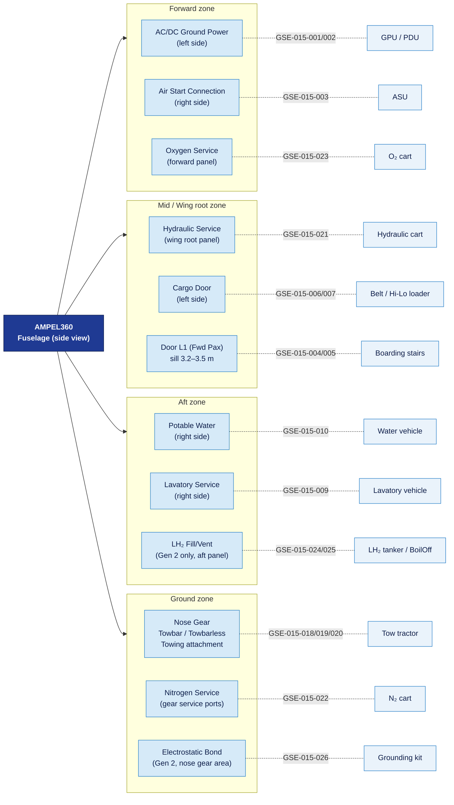

# ATLAS 010-019 · Section 01 · Subsection 015 · Subsubject 004 — GSE Interfaces, Couplings and Aircraft-Side Connections

## 1. Purpose

Defines and documents the **physical, electrical, and pneumatic interfaces** between Ground Support Equipment (GSE) and AMPEL360 aircraft variants — covering connector types, coupling specifications, aircraft-side service panel locations, and interface compatibility requirements. This subsubject is the normative reference for any GSE item listed in the catalog (`002_`) whose interface is identified with a cross-reference to `004_`[^baseline].

## 2. Scope

### 2.1 Ground Power (Electrical) Interface

#### 2.1.1 Aircraft-side connection points

AMPEL360 aircraft are equipped with external power receptacles conforming to:

- **28 V DC ground power** — MIL-DTL-83527 compatible receptacle (nose section, ground service panel).
- **115 V AC / 400 Hz ground power** — NATO STANAG 3456 / ISO 461 compatible receptacle (lower fuselage, forward ground service panel).

| Field | Value |
|---|---|
| Applicable GSE | GSE-015-001 (GPU), GSE-015-002 (PDU) |
| Connector standard (AC) | ISO 461 / STANAG 3456 — 3-pin 400 Hz plug |
| Connector standard (DC) | MIL-DTL-83527 |
| Panel location | Forward lower fuselage — left side (nose section for DC) |
| Interlock | External power available light on flight deck; automatic disconnect on engine start |
| Max cable run | 20 m from GPU to aircraft (voltage drop limit per ATA iSpec 2200[^ata2200]) |
| Polarity / phase | Phase rotation confirmed before connection; anti-arc protection on GPU contactor |

#### 2.1.2 Connection procedure summary

1. Position GPU within cable reach; apply parking brake.
2. Confirm aircraft external power switch is OFF (flight deck).
3. Connect GPU cable to aircraft receptacle; confirm locking ring engaged.
4. Power on GPU; confirm output voltage and frequency within limits.
5. Transfer to external power on flight deck; confirm "AVAIL" and "ON" annunciation.
6. For disconnection, transfer to internal power first; then switch off GPU output before disconnecting cable.

### 2.2 Pneumatic (Air Start) Interface

#### 2.2.1 Aircraft-side connection points

- **High-pressure air connection** — ISO 1307 or AN6287 compatible female coupling on the lower fuselage service panel (aft of nose landing gear bay, right side).

| Field | Value |
|---|---|
| Applicable GSE | GSE-015-003 (ASU) |
| Connector standard | AN6287 / ISO 1307 — high-pressure air coupling |
| Pressure specification | 40–45 psi (276–310 kPa) at the aircraft port during engine motoring |
| Flow rate | Minimum 60 lb/min at start connection port |
| Panel location | Lower fuselage, right side, forward of wing leading edge |
| Temperature limit | Delivered air temperature ≤ 260 °C at aircraft port |
| Interlock | Starter valve opens only on flight deck command; ASU must reach pressure before valve opens |
| Gen 2 note | AMPEL360 BWB-H2 Gen 2 electric start variant may not require ASU; confirm active engine start architecture via configuration management before connecting |

### 2.3 Passenger/Crew Boarding Interface

#### 2.3.1 Aircraft door sill heights and boarding equipment reach

Door sill heights are variant-specific. The following are reference values for interface planning:

| Door | AMPEL360e Gen 1 (sill height, AGL) | AMPEL360 BWB-H2 Gen 2 (sill height, AGL) |
|---|---|---|
| Forward passenger door (L1) | 3.2 m | 3.5 m |
| Rear passenger door (L2) | 3.1 m | 3.4 m |
| Emergency exits | 2.8 m | 3.0 m |
| Cargo compartment door | 1.5 m | 1.6 m |

| Field | Value |
|---|---|
| Applicable GSE | GSE-015-004 (motorised stairs), GSE-015-005 (manual stairs), GSE-015-011 (maintenance platform) |
| Compatibility check | Stair or platform maximum height must reach door sill height + 0.15 m for safe step-off; confirm per variant before deployment |
| Contact protection | Rubber-tipped guide rails and door-frame protectors required; no metal-to-metal contact with aircraft fuselage |
| Load limit | Maximum stair/platform rated load ≥ 250 kg (accounting for personnel + equipment) |

### 2.4 Cargo Door Interface

#### 2.4.1 Cargo loader deck height and door dimensions

| Parameter | AMPEL360e Gen 1 | AMPEL360 BWB-H2 Gen 2 |
|---|---|---|
| Forward cargo door width | 1.73 m | 1.73 m |
| Forward cargo door height | 1.22 m | 1.40 m |
| Aft cargo door width | 1.73 m | 1.73 m |
| Cargo compartment floor height (AGL) | 1.50 m | 1.62 m |

| Field | Value |
|---|---|
| Applicable GSE | GSE-015-006 (belt loader), GSE-015-007 (Hi-Lo cargo loader) |
| Deck height adjustment | Belt loader and Hi-Lo loader deck must be adjustable to compartment floor height ± 50 mm |
| Lateral clearance | Minimum 100 mm between loader side frame and door frame during operation |
| Gen 2 note | Increased door height on Gen 2 requires verification that Hi-Lo loader can reach 1.62 m without exceeding maximum tilt angle |

### 2.5 Fluid Service Connections (Lavatory and Water)

| Connection | Connector type | Location | Applicable GSE |
|---|---|---|---|
| Potable water service | Quick-disconnect (QD) coupling, NATO blue colour code | Aft lower fuselage, right side | GSE-015-010 |
| Lavatory service (drain) | QD coupling, NATO amber colour code | Aft lower fuselage, right side | GSE-015-009 |
| Lavatory service (flush water in) | QD coupling, NATO amber colour code | Adjacent to drain port | GSE-015-009 |

Colour coding and port labelling are per IATA IGOM[^iata_igom] and ATA iSpec 2200[^ata2200]. Misconnection prevention: potable water and lavatory service ports use mechanically incompatible couplings (different keyways) to prevent fluid cross-contamination.

### 2.6 Towing Interface (Nose Gear)

#### 2.6.1 Nose gear towbar attachment

| Field | Value |
|---|---|
| Applicable GSE | GSE-015-018 (tow tractor), GSE-015-019 (towbarless), GSE-015-020 (towbar) |
| Towbar pin diameter | 50 mm (AMPEL360e Gen 1) |
| Towbar pin diameter | 57 mm (AMPEL360 BWB-H2 Gen 2) |
| Shear pin rating | Towbar shear pin rated for aircraft MZFW tow load; replace after any overload event |
| Steering limit | Maximum nose-wheel deflection during towing: ±72° (Gen 1), ±65° (Gen 2); exceed limit only with bypass pin engaged |
| Bypass pin | Required for towing; removes nose-gear steering actuator from load path; inserted before tow connection |
| Towbarless cradle | Cradle nose-gear contact width must match aircraft nose-gear cross-section; verify compatibility rating in `002_` before use |
| Procedure | Full towing procedure in [`../013_Remolque/`](../013_Remolque/) |

### 2.7 Fluid Replenishment Connections (Hydraulic, Nitrogen, Oxygen)

| System | Connection type | Location | Applicable GSE |
|---|---|---|---|
| Hydraulic system (blue) | AN-6 flareless fitting, blue colour code | Wing root hydraulic service panel | GSE-015-021 |
| Nitrogen (tyre inflation, strut) | Schrader/DIN tyre valve or high-pressure coupling, yellow | Nose gear and main gear service ports | GSE-015-022 |
| Oxygen (crew oxygen) | CGA 870 or equivalent medical/oxygen coupling | Forward fuselage service panel | GSE-015-023 |

Cross-contamination prevention: all fluid replenishment couplings use incompatible fittings per their respective system. Only approved fluids per the Aircraft Maintenance Manual (AMM) shall be connected. Servicing quantities and contamination checks are in [`../011_Servicing/`](../011_Servicing/).

### 2.8 LH₂ GSE Interfaces (Gen 2 only)

> **Cross-reference:** Full cryogenic interface specifications and safety procedures for the LH₂ fuel system are in EPTA `460-469_Propulsion-de-Hidrogeno`. The entries below are `015_` identity cross-references only.

| Interface | Connector / coupling type | Location | Applicable GSE |
|---|---|---|---|
| LH₂ fill connection | Bayonet-lock cryogenic coupling (vacuum-jacketed) | Aft fuselage, LH₂ service panel | GSE-015-024 |
| LH₂ vent / boil-off connection | Bayonet-lock cryogenic vent coupling | Adjacent to fill port | GSE-015-025 |
| Electrostatic bonding point | Ground cable QD lug, stainless steel | Forward nose gear area, primary bond point | GSE-015-026 |

## 3. Diagram — Aircraft-Side Service Panel Layout (Schematic)

## 4. Footprint

| Metric | Value |
|---|---|
| Architecture | `ATLAS` — Aircraft Top Level Architecture Schema/System (controlled term) |
| Master range | `000–099` |
| Code range | `010-019` |
| Section | `01` — Manejo en Tierra & Servicio |
| Subsection | `015` — Ground Support Equipment |
| Subsubject | `004` — GSE Interfaces, Couplings and Aircraft-Side Connections |
| Variants covered | AMPEL360e Gen 1 (Jet-A/SAF), AMPEL360 BWB-H2 Gen 2 (LH₂) |
| Primary Q-Division | Q-GROUND[^qdiv] |
| Support Q-Divisions | Q-MECHANICS, Q-INDUSTRY |
| ORB support | ORB-PMO, ORB-FIN |
| Governance class | `baseline`[^gov] |
| Folder path | `Q+ATLANTIDE/000-099_ATLAS/010-019_Manejo-en-Tierra-Servicio/015_GSE/` |
| Document | `004_GSE-Interfaces-Couplings-and-Aircraft-Side-Connections.md` (this file) |
| Parent subsection | [`README.md`](./README.md) · [`000_Overview.md`](./000_Overview.md) |
| GSE catalog | [`002_GSE-Catalog-and-Compatibility-Matrix.md`](./002_GSE-Catalog-and-Compatibility-Matrix.md) |
| LH₂ system detail | EPTA `460-469_Propulsion-de-Hidrogeno` |
| Parent architecture | [`../../README.md`](../../README.md) |
| Parent baseline | [`organization/Q+ATLANTIDE.md`](../../../../organization/Q+ATLANTIDE.md) |

## 5. References & Citations

[^baseline]: **Q+ATLANTIDE controlled baseline (v1.0.0)** — [`organization/Q+ATLANTIDE.md`](../../../../organization/Q+ATLANTIDE.md). Defines the controlled `000-999` architecture-band taxonomy and the ATLAS-1000 register subpart.

[^archtable]: **§3 — Architecture Table (parent)** — [`../../README.md` §3](../../README.md#3-architecture-table). Source of authority for primary/support Q-Divisions and ORB support of this section.

[^qdiv]: **Q-Division authority** — [`organization/Q-Divisions/`](../../../../organization/Q-Divisions/). Technical-authority units for the Q+ATLANTIDE baseline.

[^gov]: **Governance class** — `baseline` denotes documents under controlled change management within the Q+ATLANTIDE baseline.

[^ata2200]: **ATA iSpec 2200 — Information Standards for Aviation Maintenance** — Governs connector specifications, ground power standards, and service panel layout conventions referenced in this subsubject.

[^ataspec100]: **ATA Spec 100 — Manufacturers Technical Data** — Legacy standard for ATA chapter/section conventions.

[^s1000d]: **S1000D Issue 6.0 — International specification for technical publications** — CSDB and DMC specification used for all Q+ATLANTIDE artefacts.

[^as9100d]: **AS9100D — Quality Management Systems — Aviation, Space and Defense Organizations** — Quality-management baseline governing interface documentation and calibration of coupling equipment.

[^icao9137]: **ICAO Doc 9137 — Airport Services Manual** — ICAO reference for GSE interface standards and service panel conventions.

[^iata_igom]: **IATA Ground Operations Manual (IGOM)** — Industry standard for ground-handling interface requirements; colour coding for fluid service connections.

### Applicable industry standards

- ATA iSpec 2200 — Information Standards for Aviation Maintenance[^ata2200]
- ATA Spec 100 — Manufacturers Technical Data[^ataspec100]
- S1000D Issue 6.0 — International specification for technical publications[^s1000d]
- AS9100D — Quality Management Systems — Aviation, Space and Defense Organizations[^as9100d]
- ICAO Doc 9137 — Airport Services Manual[^icao9137]
- IATA Ground Operations Manual (IGOM)[^iata_igom]
