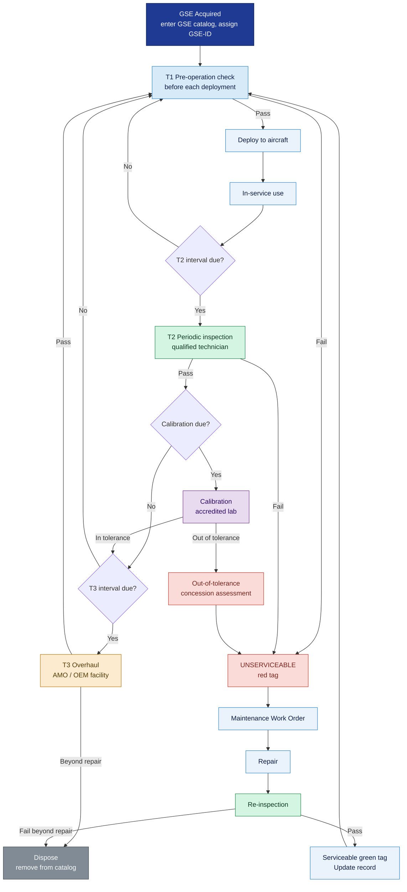

# ATLAS 010-019 · Section 01 · Subsection 015 · Subsubject 005 — GSE Maintenance, Calibration and Records

## 1. Purpose

Defines the **maintenance programme, calibration requirements, and records management** obligations for all Ground Support Equipment (GSE) catalogued in subsection `015_`. This subsubject establishes the minimum maintenance intervals, calibration schedules, and record retention requirements within the Q+ATLANTIDE baseline[^baseline], conforming to AS9100D[^as9100d], ATA iSpec 2200[^ata2200], and the IATA Ground Operations Manual (IGOM)[^iata_igom].

## 2. Scope

### 2.1 Maintenance programme framework

The GSE maintenance programme is structured in three tiers:

| Tier | Name | Trigger | Performed by |
|---|---|---|---|
| T1 | Pre-operation check | Before each deployment to an aircraft | Equipment operator |
| T2 | Periodic inspection | Calendar- or usage-based interval (see §2.3) | Qualified GSE technician |
| T3 | Major overhaul / life-cycle review | Hours, cycles, or fixed calendar interval (see §2.3) | Approved maintenance organisation (AMO) or OEM-authorised facility |

All three tiers apply to Powered GSE. Non-Powered GSE is subject to T1 (condition check before each use) and T2 (periodic inspection). T3 applies to Non-Powered GSE only where specified by the OEM or where structural load limits are involved (e.g., towbars, access stands under structural certification).

### 2.2 Calibration requirements

Calibration applies to any GSE item whose output parameter — electrical, pressure, torque, flow, or dimensional — is used to set, verify, or control a parameter on the aircraft or its systems. The GSE catalog (`002_`) records the calibration requirement and interval for each item.

#### 2.2.1 Calibration classification

| Calibration class | Applies to | Required standard | Interval |
|---|---|---|---|
| **Electrical** | GPU (voltage/frequency output), PDU | IEC 60051 / NIST traceable reference | 12 months |
| **Pressure** | ASU (pressure output), N₂ cart, O₂ unit, hydraulic cart | ISO 376 / NIST traceable reference | 6 months |
| **Flow** | Potable water vehicle (flow meter), LH₂ tanker | ISO 4185 / NIST traceable reference | 6 months |
| **Torque** | Calibrated torque wrenches (where used as GSE) | ISO 6789 | 12 months or after overload |
| **Dimensional / structural** | Towbars, access stands (load-bearing surfaces) | Load cell test per OEM spec | 12–24 months |
| **Condition** | Engine blanks, pitot covers, control surface locks, chocks | Visual + functional inspection per checklist | 12 months |

#### 2.2.2 Calibration traceability

All calibration shall be traceable to a national or international measurement standard (NIST, PTB, NPL, or equivalent). Calibration certificates shall record:

1. GSE-ID and serial number.
2. Date of calibration and calibration due date.
3. Calibrating organisation's accreditation number (ISO/IEC 17025 or equivalent).
4. Reference standard used with traceability chain.
5. As-found and as-left values.
6. Pass/fail conclusion.

Out-of-tolerance findings at calibration shall trigger an immediate serviceability review and a concession/deviation assessment to determine whether aircraft operations performed since the last valid calibration may have been affected.

### 2.3 Maintenance intervals — master schedule

| GSE-ID | Description | T2 Interval | T3 Interval | Calibration interval |
|---|---|---|---|---|
| GSE-015-001 | GPU | 250 h or 6 months (whichever first) | 1,000 h or 5 years | 12 months |
| GSE-015-002 | PDU | 250 h or 6 months | 1,000 h or 5 years | 12 months |
| GSE-015-003 | ASU | 250 h or 6 months | 1,000 h or 5 years | 6 months |
| GSE-015-004 | Motorised boarding stairs | 500 h or 12 months | 2,000 h or 10 years | N/A |
| GSE-015-005 | Manual boarding stairs | 12 months | 5 years | N/A |
| GSE-015-006 | Belt loader | 500 h or 12 months | 2,000 h or 10 years | N/A |
| GSE-015-007 | Hi-Lo cargo loader | 500 h or 12 months | 2,000 h or 10 years | N/A |
| GSE-015-008 | Baggage tractor | 500 h or 12 months | 2,000 h or 10 years | N/A |
| GSE-015-009 | Lavatory service vehicle | 12 months | 5 years | N/A |
| GSE-015-010 | Potable water service vehicle | 6 months (water quality) + 12 months (mechanical) | 5 years | 6 months (flow meter) |
| GSE-015-011 | Mobile maintenance platform | 12 months | 5 years | 12 months (structural) |
| GSE-015-012 | Nose-cowl access stand | 12 months | 5 years | 24 months (structural) |
| GSE-015-013 | Engine intake blank set | 12 months (condition) | Replace on damage | 12 months |
| GSE-015-014 | Pitot/static cover set | 12 months (condition) | Replace on damage | 12 months |
| GSE-015-015 | Wheel chock set | 12 months | Replace on damage | N/A |
| GSE-015-016 | Control surface lock set | 12 months | 5 years | 12 months (condition) |
| GSE-015-017 | Safety cone set | 24 months | Replace on damage | N/A |
| GSE-015-018 | Conventional tow tractor | 500 h or 12 months | 2,000 h or 10 years | N/A |
| GSE-015-019 | Towbarless tractor | 500 h or 12 months | 2,000 h or 10 years | N/A |
| GSE-015-020 | Nose-gear towbar | 12 months | 5 years or 1,000 cycles | 12 months (structural) |
| GSE-015-021 | Hydraulic fluid cart | 6 months | 5 years | 6 months (pressure gauge) |
| GSE-015-022 | Nitrogen servicing cart | 6 months | 5 years | 6 months (pressure) |
| GSE-015-023 | Oxygen replenishment unit | 6 months | 5 years | 6 months (pressure) |
| GSE-015-024 | LH₂ cryogenic tanker | 3 months | 2 years | 3 months |
| GSE-015-025 | Boil-off capture unit | 6 months | 3 years | 6 months |
| GSE-015-026 | Electrostatic grounding kit | 12 months | 5 years | 12 months |
| GSE-015-027 | Airframe washing rig | 12 months | 5 years | N/A |
| GSE-015-028 | Fire extinguisher cart | 12 months (pressure check + charge) | 5 years | 12 months |

### 2.4 Record retention

All GSE maintenance and calibration records shall be retained for the periods shown below, after which records may be archived or disposed of per the governing quality management system (AS9100D[^as9100d]):

| Record type | Minimum retention period |
|---|---|
| T1 pre-operation check sheet | 90 days |
| T2 periodic inspection record | Life of equipment + 2 years |
| T3 overhaul record | Life of equipment + 5 years |
| Calibration certificate | Until next calibration + 2 years (minimum 5 years) |
| Unserviceable tag and corrective action record | Life of equipment + 2 years |
| Out-of-tolerance concession record | Life of equipment + 5 years |

Records shall be stored in the designated GSE records management system (electronic or paper) identified by the local quality management authority. Each record shall be traceable to the GSE-ID and serial number.

### 2.5 Unserviceable equipment management

When a GSE item is found unserviceable (during pre-operation check, periodic inspection, or at any time):

1. **Immediate withdrawal** — Remove the item from service; do not deploy to aircraft.
2. **Red-tag application** — Attach an unserviceable (red) tag identifying: GSE-ID, date, defect description, name of person identifying the defect.
3. **Segregation** — Move to a designated unserviceable GSE holding area; physically separate from serviceable equipment.
4. **Maintenance action** — Raise a maintenance work order; assign to qualified GSE technician.
5. **Return to service** — After repair and re-inspection, remove red tag and apply green (serviceable) tag; update the maintenance record.
6. **Scrapping** — If the item is beyond economic repair or life-expired, raise a disposal record and remove from the GSE catalog active list.

### 2.6 GSE records in the ATLAS-1000 register

Each GSE asset catalogued in `002_` is registered in the ATLAS-1000 register with a unique GSE-ID. The maintenance and calibration records for that asset are linked to the GSE-ID through the Q+ATLANTIDE traceability chain, allowing:

- Full life-cycle traceability from initial entry to disposal.
- Cross-reference to any aircraft maintenance events where the GSE item was used (for out-of-tolerance concession impact assessment).
- Audit support for AS9100D[^as9100d] and regulatory inspections.

## 3. Diagram — GSE Maintenance Life-Cycle

## 4. Footprint

| Metric | Value |
|---|---|
| Architecture | `ATLAS` — Aircraft Top Level Architecture Schema/System (controlled term) |
| Master range | `000–099` |
| Code range | `010-019` |
| Section | `01` — Manejo en Tierra & Servicio |
| Subsection | `015` — Ground Support Equipment |
| Subsubject | `005` — GSE Maintenance, Calibration and Records |
| Primary Q-Division | Q-GROUND[^qdiv] |
| Support Q-Divisions | Q-MECHANICS, Q-INDUSTRY |
| ORB support | ORB-PMO, ORB-FIN |
| Governance class | `baseline`[^gov] |
| Folder path | `Q+ATLANTIDE/000-099_ATLAS/010-019_Manejo-en-Tierra-Servicio/015_GSE/` |
| Document | `005_GSE-Maintenance-Calibration-and-Records.md` (this file) |
| Parent subsection | [`README.md`](./README.md) · [`000_Overview.md`](./000_Overview.md) |
| GSE catalog | [`002_GSE-Catalog-and-Compatibility-Matrix.md`](./002_GSE-Catalog-and-Compatibility-Matrix.md) |
| Parent architecture | [`../../README.md`](../../README.md) |
| Parent baseline | [`organization/Q+ATLANTIDE.md`](../../../../organization/Q+ATLANTIDE.md) |

## 5. References & Citations

[^baseline]: **Q+ATLANTIDE controlled baseline (v1.0.0)** — [`organization/Q+ATLANTIDE.md`](../../../../organization/Q+ATLANTIDE.md). Defines the controlled `000-999` architecture-band taxonomy and the ATLAS-1000 register subpart.

[^archtable]: **§3 — Architecture Table (parent)** — [`../../README.md` §3](../../README.md#3-architecture-table). Source of authority for primary/support Q-Divisions and ORB support of this section.

[^qdiv]: **Q-Division authority** — [`organization/Q-Divisions/`](../../../../organization/Q-Divisions/). Technical-authority units for the Q+ATLANTIDE baseline.

[^gov]: **Governance class** — `baseline` denotes documents under controlled change management within the Q+ATLANTIDE baseline.

[^ata2200]: **ATA iSpec 2200 — Information Standards for Aviation Maintenance** — Governs document structure, maintenance programme format, and record requirements for aviation maintenance artefacts including GSE.

[^ataspec100]: **ATA Spec 100 — Manufacturers Technical Data** — Legacy standard for ATA chapter/section conventions.

[^s1000d]: **S1000D Issue 6.0 — International specification for technical publications** — CSDB and DMC specification used for all Q+ATLANTIDE artefacts.

[^as9100d]: **AS9100D — Quality Management Systems — Aviation, Space and Defense Organizations** — Primary quality-management standard governing calibration traceability, record retention, unserviceable part management, and maintenance programme structure for all Q+ATLANTIDE GSE.

[^icao9137]: **ICAO Doc 9137 — Airport Services Manual** — ICAO reference for GSE maintenance and inspection standards applicable to airside operations.

[^iata_igom]: **IATA Ground Operations Manual (IGOM)** — Industry standard for GSE maintenance programme structure, pre-operation checks, and record requirements.

### Applicable industry standards

- ATA iSpec 2200 — Information Standards for Aviation Maintenance[^ata2200]
- ATA Spec 100 — Manufacturers Technical Data[^ataspec100]
- S1000D Issue 6.0 — International specification for technical publications[^s1000d]
- AS9100D — Quality Management Systems — Aviation, Space and Defense Organizations[^as9100d]
- ICAO Doc 9137 — Airport Services Manual[^icao9137]
- IATA Ground Operations Manual (IGOM)[^iata_igom]
