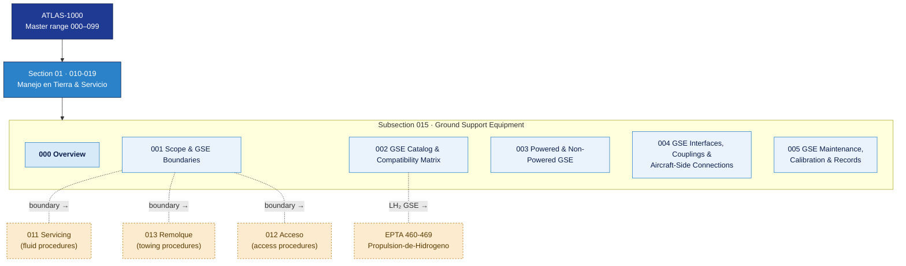

# ATLAS 010-019 · Section 01 · Subsection 015 · Subsubject 000 — Overview

## 1. Purpose

Overview entry-point for the *Ground Support Equipment* (`015`) subsection within ATLAS `010-019` — *Manejo en Tierra & Servicio*. This subsubject introduces the full scope, boundary rules, and content architecture of `015_GSE/` and links outward to the applicable industry standards listed in §5.

Ground Support Equipment (GSE) is the complete set of specialised vehicles, tools, and apparatus used to service, maintain, and support an aircraft on the ground between flights and during maintenance periods. Within the ATLAS taxonomy, subsection `015` provides the **operational procedure layer** (Level 2) for GSE — covering catalogue, compatibility, classification, physical interfaces, and maintenance/calibration requirements for all GSE types used with AMPEL360 aircraft variants.

This subsection is part of the **ATLAS-1000** register, a subpart of the controlled **Q+ATLANTIDE** baseline[^baseline][^n001].

> **Orientation layer:** Conceptual introductions to GSE categories and their role in the ground-handling turnaround are in [`../../000-009_Informacion-General-y-Servicio/003_Operaciones-Basicas/001_Ground-Handling-Basics.md`](../../000-009_Informacion-General-y-Servicio/003_Operaciones-Basicas/001_Ground-Handling-Basics.md). This subsection (`015_`) provides the **operational procedure content** per the three-level rule declared in `003_Operaciones-Basicas/000_Overview.md` §2.3.

## 2. Scope

### 2.1 Position within ATLAS 010-019

`015_GSE/` occupies the sixth slot of Code range `010-019`:

| Code | Title | Role |
|---|---|---|
| `010` | Ground Handling | Turnaround procedures, chocking, marshalling |
| `011` | Servicing | Fluid and gas replenishment/drain procedures |
| `012` | Acceso | Maintenance access platforms and docking systems |
| `013` | Remolque | Towing and pushback procedures |
| `014` | Parking | Parking, mooring and storage procedures |
| **`015`** | **Ground Support Equipment** | **GSE catalogue, interfaces and maintenance** ← this subsection |
| `016` | Lifting, Shoring and Jacking Procedures | Jacking, shoring and leveling procedures |

### 2.2 Subsubject content map

| 00N | Title | Key content |
|---|---|---|
| `000` | Overview | Scope, boundary rules, position in ATLAS, content map ← this file |
| `001` | Scope and GSE Boundaries | Taxonomy boundary definitions; what is/is not GSE within ATLAS |
| `002` | GSE Catalog and Compatibility Matrix | Authorised GSE list per AMPEL360 variant with compatibility ratings |
| `003` | Powered and Non-Powered GSE | Classification of GSE by power source; operational requirements per class |
| `004` | GSE Interfaces, Couplings and Aircraft-Side Connections | Physical and electrical interfaces between GSE and aircraft |
| `005` | GSE Maintenance, Calibration and Records | Maintenance intervals, calibration schedules, and traceability records |

### 2.3 Boundary rules

**Rule GSE-01 — Scope boundary with `011_Servicing/`:**
Fuelling vehicles and fluid-replenishment equipment are controlled under `011_Servicing/`. When a GSE item has a direct fluid-transfer function (fuel bowser, hydraulic replenishment rig), its **servicing procedure** belongs in `011_`; its **equipment record, calibration, and coupling interface** is cross-referenced here in `015_`.

**Rule GSE-02 — Scope boundary with `013_Remolque/`:**
Tow tractors and towbarless tractor procedures belong in `013_Remolque/`. This subsection (`015_`) records the tractor as a GSE catalogue entry with compatibility and interface data; the towing operation itself is not repeated here.

**Rule GSE-03 — Scope boundary with `012_Acceso/`:**
Maintenance access platforms, docking systems, and passenger boarding steps that function as access equipment are catalogued both in `012_Acceso/` (from the aircraft-access perspective) and in `015_GSE/` (from the equipment-management perspective). The `015_` catalog entry is normative for equipment identity and calibration; `012_` is normative for access procedures.

**Rule GSE-04 — Variant sensitivity:**
AMPEL360 Gen 1 (Jet-A/SAF) and Gen 2 (LH₂) variants require different GSE. LH₂-specific GSE (cryogenic fuel vehicles, boil-off capture units, electrostatic grounding kits) are flagged in the compatibility matrix (`002_`) and cross-referenced to EPTA `460-469_Propulsion-de-Hidrogeno`.

## 3. Diagram — GSE Subsection Map

*Solid arrows indicate parent → section → subsection ownership. Dotted arrows indicate boundary interfaces with adjacent subsections and related code ranges.*

## 4. Footprint

| Metric | Value |
|---|---|
| Architecture | `ATLAS` — Aircraft Top Level Architecture Schema/System (controlled term) |
| Master range | `000–099` |
| Code range | `010-019` |
| Section | `01` — Manejo en Tierra & Servicio |
| Subsection | `015` — Ground Support Equipment |
| Subsubject | `000` — Overview |
| Scope level | Operational procedure (Level 2); orientation in `003_Operaciones-Basicas/001_` |
| Variant sensitivity | Gen 1 (Jet-A/SAF) and Gen 2 (LH₂); see `002_` compatibility matrix |
| Primary Q-Division | Q-GROUND[^qdiv] |
| Support Q-Divisions | Q-MECHANICS, Q-INDUSTRY |
| ORB support | ORB-PMO, ORB-FIN |
| Governance class | `baseline`[^gov] |
| Folder path | `Q+ATLANTIDE/000-099_ATLAS/010-019_Manejo-en-Tierra-Servicio/015_GSE/` |
| Document | `015-000-GSE-Overview.md` (this file) |
| Parent subsection | [`README.md`](./README.md) |
| Parent architecture | [`../../README.md`](../../README.md) |
| Parent baseline | [`organization/Q+ATLANTIDE.md`](../../../../organization/Q+ATLANTIDE.md) |

## 5. References & Citations

[^baseline]: **Q+ATLANTIDE controlled baseline (v1.0.0)** — [`organization/Q+ATLANTIDE.md`](../../../../organization/Q+ATLANTIDE.md). Defines the controlled `000-999` architecture-band taxonomy and the ATLAS-1000 register subpart.

[^archtable]: **§3 — Architecture Table (parent)** — [`../../README.md` §3](../../README.md#3-architecture-table). Source of authority for primary/support Q-Divisions and ORB support of this section.

[^qdiv]: **Q-Division authority** — [`organization/Q-Divisions/`](../../../../organization/Q-Divisions/). Technical-authority units for the Q+ATLANTIDE baseline.

[^gov]: **Governance class** — `baseline` denotes documents under controlled change management within the Q+ATLANTIDE baseline.

[^n001]: **Note N-001** — Q+ATLANTIDE (with its ATLAS-1000 register subpart) is a taxonomy and traceability ecosystem, not an organization chart. See [`organization/Q+ATLANTIDE.md` §4](../../../../organization/Q+ATLANTIDE.md#4-notes).

[^ata2200]: **ATA iSpec 2200 — Information Standards for Aviation Maintenance** — Governs document structure, data-module scope, and chapter mapping for ATLAS maintenance artefacts. GSE procedures map to ATA chapter 10–12 (Ground Support).

[^ataspec100]: **ATA Spec 100 — Manufacturers Technical Data** — Legacy standard for ATA chapter/section numbering conventions reflected in the ATLAS `000-099` band.

[^s1000d]: **S1000D Issue 6.0 — International specification for technical publications** — Common Source DataBase (CSDB) and Data Module Code (DMC) specification used for all Q+ATLANTIDE artefacts.

[^as9100d]: **AS9100D — Quality Management Systems — Aviation, Space and Defense Organizations** — Quality-management baseline for all Q+ATLANTIDE deliverables, including GSE calibration and record requirements.

[^icao9137]: **ICAO Doc 9137 — Airport Services Manual** — ICAO reference for GSE safety standards, equipment classification, and aircraft turnaround procedures.

[^iata_igom]: **IATA Ground Operations Manual (IGOM)** — Industry standard for ground-handling and GSE operational procedures.

### Applicable industry standards

- ATA iSpec 2200 — Information Standards for Aviation Maintenance[^ata2200]
- ATA Spec 100 — Manufacturers Technical Data[^ataspec100]
- S1000D Issue 6.0 — International specification for technical publications[^s1000d]
- AS9100D — Quality Management Systems — Aviation, Space and Defense Organizations[^as9100d]
- ICAO Doc 9137 — Airport Services Manual[^icao9137]
- IATA Ground Operations Manual (IGOM)[^iata_igom]
