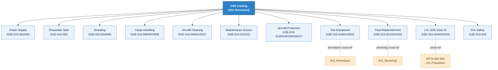

# ATLAS 010-019 · Section 01 · Subsection 015 · Subsubject 002 — GSE Catalog and Compatibility Matrix

## 1. Purpose

Provides the **authorised GSE catalog** for [PROGRAMME-AIRCRAFT] aircraft variants and the associated **compatibility matrix** that maps each GSE item to the variant(s) for which it is approved. This document is the normative source for GSE selection during turnaround planning, maintenance scheduling, and hangar equipment procurement within the Q+ATLANTIDE baseline[^baseline].

## 2. Scope

### 2.1 Catalog structure

Each GSE entry in this catalog records the minimum identity fields required for traceability and procurement:

| Field | Description |
|---|---|
| GSE-ID | Unique identifier within the Q+ATLANTIDE GSE registry (format: `GSE-015-NNN`) |
| Category | Functional category per `003_` classification |
| Description | Common name and functional description |
| Power class | Powered / Non-Powered (per `003_`) |
| Compatibility | Compatibility rating per [PROGRAMME-AIRCRAFT] variant (see §2.3) |
| Interface ref | Cross-reference to `004_` for physical interface specification |
| Calibration req. | Whether calibration is required (Yes/No); interval if Yes |
| Standards | Applicable industry standards |

### 2.2 GSE catalog — master table

| GSE-ID | Category | Description | Power class | Interface ref | Calibration req. |
|---|---|---|---|---|---|
| GSE-015-001 | Aircraft power supply | Ground Power Unit (GPU) — 28 V DC / 115 V AC 400 Hz | Powered | `004_` §2.1 | Yes — 12 months |
| GSE-015-002 | Aircraft power supply | Power Distribution Unit (PDU) | Powered | `004_` §2.1 | Yes — 12 months |
| GSE-015-003 | Pneumatic start | Air Start Unit (ASU) — high-pressure air cart | Powered | `004_` §2.2 | Yes — 6 months |
| GSE-015-004 | Passenger boarding | Motorised passenger boarding stairs | Powered | `004_` §2.3 | No |
| GSE-015-005 | Passenger boarding | Manual boarding stairs (short-body) | Non-Powered | `004_` §2.3 | No |
| GSE-015-006 | Cargo handling | Belt loader (motorised, adjustable height) | Powered | `004_` §2.4 | No |
| GSE-015-007 | Cargo handling | Hi-Lo cargo loader (ULD compatible) | Powered | `004_` §2.4 | No |
| GSE-015-008 | Cargo handling | Baggage tractor with dolly train | Powered | — | No |
| GSE-015-009 | Aircraft cleaning | Lavatory service vehicle | Powered | `004_` §2.5 | No |
| GSE-015-010 | Aircraft cleaning | Potable water service vehicle | Powered | `004_` §2.5 | Yes — 6 months (water quality) |
| GSE-015-011 | Maintenance access | Mobile maintenance platform (scissor lift type) | Powered | `004_` §2.3 | Yes — 12 months |
| GSE-015-012 | Maintenance access | Nose-cowl access stand (non-powered) | Non-Powered | `004_` §2.3 | Yes — 24 months |
| GSE-015-013 | Aircraft protection | Engine intake blank set (per variant) | Non-Powered | — | Yes — 12 months (condition) |
| GSE-015-014 | Aircraft protection | Pitot/static cover set | Non-Powered | — | Yes — 12 months (condition) |
| GSE-015-015 | Aircraft protection | Wheel chock set (main gear + nose gear) | Non-Powered | — | No |
| GSE-015-016 | Aircraft protection | Control surface lock set (elevator, aileron, rudder) | Non-Powered | — | Yes — 12 months (condition) |
| GSE-015-017 | Aircraft protection | Safety cone set | Non-Powered | — | No |
| GSE-015-018 | Tow equipment | Conventional tow tractor (towbar-equipped) | Powered | `004_` §2.6 | No (cross-ref `013_Remolque/`) |
| GSE-015-019 | Tow equipment | Towbarless tractor | Powered | `004_` §2.6 | No (cross-ref `013_Remolque/`) |
| GSE-015-020 | Tow equipment | Nose-gear towbar ([PROGRAMME-AIRCRAFT]-specific) | Non-Powered | `004_` §2.6 | Yes — 12 months |
| GSE-015-021 | Fluid replenishment | Hydraulic fluid replenishment cart | Non-Powered | `004_` §2.7 | Yes — 6 months (cross-ref `011_Servicing/`) |
| GSE-015-022 | Fluid replenishment | Nitrogen servicing cart | Non-Powered | `004_` §2.7 | Yes — 6 months |
| GSE-015-023 | Fluid replenishment | Oxygen replenishment unit | Non-Powered | `004_` §2.7 | Yes — 6 months |
| GSE-015-024 | LH₂ GSE | Cryogenic LH₂ tanker (Gen 2 only) | Powered | `004_` §2.8 | Yes — 3 months |
| GSE-015-025 | LH₂ GSE | Boil-off capture unit (Gen 2 only) | Powered | `004_` §2.8 | Yes — 6 months |
| GSE-015-026 | LH₂ GSE | Electrostatic grounding kit (Gen 2 only) | Non-Powered | `004_` §2.8 | Yes — 12 months |
| GSE-015-027 | Aircraft cleaning | Airframe washing rig | Powered | — | No |
| GSE-015-028 | Fire safety | Portable CO₂ / dry-powder fire extinguisher cart | Non-Powered | — | Yes — 12 months |

### 2.3 Compatibility matrix

Compatibility ratings:
- **A** — Approved for use; no restrictions
- **A*** — Approved with conditions noted in Remarks
- **N/A** — Not applicable to this variant
- **R** — Reserved; approval pending

| GSE-ID | [PROGRAMME-AIRCRAFT] Gen 1 (Jet-A/SAF) | [PROGRAMME-AIRCRAFT] BWB-H2 Gen 2 (LH₂) | Remarks |
|---|---|---|---|
| GSE-015-001 | A | A | GPU voltage/frequency spec per `004_` §2.1 |
| GSE-015-002 | A | A | |
| GSE-015-003 | A | A* | ASU connection point differs; see `004_` §2.2 for Gen 2 |
| GSE-015-004 | A | A* | Door sill height differs between variants; confirm step configuration |
| GSE-015-005 | A | A* | Door sill height differs; verify manual stair reach |
| GSE-015-006 | A | A | |
| GSE-015-007 | A | A* | Cargo door width/height differs on BWB variant; confirm loader deck height |
| GSE-015-008 | A | A | |
| GSE-015-009 | A | A | |
| GSE-015-010 | A | A | |
| GSE-015-011 | A | A* | Platform height and reach envelope must be validated for BWB fuselage |
| GSE-015-012 | A | N/A | Not applicable — BWB Gen 2 nose-cowl geometry differs; dedicated stand required |
| GSE-015-013 | A | A* | Blank sets are variant-specific; confirm part number against active variant |
| GSE-015-014 | A | A | |
| GSE-015-015 | A | A | |
| GSE-015-016 | A | A* | Control surface lock set differs by variant; confirm part number |
| GSE-015-017 | A | A | |
| GSE-015-018 | A | A* | Tow tractor must be verified against nose-gear weight limits; see `013_Remolque/` |
| GSE-015-019 | A | A* | Towbarless cradle geometry must match nose-gear cross-section by variant |
| GSE-015-020 | A | N/A | Gen 2 uses different towbar attachment; dedicated towbar required |
| GSE-015-021 | A | A | |
| GSE-015-022 | A | A | |
| GSE-015-023 | A | A | |
| GSE-015-024 | N/A | A | Gen 2 LH₂ only; cross-ref EPTA 460-469 |
| GSE-015-025 | N/A | A | Gen 2 LH₂ only; cross-ref EPTA 460-469 |
| GSE-015-026 | N/A | A | Gen 2 LH₂ only; cross-ref EPTA 460-469 |
| GSE-015-027 | A | A | |
| GSE-015-028 | A | A | |

## 3. Diagram — GSE Catalog Structure

## 4. Footprint

| Metric | Value |
|---|---|
| Architecture | `ATLAS` — Aircraft Top Level Architecture Schema/System (controlled term) |
| Master range | `000–099` |
| Code range | `010-019` |
| Section | `01` — Manejo en Tierra & Servicio |
| Subsection | `015` — Ground Support Equipment |
| Subsubject | `002` — GSE Catalog and Compatibility Matrix |
| Variants covered | [PROGRAMME-AIRCRAFT] Gen 1 (Jet-A/SAF), [PROGRAMME-AIRCRAFT] BWB-H2 Gen 2 (LH₂) |
| Catalog entries | 28 (GSE-015-001 through GSE-015-028) |
| Primary Q-Division | Q-GROUND[^qdiv] |
| Support Q-Divisions | Q-MECHANICS, Q-INDUSTRY |
| ORB support | ORB-PMO, ORB-FIN |
| Governance class | `baseline`[^gov] |
| Folder path | `Q+ATLANTIDE/000-099_ATLAS/010-019_Manejo-en-Tierra-Servicio/015_GSE/` |
| Document | `015-002-GSE-Catalog-and-Compatibility-Matrix.md` (this file) |
| Parent subsection | [`README.md`](./README.md) · [`015-000-GSE-Overview.md`](./015-000-GSE-Overview.md) |
| Parent architecture | [`../../README.md`](../../README.md) |
| Parent baseline | [`organization/Q+ATLANTIDE.md`](../../../../organization/Q+ATLANTIDE.md) |

## 5. References & Citations

[^baseline]: **Q+ATLANTIDE controlled baseline (v1.0.0)** — [`organization/Q+ATLANTIDE.md`](../../../../organization/Q+ATLANTIDE.md). Defines the controlled `000-999` architecture-band taxonomy and the ATLAS-1000 register subpart.

[^archtable]: **§3 — Architecture Table (parent)** — [`../../README.md` §3](../../README.md#3-architecture-table). Source of authority for primary/support Q-Divisions and ORB support of this section.

[^qdiv]: **Q-Division authority** — [`organization/Q-Divisions/`](../../../../organization/Q-Divisions/). Technical-authority units for the Q+ATLANTIDE baseline.

[^gov]: **Governance class** — `baseline` denotes documents under controlled change management within the Q+ATLANTIDE baseline.

[^ata2200]: **ATA iSpec 2200 — Information Standards for Aviation Maintenance** — Governs document structure and data-module scope. GSE catalog entries align with ATA chapter groupings for ground support equipment.

[^ataspec100]: **ATA Spec 100 — Manufacturers Technical Data** — Legacy standard for chapter/section conventions reflected in the ATLAS `000-099` band.

[^s1000d]: **S1000D Issue 6.0 — International specification for technical publications** — CSDB and DMC specification used for all Q+ATLANTIDE artefacts.

[^as9100d]: **AS9100D — Quality Management Systems — Aviation, Space and Defense Organizations** — Quality-management baseline for calibration records and controlled GSE asset management.

[^icao9137]: **ICAO Doc 9137 — Airport Services Manual** — ICAO reference for GSE safety standards and equipment classification applied in this catalog.

[^iata_igom]: **IATA Ground Operations Manual (IGOM)** — Industry standard for ground-handling equipment classification and operational procedures.

### Applicable industry standards

- ATA iSpec 2200 — Information Standards for Aviation Maintenance[^ata2200]
- ATA Spec 100 — Manufacturers Technical Data[^ataspec100]
- S1000D Issue 6.0 — International specification for technical publications[^s1000d]
- AS9100D — Quality Management Systems — Aviation, Space and Defense Organizations[^as9100d]
- ICAO Doc 9137 — Airport Services Manual[^icao9137]
- IATA Ground Operations Manual (IGOM)[^iata_igom]
