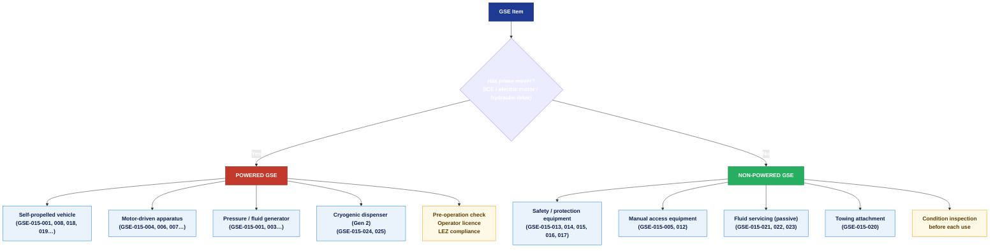

# ATLAS 010-019 · Section 01 · Subsection 015 · Subsubject 003 — Powered and Non-Powered GSE

## 1. Purpose

Defines the **classification of Ground Support Equipment by power source** — distinguishing **Powered GSE** (self-propelled or engine/motor-driven equipment) from **Non-Powered GSE** (passive, manually positioned or gravity-operated equipment) — and establishes the operational requirements, safety constraints, and regulatory obligations specific to each class within the Q+ATLANTIDE baseline[^baseline]. This classification is normative for maintenance scheduling, operator licensing, emission zone compliance, and hangar/apron assignment.

## 2. Scope

### 2.1 Classification framework

The Powered / Non-Powered classification is applied at the individual GSE asset level and recorded in the GSE catalog (`002_`). The classification governs:

- **Operator qualification** — Powered GSE requires a licensed/certified operator in most airside jurisdictions; Non-Powered GSE does not (beyond general airside safety induction).
- **Emissions zone compliance** — Internal combustion engine (ICE) Powered GSE is subject to airport Low Emission Zone (LEZ) restrictions; electric or non-powered GSE is exempt.
- **Maintenance regime** — Powered GSE has scheduled maintenance intervals for prime mover, hydraulics, electrical systems, and braking; Non-Powered GSE has inspection-based regimes only.
- **Pre-operation check** — Powered GSE requires a documented daily pre-operation check before deployment to the aircraft; Non-Powered GSE requires a condition inspection before each use.

### 2.2 Powered GSE

**Definition:** GSE that incorporates a prime mover (internal combustion engine, electric motor, or hydraulic drive) to perform its function or to propel itself.

#### 2.2.1 Sub-classes of Powered GSE

| Sub-class | Characteristics | Regulatory implication | Examples (from `002_` catalog) |
|---|---|---|---|
| Self-propelled vehicle | Road-registered or airside-only vehicle with on-board drive system | Operator airside driving licence; vehicle roadworthiness or airside certification | GPU (GSE-015-001), tow tractor (GSE-015-018), baggage tractor (GSE-015-008) |
| Motor-driven apparatus | Non-vehicle equipment with electric or hydraulic motor for work function | Operator competency certification; electrical safety inspection | Belt loader (GSE-015-006), Hi-Lo cargo loader (GSE-015-007), motorised boarding stairs (GSE-015-004) |
| Pressure/fluid-generating equipment | Equipment that generates electrical power, compressed air, or pressurised fluid | System isolation / lock-out-tag-out procedures before maintenance | GPU (GSE-015-001), ASU (GSE-015-003) |
| Cryogenic dispensing equipment (Gen 2) | Equipment handling LH₂ or other cryogenic fluids under pressure | Cryogenic handling authorisation; hydrogen safety training | LH₂ tanker (GSE-015-024), boil-off capture unit (GSE-015-025) |

#### 2.2.2 Pre-operation requirements — Powered GSE

Before deploying any Powered GSE to an aircraft stand, the following checks shall be completed and recorded:

1. **Operator authorisation check** — Confirm operator holds valid airside driving licence / equipment competency certificate for the specific equipment type.
2. **Fuel / charge level** — Confirm adequate fuel or battery charge for the planned operation; refuelling or recharging within the aircraft exclusion zone is not permitted.
3. **Braking system** — Verify service and parking brakes are functional; no abnormal response.
4. **Hydraulic / electrical system** — No visible fluid leaks; indicator lights clear of fault codes.
5. **Safety devices** — Flashing beacon operational; reversing alarm operational; emergency stop reachable from operator position.
6. **Interface check** — Any cables, hoses, or adapters required for aircraft connection are present, undamaged, and within calibration where applicable.
7. **Documentation** — Completed daily pre-operation check form (paper or electronic) retained for the period required by the local quality management system (minimum 90 days).

#### 2.2.3 Emission zone compliance

Airport-specific Low Emission Zone (LEZ) rules may prohibit or restrict ICE-powered GSE in certain ramp areas or terminal zones. The standard compliance path for AMPEL360 operations:

| GSE power type | Typical LEZ status | Mitigation |
|---|---|---|
| Diesel / petrol ICE | Restricted or prohibited in LEZ | Replace with electric equivalent |
| Electric (battery or mains) | Permitted | No restriction |
| Hydrogen fuel cell | Permitted (or preferred) | No restriction (applicable to LH₂ ramp operations) |

### 2.3 Non-Powered GSE

**Definition:** GSE that performs its function through manual placement, gravity, or passive mechanical means without a prime mover.

#### 2.3.1 Sub-classes of Non-Powered GSE

| Sub-class | Characteristics | Examples (from `002_` catalog) |
|---|---|---|
| Safety / protection equipment | Placed by hand; function is passive restraint or environmental protection | Wheel chocks (GSE-015-015), control surface locks (GSE-015-016), engine intake blanks (GSE-015-013), pitot covers (GSE-015-014), safety cones (GSE-015-017) |
| Manual access equipment | Non-motorised access apparatus; may include height-adjustable mechanisms without drive | Manual boarding stairs (GSE-015-005), nose-cowl access stand (GSE-015-012) |
| Fluid servicing equipment (passive) | Gravity-feed or pump-only carts; no self-propulsion | Hydraulic fluid cart (GSE-015-021), nitrogen cart (GSE-015-022), oxygen unit (GSE-015-023) |
| Towing attachments | Mechanical couplings between tractor and aircraft | Nose-gear towbar (GSE-015-020) |
| Safety consumables | Single-use or periodically replaced protection items | Safety cones (GSE-015-017), wheel chocks (GSE-015-015) |

#### 2.3.2 Condition inspection requirements — Non-Powered GSE

Non-Powered GSE shall be visually inspected before each deployment to confirm:

1. **Structural integrity** — No cracks, bends, or deformation visible on load-bearing members.
2. **Surface condition** — No sharp edges, protruding fasteners, or surfaces that could contact the aircraft and cause damage.
3. **Markings and labels** — Equipment identification, part number, and (where applicable) calibration date label are legible.
4. **Locking / retention mechanisms** — All pins, clips, clamps, and latches are present and functional.
5. **Colour coding** — Equipment is colour-coded (where applicable) per local ground handling authority conventions to distinguish aircraft type-specific items from universal items.

### 2.4 Equipment life-cycle and serviceable status

All GSE — Powered and Non-Powered — shall be maintained in a **serviceable** state before deployment. Equipment that fails a pre-operation check or condition inspection shall be:

1. Removed from service immediately.
2. Tagged with an **UNSERVICEABLE** label (red tag) at the point of identification.
3. Logged in the GSE maintenance record system (see `015-005-GSE-Maintenance-Calibration-and-Records.md`).
4. Not returned to service until the discrepancy is resolved, documented, and the equipment re-inspected.

## 3. Diagram — Powered vs. Non-Powered Classification Tree

## 4. Footprint

| Metric | Value |
|---|---|
| Architecture | `ATLAS` — Aircraft Top Level Architecture Schema/System (controlled term) |
| Master range | `000–099` |
| Code range | `010-019` |
| Section | `01` — Manejo en Tierra & Servicio |
| Subsection | `015` — Ground Support Equipment |
| Subsubject | `003` — Powered and Non-Powered GSE |
| Primary Q-Division | Q-GROUND[^qdiv] |
| Support Q-Divisions | Q-MECHANICS, Q-INDUSTRY |
| ORB support | ORB-PMO, ORB-FIN |
| Governance class | `baseline`[^gov] |
| Folder path | `Q+ATLANTIDE/000-099_ATLAS/010-019_Manejo-en-Tierra-Servicio/015_GSE/` |
| Document | `015-003-Powered-and-Non-Powered-GSE.md` (this file) |
| Parent subsection | [`README.md`](./README.md) · [`015-000-GSE-Overview.md`](./015-000-GSE-Overview.md) |
| GSE catalog | [`015-002-GSE-Catalog-and-Compatibility-Matrix.md`](./015-002-GSE-Catalog-and-Compatibility-Matrix.md) |
| Parent architecture | [`../../README.md`](../../README.md) |
| Parent baseline | [`organization/Q+ATLANTIDE.md`](../../../../organization/Q+ATLANTIDE.md) |

## 5. References & Citations

[^baseline]: **Q+ATLANTIDE controlled baseline (v1.0.0)** — [`organization/Q+ATLANTIDE.md`](../../../../organization/Q+ATLANTIDE.md). Defines the controlled `000-999` architecture-band taxonomy and the ATLAS-1000 register subpart.

[^archtable]: **§3 — Architecture Table (parent)** — [`../../README.md` §3](../../README.md#3-architecture-table). Source of authority for primary/support Q-Divisions and ORB support of this section.

[^qdiv]: **Q-Division authority** — [`organization/Q-Divisions/`](../../../../organization/Q-Divisions/). Technical-authority units for the Q+ATLANTIDE baseline.

[^gov]: **Governance class** — `baseline` denotes documents under controlled change management within the Q+ATLANTIDE baseline.

[^ata2200]: **ATA iSpec 2200 — Information Standards for Aviation Maintenance** — Governs document structure and data-module scope for all ATLAS artefacts.

[^ataspec100]: **ATA Spec 100 — Manufacturers Technical Data** — Legacy standard for ATA chapter/section conventions.

[^s1000d]: **S1000D Issue 6.0 — International specification for technical publications** — CSDB and DMC specification used for all Q+ATLANTIDE artefacts.

[^as9100d]: **AS9100D — Quality Management Systems — Aviation, Space and Defense Organizations** — Quality-management baseline governing GSE classification records and pre-operation check documentation.

[^icao9137]: **ICAO Doc 9137 — Airport Services Manual** — ICAO reference for GSE classification, operator requirements, and safety standards applicable to airside operations.

[^iata_igom]: **IATA Ground Operations Manual (IGOM)** — Industry standard for GSE classification and operational requirements, including pre-operation checks and emission zone compliance.

### Applicable industry standards

- ATA iSpec 2200 — Information Standards for Aviation Maintenance[^ata2200]
- ATA Spec 100 — Manufacturers Technical Data[^ataspec100]
- S1000D Issue 6.0 — International specification for technical publications[^s1000d]
- AS9100D — Quality Management Systems — Aviation, Space and Defense Organizations[^as9100d]
- ICAO Doc 9137 — Airport Services Manual[^icao9137]
- IATA Ground Operations Manual (IGOM)[^iata_igom]
