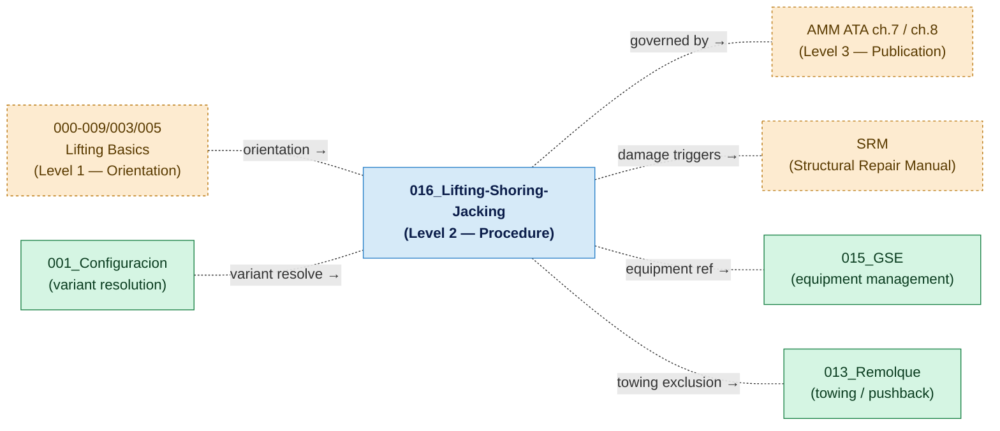

# ATLAS 010-019 · Section 01 · Subsection 016 · Subsubject 001 — Scope and Lifting, Shoring & Jacking Boundaries

## 1. Purpose

Defines the applicability, variant sensitivities, regulatory scope, and boundary rules that govern all documents within subsection `016_Lifting-Shoring-Jacking-Procedures/`. This subsubject is the **authoritative boundary declaration** for the subsection; any contributor adding or modifying content under `016_` must read this document first.

> **Scope boundary:** This file declares *what is in scope*, *what is out of scope*, and *how this subsection interfaces with adjacent documents*. The conceptual introduction to jacking, shoring, and leveling is in [`../../000-009_Informacion-General-y-Servicio/003_Operaciones-Basicas/005_Lifting-Shoring-and-Jacking-Basics.md`](../../000-009_Informacion-General-y-Servicio/003_Operaciones-Basicas/005_Lifting-Shoring-and-Jacking-Basics.md).

## 2. Scope

### 2.1 In-scope operations

The following operations are **in scope** for subsection `016_`:

| Operation | Description | Primary subsubject |
|---|---|---|
| **Jacking — full aircraft** | Raising the entire aircraft on three or four jacks simultaneously for gear retraction tests, weighing, or major gear maintenance | `003_Jacking-Procedures-and-Sequencing.md` |
| **Jacking — single gear** | Raising one gear assembly (nose or main) for tyre/wheel replacement or single-gear maintenance | `003_Jacking-Procedures-and-Sequencing.md` |
| **Shoring — structural support** | Placement of temporary structural props or shoring rigs when a primary structural member is removed, damaged, or temporarily weakened | `004_Shoring-and-Structural-Support-Procedures.md` |
| **Leveling** | Establishing the aircraft at the prescribed datum attitude for weighing, avionics calibration, or structural measurement | `005_Leveling-Weighing-and-Reference-Datum-Procedures.md` |
| **Aircraft weighing** | Measuring actual operating empty weight and centre-of-gravity position using calibrated weighing scales at jack points | `005_Leveling-Weighing-and-Reference-Datum-Procedures.md` |
| **Records and traceability** | Completion, retention, and audit of jacking, shoring, leveling, and weighing work orders and sign-off forms | `006_Lifting-Shoring-Jacking-Records-and-Traceability.md` |

### 2.2 Out-of-scope operations

The following operations are explicitly **out of scope** for subsection `016_`:

| Out-of-scope item | Correct location |
|---|---|
| Conceptual introduction to jacking/shoring/leveling | `000-009/003_Operaciones-Basicas/005_Lifting-Shoring-and-Jacking-Basics.md` |
| GSE selection and certification (jack procurement) | `010-019/015_GSE/` |
| Structural damage assessment triggering shoring | SRM (Structural Repair Manual) — external document |
| Towing with wing-tip or tail support (not jack-based) | `010-019/013_Remolque/` |
| Fuel system calibration (fuel gauging) | Relevant EPTA / avionics Code range |
| Published AMM or GMM step content | Level 3 publications — external to ATLAS |

### 2.3 Variant applicability

Jacking, shoring, and leveling procedures are **variant-dependent**. The applicable variant must be confirmed via the Configuration Baseline [`../../000-009_Informacion-General-y-Servicio/001_Configuracion/`](../../000-009_Informacion-General-y-Servicio/001_Configuracion/) before executing any procedure in this subsection.

| AMPEL360 variant family | Jack-point differences | Weighing considerations |
|---|---|---|
| Gen 1 (tube-and-wing, Jet-A/SAF) | Three-point configuration: fwd fuselage, two main gear beam jack points | Standard dry-weight weighing; fuel drained or measured |
| Gen 2 (BWB-H2 demonstrator) | Potentially four-point configuration; lower fuselage profile may require specialised jack adapters | LH₂ tanks must be purged and inerted before weighing; residual cryogen accounted for in empty-weight calculation |
| Hybrid / intermediate variants | Consult variant-specific AMM supplement | CG reference may shift with dual-fuel system configuration |

> **Warning:** Never assume jack-point locations from one variant apply to another without AMM confirmation.

### 2.4 Regulatory and standards boundary

All procedures in `016_` must comply with, and are derived from, the applicable **Aircraft Maintenance Manual (AMM)** for the variant in use. ATLAS subsection `016_` is a **programmatic and traceability layer** — it does not replace the AMM. The hierarchy is:

1. **AMM** (ATA chapters 7, 8) — governing technical authority.
2. **SRM** (Structural Repair Manual) — governing authority for shoring related to structural damage.
3. **ATLAS `016_`** — programmatic decomposition, traceability, and baseline management layer.
4. **Work orders and sign-off forms** — operational layer controlled by `006_Lifting-Shoring-Jacking-Records-and-Traceability.md`.

No content in `016_` supersedes the AMM. Where ATLAS content conflicts with the AMM, the AMM governs and a discrepancy report must be raised.

### 2.5 Three-level rule compliance

This subsection is **Level 2 — Procedure** in the three-level ATLAS content hierarchy declared in [`../../000-009_Informacion-General-y-Servicio/003_Operaciones-Basicas/000_Overview.md`](../../000-009_Informacion-General-y-Servicio/003_Operaciones-Basicas/000_Overview.md) §2.3:

| Level | Location | Role |
|---|---|---|
| **Level 1** | `000-009/003/005_Lifting-Shoring-and-Jacking-Basics.md` | Conceptual orientation — *what* jacking is |
| **Level 2** | `010-019/016_Lifting-Shoring-Jacking-Procedures/` | Operational procedure — *how* to jack, shore, level (this subsection) |
| **Level 3** | AMM ATA ch. 7 / ch. 8, SRM | Approved distributable publications |

## 3. Diagram — Scope and Boundary Map

## 4. Footprint

| Metric | Value |
|---|---|
| Architecture | `ATLAS` — Aircraft Top Level Architecture Schema/System (controlled term) |
| Master range | `000–099` |
| Code range | `010-019` |
| Section | `01` — Manejo en Tierra & Servicio |
| Subsection | `016` — Lifting, Shoring and Jacking Procedures |
| Subsubject | `001` — Scope and Lifting, Shoring & Jacking Boundaries |
| Scope level | Procedural (Level 2); orientation in `000-009/003/005_` |
| Conventional ATA reference | ATA chapters 7 (Lifting and Shoring), 8 (Leveling and Weighing) |
| Primary Q-Division | Q-GROUND[^qdiv] |
| Support Q-Divisions | Q-MECHANICS, Q-INDUSTRY |
| ORB support | ORB-PMO, ORB-FIN |
| Governance class | `baseline`[^gov] |
| Folder path | `Q+ATLANTIDE/000-099_ATLAS/010-019_Manejo-en-Tierra-Servicio/016_Lifting-Shoring-Jacking-Procedures/` |
| Document | `001_Scope-and-Lifting-Shoring-Jacking-Boundaries.md` (this file) |
| Parent subsection | [`README.md`](./README.md) · [`000_Overview.md`](./000_Overview.md) |
| Parent architecture | [`../../README.md`](../../README.md) |
| Parent baseline | [`organization/Q+ATLANTIDE.md`](../../../../organization/Q+ATLANTIDE.md) |

## 5. References & Citations

[^baseline]: **Q+ATLANTIDE controlled baseline (v1.0.0)** — [`organization/Q+ATLANTIDE.md`](../../../../organization/Q+ATLANTIDE.md). Defines the controlled `000-999` architecture-band taxonomy and the ATLAS-1000 register subpart.

[^archtable]: **§3 — Architecture Table (parent)** — [`../../README.md` §3](../../README.md#3-architecture-table). Source of authority for primary/support Q-Divisions and ORB support of this section.

[^qdiv]: **Q-Division authority** — [`organization/Q-Divisions/`](../../../../organization/Q-Divisions/). Technical-authority units for the Q+ATLANTIDE baseline.

[^gov]: **Governance class** — `baseline` denotes documents under controlled change management within the Q+ATLANTIDE baseline.

[^ata2200]: **ATA iSpec 2200** — Information standards for aviation maintenance documentation. ATA chapter 7 (Lifting and Shoring) and chapter 8 (Leveling and Weighing) govern the procedures this subsection decomposes.

[^ataspec100]: **ATA Spec 100** — Manufacturers' Technical Data standard.

[^s1000d]: **S1000D Issue 6.0** — International specification for technical publications.

[^as9100d]: **AS9100D** — Quality Management Systems — Aviation, Space and Defense Organizations.

### Applicable industry standards

- ATA iSpec 2200 — Information standards for aviation maintenance (ATA chapters 7, 8)[^ata2200]
- ATA Spec 100 — Manufacturers' Technical Data[^ataspec100]
- S1000D Issue 6.0 — International specification for technical publications[^s1000d]
- AS9100D — Quality Management Systems — Aviation, Space and Defense Organizations[^as9100d]
