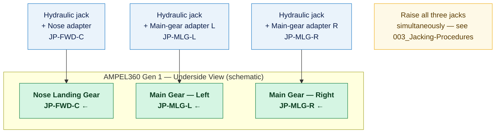

# ATLAS 010-019 · Section 01 · Subsection 016 · Subsubject 002 — Jack Points, Load Limits and Aircraft-Side Interfaces

## 1. Purpose

Defines the **approved jack-point locations**, their structural interfaces, maximum allowable load values, and jack-pad adapter requirements for each AMPEL360 variant family. This subsubject is the authoritative ATLAS-layer reference for jack-point data; the governing source remains the AMM, ATA chapter 7.

> **Warning:** Jack-point data in this file is a traceability and programmatic reference. Always verify against the current issue of the applicable AMM before performing any jacking operation. Aircraft modifications may add, remove, or relocate jack points.

## 2. Scope

### 2.1 Jack-point identification scheme

Each approved jack point is identified by a standardised three-field label:

```
JP-<ZONE>-<POSITION>
```

Where:
- `<ZONE>` = `FWD` (forward fuselage), `MLG` (main landing gear beam), `AFT` (aft fuselage / tail), `NLG` (nose landing gear — single-gear jacking only)
- `<POSITION>` = `L` (left/port), `R` (right/starboard), `C` (centreline)

Example: `JP-MLG-L` = left main landing gear beam jack point.

### 2.2 Approved jack points — Gen 1 (tube-and-wing, Jet-A/SAF)

Three-point jacking configuration for full-aircraft lifts:

| Jack Point ID | Location description | Structural fitting | Max load (kN) | Max load (t) | Jack adapter required |
|---|---|---|---|---|---|
| `JP-FWD-C` | Forward fuselage centreline, aft of nose gear bay | Reinforced keel-beam fitting, forward frame | TBD — verify AMM ch. 7 | TBD | Jack pad per ITEM — nose adapter |
| `JP-MLG-L` | Left main gear beam — inboard jack-point station | Main gear beam, rib/keel junction | TBD — verify AMM ch. 7 | TBD | Main-gear adapter — left |
| `JP-MLG-R` | Right main gear beam — inboard jack-point station | Main gear beam, rib/keel junction | TBD — verify AMM ch. 7 | TBD | Main-gear adapter — right |

> **Note:** Single-gear lifts (tyre/wheel change) use `JP-NLG-C` (nose) or `JP-MLG-L` / `JP-MLG-R` individually with the aircraft otherwise supported on ground. See `003_Jacking-Procedures-and-Sequencing.md` §2.3 for single-gear procedure.

### 2.3 Approved jack points — Gen 2 (BWB-H2 demonstrator)

The BWB (blended-wing body) planform requires a modified configuration. Confirm via Gen 2 AMM supplement before proceeding:

| Jack Point ID | Location description | Structural fitting | Max load (kN) | Max load (t) | Jack adapter required |
|---|---|---|---|---|---|
| `JP-FWD-L` | Forward centre-body, port side | BWB lower skin reinforced pad | TBD — verify Gen 2 AMM supplement | TBD | BWB fwd adapter — port |
| `JP-FWD-R` | Forward centre-body, starboard side | BWB lower skin reinforced pad | TBD — verify Gen 2 AMM supplement | TBD | BWB fwd adapter — starboard |
| `JP-AFT-L` | Aft centre-body, port side | Aft keel structure pad | TBD — verify Gen 2 AMM supplement | TBD | BWB aft adapter — port |
| `JP-AFT-R` | Aft centre-body, starboard side | Aft keel structure pad | TBD — verify Gen 2 AMM supplement | TBD | BWB aft adapter — starboard |

> **LH₂ variant note:** On Gen 2 aircraft, ensure the LH₂ tank area is not directly loaded during jacking. Do not place jack heads within the tank exclusion zone marked on the lower fuselage. Consult EPTA `460-469_` for hydrogen system ground-safety interlock requirements during jacking.

### 2.4 Jack-pad adapter requirements

Jack-pad adapters are **mandatory** between the hydraulic jack head and the aircraft structural fitting. Using a jack without the correct adapter may damage the aircraft structure and void maintenance authorisation.

| Adapter designation | Compatible jack-point IDs | Material | Inspection interval |
|---|---|---|---|
| Nose adapter Gen 1 | `JP-FWD-C` | Aluminium alloy 7075-T6; neoprene bearing face | Before each use — visual + torque check |
| Main gear adapter — left | `JP-MLG-L` | Steel (4340); machined cone fitting | Before each use — visual + dimensional check |
| Main gear adapter — right | `JP-MLG-R` | Steel (4340); machined cone fitting | Before each use — visual + dimensional check |
| BWB forward adapter | `JP-FWD-L`, `JP-FWD-R` | Aluminium alloy 7075-T6 | Before each use — visual + torque check |
| BWB aft adapter | `JP-AFT-L`, `JP-AFT-R` | Aluminium alloy 7075-T6 | Before each use — visual + torque check |

Adapters are controlled items listed in the ITEM (Illustrated Tool and Equipment Manual). Adapters with any crack, deformation, or missing inspection tag must be removed from service.

### 2.5 Maximum aircraft weight at jacking

Jacking must not be initiated if the actual aircraft weight exceeds the **maximum jacking weight (MJW)** defined in the AMM for the intended jack configuration:

| Configuration | Applicable variants | MJW condition |
|---|---|---|
| Three-point full lift | Gen 1 | Confirm fuel state + removable equipment mass ≤ MJW — verify AMM ch. 7 |
| Four-point full lift | Gen 2 | Confirm LH₂ tanks purged / inerted; residual mass ≤ MJW — verify Gen 2 AMM supplement |
| Single-gear lift | All variants | Aircraft otherwise on ground; wing fuel balanced per AMM |

If the aircraft exceeds MJW, defuel or remove equipment to the required condition before proceeding.

### 2.6 Structural interface inspection before jacking

Before applying any load, inspect each jack point for:

1. **Corrosion** — Surface corrosion on structural fitting must be assessed per SRM before jacking.
2. **Paint condition** — Bare metal or heavy peeling around jack fitting indicates potential corrosion or mechanical damage.
3. **Fitting security** — All fasteners at the jack fitting must be confirmed present and correctly torqued.
4. **Previous damage** — Any evidence of overload, scoring, or deformation from a previous jacking event must be assessed by engineering before reuse.

Record the pre-jacking structural interface inspection on the work order per `006_Lifting-Shoring-Jacking-Records-and-Traceability.md`.

## 3. Diagram — Jack-Point Layout (Gen 1 Three-Point Configuration)



## 4. Footprint

| Metric | Value |
|---|---|
| Architecture | `ATLAS` — Aircraft Top Level Architecture Schema/System (controlled term) |
| Master range | `000–099` |
| Code range | `010-019` |
| Section | `01` — Manejo en Tierra & Servicio |
| Subsection | `016` — Lifting, Shoring and Jacking Procedures |
| Subsubject | `002` — Jack Points, Load Limits and Aircraft-Side Interfaces |
| Scope level | Procedural (Level 2); orientation in `000-009/003/005_` |
| Conventional ATA reference | ATA chapter 7 — Lifting and Shoring |
| Primary Q-Division | Q-GROUND[^qdiv] |
| Support Q-Divisions | Q-MECHANICS, Q-INDUSTRY |
| ORB support | ORB-PMO, ORB-FIN |
| Governance class | `baseline`[^gov] |
| Folder path | `Q+ATLANTIDE/000-099_ATLAS/010-019_Manejo-en-Tierra-Servicio/016_Lifting-Shoring-Jacking-Procedures/` |
| Document | `002_Jack-Points-Load-Limits-and-Aircraft-Side-Interfaces.md` (this file) |
| Parent subsection | [`README.md`](./README.md) · [`000_Overview.md`](./000_Overview.md) |
| Jacking procedure | [`003_Jacking-Procedures-and-Sequencing.md`](./003_Jacking-Procedures-and-Sequencing.md) |
| Parent architecture | [`../../README.md`](../../README.md) |
| Parent baseline | [`organization/Q+ATLANTIDE.md`](../../../../organization/Q+ATLANTIDE.md) |

## 5. References & Citations

[^baseline]: **Q+ATLANTIDE controlled baseline (v1.0.0)** — [`organization/Q+ATLANTIDE.md`](../../../../organization/Q+ATLANTIDE.md). Defines the controlled `000-999` architecture-band taxonomy and the ATLAS-1000 register subpart.

[^archtable]: **§3 — Architecture Table (parent)** — [`../../README.md` §3](../../README.md#3-architecture-table). Source of authority for primary/support Q-Divisions and ORB support of this section.

[^qdiv]: **Q-Division authority** — [`organization/Q-Divisions/`](../../../../organization/Q-Divisions/). Technical-authority units for the Q+ATLANTIDE baseline.

[^gov]: **Governance class** — `baseline` denotes documents under controlled change management within the Q+ATLANTIDE baseline.

[^ata2200]: **ATA iSpec 2200** — Information standards for aviation maintenance documentation. ATA chapter 7 is the governing standard for jack-point identification and load limits.

[^ataspec100]: **ATA Spec 100** — Manufacturers' Technical Data standard.

[^s1000d]: **S1000D Issue 6.0** — International specification for technical publications.

[^as9100d]: **AS9100D** — Quality Management Systems — Aviation, Space and Defense Organizations.

### Applicable industry standards

- ATA iSpec 2200 — Information standards for aviation maintenance (ATA chapter 7)[^ata2200]
- ATA Spec 100 — Manufacturers' Technical Data[^ataspec100]
- S1000D Issue 6.0 — International specification for technical publications[^s1000d]
- AS9100D — Quality Management Systems — Aviation, Space and Defense Organizations[^as9100d]
