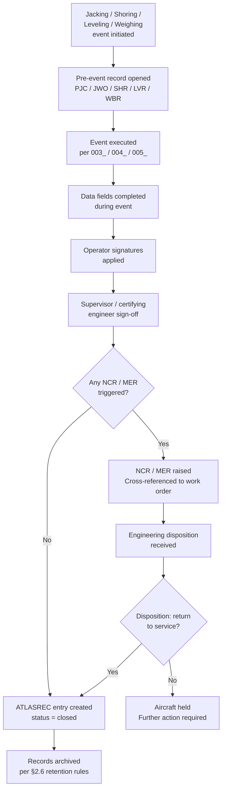

# ATLAS 010-019 · Section 01 · Subsection 016 · Subsubject 006 — Lifting, Shoring and Jacking Records and Traceability

## 1. Purpose

Defines the **records, sign-off requirements, traceability entries, and audit trail obligations** for all lifting, shoring, jacking, leveling, and weighing operations performed under subsection `016_`. Correct and complete documentation is a safety and regulatory requirement — no jacking, shoring, leveling, or weighing event is considered complete until all required records are closed out.

> **Regulatory basis:** Documentation requirements are governed by the applicable Continuing Airworthiness Maintenance Organisation (CAMO) exposition, the Aircraft Maintenance Organisation (AMO/MRO) Quality Manual, and the applicable national aviation authority (NAA) continuing-airworthiness regulations. ATLAS `016_006_` is the programmatic decomposition identifying the record types and minimum content requirements.

## 2. Scope

### 2.1 Record types

| Record type | Trigger | Minimum content | Retention period |
|---|---|---|---|
| **Jacking Work Order (JWO)** | Any full-aircraft or single-gear jacking event | Aircraft registration, MSN, task reference, date/time start/finish, jack serial numbers, jack-point IDs, max height reached, level readings, operator signatures, supervisor sign-off | Per CAMO — minimum 24 months or next similar event, whichever is longer |
| **Shoring Record (SHR)** | Any shoring installation event | EO number, SRM chapter reference, prop/rig IDs, support station IDs, load cell readings (if applicable), technician signatures, engineering authorisation reference | Per CAMO — until aircraft next re-weighed or structural modification that affects shoring record; minimum 24 months |
| **Weight and Balance Report (WBR)** | Any aircraft weighing event | Aircraft registration, MSN, weighing date, scale serial numbers + calibration dates, individual scale readings, fuel state (quantity per tank, density, temperature), W&B calculation worksheet, CG result, CG comparison to allowable envelope, authorised engineer signature | Lifetime of aircraft — archived in Aircraft Technical Records (ATR) |
| **Leveling Record (LVR)** | Leveling only (no weighing) | Aircraft registration, MSN, task reference, leveling instrument ID + calibration date, leveling station, pitch and roll readings, technician signature | Per CAMO — minimum 24 months |
| **Pre-Jacking Checklist (PJC)** | Every jacking event — completed before lift | All items in `003_Jacking-Procedures-and-Sequencing.md` §2.1, verified against aircraft state | Attached to corresponding JWO; same retention |
| **Tool and Equipment Issue Record** | Each issue of jacks, adapters, props, scales | Tool/equipment ID, calibration reference, issuing controller signature, receiving technician signature, return record | Per tool management procedure — minimum 12 months |

### 2.2 Minimum content requirements — Jacking Work Order (JWO)

Each JWO must capture the following data fields:

| Field | Description |
|---|---|
| Aircraft registration | Tail number / marking |
| MSN | Manufacturer's serial number |
| AMM reference | AMM chapter, section, subject authorising the jack operation |
| Task number | Work order / job card number |
| Date / start time | Local time (or UTC if cross-timezone) |
| Date / completion time | Local time or UTC |
| Jack 1 serial number | Jack at JP-FWD-C (or JP-FWD-L for Gen 2) |
| Jack 2 serial number | Jack at JP-MLG-L |
| Jack 3 serial number | Jack at JP-MLG-R |
| Jack 4 serial number (Gen 2 only) | Jack at JP-AFT-R or fourth point |
| Adapter serial numbers | One per jack |
| Maximum working height (mm) | Recorded at each jack point |
| Pre-lift level reading | Pitch/roll at leveling station (reference) |
| Post-lift level reading | Pitch/roll at working height |
| Pre-lowering level reading | Pitch/roll before beginning lower |
| Ground contact confirmed | Yes/No + time |
| Jack-point inspection result | Any finding / "no finding" |
| Operator signatures | One per jack position |
| Supervisor sign-off | Certifying supervisor AME licence number + signature |

### 2.3 Minimum content requirements — Weight and Balance Report (WBR)

The WBR is a permanent aircraft record and must contain:

| Field | Description |
|---|---|
| Aircraft registration / MSN / variant | Full identification |
| Weighing date and location | Hangar / apron stand |
| Ambient conditions | Temperature (°C), humidity (%), wind speed |
| Scale identification | Make, model, serial number, calibration certificate number, calibration expiry date (one per scale) |
| Scale placement | Jack-point ID each scale was placed at |
| Tare mass | Jack adapter + scale adapter plate mass per scale position |
| Gross reading — each scale | Raw reading before tare subtraction (kg) |
| Net reading — each scale | Gross minus tare (kg) |
| Total aircraft mass | Sum of net readings (kg) |
| Fuel state — each tank | Litres or kg, density (kg/L), temperature (°C) |
| Fuel mass correction | Mass correction to reach dry / zero-fuel condition |
| Corrected zero-fuel mass | Total mass minus fuel correction (kg) |
| Jack-point arm values (mm) | From AMM / WBM — one per jack point |
| CG calculation | `Σ(Net_i × Arm_i) / Σ(Net_i)` — worked calculation shown |
| CG result | mm aft of datum |
| Allowable CG range at this weight | Forward limit / aft limit (from WBM) |
| CG within envelope | Yes / No |
| Authorised signatory | Authorised engineer (B2 or equivalent) — name, licence number, signature, date |

### 2.4 ATLASREC traceability entries

All events under subsection `016_` must be entered in the ATLASREC (ATLAS Record) traceability system or equivalent aircraft record management system used by the organisation. Minimum entry fields:

| ATLASREC field | Value |
|---|---|
| `event_type` | `JACK` / `SHORE` / `LEVEL` / `WEIGH` |
| `atlas_subsubject` | `QATL-ATLAS-1000-ATLAS-010-019-01-016-NNN-*` |
| `aircraft_msn` | Aircraft manufacturer serial number |
| `event_date` | ISO 8601 date — YYYY-MM-DD |
| `record_reference` | JWO / SHR / WBR / LVR reference number |
| `authorised_by` | Certifying engineer name + licence |
| `status` | `open` / `closed` |

Events must be closed (status = `closed`) before the aircraft is returned to service after any jacking, shoring, leveling, or weighing operation.

### 2.5 Non-conformance and discrepancy reporting

The following events require a **Non-Conformance Report (NCR)** or **Maintenance Event Report (MER)** in addition to the standard work order:

| Event | Required report type |
|---|---|
| ATLAS content conflicts with current AMM | Discrepancy report — raise against ATLAS `016_` document; halt operation; do not proceed |
| Jack load exceeded MJW during operation | MER + structural assessment before return to service |
| Jack-point structural damage found | NCR + SRM assessment; aircraft grounded pending engineering disposition |
| Scale calibration found out-of-date post-weighing | NCR; weighing result void; re-weigh required |
| Aircraft level outside AMM tolerance during lift | MER; jack down; investigate; re-attempt |
| Safety collar not engaged — work performed | Immediate safety event report; engineering inspection; root-cause investigation |

All NCRs and MERs must be cross-referenced to the relevant JWO, WBR, or SHR.

### 2.6 Record retention and archival

| Record type | Retention | Archive location |
|---|---|---|
| JWO, LVR, PJC | 24 months minimum | AMO maintenance records system |
| SHR | 24 months minimum or until next structural event affecting the shored area | AMO maintenance records system |
| WBR | Lifetime of aircraft | Aircraft Technical Records (ATR) — permanent file |
| ATLASREC entries | Lifetime of aircraft (system log) | ATLASREC / equivalent system |
| Tool/equipment issue records | 12 months minimum | Tool store management system |

Records must be legible, indelible (no pencil for final sign-off), and protected from accidental alteration. Digital records must be stored in a system with audit-log capability per AS9100D and the organisation's Quality Manual.

## 3. Diagram — Records Lifecycle

## 4. Footprint

| Metric | Value |
|---|---|
| Architecture | `ATLAS` — Aircraft Top Level Architecture Schema/System (controlled term) |
| Master range | `000–099` |
| Code range | `010-019` |
| Section | `01` — Manejo en Tierra & Servicio |
| Subsection | `016` — Lifting, Shoring and Jacking Procedures |
| Subsubject | `006` — Lifting, Shoring and Jacking Records and Traceability |
| Scope level | Procedural (Level 2); records governance |
| Conventional ATA reference | ATA chapters 7, 8 — record obligations for lifting, leveling, and weighing |
| Primary Q-Division | Q-GROUND[^qdiv] |
| Support Q-Divisions | Q-MECHANICS, Q-INDUSTRY |
| ORB support | ORB-PMO, ORB-FIN |
| Governance class | `baseline`[^gov] |
| Folder path | `Q+ATLANTIDE/000-099_ATLAS/010-019_Manejo-en-Tierra-Servicio/016_Lifting-Shoring-Jacking-Procedures/` |
| Document | `006_Lifting-Shoring-Jacking-Records-and-Traceability.md` (this file) |
| Parent subsection | [`README.md`](./README.md) · [`000_Overview.md`](./000_Overview.md) |
| Jacking procedure | [`003_Jacking-Procedures-and-Sequencing.md`](./003_Jacking-Procedures-and-Sequencing.md) |
| Shoring procedure | [`004_Shoring-and-Structural-Support-Procedures.md`](./004_Shoring-and-Structural-Support-Procedures.md) |
| Leveling and weighing | [`005_Leveling-Weighing-and-Reference-Datum-Procedures.md`](./005_Leveling-Weighing-and-Reference-Datum-Procedures.md) |
| Parent architecture | [`../../README.md`](../../README.md) |
| Parent baseline | [`organization/Q+ATLANTIDE.md`](../../../../organization/Q+ATLANTIDE.md) |

## 5. References & Citations

[^baseline]: **Q+ATLANTIDE controlled baseline (v1.0.0)** — [`organization/Q+ATLANTIDE.md`](../../../../organization/Q+ATLANTIDE.md). Defines the controlled `000-999` architecture-band taxonomy and the ATLAS-1000 register subpart.

[^archtable]: **§3 — Architecture Table (parent)** — [`../../README.md` §3](../../README.md#3-architecture-table). Source of authority for primary/support Q-Divisions and ORB support of this section.

[^qdiv]: **Q-Division authority** — [`organization/Q-Divisions/`](../../../../organization/Q-Divisions/). Technical-authority units for the Q+ATLANTIDE baseline.

[^gov]: **Governance class** — `baseline` denotes documents under controlled change management within the Q+ATLANTIDE baseline.

[^ata2200]: **ATA iSpec 2200** — Information standards for aviation maintenance documentation. ATA chapters 7 and 8 specify record requirements for jacking, shoring, leveling, and weighing operations.

[^ataspec100]: **ATA Spec 100** — Manufacturers' Technical Data standard.

[^s1000d]: **S1000D Issue 6.0** — International specification for technical publications.

[^as9100d]: **AS9100D** — Quality Management Systems — Aviation, Space and Defense Organizations. Governs record integrity, audit-log, and document-control requirements for all ATLAS records.

### Applicable industry standards

- ATA iSpec 2200 — Information standards for aviation maintenance (ATA chapters 7, 8)[^ata2200]
- ATA Spec 100 — Manufacturers' Technical Data[^ataspec100]
- S1000D Issue 6.0 — International specification for technical publications[^s1000d]
- AS9100D — Quality Management Systems — Aviation, Space and Defense Organizations[^as9100d]
