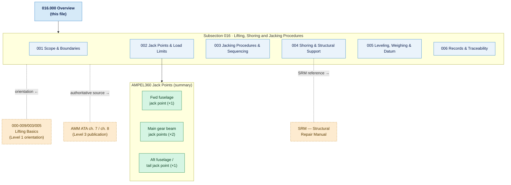

# ATLAS 010-019 · Section 01 · Subsection 016 · Subsubject 000 — Overview

## 1. Purpose

Overview entry-point for *Lifting, Shoring and Jacking Procedures* (`016`) — the sixth subsection of Code range `010-019` (*Manejo en Tierra & Servicio*), which is the **second Code range of the ATLAS master range** (`000–099`).

This subsubject introduces the procedural scope, jack-point map summary, safety prerequisites, and document structure for all operations that raise, stabilise, or level an AMPEL360 aircraft during maintenance. It is the **Level 2 — Procedure** counterpart to the introductory orientation in [`../../000-009_Informacion-General-y-Servicio/003_Operaciones-Basicas/005_Lifting-Shoring-and-Jacking-Basics.md`](../../000-009_Informacion-General-y-Servicio/003_Operaciones-Basicas/005_Lifting-Shoring-and-Jacking-Basics.md)[^basics].

> **Conventional ATA reference:** ATA chapter 7 (Lifting and Shoring) and ATA chapter 8 (Leveling and Weighing). ATLAS `016_` is the programmatic equivalent within the `010-019` Code range.

## 2. Scope

### 2.1 Position within ATLAS 010-019

`016_Lifting-Shoring-Jacking-Procedures/` occupies the sixth procedural slot in Code range `010-019`:

| Code | Title | Role within the Code range |
|---|---|---|
| `010` | Ground Handling | Turnaround, chocking, exclusion zones |
| `011` | Servicing | Fluid and gas replenishment / drainage |
| `012` | Acceso | Maintenance platforms and access systems |
| `013` | Remolque | Towing and pushback procedures |
| `014` | Parking | Mooring, storage, and parking procedures |
| `015` | GSE | Ground support equipment management |
| **`016`** | **Lifting, Shoring and Jacking Procedures** | **Jacking, shoring, leveling, and weighing ← this subsection** |

### 2.2 Subsubject structure

| 00N | Title | Key procedural scope |
|---|---|---|
| `000` | Overview | Jack-point map summary, safety prerequisites, document structure (this file) |
| `001` | Scope and Lifting, Shoring & Jacking Boundaries | Applicability, variant sensitivities, regulatory scope, boundary rules |
| `002` | Jack Points, Load Limits and Aircraft-Side Interfaces | Approved jack points by variant, structural fittings, maximum load values |
| `003` | Jacking Procedures and Sequencing | Step-level jacking sequence, level monitoring, safety-collar usage |
| `004` | Shoring and Structural Support Procedures | Approved shoring rigs, placement, load-path analysis |
| `005` | Leveling, Weighing and Reference Datum Procedures | Datum establishment, spirit-level stations, weighing scales |
| `006` | Lifting, Shoring and Jacking Records and Traceability | Sign-off forms, ATLASREC entries, audit trail requirements |

### 2.3 Safety prerequisites — MANDATORY before any lift

The following conditions must be verified before any jacking, shoring, or leveling operation is initiated:

1. **Aircraft weight condition** — Confirm actual aircraft weight (fuel state, loose equipment removed) is within the maximum jacking weight for the intended operation. Verify against the applicable AMM, ATA chapter 7.
2. **Jack-point identification** — Identify and mark all approved jack points per `016-002-Jack-Points-Load-Limits-and-Aircraft-Side-Interfaces.md`. Never jack on unapproved structure.
3. **Approved equipment** — Use only jacks and shoring rigs listed in the applicable Illustrated Tool and Equipment Manual (ITEM) or approved equivalent.
4. **Personnel briefing** — Minimum crew: one operator at each jack, one supervisor monitoring level, one spotter at the nose. All must be briefed on emergency-lower procedure before the lift begins.
5. **Area clearance** — Confirm all GSE, access platforms, and personnel not assigned to the lift are clear of the aircraft. Establish exclusion zone minimum radius per the AMM.
6. **Weather** — No jacking in winds exceeding the AMM-specified limit. Confirm floor loading is within hangar floor limits if applicable.
7. **Systems safe** — Hydraulic system depressurised (or safely pressurised if gear retraction test), avionics off, all control-surface locks installed.

### 2.4 Scope boundary — orientation vs. procedure

| Level | Document | Role |
|---|---|---|
| **Level 1 — Orientation** | `000-009/003_Operaciones-Basicas/005_Lifting-Shoring-and-Jacking-Basics.md` | *What* jacking is, key concepts, shared vocabulary |
| **Level 2 — Procedure** | `010-019/016_Lifting-Shoring-Jacking-Procedures/` | *How* to jack, shore, level, and weigh — step sequences, limits, sign-offs (this subsection) |
| **Level 3 — Publication** | AMM ATA ch. 7 / ch. 8, SRM | Approved, distributable technical publications |

Content shall not be duplicated across levels. Step-level procedures belong in Level 2; conceptual definitions belong in Level 1.

## 3. Diagram — Subsection Structure and Jack-Point Map Summary

*Solid arrows indicate ownership/structure. Dotted arrows indicate cross-document interfaces.*

## 4. Footprint

| Metric | Value |
|---|---|
| Architecture | `ATLAS` — Aircraft Top Level Architecture Schema/System (controlled term) |
| Master range | `000–099` |
| Code range | `010-019` |
| Section | `01` — Manejo en Tierra & Servicio |
| Subsection | `016` — Lifting, Shoring and Jacking Procedures |
| Subsubject | `000` — Overview |
| Scope level | Procedural (Level 2); orientation in `000-009/003/005_` |
| Conventional ATA reference | ATA chapters 7 (Lifting and Shoring), 8 (Leveling and Weighing) |
| Primary Q-Division | Q-GROUND[^qdiv] |
| Support Q-Divisions | Q-MECHANICS, Q-INDUSTRY |
| ORB support | ORB-PMO, ORB-FIN |
| Governance class | `baseline`[^gov] |
| Folder path | `Q+ATLANTIDE/000-099_ATLAS/010-019_Manejo-en-Tierra-Servicio/016_Lifting-Shoring-Jacking-Procedures/` |
| Document | `016-000-Lifting-Shoring-Jacking-Procedures-Overview.md` (this file) |
| Parent subsection | [`README.md`](./README.md) |
| Orientation layer | [`../../000-009_Informacion-General-y-Servicio/003_Operaciones-Basicas/005_Lifting-Shoring-and-Jacking-Basics.md`](../../000-009_Informacion-General-y-Servicio/003_Operaciones-Basicas/005_Lifting-Shoring-and-Jacking-Basics.md) |
| Parent architecture | [`../../README.md`](../../README.md) |
| Parent baseline | [`organization/Q+ATLANTIDE.md`](../../../../organization/Q+ATLANTIDE.md) |

## 5. References & Citations

[^baseline]: **Q+ATLANTIDE controlled baseline (v1.0.0)** — [`organization/Q+ATLANTIDE.md`](../../../../organization/Q+ATLANTIDE.md). Defines the controlled `000-999` architecture-band taxonomy and the ATLAS-1000 register subpart.

[^archtable]: **§3 — Architecture Table (parent)** — [`../../README.md` §3](../../README.md#3-architecture-table). Source of authority for primary/support Q-Divisions and ORB support of this section.

[^qdiv]: **Q-Division authority** — [`organization/Q-Divisions/`](../../../../organization/Q-Divisions/). Technical-authority units for the Q+ATLANTIDE baseline.

[^gov]: **Governance class** — `baseline` denotes documents under controlled change management within the Q+ATLANTIDE baseline.

[^basics]: **Orientation layer** — [`../../000-009_Informacion-General-y-Servicio/003_Operaciones-Basicas/005_Lifting-Shoring-and-Jacking-Basics.md`](../../000-009_Informacion-General-y-Servicio/003_Operaciones-Basicas/005_Lifting-Shoring-and-Jacking-Basics.md). Level 1 introductory orientation for jacking, shoring, and leveling concepts.

[^ata2200]: **ATA iSpec 2200** — Information standards for aviation maintenance documentation. ATA chapter 7 (Lifting and Shoring) and chapter 8 (Leveling and Weighing) are the conventional chapter references for this subsection's scope.

[^ataspec100]: **ATA Spec 100** — Manufacturers' Technical Data standard.

[^s1000d]: **S1000D Issue 6.0** — International specification for technical publications.

[^as9100d]: **AS9100D** — Quality Management Systems — Aviation, Space and Defense Organizations.

### Applicable industry standards

- ATA iSpec 2200 — Information standards for aviation maintenance (ATA chapters 7, 8)[^ata2200]
- ATA Spec 100 — Manufacturers' Technical Data[^ataspec100]
- S1000D Issue 6.0 — International specification for technical publications[^s1000d]
- AS9100D — Quality Management Systems — Aviation, Space and Defense Organizations[^as9100d]
