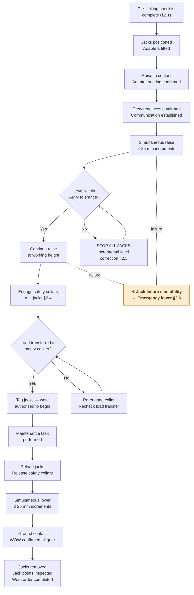

# ATLAS 010-019 · Section 01 · Subsection 016 · Subsubject 003 — Jacking Procedures and Sequencing

## 1. Purpose

Provides the **step-level jacking procedure** for [PROGRAMME-AIRCRAFT] aircraft, covering full-aircraft three-point lifts, single-gear lifts, level monitoring, safety-collar engagement, and the emergency-lower procedure. This subsubject is the primary procedural reference for all jacking operations performed under subsection `016_`.

> **Governing source:** All steps in this document are derived from the applicable AMM, ATA chapter 7. Where this document conflicts with the current AMM issue, the AMM governs. Raise a discrepancy report and do not proceed until resolved.

## 2. Scope

### 2.1 Pre-jacking checklist

Before initiating any jack operation, verify all items on the Pre-Jacking Checklist (work order attachment — see `016-006-Lifting-Shoring-Jacking-Records-and-Traceability.md`):

| # | Check item | Verified by |
|---|---|---|
| 1 | Aircraft weight within Maximum Jacking Weight (MJW) — AMM ch. 7 | AME / Lead mechanic |
| 2 | Jack-point locations confirmed and marked — `016-002-Jack-Points-Load-Limits-and-Aircraft-Side-Interfaces.md` | AME |
| 3 | Correct jack adapters fitted and inspected | AME |
| 4 | All jacks verified functional, hydraulic fluid level OK, pressure gauge calibration current | Equipment controller |
| 5 | Crew briefed (minimum: one operator per jack + one supervisor + one spotter) | Supervisor |
| 6 | Aircraft area cleared — exclusion zone established | Supervisor |
| 7 | Weather within limits — no jacking above wind speed limit per AMM | Supervisor |
| 8 | Hydraulic system depressurised (or per AMM for gear retraction test) | AME |
| 9 | All flight control surfaces locked; gust locks installed | AME |
| 10 | Aircraft chocked (chocks remain until all jacks at working height with safety collars engaged) | AME |

### 2.2 Full-aircraft three-point lift procedure — Gen 1

**Required personnel:** Minimum four: one operator at each of the three jacks, one supervisor monitoring level and coordinating.

**Step sequence:**

1. **Position jacks** — Roll each jack into position beneath its jack point. Do not apply load.
2. **Fit adapters** — Install the correct jack-pad adapter on each jack head. Confirm adapter seating — no rocking.
3. **Raise to contact** — Slowly raise each jack until the adapter makes light contact with the aircraft fitting. Confirm adapter is correctly seated in the fitting socket.
4. **Confirm crew readiness** — Supervisor confirms all operators are at their jacks, communication established (hand signals or radio), spotter at nose.
5. **Begin simultaneous raise** — Raise all three jacks simultaneously at equal, slow increments (≤ 25 mm per raise increment, or per AMM limit). Maintain visual contact with the level indicator throughout.
6. **Monitor level continuously** — The supervisor monitors the aircraft level indicator (spirit level or electronic inclinometer at the designated reference station). If level deviates beyond AMM tolerance, pause all jacks immediately and correct (§2.5).
7. **Clear of chocks** — At the moment the main gear becomes airborne, the spotter confirms wheels clear of chocks. Chocks may be removed after all main gear clears the ground.
8. **Continue to working height** — Continue raising to the required working height per the maintenance task. Do not exceed the maximum jack height published in the AMM.
9. **Engage safety collars** — Engage mechanical safety collars on all jacks. Do not perform maintenance work under a jacked aircraft without safety collars engaged.
10. **Confirm stable** — Supervisor confirms the aircraft is stable, level within tolerance, and all safety collars are fully engaged before authorising maintenance work to begin.
11. **Document** — Record jack-up time, operators, jack serial numbers, and aircraft level reading on the work order.

### 2.3 Single-gear lift procedure

Single-gear lifts are used for tyre/wheel replacement or single-gear maintenance where only one gear needs to be raised.

**Additional prerequisite:** Confirm the aircraft is on level ground. Ensure the opposite gear (and nose gear for main-gear single lifts) are correctly chocked.

**Step sequence:**

1. Position the single jack at the applicable jack point (`JP-MLG-L`, `JP-MLG-R`, or `JP-FWD-C` for nose gear only — confirm with AMM).
2. Fit the correct adapter.
3. Raise slowly to contact; confirm adapter seating.
4. Raise until tyre is clear of the ground (minimum clearance per AMM for tyre/wheel removal).
5. Engage safety collar immediately.
6. Confirm aircraft is stable on the remaining two gear plus the single jack before proceeding.

> **Do not** raise a single main gear while the other main gear is also raised (no two-jack configuration unless the AMM explicitly permits it with a specific three- or four-jack configuration).

### 2.4 Safety-collar engagement procedure

Safety collars (also called mechanical locking rings or jack lock rings) are mandatory before performing work under any jacked aircraft.

| Step | Action |
|---|---|
| 1 | After jack reaches working height, stop hydraulic pump. |
| 2 | Rotate the mechanical safety collar down the jack barrel until it contacts the support surface. |
| 3 | Confirm collar is fully engaged — no gap between collar and support surface; collar cannot rotate freely. |
| 4 | Lower the jack hydraulic pressure slightly to transfer load onto the safety collar. |
| 5 | Verify load transfer — jack hydraulic gauge should drop to near-zero if load fully on collar. |
| 6 | Tag the jack with a "Safety Collar Engaged" placard before any personnel work under the aircraft. |

**Never** work under a jacked aircraft unless all safety collars are confirmed engaged per steps 1–6.

### 2.5 Level correction during jacking

If the aircraft level deviates beyond the AMM-specified tolerance during a lift:

1. **Stop all jacks immediately.** Do not continue raising while off-level.
2. Identify which jack is high or low relative to the others.
3. Raise only the low jack(s) incrementally (≤ 10 mm steps) while other operators hold position.
4. Re-check level after each increment.
5. Continue simultaneous raise only when level is restored within AMM tolerance.

If level cannot be restored by incremental jack adjustment — for example due to a stuck jack or unequal load path — lower all jacks using the emergency-lower procedure (§2.6) and investigate before re-attempting.

### 2.6 Emergency-lower procedure

In the event of jack failure, loss of hydraulic pressure, or aircraft instability during a lift:

1. **Immediate action:** Shout/radio "STOP — HOLD ALL JACKS" to all operators.
2. Confirm all personnel are clear from under the aircraft.
3. Engage safety collars on any jacks where collars are not already engaged.
4. Assess cause of instability before proceeding.
5. If emergency lower is required: release hydraulic pressure very slowly on all jacks simultaneously. Do not release one jack rapidly while others hold — this may cause a sideways tipping load.
6. Lower aircraft to ground contact on all gear simultaneously; confirm chocks are in place before completing lower.
7. Raise a maintenance event report and do not repeat the jacking operation until the root cause is identified and resolved.

### 2.7 Lowering procedure — normal

After maintenance task is complete:

1. Raise jack hydraulic pressure to reload the jack before releasing the safety collar.
2. Disengage safety collars on all jacks simultaneously.
3. Lower all jacks simultaneously at equal, slow increments (≤ 25 mm per increment).
4. Monitor level continuously during lowering.
5. At ground contact, confirm weight-on-wheels indication (WOW = TRUE) on all gear.
6. Continue lowering until all jacks are fully unloaded (jack gauges at zero).
7. Remove jacks and adapters.
8. Inspect jack-point fittings for any damage.
9. Replace chocks as required for post-maintenance ground state.
10. Complete work order documentation per `016-006-Lifting-Shoring-Jacking-Records-and-Traceability.md`.

## 3. Diagram — Full-Aircraft Jacking Sequence

## 4. Footprint

| Metric | Value |
|---|---|
| Architecture | `ATLAS` — Aircraft Top Level Architecture Schema/System (controlled term) |
| Master range | `000–099` |
| Code range | `010-019` |
| Section | `01` — Manejo en Tierra & Servicio |
| Subsection | `016` — Lifting, Shoring and Jacking Procedures |
| Subsubject | `003` — Jacking Procedures and Sequencing |
| Scope level | Procedural (Level 2); orientation in `000-009/003/005_` |
| Conventional ATA reference | ATA chapter 7 — Lifting and Shoring |
| Primary Q-Division | Q-GROUND[^qdiv] |
| Support Q-Divisions | Q-MECHANICS, Q-INDUSTRY |
| ORB support | ORB-PMO, ORB-FIN |
| Governance class | `baseline`[^gov] |
| Folder path | `Q+ATLANTIDE/000-099_ATLAS/010-019_Manejo-en-Tierra-Servicio/016_Lifting-Shoring-Jacking-Procedures/` |
| Document | `016-003-Jacking-Procedures-and-Sequencing.md` (this file) |
| Parent subsection | [`README.md`](./README.md) · [`016-000-Lifting-Shoring-Jacking-Procedures-Overview.md`](./016-000-Lifting-Shoring-Jacking-Procedures-Overview.md) |
| Jack-point reference | [`016-002-Jack-Points-Load-Limits-and-Aircraft-Side-Interfaces.md`](./016-002-Jack-Points-Load-Limits-and-Aircraft-Side-Interfaces.md) |
| Records | [`016-006-Lifting-Shoring-Jacking-Records-and-Traceability.md`](./016-006-Lifting-Shoring-Jacking-Records-and-Traceability.md) |
| Parent architecture | [`../../README.md`](../../README.md) |
| Parent baseline | [`organization/Q+ATLANTIDE.md`](../../../../organization/Q+ATLANTIDE.md) |

## 5. References & Citations

[^baseline]: **Q+ATLANTIDE controlled baseline (v1.0.0)** — [`organization/Q+ATLANTIDE.md`](../../../../organization/Q+ATLANTIDE.md). Defines the controlled `000-999` architecture-band taxonomy and the ATLAS-1000 register subpart.

[^archtable]: **§3 — Architecture Table (parent)** — [`../../README.md` §3](../../README.md#3-architecture-table). Source of authority for primary/support Q-Divisions and ORB support of this section.

[^qdiv]: **Q-Division authority** — [`organization/Q-Divisions/`](../../../../organization/Q-Divisions/). Technical-authority units for the Q+ATLANTIDE baseline.

[^gov]: **Governance class** — `baseline` denotes documents under controlled change management within the Q+ATLANTIDE baseline.

[^ata2200]: **ATA iSpec 2200** — Information standards for aviation maintenance documentation. ATA chapter 7 governs all jacking and shoring procedures for which ATLAS `016_003_` is the programmatic decomposition.

[^ataspec100]: **ATA Spec 100** — Manufacturers' Technical Data standard.

[^s1000d]: **S1000D Issue 6.0** — International specification for technical publications.

[^as9100d]: **AS9100D** — Quality Management Systems — Aviation, Space and Defense Organizations.

### Applicable industry standards

- ATA iSpec 2200 — Information standards for aviation maintenance (ATA chapter 7)[^ata2200]
- ATA Spec 100 — Manufacturers' Technical Data[^ataspec100]
- S1000D Issue 6.0 — International specification for technical publications[^s1000d]
- AS9100D — Quality Management Systems — Aviation, Space and Defense Organizations[^as9100d]
