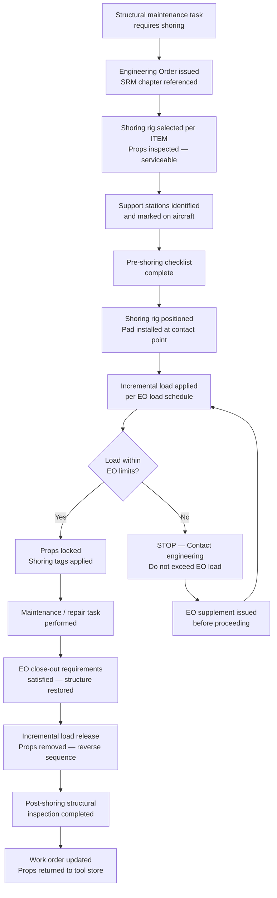

# ATLAS 010-019 · Section 01 · Subsection 016 · Subsubject 004 — Shoring and Structural Support Procedures

## 1. Purpose

Defines the **shoring and structural support procedures** for [PROGRAMME-AIRCRAFT] aircraft — the placement, loading, and removal of temporary structural props, shoring rigs, and support beams used when a primary structural member is removed, damaged, or temporarily weakened during maintenance or repair. Shoring is an **engineering-authorised action**; no shoring may be installed without a written Engineering Order (EO) or maintenance instruction referencing the applicable SRM (Structural Repair Manual).

> **Governing sources:** SRM (Structural Repair Manual) governs shoring configurations for specific structural damage scenarios. AMM, ATA chapter 7 governs general shoring provisions. ATLAS `016_004_` is the programmatic decomposition and traceability reference.

## 2. Scope

### 2.1 When shoring is required

Shoring is required in the following circumstances:

| Trigger | Description | Authorisation required |
|---|---|---|
| **Structural member removal** | A primary structural element (spar, frame, keel beam section, bulkhead) is removed for replacement or major repair | Engineering Order + SRM chapter reference |
| **Structural damage — ground** | Damage assessed as requiring temporary support to prevent further deformation before repair | Damage assessment report + EO + SRM chapter reference |
| **Jacking on uneven surface** | Aircraft must be stabilised on a surface that does not allow standard three-point jacking geometry | EO or AMM ch. 7 provision |
| **Fuel system modification** | Large fuel system modification requiring the lower wing structure to be unloaded | EO + AMM supplement reference |
| **Landing gear removal** | Complete gear assembly removed for overhaul — fuselage must be supported at the gear beam | AMM ch. 7 + EO |

### 2.2 Shoring rig categories

| Category | Description | Typical application |
|---|---|---|
| **Axial prop** | Single telescoping column, steel or aluminium alloy, adjustable height, pad at each end | Vertical load transfer under a frame or keel beam section |
| **Purpose-built shoring frame** | Manufacturer-designed rig for a specific structural removal — listed in AMM / ITEM | Landing gear beam removal, spar removal |
| **Spreader beam + props** | Horizontal spreader beam distributing load across two or more props | Fuselage lower skin support during floor beam removal |
| **Wing trestle** | Padded support stand under wing lower surface at a defined support station | Wing-tip and outboard wing support during gear removal |

Use **only** shoring rigs and props listed in the applicable ITEM or EO. Improvised supports are prohibited.

### 2.3 Pre-shoring procedure

Before installing any shoring:

1. **Obtain EO and SRM reference** — Confirm the Engineering Order is issued and SRM chapter is identified. Document EO number on work order.
2. **Confirm shoring rig availability and condition** — Check ITEM; inspect selected props/frames for damage, deformation, or missing labels. Tag and remove from service any defective items.
3. **Identify support stations** — Locate and mark support stations on the aircraft per EO. Do not shore at unapproved locations.
4. **Calculate load path** — Confirm load distribution per EO or SRM shoring analysis. If load calculation is not included in the EO, request engineering supplement before proceeding.
5. **Area clearance** — Establish exclusion zone around the shoring area. Brief all personnel.

### 2.4 Shoring installation procedure

**General sequence (verify against EO for task-specific requirements):**

| Step | Action | Verify |
|---|---|---|
| 1 | Position shoring rig at the designated support station per EO | Correct station confirmed against aircraft marking |
| 2 | Install pad at contact point between rig and aircraft structure — use only the pad specified in the EO | Pad material matches EO requirement; no metallic direct contact unless EO specifies |
| 3 | Extend prop/rig to achieve light contact with the aircraft at the support station | No preloading at this step |
| 4 | Apply incremental load per EO load schedule — if EO specifies load values, use a calibrated load cell or torque-limited hydraulic ram | Load cell / torque reading matches EO |
| 5 | Confirm the aircraft has not deflected beyond allowable limits per EO | Visual check of reference datum and spirit-level station |
| 6 | Lock all adjustable prop mechanisms — ensure props cannot be inadvertently extended or retracted | Locking collar / lock-nut confirmed |
| 7 | Tag each prop/rig with a "Shoring Installed" maintenance tag showing EO number, date, and technician sign-off | Tags confirmed in place |
| 8 | Record shoring installation on work order per `016-006-Lifting-Shoring-Jacking-Records-and-Traceability.md` | Work order entry complete |

### 2.5 Shoring removal procedure

Shoring shall be removed only after the structural repair or maintenance task is complete and the structure has been returned to its original load-bearing capability per EO close-out requirements.

| Step | Action |
|---|---|
| 1 | Confirm EO close-out requirement is satisfied — structural inspection / NDI complete as required |
| 2 | Confirm all personnel are clear of the structure being re-loaded |
| 3 | Incrementally reduce prop load (reverse of installation load schedule per EO) |
| 4 | Remove props/rigs and pads in reverse installation order |
| 5 | Inspect contact surfaces on aircraft structure for any indentation, scratch, or damage from the prop pads — report any finding per the standard defect reporting procedure |
| 6 | Remove all shoring tags; update work order to "shoring removed" state |
| 7 | Return props/rigs to tool store; record return in ITEM tracking system |

### 2.6 Wing trestle — special considerations

Wing trestles used during landing gear removal must:

- Be positioned at the wing support station identified in the AMM (not at unapproved wing skin locations).
- Use the approved neoprene or composite pad to avoid skin damage.
- Be rated for the local wing weight at the applicable fuel state.
- Be secured to the trestle base — no tipping under asymmetric load.
- Remain installed until the gear is reinstalled and load-path continuity is restored through the gear attach fittings.

### 2.7 Structural interface inspection post-shoring

After shoring removal, inspect all prop-contact surfaces on the aircraft structure for:

1. Localised dimpling or deformation of skin panels.
2. Scratch marks or paint removal at the contact pad location.
3. Any cracking or disbond at the contact zone.

Any finding must be assessed per SRM before the aircraft is returned to service. Document findings on the work order.

## 3. Diagram — Shoring Authorisation and Installation Flow

## 4. Footprint

| Metric | Value |
|---|---|
| Architecture | `ATLAS` — Aircraft Top Level Architecture Schema/System (controlled term) |
| Master range | `000–099` |
| Code range | `010-019` |
| Section | `01` — Manejo en Tierra & Servicio |
| Subsection | `016` — Lifting, Shoring and Jacking Procedures |
| Subsubject | `004` — Shoring and Structural Support Procedures |
| Scope level | Procedural (Level 2); orientation in `000-009/003/005_` |
| Conventional ATA reference | ATA chapter 7 — Lifting and Shoring |
| External authority | SRM (Structural Repair Manual) — governs shoring configurations for damage scenarios |
| Primary Q-Division | Q-GROUND[^qdiv] |
| Support Q-Divisions | Q-MECHANICS, Q-INDUSTRY |
| ORB support | ORB-PMO, ORB-FIN |
| Governance class | `baseline`[^gov] |
| Folder path | `Q+ATLANTIDE/000-099_ATLAS/010-019_Manejo-en-Tierra-Servicio/016_Lifting-Shoring-Jacking-Procedures/` |
| Document | `016-004-Shoring-and-Structural-Support-Procedures.md` (this file) |
| Parent subsection | [`README.md`](./README.md) · [`016-000-Lifting-Shoring-Jacking-Procedures-Overview.md`](./016-000-Lifting-Shoring-Jacking-Procedures-Overview.md) |
| Records | [`016-006-Lifting-Shoring-Jacking-Records-and-Traceability.md`](./016-006-Lifting-Shoring-Jacking-Records-and-Traceability.md) |
| Parent architecture | [`../../README.md`](../../README.md) |
| Parent baseline | [`organization/Q+ATLANTIDE.md`](../../../../organization/Q+ATLANTIDE.md) |

## 5. References & Citations

[^baseline]: **Q+ATLANTIDE controlled baseline (v1.0.0)** — [`organization/Q+ATLANTIDE.md`](../../../../organization/Q+ATLANTIDE.md). Defines the controlled `000-999` architecture-band taxonomy and the ATLAS-1000 register subpart.

[^archtable]: **§3 — Architecture Table (parent)** — [`../../README.md` §3](../../README.md#3-architecture-table). Source of authority for primary/support Q-Divisions and ORB support of this section.

[^qdiv]: **Q-Division authority** — [`organization/Q-Divisions/`](../../../../organization/Q-Divisions/). Technical-authority units for the Q+ATLANTIDE baseline.

[^gov]: **Governance class** — `baseline` denotes documents under controlled change management within the Q+ATLANTIDE baseline.

[^ata2200]: **ATA iSpec 2200** — Information standards for aviation maintenance documentation. ATA chapter 7 (Lifting and Shoring) governs the procedures this subsubject decomposes.

[^ataspec100]: **ATA Spec 100** — Manufacturers' Technical Data standard.

[^s1000d]: **S1000D Issue 6.0** — International specification for technical publications.

[^as9100d]: **AS9100D** — Quality Management Systems — Aviation, Space and Defense Organizations.

### Applicable industry standards

- ATA iSpec 2200 — Information standards for aviation maintenance (ATA chapter 7)[^ata2200]
- ATA Spec 100 — Manufacturers' Technical Data[^ataspec100]
- S1000D Issue 6.0 — International specification for technical publications[^s1000d]
- AS9100D — Quality Management Systems — Aviation, Space and Defense Organizations[^as9100d]
