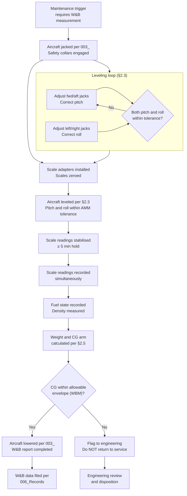

# ATLAS 010-019 · Section 01 · Subsection 016 · Subsubject 005 — Leveling, Weighing and Reference Datum Procedures

## 1. Purpose

Defines the procedures for **leveling** the aircraft to its prescribed reference datum, performing an **aircraft weight-and-balance (W&B) measurement**, and recording the results. These procedures are required at aircraft delivery, after significant structural modifications, after major fuel system modifications, and at the intervals defined in the Maintenance Planning Document (MPD).

> **Governing source:** AMM, ATA chapter 8 (Leveling and Weighing). ATLAS `016_005_` is the programmatic decomposition and traceability reference. All weight-and-balance results must be processed per the applicable Weight and Balance Manual (WBM) or AMM chapter 8 supplement.

## 2. Scope

### 2.1 When leveling and weighing is required

| Trigger | Mandatory W&B measurement | Leveling only |
|---|---|---|
| Aircraft delivery | Yes | — |
| First flight after major structural repair (as defined in SRM) | Yes | — |
| Replacement of a major structural assembly (wing, fuselage section) | Yes | — |
| Fuel quantity system calibration | — | Yes |
| Inertial reference system (IRS) calibration | — | Yes |
| Structural waterline/station measurement | — | Yes |
| At scheduled W&B interval per MPD | Yes | — |

### 2.2 Reference datum

The **reference datum** is a fixed imaginary vertical plane from which all horizontal distances are measured for centre-of-gravity (CG) calculations. For AMPEL360:

- The datum is defined in the AMM, ATA chapter 8 / Weight and Balance Manual.
- Horizontal distances (arms) are measured in millimetres aft of the datum (positive aft) or forward of the datum (negative forward).
- **Fuselage stations (FS)** are numbered from the datum.
- **Buttock lines (BL)** measure lateral offset from the aircraft centreline.
- **Waterlines (WL)** measure vertical offset from a reference plane (typically below the keel).

Contributors must not define or modify the reference datum — it is fixed by the manufacturer's AMM.

### 2.3 Leveling procedure

**Prerequisites:** Aircraft must be jacked to a stable three-point (or four-point for Gen 2) position per `016-003-Jacking-Procedures-and-Sequencing.md`. Fuel state must be known and recorded.

**Step sequence:**

| Step | Action | Verify |
|---|---|---|
| 1 | Confirm aircraft is jacked and all safety collars engaged per `003_` | Safety collars confirmed |
| 2 | Install leveling reference instrument at the AMM-specified leveling station (spirit-level pad or electronic inclinometer mount) | Instrument correctly seated at station |
| 3 | Read pitch angle (nose-up/nose-down) from leveling instrument | Record raw reading |
| 4 | Adjust fwd/aft jack heights incrementally until pitch angle is within AMM leveling tolerance (typically ±0.1°) | Pitch within tolerance |
| 5 | Read roll angle (left bank / right bank) from leveling instrument | Record raw reading |
| 6 | Adjust left/right main-gear jack heights incrementally until roll angle is within AMM leveling tolerance | Roll within tolerance |
| 7 | Re-confirm pitch has not changed after roll correction — iterate if necessary | Pitch and roll both within tolerance simultaneously |
| 8 | Re-engage all safety collars after final jack height adjustment | Safety collars confirmed |
| 9 | Record final pitch and roll readings, leveling station identification, and instrument calibration reference on the work order | Work order entry complete |

### 2.4 Weighing procedure

**Prerequisites:** Aircraft leveled per §2.3. All weighing scales calibrated and in date. Fuel state confirmed and recorded (exact fuel quantity per each tank — fuel density applied per AMM). All removable equipment per the weight-and-balance item list either installed and listed, or removed and listed.

**Equipment required:**
- Three (Gen 1) or four (Gen 2) calibrated platform weighing scales — one per jack point.
- Scale adapter plates to fit between jack adapter and scale platform.
- Scale calibration certificates — current within calibration interval.

**Step sequence:**

| Step | Action | Verify |
|---|---|---|
| 1 | Insert scale adapter plates between each jack head adapter and the aircraft jack-point fitting | Scales correctly positioned and seated |
| 2 | Zero all scales (tare) with only the scale adapter plate mass | Scale zero confirmed per scale manufacturer procedure |
| 3 | Jack aircraft per `003_` until aircraft is fully supported on scales | All scales reading positive load |
| 4 | Level aircraft per §2.3 with aircraft on scales | Pitch and roll within AMM tolerance |
| 5 | Allow 5 minutes for aircraft to stabilise; confirm scale readings are stable (not drifting) | Scale drift < AMM limit |
| 6 | Record gross weight reading from each scale simultaneously | Scale readings recorded on W&B data sheet |
| 7 | Sum individual scale readings to obtain gross aircraft weight | Cross-check against estimated gross weight — discrepancy > 2% requires investigation |
| 8 | Apply weight corrections per AMM: subtract tare mass of jack adapters; apply fuel correction for deviation from dry-aircraft condition | Corrected weights calculated |
| 9 | Compute CG arm per AMM formula using individual scale readings and known jack-point arm values | CG arm calculated |
| 10 | Compare computed CG to the allowable CG envelope per WBM | CG within delivery envelope — or flag for engineering review |
| 11 | Lower aircraft per `003_` lowering procedure | Aircraft on ground |
| 12 | Complete and sign W&B data sheet; submit to engineering for record update | W&B report filed per `016-006-Lifting-Shoring-Jacking-Records-and-Traceability.md` |

### 2.5 Centre-of-gravity calculation summary

The CG position is calculated as:

```
CG arm (mm aft of datum) = Σ(Scale_i × Arm_i) / Σ(Scale_i)
```

Where:
- `Scale_i` = corrected load reading at jack point i (kg or N)
- `Arm_i` = horizontal distance (arm) from datum to jack point i (mm aft datum)
- Sum is taken over all active jack points (3 for Gen 1, 4 for Gen 2)

The jack-point arm values for each variant are published in the AMM, ATA chapter 8 / WBM and must not be assumed from this document — always use AMM values.

### 2.6 Fuel state at weighing

The weight-and-balance measurement must record the actual fuel state precisely:

- **Preferred condition:** Aircraft at zero-fuel weight (all fuel tanks drained or fuelled to a precisely known quantity with density measured).
- **Acceptable condition:** Known fuel quantity per tank (from calibrated totalizer or dipstick measurement) with fuel density measured from a sample.
- **Not acceptable:** Estimated or nominal fuel quantity — must be a confirmed measurement.

For Gen 2 (LH₂) aircraft: Tanks must be purged and inerted; residual LH₂ and GH₂ mass must be measured or confirmed zero before a valid dry-weight measurement can be obtained. Consult Gen 2 AMM supplement and EPTA `460-469_` procedures.

## 3. Diagram — Leveling and Weighing Flow



## 4. Footprint

| Metric | Value |
|---|---|
| Architecture | `ATLAS` — Aircraft Top Level Architecture Schema/System (controlled term) |
| Master range | `000–099` |
| Code range | `010-019` |
| Section | `01` — Manejo en Tierra & Servicio |
| Subsection | `016` — Lifting, Shoring and Jacking Procedures |
| Subsubject | `005` — Leveling, Weighing and Reference Datum Procedures |
| Scope level | Procedural (Level 2); orientation in `000-009/003/005_` |
| Conventional ATA reference | ATA chapter 8 — Leveling and Weighing |
| External authority | Weight and Balance Manual (WBM) — governs CG envelope and arm values |
| Primary Q-Division | Q-GROUND[^qdiv] |
| Support Q-Divisions | Q-MECHANICS, Q-INDUSTRY |
| ORB support | ORB-PMO, ORB-FIN |
| Governance class | `baseline`[^gov] |
| Folder path | `Q+ATLANTIDE/000-099_ATLAS/010-019_Manejo-en-Tierra-Servicio/016_Lifting-Shoring-Jacking-Procedures/` |
| Document | `016-005-Leveling-Weighing-and-Reference-Datum-Procedures.md` (this file) |
| Parent subsection | [`README.md`](./README.md) · [`016-000-Lifting-Shoring-Jacking-Procedures-Overview.md`](./016-000-Lifting-Shoring-Jacking-Procedures-Overview.md) |
| Jacking prerequisite | [`016-003-Jacking-Procedures-and-Sequencing.md`](./016-003-Jacking-Procedures-and-Sequencing.md) |
| Records | [`016-006-Lifting-Shoring-Jacking-Records-and-Traceability.md`](./016-006-Lifting-Shoring-Jacking-Records-and-Traceability.md) |
| Parent architecture | [`../../README.md`](../../README.md) |
| Parent baseline | [`organization/Q+ATLANTIDE.md`](../../../../organization/Q+ATLANTIDE.md) |

## 5. References & Citations

[^baseline]: **Q+ATLANTIDE controlled baseline (v1.0.0)** — [`organization/Q+ATLANTIDE.md`](../../../../organization/Q+ATLANTIDE.md). Defines the controlled `000-999` architecture-band taxonomy and the ATLAS-1000 register subpart.

[^archtable]: **§3 — Architecture Table (parent)** — [`../../README.md` §3](../../README.md#3-architecture-table). Source of authority for primary/support Q-Divisions and ORB support of this section.

[^qdiv]: **Q-Division authority** — [`organization/Q-Divisions/`](../../../../organization/Q-Divisions/). Technical-authority units for the Q+ATLANTIDE baseline.

[^gov]: **Governance class** — `baseline` denotes documents under controlled change management within the Q+ATLANTIDE baseline.

[^ata2200]: **ATA iSpec 2200** — Information standards for aviation maintenance documentation. ATA chapter 8 (Leveling and Weighing) governs the procedures this subsubject decomposes.

[^ataspec100]: **ATA Spec 100** — Manufacturers' Technical Data standard.

[^s1000d]: **S1000D Issue 6.0** — International specification for technical publications.

[^as9100d]: **AS9100D** — Quality Management Systems — Aviation, Space and Defense Organizations.

### Applicable industry standards

- ATA iSpec 2200 — Information standards for aviation maintenance (ATA chapter 8)[^ata2200]
- ATA Spec 100 — Manufacturers' Technical Data[^ataspec100]
- S1000D Issue 6.0 — International specification for technical publications[^s1000d]
- AS9100D — Quality Management Systems — Aviation, Space and Defense Organizations[^as9100d]
