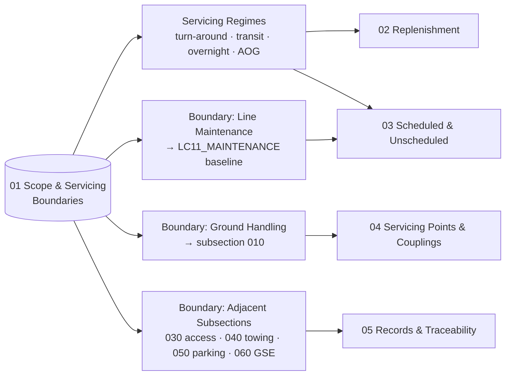

# ATLAS 010-019 · Section 01 · Subsection 020 · Subsubject 011 — Scope and Servicing Boundaries

## 1. Purpose

Establishes the **scope boundary** of the *servicing* subsection (`020`) within ATLAS `010-019.01` *Manejo en Tierra & Servicio* and the **boundary clauses** that separate servicing from adjacent activities — *ground handling* (subsection `010`), *line maintenance* (LC11_MAINTENANCE workflows) and the more specific operations covered by sibling subsections (`030`–`060`). Fixes the controlled vocabulary for **turn-around servicing**, **transit servicing** and **overnight servicing** so that the downstream subsubjects (`012`–`015`) — replenishment, scheduled/unscheduled servicing, servicing points and records — share a single semantic model on the ATA iSpec 2200 / Spec 100 information set[^ata2200][^ataspec100][^s1000d], in conformance with the controlled Q+ATLANTIDE baseline[^baseline] and ATA 12 chapter scope[^ata12].

## 2. Scope

- Covers the *Scope and Servicing Boundaries* subsubject (`011`) of subsection `020` *servicing* within section `01` *Manejo en Tierra & Servicio*.
- Inherits Q-Division authority and ORB support from the parent row in [`../../README.md` §3](../../README.md#3-architecture-table)[^archtable].
- **In scope** — the servicing activity boundary:
  - **Servicing vs. ground handling.** Servicing is the active *replenishment* of fluids, gases and energy and the related scheduled/unscheduled tasks that restore the aircraft to a ready-for-flight condition. Ground handling (subsection `010`) covers *positioning, marshalling, safety zoning and the physical presence of GSE*. The shared GSE-interface surface is split per the boundary clause stated in the parent [`010_Overview.md` §2](./010_Overview.md#2-scope) and in [`../010_Ground-handling/010_Overview.md` §2](../010_Ground-handling/010_Overview.md#2-scope).
  - **Servicing vs. line maintenance.** Servicing executes the operational replenishment and condition-based tasks defined by the maintenance program; line maintenance (consumed via `AMPEL360-AIR-T/LC11_MAINTENANCE/`) defines the *program baseline* (intervals, task cards, AMM/MPD content). Servicing consumes that baseline; it does not redefine it. See subsubject `013` for the bidirectional reference.
  - **Servicing regimes.** *Turn-around servicing* (between two consecutive flights, within a stand-time budget), *transit servicing* (short stop, partial replenishment), *overnight servicing* (extended stop, full replenishment plus scheduled tasks) and *AOG servicing* (out-of-program replenishment triggered by an unscheduled event).
- **Out of scope.** Towing/pushback (subsection `040`), parking configurations (subsection `050`), GSE pool management (subsection `060`), and the maintenance-program *definition* itself (LC11_MAINTENANCE SSOT). These are referenced as adjacent or upstream sources and are not redefined here.
- Boundary clauses are surfaced as S1000D `terminology` and `applicability` entries on the ATA iSpec 2200 information set[^ata2200][^s1000d] and quality-controlled per AS9100D[^as9100d].

## 3. Diagram

The diagram below shows how the *servicing* boundary partitions the activity space across adjacent subsections and downstream subsubjects.

## 4. Footprint

| Metric | Value |
|---|---|
| Architecture | `ATLAS` — Aircraft Top-Level Architecture System |
| Master range | `000–099` |
| Code range | `010-019` |
| Section | `01` — Manejo en Tierra & Servicio |
| Subject | `00` — General Information |
| Subsection | `020` — servicing |
| Subsubject | `011` — Scope and Servicing Boundaries |
| Primary Q-Division | Q-GROUND[^qdiv] |
| Support Q-Divisions | Q-MECHANICS, Q-INDUSTRY |
| ORB support | ORB-PMO, ORB-FIN |
| Governance class | `baseline`[^gov] |
| Folder path | `Q+ATLANTIDE/000-099_ATLAS/010-019_Manejo-en-Tierra-Servicio/020_servicing/` |
| Document | `011_Scope-and-Servicing-Boundaries.md` (this file) |
| Parent subsection | [`010_Overview.md`](./010_Overview.md) |
| Parent architecture | [`../../README.md`](../../README.md) |
| Parent baseline | [`organization/Q+ATLANTIDE.md`](../../../../organization/Q+ATLANTIDE.md) |

## 5. References & Citations

[^baseline]: **Q+ATLANTIDE controlled baseline (v1.0.0)** — [`organization/Q+ATLANTIDE.md`](../../../../organization/Q+ATLANTIDE.md). Defines the controlled `000-999` architecture-band taxonomy and the ATLAS-1000 register subpart.

[^archtable]: **ATLAS §3 Architecture Table** — [`../../README.md` §3](../../README.md#3-architecture-table). Authoritative source for the `010-019` row (Section `01` — Manejo en Tierra & Servicio, Primary Q-Division Q-GROUND).

[^qdiv]: **Q-Division authority** — Q-Divisions provide technical authority over an architecture row (Q+ATLANTIDE Note N-002). See [`organization/Q+ATLANTIDE.md` §4](../../../../organization/Q+ATLANTIDE.md#4-notes).

[^gov]: **Governance class** — Bands are classified as `baseline` or `restricted` per Q+ATLANTIDE §4 governance rules.

[^ata12]: **ATA Chapter 12 — Servicing** — Industry chapter covering routine servicing tasks performed during turn-around and overnight stops; canonical scope reference for ATLAS subsection `020`.

[^ata2200]: **ATA iSpec 2200 — Information Standards for Aviation Maintenance** — Industry standard for digital aircraft maintenance information; governs chapter / section / subject numbering inherited by ATLAS `000-099`.

[^ataspec100]: **ATA Spec 100 — Manufacturers' Technical Data** — Predecessor numbering scheme that established the 00–99 chapter map mirrored by ATLAS sub-ranges.

[^s1000d]: **S1000D Issue 6.0 — International specification for technical publications** — Common Source DataBase (CSDB) and Data Module Code (DMC) specification used across ATLAS technical publications.

[^as9100d]: **AS9100D — Quality Management Systems — Aviation, Space and Defense Organizations** — Quality-management baseline for all Q+ATLANTIDE deliverables.

### Applicable industry standards

The following ATA-family and industry standards apply to this subsubject in addition to the cross-cutting Q+ATLANTIDE governance:

- ATA Chapter 12 — Servicing[^ata12]
- ATA iSpec 2200 — Information Standards for Aviation Maintenance[^ata2200]
- ATA Spec 100 — Manufacturers' Technical Data[^ataspec100]
- S1000D Issue 6.0 — International specification for technical publications[^s1000d]
- AS9100D — Quality Management Systems — Aviation, Space and Defense Organizations[^as9100d]
