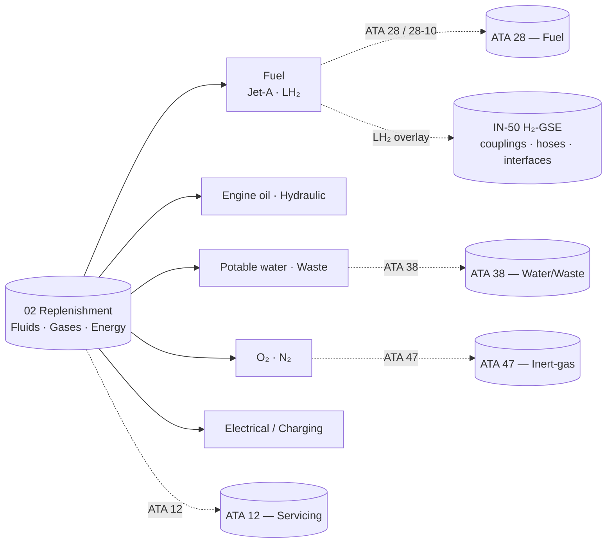

# ATLAS 010-019 · Section 01 · Subsection 020 · Subsubject 012 — Replenishment: Fluids, Gases and Energy

## 1. Purpose

Defines the **replenishment regimes and limits** for the consumables that the *servicing* subsection (`020`) covers during turn-around, transit and overnight stops. Spans the conventional set (fuel, engine oil, hydraulic fluid, potable/grey water, oxygen, nitrogen, electrical charging) and the AMPEL360-specific set (LH₂ as primary fuel, NH₃ as carrier where applicable, N₂ for inerting, high-rate electrical/charging energy). Anchors each consumable to its primary ATA chapter — **ATA 12** (Servicing)[^ata12] for the cross-cutting protocol, **ATA 28** / **ATA 28-10** (Fuel / storage)[^ata28] for fuel and LH₂ storage interface, **ATA 38** (Water/Waste)[^ata38] for potable/grey water, **ATA 47** (Inert-gas)[^ata47] for N₂ — in conformance with the controlled Q+ATLANTIDE baseline[^baseline] and S1000D[^s1000d].

## 2. Scope

- Covers the *Replenishment: Fluids, Gases and Energy* subsubject (`012`) of subsection `020` *servicing*.
- Inherits Q-Division authority and ORB support from the parent row in [`../../README.md` §3](../../README.md#3-architecture-table)[^archtable].
- **Consumables in scope** (regime + limit per consumable shall be defined in the downstream data modules):
  - **Fuel.** Conventional Jet-A/Jet-A-1 for legacy variants; **LH₂ for AMPEL360**, with regime governed by transfer-rate envelope, vent/boil-off management and purge cycles. Storage interface and product specification follow ATA 28-10[^ata28] and the H₂-GSE supply-chain spec at `OPT-INS_FRAMEWORK/I-INFRASTRUCTURES/ATA_IN_H2_GSE_AND_SUPPLY_CHAIN/IN-50-h2-gse-couplings-hoses-interfaces/`.
  - **Engine oil and hydraulic fluid.** Top-up regime per AMM/MPD, batch/lot tracking required (see subsubject `015`).
  - **Water and waste.** Potable-water uplift and grey/lavatory waste removal under ATA 38[^ata38].
  - **Gases.** Crew/passenger oxygen replenishment; nitrogen for tyre/strut servicing and inerting under ATA 47[^ata47].
  - **Electrical energy.** Ground-power supply and high-rate **electrical charging** of onboard energy storage where present (battery packs, hybrid-electric systems).
- **Replenishment regimes.** For each consumable: nominal flow / charging rate, max permissible rate, target/cut-off quantity, allowable temperature/pressure window, simultaneous-operation rules with adjacent servicing, and **boil-off / purge** budget for cryogenic fluids.
- **H₂-specific overlay.** Replenishment of LH₂ requires (a) pre-conditioning and purge of transfer line, (b) boil-off management with vent recapture per the WTW infrastructure overlay, (c) two-person rule and exclusion-zone confirmation handed over from subsection `010` (see boundary clause in [`010_Overview.md` §2](./010_Overview.md#2-scope)). Coupling and hose specifications are **not** redefined here — they are owned by subsubject `014` and by the H₂-GSE supply-chain spec referenced above.
- Out of scope: coupling geometry and protocol definition (subsubject `014`), task-card scheduling logic (subsubject `013`), record format and retention (subsubject `015`), and GSE positioning (`../010_Ground-handling/04`).

## 3. Diagram

The diagram below maps each in-scope consumable to its primary ATA chapter and shows the H₂-GSE supply-chain overlay that subsubjects `012` and `014` jointly consume.

## 4. Footprint

| Metric | Value |
|---|---|
| Architecture | `ATLAS` — Aircraft Top-Level Architecture System |
| Master range | `000–099` |
| Code range | `010-019` |
| Section | `01` — Manejo en Tierra & Servicio |
| Subject | `00` — General Information |
| Subsection | `020` — servicing |
| Subsubject | `012` — Replenishment: Fluids, Gases and Energy |
| Primary Q-Division | Q-GROUND[^qdiv] |
| Support Q-Divisions | Q-MECHANICS, Q-INDUSTRY |
| ORB support | ORB-PMO, ORB-FIN |
| Governance class | `baseline`[^gov] |
| Folder path | `Q+ATLANTIDE/000-099_ATLAS/010-019_Manejo-en-Tierra-Servicio/020_servicing/` |
| Document | `012_Replenishment-Fluids-Gases-and-Energy.md` (this file) |
| ATA chapters | `12`, `28`, `28-10`, `38`, `47` |
| Infrastructure overlay | `OPT-INS_FRAMEWORK/I-INFRASTRUCTURES/ATA_12-SERVICING_INFRA/` |
| H₂-GSE supply-chain ref | `OPT-INS_FRAMEWORK/I-INFRASTRUCTURES/ATA_IN_H2_GSE_AND_SUPPLY_CHAIN/IN-50-h2-gse-couplings-hoses-interfaces/` |
| Parent subsection | [`010_Overview.md`](./010_Overview.md) |
| Parent architecture | [`../../README.md`](../../README.md) |
| Parent baseline | [`organization/Q+ATLANTIDE.md`](../../../../organization/Q+ATLANTIDE.md) |

## 5. References & Citations

[^baseline]: **Q+ATLANTIDE controlled baseline (v1.0.0)** — [`organization/Q+ATLANTIDE.md`](../../../../organization/Q+ATLANTIDE.md). Defines the controlled `000-999` architecture-band taxonomy and the ATLAS-1000 register subpart.

[^archtable]: **ATLAS §3 Architecture Table** — [`../../README.md` §3](../../README.md#3-architecture-table). Authoritative source for the `010-019` row (Section `01` — Manejo en Tierra & Servicio, Primary Q-Division Q-GROUND).

[^qdiv]: **Q-Division authority** — Q-Divisions provide technical authority over an architecture row (Q+ATLANTIDE Note N-002). See [`organization/Q+ATLANTIDE.md` §4](../../../../organization/Q+ATLANTIDE.md#4-notes).

[^gov]: **Governance class** — Bands are classified as `baseline` or `restricted` per Q+ATLANTIDE §4 governance rules.

[^ata12]: **ATA Chapter 12 — Servicing** — Industry chapter covering routine servicing tasks performed during turn-around and overnight stops.

[^ata28]: **ATA Chapter 28 — Fuel** (incl. ATA 28-10 storage) — Industry chapter covering aircraft fuel systems and storage; ATA 28-10 is the canonical interface for the AMPEL360 LH₂ storage subsystem.

[^ata38]: **ATA Chapter 38 — Water/Waste** — Industry chapter covering potable-water uplift and lavatory/waste servicing.

[^ata47]: **ATA Chapter 47 — Inert-gas (N₂)** — Industry chapter covering nitrogen-generation and inerting servicing.

[^ata2200]: **ATA iSpec 2200 — Information Standards for Aviation Maintenance** — Industry standard for digital aircraft maintenance information; governs chapter / section / subject numbering inherited by ATLAS `000-099`.

[^ataspec100]: **ATA Spec 100 — Manufacturers' Technical Data** — Predecessor numbering scheme that established the 00–99 chapter map mirrored by ATLAS sub-ranges.

[^s1000d]: **S1000D Issue 6.0 — International specification for technical publications** — Common Source DataBase (CSDB) and Data Module Code (DMC) specification used across ATLAS technical publications.

[^as9100d]: **AS9100D — Quality Management Systems — Aviation, Space and Defense Organizations** — Quality-management baseline for all Q+ATLANTIDE deliverables.

### Applicable industry standards

The following ATA-family and industry standards apply to this subsubject in addition to the cross-cutting Q+ATLANTIDE governance:

- ATA Chapter 12 — Servicing[^ata12]
- ATA Chapter 28 — Fuel (incl. 28-10 storage)[^ata28]
- ATA Chapter 38 — Water/Waste[^ata38]
- ATA Chapter 47 — Inert-gas (N₂)[^ata47]
- ATA iSpec 2200 — Information Standards for Aviation Maintenance[^ata2200]
- ATA Spec 100 — Manufacturers' Technical Data[^ataspec100]
- S1000D Issue 6.0 — International specification for technical publications[^s1000d]
- AS9100D — Quality Management Systems — Aviation, Space and Defense Organizations[^as9100d]
